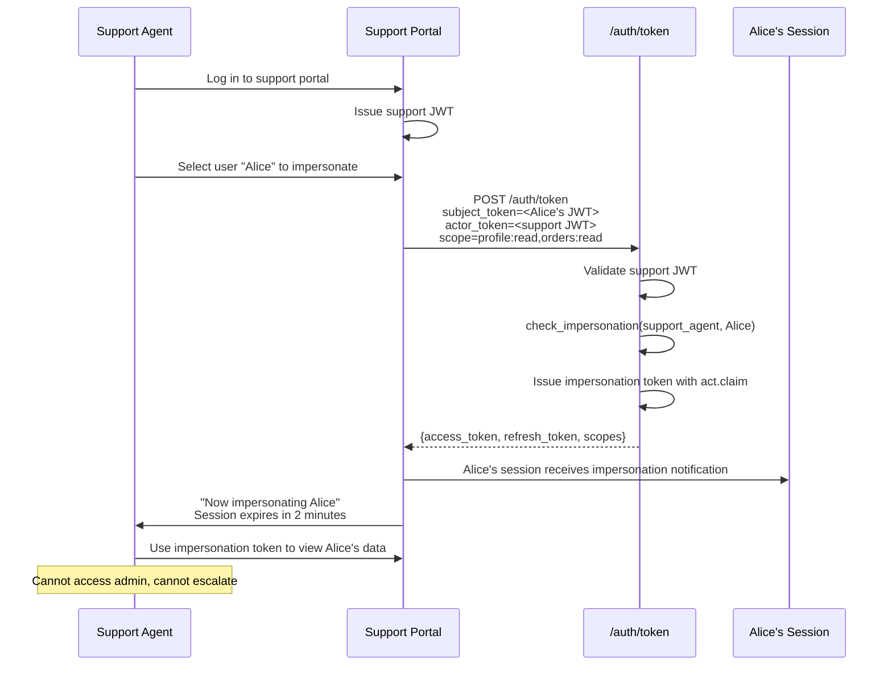
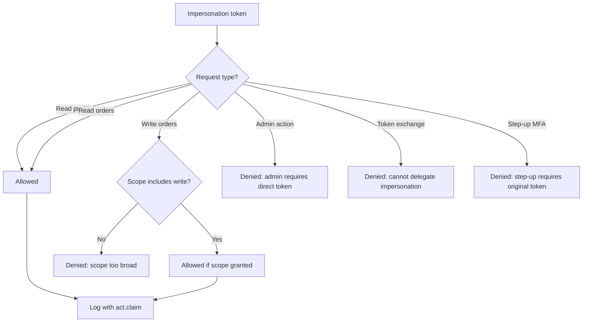
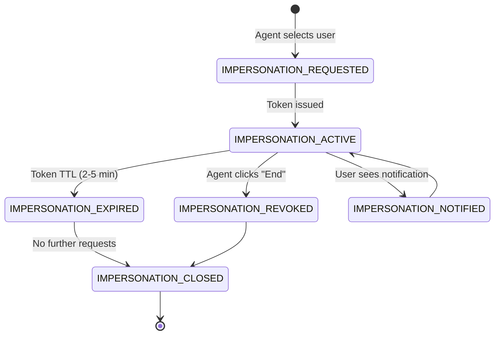
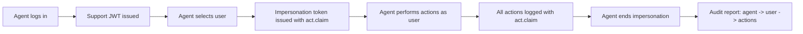

# Story 6.2: Implement Support Impersonation Flow

## Epic

[06-delegation-act](../delegation.md)

## Parent Epic Story

Story 6.2

## Summary

Implement the specific use case of support tool impersonation: a support agent logs into the support portal, selects a user to impersonate, and receives a token with `act` claim. The impersonated session has restricted capabilities (cannot access admin functions, cannot escalate privileges).

## Why This Story Exists

Support impersonation is one of the primary use cases for RFC 8693 delegation. The JWT document specifically calls out "Support tool impersonation" as a delegation scenario. This story defines the flow, restrictions, and audit requirements for support impersonation.

## Design Context

### Support Impersonation Flow

```
Support Agent -> Support Portal -> Login -> Support Portal JWT
Support Agent -> Support Portal -> Selects User Alice -> POST /auth/token
Support Portal -> Receives Alice-impersonation JWT with act.claim
Support Agent -> Impersonates Alice -> Uses impersonation token
```

### Impersonation Restrictions

The impersonation token must be restricted:

| Restriction | Enforcement | Rationale |
|-------------|-------------|-----------|
| No admin access | JWT middleware rejects if act.sub != admin | Prevent privilege escalation |
| No delegation | Token cannot be used for further delegation | Prevent chain delegation |
| No token exchange | `/auth/token` rejects if act claim present | Prevent impersonation chains |
| Short TTL | 2-5 minutes | Limit exposure window |
| Audit required | Every action logged with act claim | Full audit trail |
| Visible to user | User sees "impersonated by [agent]" | Transparency |

### Impersonation Token Structure

```json
{
  "sub": "alice_123",
  "tenant_id": "tenant_abc",
  "act": {
    "sub": "support_agent_456",
    "tenant": "tenant_abc",
    "portal": "support-portal"
  },
  "sx": {
    "roles": ["customer"],
    "permissions": [],
    "impersonated_by": "support_agent_456",
    "impersonation_scope": ["profile:read", "orders:read"]
  }
}
```

### Support Portal Authorization

```rust
fn can_impersonate(
    support_agent: &SupportAgent,
    target_user: &str,
) -> Result<(), AuthError> {
    // 1. Agent must be a support agent role
    if !support_agent.roles.contains(&"support_agent".to_string()) {
        return Err(AuthError::NotASupportAgent);
    }
    
    // 2. Agent can only impersonate users in their tenant
    let target_user_tenant = user_repo.get_tenant(target_user)?;
    if target_user_tenant != support_agent.tenant_id {
        return Err(AuthError::CrossTenantImpersonationNotAllowed);
    }
    
    // 3. Agent must have impersonation permission for the target's org
    let target_org = user_repo.get_org(target_user)?;
    if !support_agent.orgs.contains(&target_org) {
        return Err(AuthError::NotInTargetOrg);
    }
    
    // 4. Log the impersonation attempt
    audit_log::log_impersonation_attempt(
        support_agent.id,
        target_user,
        support_agent.tenant_id,
    );
    
    Ok(())
}
```

## Mermaid Diagrams

### Support Impersonation Flow



### Impersonation Restrictions



### Impersonation Session Lifecycle



### Audit Trail



## Malicious Hacker Gotchas (Must Be Addressed During Implementation)

> **Source:** `docs/PRS_SECURITY_HARDENING.md` — Security threat model analysis

### HACK-601: Support Agent Role Can Be Forged via JWT Claim (CRITICAL — Hole #1 from PRS)

**Risk:** Attacker forges a JWT with `roles: ["support_agent"]` to initiate impersonation

The story shows: `can_impersonate()` checks `support_agent.roles.contains(&"support_agent".to_string())`. But this check runs on the SUPPORT PORTAL, not on the IDAM service. If the support portal trusts its own JWT to determine the agent's role, an attacker can forge this claim.

**Exploit path:**
1. Attacker has ANY valid JWT (e.g., from a compromised user account)
2. Attacker forges a new JWT with `roles: ["support_agent"]`, `sub: "attacker_123"`
3. Attacker accesses the support portal with the forged JWT
4. Support portal checks `roles.contains("support_agent")` → true
5. Attacker selects a target user → `can_impersonate()` returns `Ok(())`
6. Token exchange endpoint issues an impersonation token
7. Result: Attacker can impersonate any user in their tenant

**The vulnerability exists because:**
- The support portal trusts its OWN JWT for role checking
- The token exchange endpoint trusts the support portal's decision
- No additional verification of the agent's role against authz-core

**Implementation requirement:**
- `can_impersonate()` must NOT rely on the JWT's `roles` claim
- The support portal must call authz-core `/principal/effective` to verify the agent's actual roles
- The token exchange endpoint must ALSO verify the actor has `support_agent` role by calling authz-core
- Document: "Impersonation eligibility is verified by authz-core, not extracted from the actor JWT."

### HACK-602: Impersonation Token Can Bypass Admin Route Protection (CRITICAL — related to Hole #4 from PRS)

**Risk:** Impersonation token with `act` claim still accesses admin routes

The story says: "Impersonation token cannot be used for admin actions (JWT middleware rejects)." But HOW is this enforced?

**Exploit path (jwt-only admin route):**
1. Admin classifies `/api/v1/orgs/{id}/members DELETE` as `jwt-only` (incorrect classification)
2. Attacker gets an impersonation token for user A
3. Attacker sends DELETE request to the jwt-only admin route
4. JWT middleware validates the token (signature, expiry, audience)
5. The middleware checks JWT claims → user A has permission to manage members (in their JWT)
6. Request is ALLOWED because the route is `jwt-only` and the JWT claims include the permission
7. Result: The impersonation token accesses admin functionality through a misclassified route

**This is covered by HACK-201 in Story 4.1.** The key mitigation is:
- Admin routes MUST NEVER be classified as `jwt-only`
- The JWT middleware should check for the presence of an `act` claim on admin routes and deny regardless of classification

**Implementation requirement:**
- On ANY route containing `/admin/`, `/orgs/`, `/roles/`, `/permissions/`, the JWT middleware MUST check for the `act` claim
- If `act` is present → DENY with 403 "Impersonation tokens cannot access admin routes"
- This check happens BEFORE the route classification lookup
- Document: "Admin routes reject ALL tokens with an act claim, regardless of the route's classification."

### HACK-603: Impersonation Token Can Be Used for Further Delegation (HIGH — Hole #10 from PRS)

**Risk:** Attacker chains impersonation tokens to escalate privileges

The story says: "Token exchange rejects if act claim present." But is this enforced at the token exchange endpoint (Story 3.4)?

**Exploit path (chain delegation):**
1. Attacker gets impersonation token for user A (with `act.sub = attacker`)
2. Attacker calls POST `/auth/token` with:
   - `subject_token = impersonation_token`
   - `actor_token = attacker's own token`
3. Token exchange validates subject token (valid signature)
4. Token exchange checks `can_delegate()` → attacker has `support_agent` role → true
5. Token exchange issues a NEW token with `act.sub = attacker` and subject claims from user A
6. Attacker now has a "clean" token that carries user A's claims and has NO act claim
7. The impersonation restriction is removed!

**The story says:** "Token exchange rejects if act claim present." But the check in Story 3.4 only checks the ACTOR token, not the SUBJECT token:

```rust
pub fn can_delegate(actor_claims: &SesameAuthzClaims, target_user_id: &str) -> bool {
    // Checks actor's roles, not subject's act claim
}
```

**The fix:** The token exchange endpoint MUST check if the SUBJECT token has an `act` claim, and reject the exchange if it does.

**Implementation requirement:**
- The token exchange endpoint MUST check if the subject token has an `act` claim
- If `act` is present in the subject token → REJECT with 403 "Subject token is an impersonation/delegation token and cannot be used as subject"
- This check MUST happen before `can_delegate()` is called
- Document: "Subject tokens with an act claim are rejected by the token exchange endpoint to prevent impersonation chains."

### HACK-604: Impersonation Notification Can Be Suppressed or Delayed (HIGH — related to Hole #4 from PRS)

**Risk:** Attacker impersonates a user without the user knowing

The story says: "User is notified when their session is impersonated." But the implementation shows: "alice receives an in-app notification."

**Exploit path (notification bypass):**
1. Attacker impersonates user A
2. The notification system is down, or the notification is delayed
3. Attacker performs malicious actions (data exfiltration, permission changes)
4. The user never knows they were impersonated
5. By the time the notification arrives, the damage is done

**Implementation requirement:**
- The impersonation notification MUST be sent SYNCHRONOUSLY during the token exchange
- If the notification fails (service down, network error), the impersonation MUST STILL proceed
- BUT: the impersonation must be logged as a HIGH-PRIORITY security event with `alert_level: "notification_failed"`
- The notification system must have a REDUNDANT channel: in-app notification + email (for critical events)
- Document: "Impersonation notification is sent synchronously. If it fails, the impersonation proceeds but is flagged for security review."

### HACK-605: Impersonation Token TTL Can Be Extended by Client (HIGH — related to Hole #6 from PRS)

**Risk:** Support portal requests a longer TTL for impersonation tokens

The story shows: "TTL is set server-side: 2-5 minutes." But is this enforced? Can the support portal pass a `ttl` parameter?

**Exploit path:**
1. Attacker controls the support portal (or the support portal code is compromised)
2. Support portal requests impersonation token with `ttl: 3600` (1 hour)
3. If the token exchange endpoint accepts the `ttl` parameter → attacker gets a 1-hour impersonation token
4. Attacker has 1 hour to perform malicious actions with full user access

**The story says:** "Impersonation token TTL cannot be extended by client: Assert that the `expires_in` for an impersonation token is set server-side and cannot be overridden by a client parameter." But this is only in the test section, not in the implementation requirements.

**Implementation requirement:**
- The token exchange endpoint MUST IGNORE any `ttl` or `expires_in` parameter from the client
- For impersonation tokens, the TTL is HARDCODED to a maximum value (e.g., 300 seconds / 5 minutes)
- The TTL must be configurable per tenant (e.g., `TENANT_IMPERSONATION_TTL`) but NEVER per-request
- Document: "Impersonation token TTL is hardcoded to the configured maximum. Any client-supplied TTL parameter is ignored."

### HACK-606: Attacker Can Impersonate Users in Other Tenants (CRITICAL — Hole #5 from PRS)

**Risk:** Cross-tenant impersonation via org manipulation

The story says: "Agent can only impersonate users in their tenant." But the check order matters:

```rust
// 2. Agent can only impersonate users in their tenant
let target_user_tenant = user_repo.get_tenant(target_user)?;
if target_user_tenant != support_agent.tenant_id {
    return Err(AuthError::CrossTenantImpersonationNotAllowed);
}
```

**Exploit path (org manipulation for cross-tenant impersonation):**
1. Attacker creates org_123 (Tenant A) and org_456 (Tenant A)
2. Attacker assigns themselves as support_agent to org_123
3. Attacker manipulates the user database to place a Tenant B user in org_123
4. `can_impersonate()` checks: `target_org = org_123`, `agent.orgs = [org_123]` → match!
5. BUT: the tenant check happens BEFORE the org check, so: `target_tenant = Tenant B`, `agent.tenant = Tenant A` → denied

**The story says the tenant check happens BEFORE the org check, which is CORRECT.** But what if a later implementation changes the order?

**The real exploit is different:** What if the user's tenant is derived from their org, and the attacker controls the org mapping?

**Exploit path (org-based tenant resolution):**
1. Attacker creates org_123 in Tenant A
2. Attacker assigns themselves as support_agent to org_123
3. Attacker creates a user and places them in org_123
4. If the tenant is derived from the org (Tenant A's orgs → Tenant A), the user is in Tenant A
5. The tenant check passes: `target_tenant = Tenant A`, `agent.tenant = Tenant A` → match!
6. The org check passes: `target_org = org_123`, `agent.orgs = [org_123]` → match!
7. Result: Attacker can impersonate the user they created

**This is actually correct behavior:** if the attacker controls the org and the user is in the same tenant, impersonation is allowed. This is the INTENDED design.

**The real risk is when the org management API is compromised**, allowing the attacker to:
- Create users in other tenants' orgs (if org management is not tenant-isolated)
- Assign other tenants' users to their orgs (if org assignment is not tenant-isolated)

**Implementation requirement:**
- The user's tenant MUST be verified from the user database, NOT derived from the org
- The org check must be: "agent is assigned to the target user's org IN THE TARGET USER'S TENANT"
- Document: "Tenant verification is done from the user record, not from the org record. An org in Tenant A cannot be used to impersonate a user in Tenant B."

### HACK-607: Impersonation During Password Change Creates a Security Gap (HIGH — related to Hole #3 from PRS)

**Risk:** Attacker starts impersonation just before the user changes password, gaining access after the user's session is invalidated

**Exploit path:**
1. Attacker starts impersonating user A (impersonation token with TTL = 5 minutes)
2. User A changes their password
3. User A's own tokens are invalidated (per password change policy)
4. BUT: the attacker's impersonation token is STILL VALID for 4 more minutes
5. Attacker continues to impersonate user A for 4 more minutes
6. Result: The attacker has uninterrupted access even after the user tries to revoke access

**The story says:** "Agent impersonates user who then changes password: Given agent_456 is impersonating user alice → when alice changes her password → then alice's sessions are invalidated (per password change policy), but agent_456's impersonation token may still be valid until its TTL expires — this is acceptable because the impersonation token is scoped and auditable."

**But "acceptable" is not "secure."** The attacker has 4 minutes of uninterrupted access.

**Implementation requirement:**
- When a user changes their password, ALL impersonation tokens for that user must be immediately revoked (added to denylist)
- The denylist entry TTL = remaining impersonation TTL (e.g., 4 minutes)
- Log a HIGH-PRIORITY security event: "Password changed during active impersonation — impersonation token revoked"
- Document: "Password change revokes ALL active impersonation tokens for the affected user. This is enforced by adding the impersonation token's jti to the denylist."

### HACK-608: Impersonation Audit Log Can Be Manipulated (MEDIUM — related to Hole #7 from PRS)

**Risk:** Attacker modifies the audit log to cover their tracks

The story says: "Impersonation audit log is tamper-proof: Assert that audit log entries are immutable — once written, they cannot be modified or deleted."

**But how is immutability enforced?** If the audit log is stored in a database, an attacker with database access can modify or delete entries.

**Exploit path:**
1. Attacker gains database access (via SQL injection, compromised service, or SSH)
2. Attacker deletes audit log entries for their impersonation sessions
3. The security team has no record of the impersonation
4. Result: Cover-up successful

**Implementation requirement:**
- Audit logs must be written to an immutable storage (e.g., WORM disk, append-only database)
- Audit logs must be replicated to a separate, read-only storage (e.g., S3 with object lock)
- Audit log integrity must be verified periodically (cryptographic hash chain)
- Database-access privileges must be restricted: no direct write/delete to the audit log table
- Document: "Audit logs are written to immutable, append-only storage. Direct modification or deletion is impossible. Integrity is verified via cryptographic hash chain."

### HACK-609: Multiple Simultaneous Impersonations by Same Agent (MEDIUM — related to Hole #3 from PRS)

**Risk:** Attacker impersonates multiple users simultaneously

The story says: "behavior depends on policy." But there's no policy defined.

**Exploit path:**
1. Attacker is a support agent
2. Attacker impersonates user A (impersonation token 1, TTL = 5 min)
3. Attacker impersonates user B (impersonation token 2, TTL = 5 min)
4. Attacker impersonates user C (impersonation token 3, TTL = 5 min)
5. Attacker performs malicious actions as all three users within the 5-minute window
6. Result: Massive data exfiltration from multiple accounts

**Implementation requirement:**
- Limit simultaneous impersonations per agent (e.g., MAX 3 concurrent impersonations)
- If the agent already has 3 active impersonation tokens, the 4th request is DENIED
- Track this in Redis: `impersonation:agent:{agent_id}` → count + TTL matching the impersonation TTL
- Document: "Maximum 3 simultaneous impersonations per agent. Additional impersonation attempts are denied."

### HACK-610: Impersonation Token Cannot Be Used for Step-Up MFA (LOW — related to Hole #4 from PRS)

**Risk:** Attacker uses impersonation token for step-up MFA, potentially bypassing MFA requirements

The story says: "Step-up MFA rejected for impersonation token." This is correct — an impersonation token should NOT be able to perform step-up MFA.

**But what if the attacker FORGES a token without an `act` claim but with the impersonated user's claims?**

**Exploit path:**
1. Attacker forges a JWT with the impersonated user's claims (e.g., `sub: "user_abc"`, `roles: ["admin"]`)
2. The token has NO `act` claim (so it doesn't look like an impersonation token)
3. Attacker sends the forged token to a step-up MFA endpoint
4. If the MFA endpoint only checks the user's current session status (not the token's authenticity), it might allow the step-up
5. Result: Attacker completes step-up MFA and gets a "clean" admin token

**The fix is in the step-up MFA implementation:** the MFA endpoint must verify the token's signature and check for the presence of an `act` claim.

**Implementation requirement:**
- The step-up MFA endpoint must verify the token's JWT signature
- If the token has an `act` claim → DENY step-up (MFA requires original user token)
- If the signature is invalid → DENY (forged token)
- Document: "Step-up MFA requires a token without an act claim and with a valid signature."

---

## OpenAPI Changes

No new endpoints needed -- support impersonation uses the existing `/auth/token` token exchange endpoint (Story 6.1).

```yaml
components:
  schemas:
    TokenExchangeResponse:
      description: |
        When used for support impersonation:
        - Token has a short TTL (2-5 minutes)
        - act.claim contains the support agent's identity
        - Token cannot be used for admin actions or further delegation
        - All actions are logged with the act.claim for audit
```

## Design Doc References

- `design-doc.md` section 10.5: Delegation & Actor Claims -- support tool impersonation
- `design-doc.md` section 10.1: Token Security -- "Support tool impersonation with act claim"
- `design-doc.md` section 6.2: JWT Schema -- `act` claim in namespaced claims

## Wiki Pages to Update/Create

- `topics/topic-delegation.md`: Document support impersonation flow
- `topics/topic-token-lifecycle.md`: Document impersonation session lifecycle
- `topics/topic-authorization-flow.md`: Note impersonation restrictions

## Acceptance Criteria

- [ ] Support impersonation uses `/auth/token` token exchange endpoint
- [ ] Impersonation token includes `act` claim with agent identity
- [ ] Impersonation token has short TTL (2-5 minutes)
- [ ] Impersonation token cannot be used for admin actions (JWT middleware rejects)
- [ ] Impersonation token cannot be used for further delegation/token exchange
- [ ] Support agent must have `support_agent` role to initiate impersonation
- [ ] Support agent can only impersonate users in their tenant
- [ ] Impersonation is logged (agent_id, user_id, start_time, end_time)
- [ ] User is notified when their session is impersonated
- [ ] Impersonation ends when token TTL expires or agent clicks "End"
- [ ] Metrics: `impersonation_total{status: "success", "denied", "expired"}` is emitted
- [ ] Audit log includes all actions performed during impersonation

## Dependencies

- Depends on Story 6.1 (token exchange endpoint)
- Intersects with Story 5.1 (token versioning -- impersonation triggers version bump for user)

## Risk / Trade-offs

- **Token TTL too short**: 2-5 minutes may be too short for support tasks that require navigating multiple screens. Consider extending to 10 minutes for low-risk support tasks, but this increases the exposure window.
- **Impersonation visibility**: The user should be notified when impersonated, but the notification mechanism is not specified. Options: email, in-app notification, or session metadata. This story assumes in-app notification.
- **Cross-tenant impersonation**: Currently blocked (agent can only impersonate users in their tenant). This is correct for SaaS multi-tenant isolation but may be limiting for platform operators who manage multiple tenants.

## Tests

### Unit Tests

- [ ] **Support impersonation requires support_agent role**: Given a user with `roles = ["support_agent"]`, assert `can_impersonate(agent, target_user)` returns `Ok(())`; given a user with `roles = ["customer"]`, assert it returns `Err(AuthError::NotASupportAgent)`
- [ ] **Non-support user cannot initiate impersonation**: Given a user with `roles = ["admin"]` but no `support_agent` role, assert `can_impersonate()` returns `Err(AuthError::NotASupportAgent)` — having admin rights does not grant impersonation ability
- [ ] **Cross-tenant impersonation is blocked**: Given support agent in tenant "abc" targets user in tenant "xyz", assert `can_impersonate()` returns `Err(AuthError::CrossTenantImpersonationNotAllowed)`
- [ ] **Agent cannot impersonate user outside their orgs**: Given support agent assigned to org_123 and org_456, assert `can_impersonate(agent, user_in_org_789)` returns `Err(AuthError::NotInTargetOrg)`
- [ ] **Agent CAN impersonate user in their org**: Given support agent assigned to org_123 and target user in org_123, assert `can_impersonate(agent, target_user)` returns `Ok(())`
- [ ] **Impersonation token TTL is set to 2 minutes**: Given a support impersonation token is issued, assert `expires_in = 120` (2 minutes in seconds)
- [ ] **Impersonation token TTL is set to 5 minutes (default)**: Given the impersonation TTL is not explicitly overridden, assert `expires_in = 300` (5 minutes)
- [ ] **Impersonation token includes act claim**: Given an impersonation token is issued, assert the JWT payload contains an `act` claim with `sub = support_agent_id`, `tenant = tenant_id`, and `portal = "support-portal"`
- [ ] **Impersonation token includes impersonated_by in sx**: Assert the JWT `sx` claim contains `impersonated_by = support_agent_id`
- [ ] **Impersonation token includes impersonation_scope in sx**: Assert the JWT `sx` claim contains `impersonation_scope = ["profile:read", "orders:read"]` (the granted read-only scopes)
- [ ] **Admin action rejected for impersonation token**: Given a request to an admin route with an impersonation token (act claim present), assert the JWT middleware returns 403 Forbidden with a message indicating impersonation tokens cannot access admin functions
- [ ] **Token exchange rejected for impersonation token**: Given a request to POST `/auth/token` with an impersonation token as the subject token, assert the handler returns 403 Forbidden — impersonation tokens cannot be used for further delegation
- [ ] **Step-up MFA rejected for impersonation token**: Given a step-up MFA request with an impersonation token, assert the handler returns 403 Forbidden — step-up requires the original user token
- [ ] **Impersonation audit log is written on initiation**: Given an impersonation is started, assert an audit log entry is created with `actor_id = agent_id`, `subject_id = target_user_id`, `start_time = now()`, and `tenant_id`
- [ ] **Impersonation audit log is written on completion**: Given an impersonation ends (either by TTL expiry or agent click), assert a completion audit log entry is written with `end_time = now()` and `duration = end_time - start_time`
- [ ] **Metrics: impersonation_total{status: "success"} emitted**: Assert `impersonation_total{status: "success"}` is incremented when impersonation starts
- [ ] **Metrics: impersonation_total{status: "denied"} emitted**: Assert `impersonation_total{status: "denied"}` is incremented when impersonation is denied (no support_agent role, cross-tenant, wrong org)
- [ ] **Metrics: impersonation_total{status: "expired"} emitted**: Assert `impersonation_total{status: "expired"}` is incremented when an impersonation session expires by TTL
- [ ] **Impersonation token cannot escalate privileges**: Assert that the impersonation token's `sx.roles` does NOT include `admin` or `platform_admin` — even if the impersonated user has admin rights, the impersonation token strips them
- [ ] **Support agent's org list is validated on each impersonation**: Assert that `can_impersonate()` queries the database for the target user's org and checks it against the agent's assigned orgs — the check is not cached
- [ ] **Audit log entry includes all action details during impersonation**: Given an agent performs 5 actions while impersonating a user, assert 5 separate audit log entries are written, each with the act.claim context

### Integration Tests (BDD-style with `rstest_bdd`)

- [ ] **Scenario: Support agent impersonates user in same org**: `given` support_agent_456 with `roles = ["support_agent"]` and assigned to org_123 → `when` the agent selects user alice_123 (in org_123) to impersonate → `then` an impersonation token is issued with `act.sub = "support_agent_456"`, `expires_in = 300`, and the agent can view alice's profile and orders
- [ ] **Scenario: Support agent cannot impersonate user in different org**: `given` support_agent_456 assigned to org_123 → `when` the agent selects user bob_789 (in org_789) to impersonate → `then` the request is denied with 403 `NotInTargetOrg` and `impersonation_total{status: "denied"}` is incremented
- [ ] **Scenario: Cross-tenant impersonation blocked**: `given` support_agent_456 in tenant "hauliage" → `when` the agent selects user from tenant "rerp" → `then` the request is denied with 403 `CrossTenantImpersonationNotAllowed`
- [ ] **Scenario: Impersonation token used for read-only actions**: `given` agent_456 has an active impersonation token for alice → `when` the agent reads alice's profile (`GET /api/profile`) and reads alice's orders (`GET /api/orders`) → `then` both requests succeed and are logged with `act.sub = "agent_456"`
- [ ] **Scenario: Impersonation token denied for write actions without scope**: `given` agent_456 has an impersonation token with `impersonation_scope = ["profile:read", "orders:read"]` → `when` the agent tries to write an order (`POST /api/orders`) → `then` the request is denied (scope does not include write)
- [ ] **Scenario: Impersonation token denied for admin actions**: `given` agent_456 has an active impersonation token → `when` the agent tries to create a new org (`POST /api/orgs`) → `then` the JWT middleware denies the request with 403 because the token has an act claim
- [ ] **Scenario: Impersonation token cannot be used for token exchange**: `given` agent_456 has an active impersonation token → `when` the agent calls POST `/auth/token` with the impersonation token as subject_token → `then` the request is denied with 403 — impersonation tokens cannot be delegated further
- [ ] **Scenario: Impersonation token TTL expires**: `given` agent_456 has an impersonation token with `expires_in = 120` → `when` 121 seconds pass → `then` the token is rejected as expired (401) and `impersonation_total{status: "expired"}` is incremented
- [ ] **Scenario: Agent ends impersonation early**: `given` agent_456 has an active impersonation token → `when` the agent clicks "End impersonation" → `then` the token is invalidated in Redis (added to denylist), the agent is returned to the support portal, and an audit log entry records the early termination
- [ ] **Scenario: User receives impersonation notification**: `given` agent_456 starts impersonating user alice → `when` the impersonation token is issued → `then` alice receives an in-app notification "User agent_456 is impersonating you on support portal"
- [ ] **Scenario: All actions during impersonation are logged**: `given` agent_456 is impersonating alice and performs: (1) read profile, (2) read orders, (3) read settings → `then` 3 separate audit log entries are created, each containing `act.sub = "agent_456"`
- [ ] **Scenario: Non-support user cannot impersonate**: `given` user hank with `roles = ["customer"]` → `when` hank tries to call the impersonation endpoint → `then` the request is denied with 403 and `impersonation_total{status: "denied"}` is incremented
- [ ] **Scenario: Token version bumps on impersonation**: `given` user alice has `authz_ver:{alice} = 10` → `when` agent_456 starts impersonating alice → `then` alice's version is bumped to 11 (impersonation triggers a version bump per Story 5.1)
- [ ] **Scenario: Impersonation session survives support portal reconnect**: `given` agent_456 has an active impersonation token → `when` the support portal page is refreshed (browser reload) → `then` the impersonation token is still valid and the agent can continue impersonating (token is stored in the browser, not in the portal session)

### Security Regression Tests

- [ ] **Impersonation token cannot bypass admin route protection**: Assert that any admin route (create org, delete user, modify settings) checks for the presence of an `act` claim and denies the request — a forged impersonation token without an act claim would not bypass this because the token must come from the trusted token exchange endpoint
- [ ] **Impersonation chain is prevented**: Assert that an impersonation token (with act claim) cannot be used as the subject_token in a token exchange — this prevents a chain where agent impersonates user A, then impersonates user B through user A's token
- [ ] **Impersonation token cannot escalate above impersonated user's privileges**: Assert that the impersonation token's effective permissions are a subset of the impersonated user's permissions — the agent can never do something the impersonated user couldn't do themselves
- [ ] **Cross-tenant impersonation cannot be achieved via org manipulation**: Assert that even if an attacker controls two organizations, an agent assigned to org_123 cannot impersonate a user in org_456 of a different tenant — the tenant check happens before the org check
- [ ] **Impersonation audit log is tamper-proof**: Assert that audit log entries are immutable — once written, they cannot be modified or deleted. The audit log should be append-only with cryptographic hashing to detect tampering.
- [ ] **Support agent role cannot be forged**: Assert that a user cannot set `roles = ["support_agent"]` in their JWT to gain impersonation capability — the support_agent role is assigned by the identity provider, not self-proclaimed
- [ ] **Impersonation TTL cannot be extended by client**: Assert that the `expires_in` for an impersonation token is set server-side and cannot be overridden by a client parameter — a malicious portal cannot request a longer TTL
- [ ] **Impersonation notification cannot be suppressed**: Assert that the user notification is sent synchronously during the impersonation initiation — it cannot be skipped or deferred by the support portal
- [ ] **Agent cannot impersonate themselves**: Assert that a support agent cannot initiate impersonation on their own account (agent_456 cannot impersonate agent_456) — this prevents self-impersonation for audit manipulation
- [ ] **Impersonation does not affect the impersonated user's active sessions**: Assert that starting an impersonation session does NOT invalidate the impersonated user's existing sessions — the user can continue using the app normally. However, the user's token version is bumped (Story 5.1) so any high-risk requests from the user's own token may be temporarily rejected until the next login.
- [ ] **Impersonation token revocation propagates immediately**: Assert that when an agent clicks "End impersonation", the token is added to the denylist (Story 5.3) and immediately rejected on the next request — no 30-second cache staleness window
- [ ] **Actor cannot use impersonation to bypass rate limits**: Assert that the impersonation endpoint enforces the same rate limiting as the login endpoint — a malicious agent cannot use impersonation to flood the system with token requests

### Edge Cases

- [ ] **Support agent with no assigned orgs**: Given a support agent with `orgs = []`, assert `can_impersonate()` returns `Err(AuthError::NotInTargetOrg)` for any target user — an agent with no org assignments cannot impersonate anyone
- [ ] **Target user does not exist**: Given a support agent tries to impersonate a non-existent user, assert `can_impersonate()` returns an error (user not found) without leaking information about whether the user exists
- [ ] **Target user is disabled/deleted**: Given a support agent tries to impersonate a disabled user, assert `can_impersonate()` returns an error — impersonation should not be allowed for disabled accounts
- [ ] **Multiple simultaneous impersonations by same agent**: Given agent_456 is already impersonating user alice → `when` the agent tries to impersonate user bob at the same time → `then` the system either allows it (separate impersonation tokens) or denies it (one impersonation per agent) — behavior depends on policy
- [ ] **Impersonation token with zero TTL**: Given a configuration error results in `expires_in = 0` for an impersonation token, assert the token is rejected at issuance (zero TTL is not valid)
- [ ] **Agent loses support_agent role mid-impersonation**: Given agent_456 is actively impersonating user alice → `when` an admin revokes agent_456's support_agent role → `then` the existing impersonation token remains valid until TTL expiry (tokens are issued with their own permissions at issuance time, role changes affect new tokens only)
- [ ] **Impersonation during high-traffic period**: Given 1000 concurrent impersonation requests from different agents → `then` the system processes them without performance degradation (each request is a database lookup + JWT signing)
- [ ] **Agent impersonates user then immediately ends**: Given agent_456 starts impersonation and immediately clicks "End" (within 1 second), assert the audit log records a very short duration (`duration ~ 1s`) and the impersonation token is quickly revoked
- [ ] **Support portal JWT expired during impersonation**: Given the support portal's own session expires while the agent is impersonating a user → `then` the agent is redirected to re-authenticate, but the impersonation token (issued by the IDAM) may still be valid until its own TTL expires — clarify the relationship between portal session and impersonation token
- [ ] **Agent impersonates user who then changes password**: Given agent_456 is impersonating user alice → `when` alice changes her password → `then` alice's sessions are invalidated (per password change policy), but agent_456's impersonation token may still be valid until its TTL expires — this is acceptable because the impersonation token is scoped and auditable

### Cleanup

- Redis state must be cleaned between test scenarios — use `FLUSHDB` or a unique Redis prefix per test run to prevent stale tokens, denylist entries, and impersonation sessions from affecting subsequent tests
- Audit log state must be reset between tests — use a fresh audit logger or clear the log buffer between test scenarios
- Metrics registry must be reset between test scenarios using `prometheus::Registry::new()` to prevent cross-test metric contamination
- JWT signing/verification keys used in tests should be unique per test to prevent key collisions between concurrent test scenarios
- Support agent accounts and test users created during tests must be cleaned up — use test factories that roll back or delete test data between scenarios
- Impersonation notifications sent during tests should be cleared between scenarios — verify that the notification system (in-memory or Redis-based) is reset
- Impersonation tokens used in tests should be generated with fresh JWTs per test to prevent token reuse across scenarios
- If using mock Redis, ensure the mock is reset between tests — use a fresh mock instance or call `mock.reset()`
- The support agent's org assignment state in the database must be reset between tests — each test should create a clean agent-org relationship
