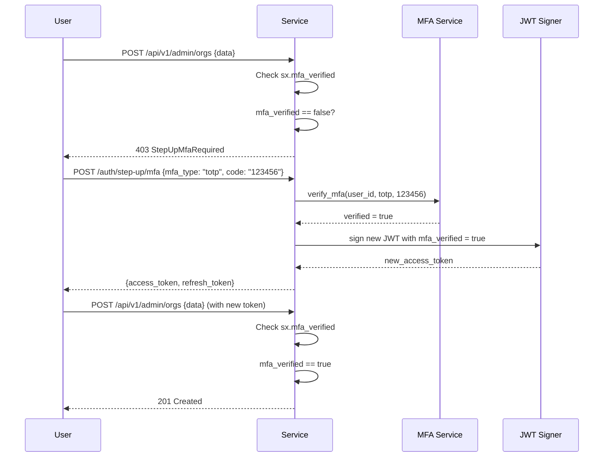
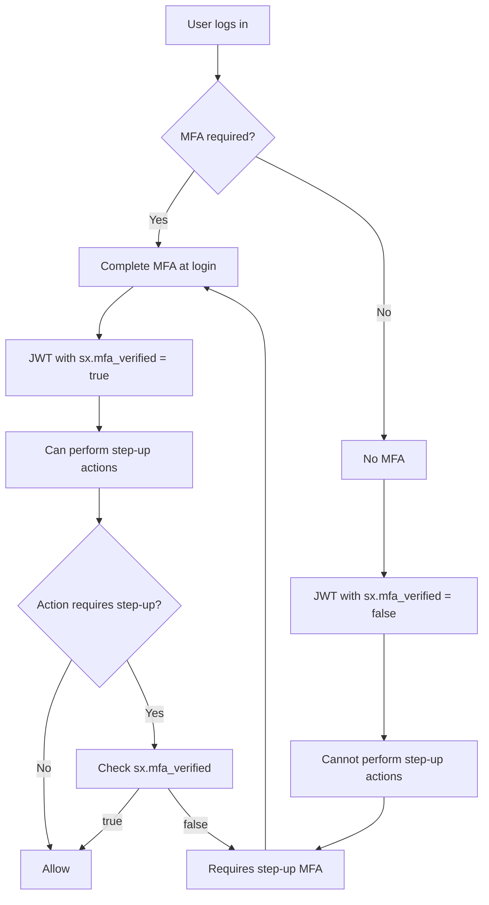
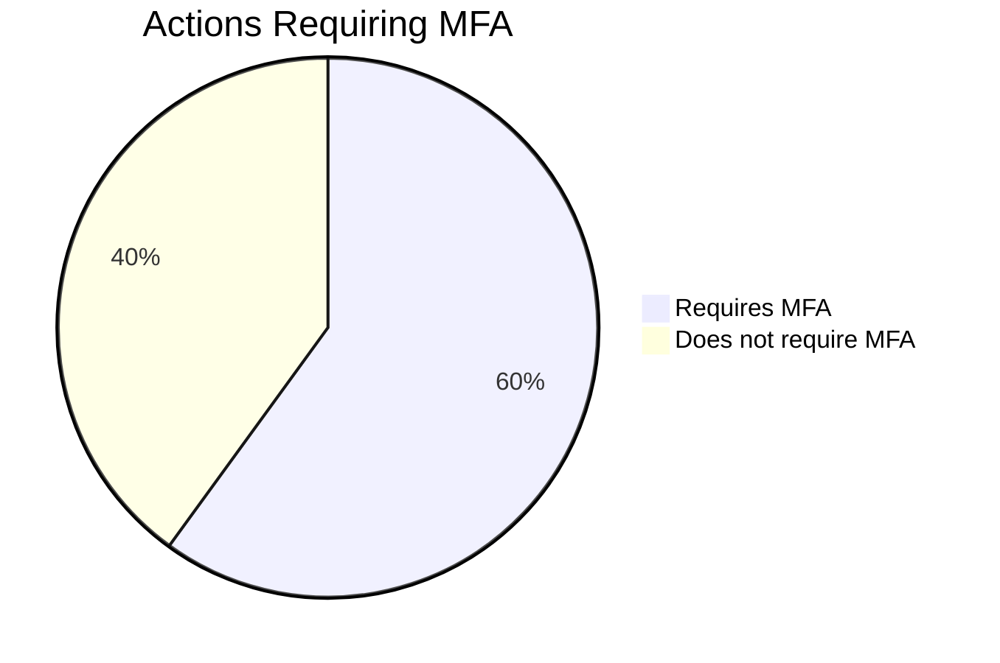

# Story 6.3: Implement Step-Up MFA for Delegated Actions

## Epic

[06-delegation-act](../delegation.md)

## Parent Epic Story

Story 6.3

## Summary

Implement step-up MFA as a prerequisite for certain delegated actions. When an actor attempts a high-consequence action (admin, org configuration, user impersonation), require additional MFA verification before the action is allowed. This ensures that delegation does not bypass MFA requirements.

## Why This Story Exists

The JWT document states: "The JWT must include `sx.mfa_verified: true/false`. When claims.mfa_verified == false, deny step-up operations. Step-up MFA requires re-authentication with MFA to get a new token." This ensures that delegation doesn't create a security gap where sensitive actions can be performed without additional verification.

## Design Context

### Current State

- No MFA verification flag in JWT
- No step-up MFA flow
- MFA is only checked at login time

### MFA Verification in JWT

The `sx` namespace includes MFA verification status:

```json
{
  "sx": {
    "roles": ["customer"],
    "permissions": ["profile:read"],
    "mfa_verified": true,
    "mfa_verified_at": 1715000000
  }
}
```

### Step-Up MFA Flow (F-006 + F-016 Fix)

```
User (with JWT) -> Service (high-consequence action)
  -> Check: sx.mfa_verified == false?
    -> Yes: redirect to step-up MFA flow
      -> User completes MFA (TOTP, WebAuthn, SMS)
      -> Service issues new JWT with sx.mfa_verified = true
      -> Service INVALIDATES the old refresh token family (F-006 Fix)
      -> Retry original action
```

**F-006 Fix: Step-up MFA invalidates old refresh token.** When step-up MFA succeeds:
1. Issue new access token with `sx.mfa_verified = true`
2. Issue new refresh token (new jti)
3. **CRITICAL**: Add the OLD refresh token jti to the denylist for 24 hours (same as Story 3.1)
4. This prevents an attacker who stole the refresh token before the step-up from using it

Without this fix, a stolen refresh token used BEFORE step-up would still work after step-up completes, as the old refresh token would still be valid in Redis. The attacker could then call `/auth/refresh` with the old token, receive a new token with `mfa_verified = true`, and completely bypass MFA.

**F-016 Fix: MFA type strength requirements.** Not all MFA types provide equal security:

| MFA Type | Strength | Recommended Actions | Security Notes |
|----------|----------|---------------------|----------------|
| WebAuthn/FIDO2 | Highest | All MFA-required actions | Phishing-resistant, hardware-bound |
| TOTP | Medium | Admin actions, org config, impersonation | Standard RFC 6238, no SIM swap risk |
| SMS | Lowest | User-facing actions ONLY (profile update, read) | Vulnerable to SIM swap, SS7 attacks |

**Configuration requirement:** SMS must require an explicit `ALLOW_SMS_MFA=true` environment variable. By default, only TOTP and WebAuthn are accepted. SMS can only be used for low-consequence step-up actions (e.g., resetting an email address), never for admin/org/impersonation/API key actions.

MFA type strength is checked in `check_mfa_for_action()`:
```rust
fn check_mfa_strength(
    mfa_type: &str,
    action: &str,
) -> Result<(), AuthError> {
    let requires_strong_mfa = matches!(action,
        "admin:create_org" |
        "org:config:update" |
        "admin:impersonate" |
        "api_key:create" |
        "api_key:revoke" |
        "role:assign"
    );
    
    if requires_strong_mfa && mfa_type != "webauthn" && mfa_type != "totp" {
        return Err(AuthError::MfaTypeTooWeak {
            required: "webauthn or totp",
            provided: mfa_type,
        });
    }
    Ok(())
}
```

### Step-Up MFA Endpoints

```
POST /auth/step-up/mfa
Authorization: Bearer <current_jwt>

{
  "mfa_type": "totp",
  "mfa_code": "123456"
}

Response:
{
  "new_access_token": "<new_jwt_with_mfa_verified=true>",
  "new_refresh_token": "<new_refresh>",
  "expires_in": 300
}
```

### Actions Requiring Step-Up MFA

| Action | MFA Required? | Rationale |
|--------|---------------|-----------|
| Admin action (create org) | Yes | High-consequence |
| Org configuration change | Yes | Affects other users |
| User impersonation | Yes | Bypasses normal access |
| API key creation | Yes | M2M access creation |
| API key revocation | Yes | Key lifecycle management |
| Role assignment | Yes | Privilege escalation |
| Profile update | No | Low-consequence |
| Read requests | No | No side effects |

## Implementation Notes

### MFA Verification Check in JWT Middleware

```rust
fn check_mfa_for_action(
    claims: &AccessClaims,
    action: &str,
) -> Result<(), AuthError> {
    let requires_mfa = matches!(action, 
        "admin:create_org" | 
        "org:config:update" | 
        "admin:impersonate" | 
        "api_key:create" | 
        "api_key:revoke" | 
        "role:assign"
    );
    
    if requires_mfa && !claims.sx.mfa_verified {
        return Err(AuthError::StepUpMfaRequired);
    }
    
    Ok(())
}
```

### Step-Up MFA Implementation

```rust
async fn handle_step_up_mfa(
    claims: AccessClaims,
    request: MfaRequest,
) -> Result<StepUpMfaResponse, AuthError> {
    // 1. Verify current token is valid
    // 2. Verify MFA code
    // 3. Issue new token with mfa_verified = true
    // 4. Store session in Redis
    
    let verified = mfa_service.verify(claims.sub, &request.mfa_type, &request.mfa_code)?;
    
    if !verified {
        return Err(AuthError::MfaVerificationFailed);
    }
    
    // Issue new JWT with mfa_verified = true
    let new_claims = claims.clone_with_mfa_verified(true);
    let new_token = jwt_signer.sign(new_claims)?;
    
    Ok(StepUpMfaResponse {
        new_access_token: new_token,
        new_refresh_token: generate_refresh_token(claims.sub)?,
        expires_in: 300,
    })
}
```

## Mermaid Diagrams

### Step-Up MFA Flow



### MFA Verification Status



### MFA-Protected Actions



## OpenAPI Changes

Add to `openapi/idam/identity-login-service/openapi.yaml`:

```yaml
paths:
  /auth/step-up/mfa:
    post:
      summary: Step-Up MFA Verification
      operationId: stepUpMfa
      description: |
        Verify MFA to obtain a new token with mfa_verified = true.
        Required for high-consequence actions when the current token
        does not have mfa_verified set.
      security:
        - BearerAuth: []
      requestBody:
        required: true
        content:
          application/json:
            schema:
              type: object
              required: [mfa_type, mfa_code]
              properties:
                mfa_type:
                  type: string
                  enum: [totp, webauthn, sms]
                mfa_code:
                  type: string
                  description: MFA verification code
      responses:
        '200':
          description: New JWT with mfa_verified = true
          content:
            application/json:
              schema:
                $ref: '#/components/schemas/StepUpMfaResponse'
        '401':
          description: Invalid MFA code
```

Add new schema:

```yaml
components:
  schemas:
    StepUpMfaResponse:
      type: object
      required: [new_access_token, expires_in]
      properties:
        new_access_token:
          type: string
          description: New JWT with mfa_verified = true
        new_refresh_token:
          type: string
          description: New rotating refresh token
        expires_in:
          type: integer
          format: int64
          description: Token lifetime in seconds
```

## Design Doc References

- `design-doc.md` section 10.5: Delegation & Actor Claims -- step-up MFA
- `design-doc.md` section 10.1: Token Security -- "sx.mfa_verified: true/false" claim
- `design-doc.md` section 6.2: JWT Schema -- MFA verification in sx namespace

## Wiki Pages to Update/Create

- `topics/topic-delegation.md`: Document step-up MFA in delegation context
- `topics/topic-token-lifecycle.md`: Document step-up MFA in token lifecycle
- `topics/topic-mfa.md`: (new) Document MFA verification in JWT

## Acceptance Criteria

- [ ] JWT includes `sx.mfa_verified` boolean claim
- [ ] Actions in the "requires MFA" list check `sx.mfa_verified`
- [ ] Missing or false `sx.mfa_verified` returns 403 StepUpMfaRequired
- [ ] `/auth/step-up/mfa` endpoint accepts MFA type and code
- [ ] Successful MFA verification returns new JWT with mfa_verified = true
- [ ] New JWT has same claims as old JWT plus mfa_verified = true
- [ ] MFA verification is logged (user_id, mfa_type, result)
- [ ] Metrics: `mfa_step_up_total{result: "success", "failed"}` is emitted

## Dependencies

- Depends on Story 2.2 (AccessClaims struct with sx namespace)
- Depends on MFA service implementation (external dependency)

## Risk / Trade-offs

- **MFA verification latency**: Step-up MFA requires an additional network call (to MFA service). This adds latency to high-consequence actions. Consider caching MFA verification status (e.g., mfa_verified is valid for 15 minutes) to reduce latency for repeated step-up actions within a short window.
- **MFA type diversity**: Different MFA types (TOTP, WebAuthn, SMS) have different security guarantees. SMS is weaker than TOTP or WebAuthn. Consider allowing configuration of acceptable MFA types per action type.
