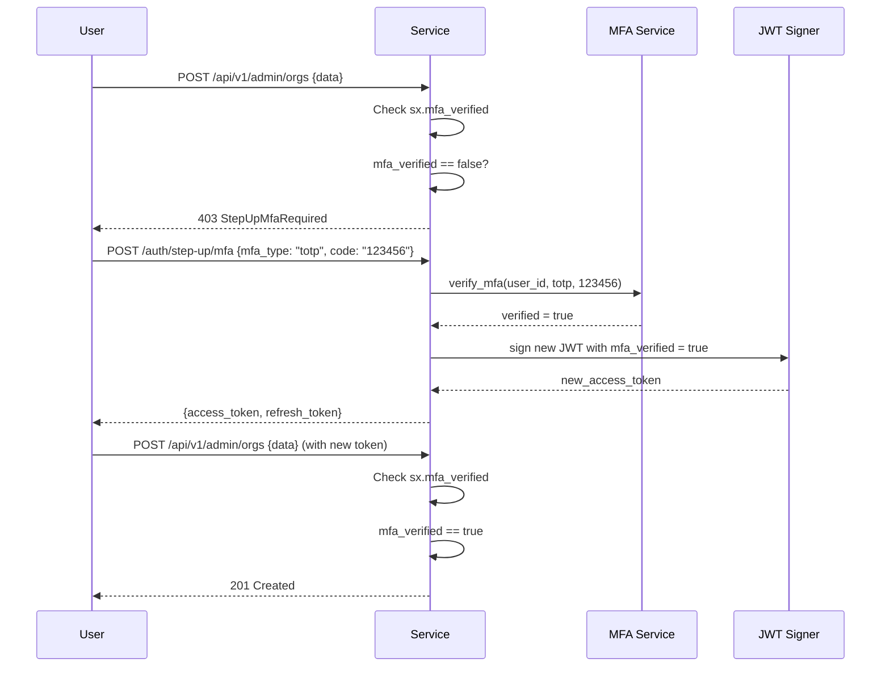
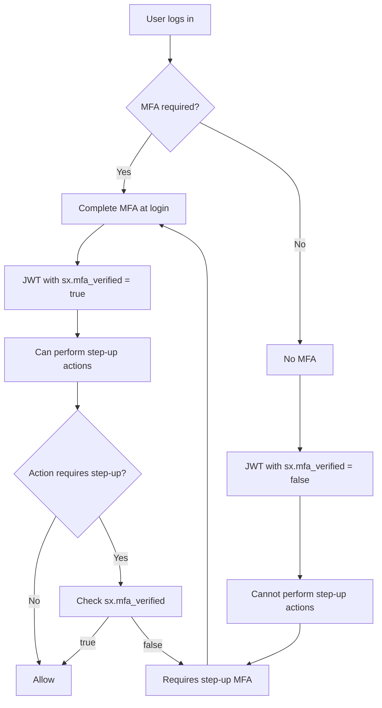
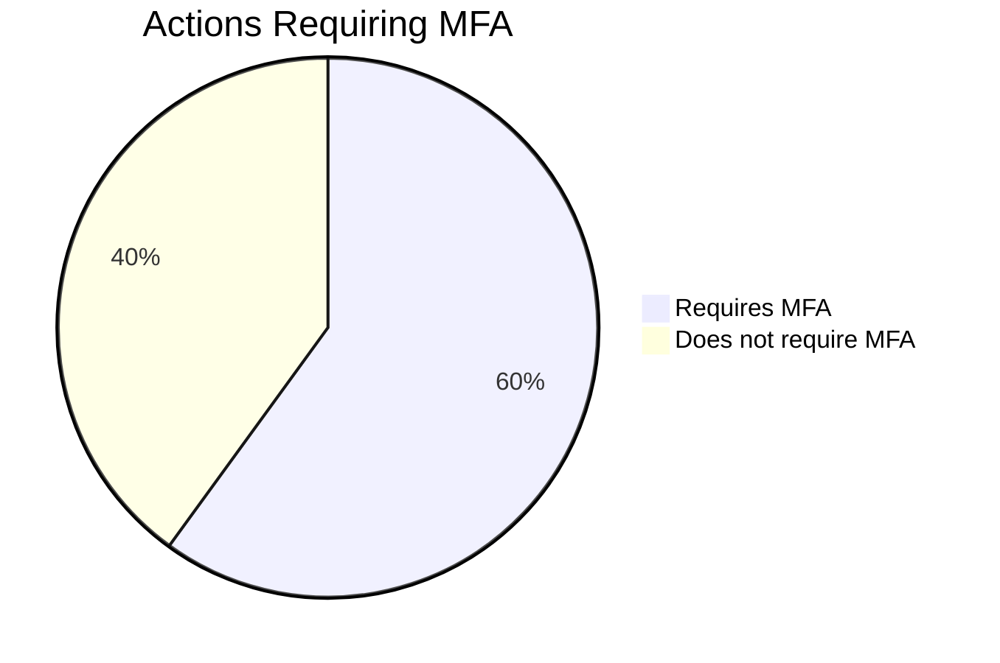

# Story 6.3: Implement Step-Up MFA for Delegated Actions

## Epic

[06-delegation-act](../delegation.md)

## Parent Epic Story

Story 6.3

## Summary

Implement step-up MFA as a prerequisite for certain delegated actions. When an actor attempts a high-consequence action (admin, org configuration, user impersonation), require additional MFA verification before the action is allowed. This ensures that delegation does not bypass MFA requirements.

## Why This Story Exists

The JWT document states: "The JWT must include `sx.mfa_verified: true/false`. When claims.mfa_verified == false, deny step-up operations. Step-up MFA requires re-authentication with MFA to get a new token." This ensures that delegation doesn't create a security gap where sensitive actions can be performed without additional verification.

## Design Context

### Current State

- No MFA verification flag in JWT
- No step-up MFA flow
- MFA is only checked at login time

### MFA Verification in JWT

The `sx` namespace includes MFA verification status:

```json
{
  "sx": {
    "roles": ["customer"],
    "permissions": ["profile:read"],
    "mfa_verified": true,
    "mfa_verified_at": 1715000000
  }
}
```

### Step-Up MFA Flow (F-006 + F-016 Fix)

```
User (with JWT) -> Service (high-consequence action)
  -> Check: sx.mfa_verified == false?
    -> Yes: redirect to step-up MFA flow
      -> User completes MFA (TOTP, WebAuthn, SMS)
      -> Service issues new JWT with sx.mfa_verified = true
      -> Service INVALIDATES the old refresh token family (F-006 Fix)
      -> Retry original action
```

**F-006 Fix: Step-up MFA invalidates old refresh token.** When step-up MFA succeeds:
1. Issue new access token with `sx.mfa_verified = true`
2. Issue new refresh token (new jti)
3. **CRITICAL**: Add the OLD refresh token jti to the denylist for 24 hours (same as Story 3.1)
4. This prevents an attacker who stole the refresh token before the step-up from using it

Without this fix, a stolen refresh token used BEFORE step-up would still work after step-up completes, as the old refresh token would still be valid in Redis. The attacker could then call `/auth/refresh` with the old token, receive a new token with `mfa_verified = true`, and completely bypass MFA.

**F-016 Fix: MFA type strength requirements.** Not all MFA types provide equal security:

| MFA Type | Strength | Recommended Actions | Security Notes |
|----------|----------|---------------------|----------------|
| WebAuthn/FIDO2 | Highest | All MFA-required actions | Phishing-resistant, hardware-bound |
| TOTP | Medium | Admin actions, org config, impersonation | Standard RFC 6238, no SIM swap risk |
| SMS | Lowest | User-facing actions ONLY (profile update, read) | Vulnerable to SIM swap, SS7 attacks |

**Configuration requirement:** SMS must require an explicit `ALLOW_SMS_MFA=true` environment variable. By default, only TOTP and WebAuthn are accepted. SMS can only be used for low-consequence step-up actions (e.g., resetting an email address), never for admin/org/impersonation/API key actions.

MFA type strength is checked in `check_mfa_for_action()`:
```rust
fn check_mfa_strength(
    mfa_type: &str,
    action: &str,
) -> Result<(), AuthError> {
    let requires_strong_mfa = matches!(action,
        "admin:create_org" |
        "org:config:update" |
        "admin:impersonate" |
        "api_key:create" |
        "api_key:revoke" |
        "role:assign"
    );
    
    if requires_strong_mfa && mfa_type != "webauthn" && mfa_type != "totp" {
        return Err(AuthError::MfaTypeTooWeak {
            required: "webauthn or totp",
            provided: mfa_type,
        });
    }
    Ok(())
}
```

### Step-Up MFA Endpoints

```
POST /auth/step-up/mfa
Authorization: Bearer <current_jwt>

{
  "mfa_type": "totp",
  "mfa_code": "123456"
}

Response:
{
  "new_access_token": "<new_jwt_with_mfa_verified=true>",
  "new_refresh_token": "<new_refresh>",
  "expires_in": 300
}
```

### Actions Requiring Step-Up MFA

| Action | MFA Required? | Rationale |
|--------|---------------|-----------|
| Admin action (create org) | Yes | High-consequence |
| Org configuration change | Yes | Affects other users |
| User impersonation | Yes | Bypasses normal access |
| API key creation | Yes | M2M access creation |
| API key revocation | Yes | Key lifecycle management |
| Role assignment | Yes | Privilege escalation |
| Profile update | No | Low-consequence |
| Read requests | No | No side effects |

## Implementation Notes

### MFA Verification Check in JWT Middleware

```rust
fn check_mfa_for_action(
    claims: &AccessClaims,
    action: &str,
) -> Result<(), AuthError> {
    let requires_mfa = matches!(action, 
        "admin:create_org" | 
        "org:config:update" | 
        "admin:impersonate" | 
        "api_key:create" | 
        "api_key:revoke" | 
        "role:assign"
    );
    
    if requires_mfa && !claims.sx.mfa_verified {
        return Err(AuthError::StepUpMfaRequired);
    }
    
    Ok(())
}
```

### Step-Up MFA Implementation

```rust
async fn handle_step_up_mfa(
    claims: AccessClaims,
    request: MfaRequest,
) -> Result<StepUpMfaResponse, AuthError> {
    // 1. Verify current token is valid
    // 2. Verify MFA code
    // 3. Issue new token with mfa_verified = true
    // 4. Store session in Redis
    
    let verified = mfa_service.verify(claims.sub, &request.mfa_type, &request.mfa_code)?;
    
    if !verified {
        return Err(AuthError::MfaVerificationFailed);
    }
    
    // Issue new JWT with mfa_verified = true
    let new_claims = claims.clone_with_mfa_verified(true);
    let new_token = jwt_signer.sign(new_claims)?;
    
    Ok(StepUpMfaResponse {
        new_access_token: new_token,
        new_refresh_token: generate_refresh_token(claims.sub)?,
        expires_in: 300,
    })
}
```

## Mermaid Diagrams

### Step-Up MFA Flow



### MFA Verification Status



### MFA-Protected Actions



## OpenAPI Changes

Add to `openapi/idam/identity-login-service/openapi.yaml`:

```yaml
paths:
  /auth/step-up/mfa:
    post:
      summary: Step-Up MFA Verification
      operationId: stepUpMfa
      description: |
        Verify MFA to obtain a new token with mfa_verified = true.
        Required for high-consequence actions when the current token
        does not have mfa_verified set.
      security:
        - BearerAuth: []
      requestBody:
        required: true
        content:
          application/json:
            schema:
              type: object
              required: [mfa_type, mfa_code]
              properties:
                mfa_type:
                  type: string
                  enum: [totp, webauthn, sms]
                mfa_code:
                  type: string
                  description: MFA verification code
      responses:
        '200':
          description: New JWT with mfa_verified = true
          content:
            application/json:
              schema:
                $ref: '#/components/schemas/StepUpMfaResponse'
        '401':
          description: Invalid MFA code
```

Add new schema:

```yaml
components:
  schemas:
    StepUpMfaResponse:
      type: object
      required: [new_access_token, expires_in]
      properties:
        new_access_token:
          type: string
          description: New JWT with mfa_verified = true
        new_refresh_token:
          type: string
          description: New rotating refresh token
        expires_in:
          type: integer
          format: int64
          description: Token lifetime in seconds
```

## Design Doc References

- `design-doc.md` section 10.5: Delegation & Actor Claims -- step-up MFA
- `design-doc.md` section 10.1: Token Security -- "sx.mfa_verified: true/false" claim
- `design-doc.md` section 6.2: JWT Schema -- MFA verification in sx namespace

## Wiki Pages to Update/Create

- `topics/topic-delegation.md`: Document step-up MFA in delegation context
- `topics/topic-token-lifecycle.md`: Document step-up MFA in token lifecycle
- `topics/topic-mfa.md`: (new) Document MFA verification in JWT

## Malicious Hacker Gotchas (Must Be Addressed During Implementation)

> **Source:** `docs/PRS_SECURITY_HARDENING.md` — Security threat model analysis

These are specific attack vectors identified during threat modeling. Each must be considered and mitigated during implementation. If a gotcha cannot be fully mitigated, document the residual risk.

### HACK-901: Step-Up MFA Does NOT Invalidate Existing Access Tokens (CRITICAL — Hole #9 from PRS)

**Risk:** Attacker retains valid access token after user completes MFA step-up

**Exploit path (detailed):**
1. User logs in (no MFA verified). They have a valid access token with `ver: 42` and `sx.mfa_verified = false`
2. Attacker has the user's access token (stolen from memory, network, log, etc.)
3. User completes step-up MFA
4. New access token is issued with `sx.mfa_verified = true` and `ver: 42` (NOT bumped)
5. Old refresh token is denylisted (F-006 Fix — this is correct)
6. BUT: the attacker's stolen access token has `ver: 42` which matches the current version
7. The attacker's token is NOT revoked — it has the correct version
8. The attacker still has access to ALL non-MFA-protected routes

**The deeper hole:** The step-up MFA only affects the MFA-verified claim, not the permissions themselves. Even with `mfa_verified: false`, the attacker still has access to non-MFA-protected routes. The MFA step-up only protects specific high-consequence actions (admin:create_org, org:config:update, etc.) — it does NOT protect the entire session.

**Implementation requirement:**
1. On step-up MFA completion, BUMP the token version (`ver` claim) — invalidates ALL existing access tokens from the session
2. Story 5.1 says "Bumped whenever user's permissions change" — step-up MFA is effectively a privilege change for the session (the user's session is now "verified" with stronger authentication)
3. The new access token should have `ver: 43` (bumped from 42)
4. The attacker's token with `ver: 42` will be rejected on the next request (version mismatch, assuming Hole #8 is fixed and version checks apply to all routes)

**Acceptance criterion addition:**
- "On step-up MFA completion, the token version is bumped, invalidating all existing access tokens from the session"
- "F-006 Fix is COMPLETIONALLY applied: old refresh token is denylisted AND token version is bumped"

**Code change required in handler:**
```rust
// On successful step-up MFA:
let new_ver = version_cache.bump_for_user(claims.sub).await?; // INCREMENT ver
let new_claims = claims.clone_with_mfa_verified(true, new_ver);
// ^^^ new_ver is the bumped version, not the same as the old ver
```

### HACK-902: Pre-MFA Token Replay Attack (CRITICAL — Hole #9 from PRS, related to F-006)

**Risk:** Attacker uses refresh token to obtain MFA-verified token BEFORE step-up completes

**Exploit path (detailed):**
1. User's old refresh token is stolen (before step-up MFA)
2. Attacker uses the stolen refresh token to obtain a new access token
3. The attacker's access token has the user's permissions but `mfa_verified: false`
4. User completes step-up MFA (this is where F-006 kicks in)
5. F-006: old refresh token is denylisted
6. BUT: the attacker already has a valid access token from step 2
7. The attacker's token is NOT revoked — it was issued before step-up

**Why F-006 alone is insufficient:** The F-006 fix only denylists the OLD REFRESH TOKEN. It does NOT revoke the access token that was ALREADY issued using that refresh token. The access token is valid until its own TTL expires (5 minutes) unless:
- Its `jti` is in the denylist (not done — only refresh token jti is denylisted)
- Its `ver` is bumped (not done — unless HACK-901 fix is applied)
- Its `jti` is added to the denylist explicitly (not done)

**Implementation requirement:**
1. On step-up MFA completion:
   a. Old refresh token jti is denylisted (F-006 — already specified)
   b. NEW: Token version is bumped (HACK-901 — NOT currently specified)
   c. NEW: Optionally, add ALL existing access token jtis from the session to the denylist for immediate effect

**This is the COMPLETE F-006 fix:** The current F-006 is PARTIAL — it only denylists the old refresh token. The COMPLETE fix requires all three steps above.

### HACK-903: Missing MFA-Verified Claim Defaults to False — But Is It? (HIGH)

**Risk:** Silent MFA bypass via missing claim

Story 6.3's unit test says: "Missing sx.mfa_verified defaults to false." But the `AccessClaims` struct in Story 2.2 defines `sx` as `SesameAuthzClaims`, which requires a `SesameAuthzClaims` instance (not `Option<SesameAuthzClaims>`). If the deserializer cannot find `https://sesame-idam.dev/claims` in the JWT, it will either:
- Panic on deserialization (DoS)
- Use a default empty struct (potential MFA bypass if the default has `mfa_verified: true`)

**Implementation requirement:**
- Ensure `SesameAuthzClaims` has `#[serde(default)]` at the struct level, so a missing `sx` namespace results in `SesameAuthzClaims { tenant: "", portal: "", roles: [], permissions: [], mfa_verified: false, ... }`
- The `mfa_verified` default MUST be `false` — never `true`
- Test this explicitly: "Given a JWT without `sx.mfa_verified`, assert the claim defaults to `false` (fail closed)"

### HACK-904: MFA Deny Endpoint Leaks Which Actions Require MFA (LOW — but documented)

**Risk:** Attacker learns the exact MFA-gated actions, enabling targeted attacks

**Exploit path:**
1. Attacker enumerates which actions require MFA by trying each one with `sx.mfa_verified = false`
2. The 403 response reveals the exact action name (e.g., "StepUpMfaRequired for action: admin:create_org")
3. Attacker now knows the exact list of MFA-gated actions

**Implementation requirement:**
- The 403 response should use a generic error message: "Additional verification required" — NOT listing which actions require MFA
- Document this as a security design decision

### HACK-905: Concurrent Step-Up Creates Multiple Tokens Without Version Bump Coordination (MEDIUM)

**Risk:** Concurrent step-up requests create tokens with same version, allowing one to bypass MFA

**Exploit path:**
1. Two concurrent step-up MFA requests arrive from the same user
2. Both check `ver: 42`, both succeed
3. Both issue new tokens with `ver: 43`
4. Both tokens have `mfa_verified: true`
5. But between the two requests, the original refresh token may have been used and rotated by an attacker

**Implementation requirement:**
- Step-up MFA should be serialized per user — use a per-user mutex or Redis lock
- Reject concurrent step-up requests with a clear error ("Step-up in progress, please retry")
- Ensure the token version is bumped for EACH step-up (even concurrent ones)

---

## Acceptance Criteria

- [ ] JWT includes `sx.mfa_verified` boolean claim
- [ ] Actions in the "requires MFA" list check `sx.mfa_verified`
- [ ] Missing or false `sx.mfa_verified` returns 403 StepUpMfaRequired
- [ ] `/auth/step-up/mfa` endpoint accepts MFA type and code
- [ ] Successful MFA verification returns new JWT with mfa_verified = true
- [ ] New JWT has same claims as old JWT plus mfa_verified = true
- [ ] MFA verification is logged (user_id, mfa_type, result)
- [ ] Metrics: `mfa_step_up_total{result: "success", "failed"}` is emitted

## Dependencies

- Depends on Story 2.2 (AccessClaims struct with sx namespace)
- Depends on MFA service implementation (external dependency)

## Risk / Trade-offs

- **MFA verification latency**: Step-up MFA requires an additional network call (to MFA service). This adds latency to high-consequence actions. Consider caching MFA verification status (e.g., mfa_verified is valid for 15 minutes) to reduce latency for repeated step-up actions within a short window.
- **MFA type diversity**: Different MFA types (TOTP, WebAuthn, SMS) have different security guarantees. SMS is weaker than TOTP or WebAuthn. Consider allowing configuration of acceptable MFA types per action type.

## Tests

### Unit Tests

- [ ] **JWT includes sx.mfa_verified boolean claim**: Given a user logs in with MFA, assert the issued access token contains `sx.mfa_verified: true`; given a user logs in without MFA, assert `sx.mfa_verified: false`
- [ ] **Missing sx.mfa_verified defaults to false**: Given a JWT issued by an older service version that does not include `sx.mfa_verified`, assert the claim defaults to `false` (fail closed for step-up actions)
- [ ] **Admin action denied when mfa_verified is false**: Given `claims.sx.mfa_verified = false` and the action is `admin:create_org`, assert `check_mfa_for_action()` returns `Err(AuthError::StepUpMfaRequired)`
- [ ] **Admin action allowed when mfa_verified is true**: Given `claims.sx.mfa_verified = true` and the action is `admin:create_org`, assert `check_mfa_for_action()` returns `Ok(())`
- [ ] **Org config update denied when mfa_verified is false**: Given `claims.sx.mfa_verified = false` and action is `org:config:update`, assert the check returns `StepUpMfaRequired`
- [ ] **User impersonation denied when mfa_verified is false**: Given `claims.sx.mfa_verified = false` and action is `admin:impersonate`, assert the check returns `StepUpMfaRequired`
- [ ] **API key creation denied when mfa_verified is false**: Given `claims.sx.mfa_verified = false` and action is `api_key:create`, assert the check returns `StepUpMfaRequired`
- [ ] **API key revocation denied when mfa_verified is false**: Given `claims.sx.mfa_verified = false` and action is `api_key:revoke`, assert the check returns `StepUpMfaRequired`
- [ ] **Role assignment denied when mfa_verified is false**: Given `claims.sx.mfa_verified = false` and action is `role:assign`, assert the check returns `StepUpMfaRequired`
- [ ] **Profile update allowed without MFA**: Given `claims.sx.mfa_verified = false` and action is `profile:read` or `profile:update`, assert the check returns `Ok(())` (no MFA required for profile updates)
- [ ] **Read requests allowed without MFA**: Given `claims.sx.mfa_verified = false` and action is `orders:read`, assert the check returns `Ok(())`
- [ ] **POST /auth/step-up/mfa accepts valid request**: Given a valid POST to `/auth/step-up/mfa` with `mfa_type: "totp"` and `mfa_code: "123456"`, assert the handler processes the request
- [ ] **POST /auth/step-up/mfa rejects missing mfa_type**: Given a POST to `/auth/step-up/mfa` without `mfa_type`, assert the handler returns 400 Bad Request
- [ ] **POST /auth/step-up/mfa rejects missing mfa_code**: Given a POST to `/auth/step-up/mfa` without `mfa_code`, assert the handler returns 400 Bad Request
- [ ] **POST /auth/step-up/mfa rejects invalid mfa_type**: Given `mfa_type: "invalid_type"`, assert the handler returns 400 Bad Request (not in enum: totp, webauthn, sms)
- [ ] **Successful MFA verification returns new JWT with mfa_verified = true**: Given valid MFA code verification, assert the response contains a new access token with `sx.mfa_verified: true` in the decoded JWT
- [ ] **Successful MFA verification returns new refresh token**: Given valid MFA code verification, assert the response contains a new refresh token
- [ ] **Successful MFA verification returns expires_in = 300**: Given valid MFA code verification, assert `expires_in = 300` (5 minutes) in the response
- [ ] **New JWT preserves original claims plus mfa_verified**: Given original claims with `sub: "alice"`, `tenant_id: "abc"`, `roles: ["customer"]`, assert the new JWT after step-up MFA preserves all original claims and sets `sx.mfa_verified: true`
- [ ] **Failed MFA verification returns 401**: Given an incorrect MFA code, assert the handler returns 401 Unauthorized with `MfaVerificationFailed` error
- [ ] **MFA verification is logged**: Given a successful MFA verification, assert the logging system receives an event with `user_id`, `mfa_type`, and `result: "success"`
- [ ] **Failed MFA verification is logged**: Given an incorrect MFA code, assert the logging system receives an event with `user_id`, `mfa_type`, and `result: "failed"`
- [ ] **Metrics: mfa_step_up_total{result: "success"} emitted**: Assert the counter is incremented on successful MFA verification
- [ ] **Metrics: mfa_step_up_total{result: "failed"} emitted**: Assert the counter is incremented on failed MFA verification
- [ ] **WebAuthn accepted for all actions**: Given `mfa_type = "webauthn"` and action is `admin:create_org`, assert `check_mfa_strength()` returns `Ok(())` (WebAuthn is strongest)
- [ ] **TOTP accepted for all actions**: Given `mfa_type = "totp"` and action is `api_key:revoke`, assert `check_mfa_strength()` returns `Ok(())` (TOTP is medium strength)
- [ ] **SMS rejected for admin actions**: Given `mfa_type = "sms"` and action is `admin:create_org`, assert `check_mfa_strength()` returns `Err(AuthError::MfaTypeTooWeak { required: "webauthn or totp", provided: "sms" })`
- [ ] **SMS accepted for low-consequence actions**: Given `mfa_type = "sms"` and action is `profile:update`, assert `check_mfa_strength()` returns `Ok(())` (SMS is acceptable for low-consequence)
- [ ] **SMS requires explicit ALLOW_SMS_MFA env var**: Given `ALLOW_SMS_MFA` is not set (default), assert SMS MFA is rejected for all actions
- [ ] **F-006 Fix: Old refresh token added to denylist on step-up**: Given step-up MFA succeeds, assert the OLD refresh token's jti is added to the denylist with a 24-hour TTL (matching Story 3.1)
- [ ] **F-006 Fix: Old refresh token cannot be used after step-up**: Given the old refresh token is added to the denylist, assert a POST `/auth/refresh` with the old token returns 401 TokenRevoked
- [ ] **F-016 Fix: MFA type strength check uses correct action list**: Given the action list `["admin:create_org", "org:config:update", "admin:impersonate", "api_key:create", "api_key:revoke", "role:assign"]`, assert SMS is rejected for all of them
- [ ] **F-016 Fix: MFA type strength check allows TOTP for all actions**: Given TOTP is used for each action in the strong MFA list, assert all pass the strength check
- [ ] **MFA code rate limiting**: Given 10 failed MFA attempts in 1 minute, assert the 11th attempt is rate-limited (returns 429 Too Many Requests)
- [ ] **MFA code has limited attempts**: Given a TOTP code has a 30-second window, assert a code from 2 minutes ago is rejected as expired

### Integration Tests (BDD-style with `rstest_bdd`)

- [ ] **Scenario: User performs step-up MFA for admin action**: `given` user alice logs in (sx.mfa_verified = false) → `when` alice attempts to create an org → `then` the request returns 403 StepUpMfaRequired → `when` alice calls POST /auth/step-up/mfa with TOTP code → `then` a new token is returned with sx.mfa_verified = true → `when` alice retries the org creation → `then` the request succeeds with 201 Created
- [ ] **Scenario: User performs step-up MFA with WebAuthn**: `given` user bob logs in (sx.mfa_verified = false) → `when` bob calls POST /auth/step-up/mfa with mfa_type = "webauthn" → `then` the MFA service verifies the WebAuthn assertion and returns a new token with sx.mfa_verified = true
- [ ] **Scenario: SMS rejected for admin action**: `given` user carol logs in (sx.mfa_verified = false) → `when` carol calls POST /auth/step-up/mfa with mfa_type = "sms" and a valid code → `then` the handler rejects with MfaTypeTooWeak (SMS not allowed for admin actions)
- [ ] **Scenario: Step-up MFA invalidates old refresh token (F-006)**: `given` user dave has an active refresh token → `when` dave performs step-up MFA → `then` dave's old refresh token is added to the denylist → `when` dave tries to refresh with the old token → `then` the refresh is denied with 401 TokenRevoked
- [ ] **Scenario: Correct MFA code succeeds**: `given` user eve has a valid TOTP secret configured → `when` POST /auth/step-up/mfa is called with the current TOTP code → `then` the verification succeeds and a new token with mfa_verified = true is returned
- [ ] **Scenario: Incorrect MFA code fails**: `given` user frank has TOTP configured → `when` POST /auth/step-up/mfa is called with a wrong code → `then` the verification fails with 401 MfaVerificationFailed
- [ ] **Scenario: Expired MFA code fails**: `given` user grace has TOTP configured → `when` POST /auth/step-up/mfa is called with a TOTP code from 2 minutes ago (outside the 30-second window) → `then` the verification fails with 401
- [ ] **Scenario: MFA verification logged with correct details**: `given` user hank performs step-up MFA with TOTP → `then` the audit log contains an entry with `user_id: "hank"`, `mfa_type: "totp"`, `result: "success"`, and `timestamp`
- [ ] **Scenario: Metrics recorded on step-up**: `given` a successful step-up MFA → `when` the response is received → `then` `mfa_step_up_total{result: "success"}` is incremented by 1
- [ ] **Scenario: Metrics recorded on failed step-up**: `given` a failed step-up MFA (wrong code) → `then` `mfa_step_up_total{result: "failed"}` is incremented by 1
- [ ] **Scenario: User who logs in WITH MFA can perform step-up actions**: `given` user iris logs in WITH MFA (sx.mfa_verified = true at login) → `when` iris attempts to create an org → `then` the request succeeds immediately without step-up (mfa_verified is already true)
- [ ] **Scenario: Actor with act claim must also have mfa_verified for step-up actions**: `given` support agent with an impersonation token (act.claim present, sx.mfa_verified = false) → `when` the agent attempts to create an org (admin action) → `then` the request returns 403 StepUpMfaRequired — impersonation does not grant MFA bypass
- [ ] **Scenario: Step-up MFA preserves token version**: `given` user jane has ver = 5 → `when` jane performs step-up MFA → `then` the new token has ver = 6 (version is bumped on step-up, same as delegation)
- [ ] **Scenario: Rate limiting on MFA attempts**: `given` user kate makes 10 consecutive failed MFA attempts → `when` the 11th attempt arrives → `then` the handler returns 429 Too Many Requests

### Security Regression Tests

- [ ] **MFA verification cannot be bypassed by modifying claims**: Assert that a client cannot set `sx.mfa_verified = true` in a forged JWT to bypass step-up — the JWT signature prevents claim tampering, and the middleware validates the signature before checking mfa_verified
- [ ] **Step-up MFA does not escalate privileges**: Assert that step-up MFA only sets `sx.mfa_verified = true` — it does NOT add any additional roles or permissions to the token
- [ ] **Old refresh token invalidation prevents MFA bypass attack**: Assert that the F-006 fix (adding old refresh token to denylist) prevents an attacker who stole the refresh token before step-up from using it to get a new MFA-verified token
- [ ] **SMS MFA is blocked by default**: Assert that `ALLOW_SMS_MFA` environment variable is unset by default, and SMS MFA is rejected for all actions until explicitly enabled
- [ ] **MFA type cannot be forged**: Assert that the mfa_type in the step-up response is derived from the MFA service verification, not from the client-supplied value — a client cannot claim "I used WebAuthn" when they actually used SMS
- [ ] **MFA code cannot be reused**: Assert that each MFA code (TOTP) is only valid within its time window (30 seconds) — a code from a previous window is rejected
- [ ] **MFA verification does not leak user information**: Assert that failed MFA attempts return the same error message regardless of whether the user exists or the code was simply wrong — prevent user enumeration
- [ ] **MFA rate limiting prevents brute force**: Assert that the MFA endpoint enforces rate limiting (e.g., 5 attempts per minute per user) — an attacker cannot brute force a TOTP code
- [ ] **Step-up MFA token has same TTL as regular token**: Assert that the new token issued after step-up MFA has `expires_in = 300` (5 minutes) — not extended beyond the normal token TTL
- [ ] **Act claim does not interfere with MFA check**: Assert that a token with an `act` claim (delegation) is still subject to the MFA check for high-consequence actions — delegation does not exempt from MFA
- [ ] **MFA verification is idempotent**: Assert that calling step-up MFA twice with valid codes results in two new tokens both with `sx.mfa_verified = true` — no adverse side effects
- [ ] **MFA-denied endpoint does not leak which actions require MFA**: Assert that the 403 StepUpMfaRequired response does not list which actions require MFA — the error is generic (e.g., "Additional verification required") to prevent reconnaissance

### Edge Cases

- [ ] **MFA code exactly at window boundary**: Given a TOTP code is valid from :00-:30, assert a code from :29 is accepted and a code from :31 is rejected
- [ ] **MFA code from clock skew**: Given NTP clock skew causes a 10-second drift, assert the MFA service checks the current time ± 1 window (30-second tolerance) to accommodate clock differences
- [ ] **WebAuthn assertion for non-WebAuthn device**: Given a user without a WebAuthn device attempts mfa_type = "webauthn", assert the handler returns a clear error (e.g., "WebAuthn device not registered for this user")
- [ ] **MFA type enum validation is strict**: Given `mfa_type: "otp"` (similar to "totp" but not in enum), assert the handler returns 400 Bad Request — enum validation is strict, not fuzzy
- [ ] **MFA verification during service maintenance**: Given the MFA service is temporarily unavailable during step-up, assert the handler returns 503 Service Unavailable with a clear message (not a 500 internal error)
- [ ] **Step-up MFA with already-verified token**: Given a user with `sx.mfa_verified = true` calls POST /auth/step-up/mfa, assert the handler either returns the same token (idempotent) or returns a clear error — the user should not need to step-up again
- [ ] **Concurrent step-up MFA requests**: Given 10 concurrent step-up MFA requests from the same user with valid codes, assert all 10 succeed and each returns a unique new token (token version is bumped for each issue)
- [ ] **MFA service returns unexpected response**: Given the MFA service returns a response missing the `verified` field, assert the handler rejects the response with an error (not a panic or unwrap)
- [ ] **Step-up MFA during token expiry**: Given a user's token expires during the MFA verification process (between the initial 403 and the step-up), assert the step-up request is rejected (the original token must still be valid)
- [ ] **Empty mfa_code**: Given `mfa_code: ""`, assert the handler returns 400 Bad Request — empty codes are not valid
- [ ] **MFA code with special characters**: Given `mfa_code: "123!@#"`, assert the handler handles it gracefully — MFA codes are typically numeric, but the handler should validate the format

### Cleanup

- Redis state must be cleaned between test scenarios — use `FLUSHDB` or a unique Redis prefix per test run to prevent stale tokens, denylist entries, and refresh tokens from affecting subsequent tests
- F-006 fix creates denylist entries for old refresh tokens — verify these are cleaned up (`FLUSHDB` or prefix-based cleanup) between tests
- Metrics registry must be reset between test scenarios using `prometheus::Registry::new()` to prevent cross-test metric contamination
- JWT signing/verification keys used in tests should be unique per test to prevent key collisions between concurrent test scenarios
- MFA service mock must be reset between tests — use a fresh mock instance with fresh TOTP secrets per user per test
- User accounts and MFA seed values created during tests must be cleaned up — use test factories that roll back or delete test data between scenarios
- Step-up MFA tokens used in tests should be generated with fresh JWTs per test to prevent token reuse across scenarios
- Rate limiting state (per-user attempt counters) must be reset between test scenarios — use a fresh rate limiter per test
- If using mock Redis, ensure the mock is reset between tests — use a fresh mock instance or call `mock.reset()`
- TOTP time windows in tests should be controlled — use a mock time provider or test framework time manipulation to avoid race conditions with real time windows
