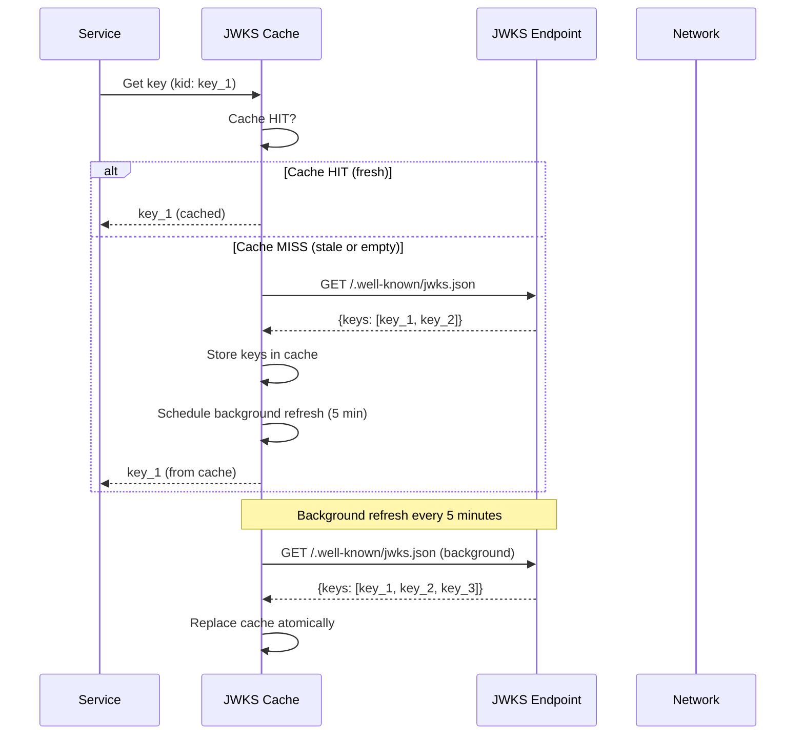
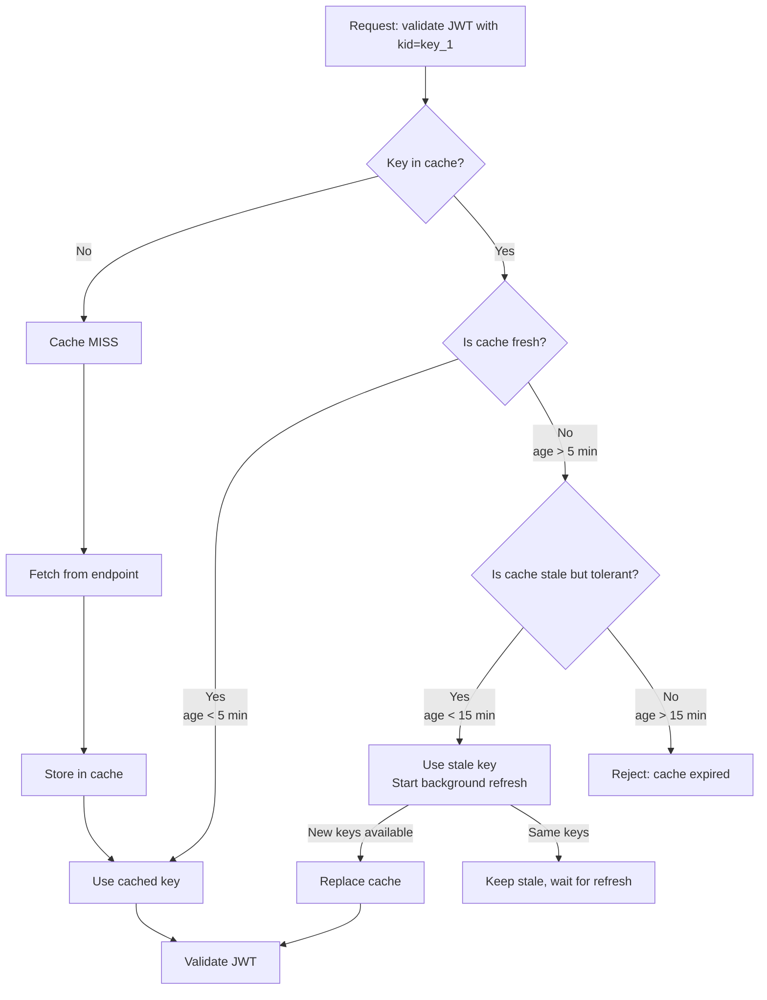
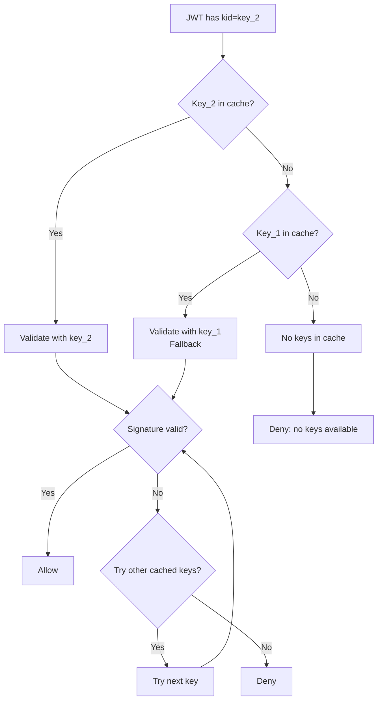

# Story 7.1: Implement JWKS Caching Strategy

## Epic

[07-caching-strategy](../caching.md)

## Parent Epic Story

Story 7.1

## Summary

Implement JWKS caching at the gateway/service level with configurable TTL, fallback to next key, and background refresh. This is the most critical cache because a JWKS outage breaks ALL token validation across all 6 services.

## Why This Story Exists

The JWT document states: "JWKS cache is the first layer -- always cache. Without it, every request requires an HTTP call to fetch keys, creating a single point of failure. A stale cache is safe for validation because key rotation is rare, and new keys are always accepted (fallback to next key)." Without JWKS caching, token validation has a hard dependency on network connectivity to the JWKS endpoint.

## Design Context

### Current State

- No JWKS cache exists in any service
- Each JWT validation makes an HTTP call to the JWKS endpoint
- If the JWKS endpoint is unavailable, ALL token validation fails
- No fallback to next key

### JWKS Cache Design

| Config | Default | Description |
|--------|---------|-------------|
| TTL | 5 minutes | Cache lifetime before refresh |
| Background refresh | true | Refresh cache in background, not on-demand |
| Stale tolerance | 15 minutes | Accept cached keys even if stale (up to 15 min) |
| Fallback to next key | true | If primary key fails, try other keys in JWKS |
| Max keys | 10 | Maximum number of keys to cache |

### Cache Structure

```rust
pub struct JwksCache {
    keys: RwLock<HashMap<String, Jwk>>,  // kid -> JWK
    last_refresh: RwLock<Option<Instant>>,
    refresh_interval: Duration,  // 5 minutes
    stale_tolerance: Duration,   // 15 minutes
    background_refresh: bool,
}
```

### Background Refresh

```rust
impl JwksCache {
    pub async fn start_background_refresh(&self, endpoint: &str) {
        let mut interval = tokio::time::interval(self.refresh_interval);
        
        loop {
            interval.tick().await;
            
            // Refresh in background without blocking request validation
            let new_keys = fetch_jwks(endpoint).await;
            
            if let Ok(keys) = new_keys {
                // Replace cache atomically
                *self.keys.write().await = keys;
                *self.last_refresh.write().await = Some(Instant::now());
                
                info!("JWKS cache refreshed with {} keys", keys.len());
            }
        }
    }
    
    pub async fn get_key(&self, kid: &str) -> Option<Jwk> {
        // 1. Check cache
        if let Some(key) = self.keys.read().await.get(kid) {
            return Some(key.clone());
        }
        
        // 2. Cache miss -- try to refresh immediately
        // This is a temporary measure; background refresh should keep cache populated
        None
    }
    
    pub async fn get_any_valid_key(&self) -> Option<Jwk> {
        // Fallback to any key in JWKS (for key rotation periods)
        let keys = self.keys.read().await;
        keys.values().next().cloned()
    }
}
```

### Validation with JWKS Cache

```rust
pub async fn validate_jwt(
    token: &str,
    cache: &JwksCache,
) -> Result<AccessClaims, JwtError> {
    let parts: Vec<&str> = token.split('.').collect();
    let header: JwtHeader = serde_json::from_str(&parts[0])?;
    
    // 1. Get key from cache (with fallback to any key)
    let key = if let Some(kid) = &header.kid {
        cache.get_key(kid).await
            .or_else(|| cache.get_any_valid_key().await)
    } else {
        cache.get_any_valid_key().await
    };
    
    // 2. Validate signature with cached key
    let claims = verify_signature(token, key)?;
    
    // 3. Validate standard claims
    validate_claims(&claims)?;
    
    Ok(claims)
}
```

## Mermaid Diagrams

### JWKS Cache Lifecycle



### JWKS Cache with Stale Tolerance



### Fallback to Next Key



## Malicious Hacker Gotchas (Must Be Addressed During Implementation)

> **Source:** `docs/PRS_SECURITY_HARDENING.md` — Security threat model analysis

### HACK-711: JWKS Cache Poisoning via Malicious Key Injection (CRITICAL — Hole #1 from PRS)

**Risk:** Attacker injects a malicious key into the JWKS cache that signs forged tokens

The story shows: `background_refresh atomically replaces cache`. If the JWKS endpoint is compromised (or the network path is MITMed), an attacker can inject a malicious public key into the JWKS response. The cache replaces the legitimate key with the attacker's key.

**Exploit path:**
1. Attacker compromises the JWKS endpoint (e.g., SQL injection, code execution, or access to the key management system)
2. Attacker adds a malicious key to the JWKS response: `{key: malicious_key, kid: "key_1"}`
3. The next background refresh atomically replaces the cache with the poisoned keys
4. The service now uses the attacker's key to validate ALL tokens
5. The attacker can sign ANY token with their private key → ALL users are compromised
6. Result: Complete authentication bypass

**Implementation requirement:**
- The JWKS fetch MUST use TLS with certificate pinning (or at minimum TLS with standard certificate validation)
- The JWKS endpoint URL MUST be hardcoded or come from a trusted configuration source (not from the database or user input)
- Add a hash chain: store the hash of the previous JWKS response and verify the new response's hash is consistent with the previous one (detects unexpected changes)
- Add rate limiting to the JWKS fetch: MAX 1 fetch per minute per service instance (prevents refresh storms from amplifying cache poisoning)
- Document: "JWKS cache poisoning is prevented by TLS with certificate validation, hardcoded endpoint URLs, and fetch rate limiting."

### HACK-712: JWKS Cache Can Be Exhausted via Key Flood (HIGH — related to Hole #1 from PRS)

**Risk:** Attacker floods the JWKS endpoint with keys to exhaust cache memory

The story says: `max_keys = 10`. But what if the attacker sends a JWKS response with 10,000 keys? The cache would accept the first 10 (or all 10,000 if max_keys is not enforced).

**Exploit path:**
1. Attacker controls the JWKS endpoint (or can MITM the fetch)
2. Attacker sends a JWKS response with 10,000 keys (each ~1-2 KB)
3. The cache stores 10,000 keys (10-20 MB of memory)
4. If the attacker sends 100 such responses over time, the memory usage grows to 1-2 GB
5. The service OOMs and crashes
6. Result: Denial of service

**The story says:** `max_keys = 10`. But is this enforced at the FETCH level or the STORAGE level? If it's only at storage, the attacker could still send a 10,000-key response and the cache would truncate it to 10 keys. So the exploit only works if max_keys is NOT enforced.

**The real risk is different:** What if the attacker sends a JWKS response with 10 keys, each containing a VERY LARGE key (e.g., 100 KB due to malformed PEM data)?

**Exploit path:**
1. Attacker sends a JWKS response with 10 keys, each 100 KB (1 MB total)
2. The cache stores all 10 keys (1 MB)
3. The attacker sends 10 such responses per minute → 10 MB/min → 600 MB/hour
4. The service eventually OOMs
5. Result: Denial of service

**Implementation requirement:**
- Enforce max_keys at the FETCH level: reject JWKS responses with more than 10 keys
- Enforce a MAX key size: reject any JWK that exceeds 10 KB (RSA public keys are typically 1-2 KB)
- Enforce a MAX JWKS response size: reject JWKS documents larger than 100 KB
- Document: "JWKS responses are limited to 10 keys, 10 KB per key, and 100 KB total. Oversized responses are rejected."

### HACK-713: Stale JWKS Key Used for Token Forgery (HIGH — related to Hole #3 from PRS)

**Risk:** A key that was rotated OUT of the JWKS endpoint is still in the cache and used to validate tokens

The story says: `stale tolerance: 15 minutes`. This means if a key is rotated, the old key remains in the cache for 15 minutes. During this window, an attacker who obtained the old PRIVATE key can sign forged tokens.

**Exploit path:**
1. At time T, the key rotation occurs: key_1 → key_2
2. The JWKS endpoint now only has key_2
3. But the cache still has key_1 (because of the 15-minute stale tolerance)
4. An attacker who obtained key_1's private key (e.g., from a backup, log, or leak) before the rotation
5. The attacker signs a forged token with key_1
6. The service validates the token with the stale key_1 from the cache → VALID
7. Result: Forged token accepted during the 15-minute rotation window

**This is the inherent risk of the stale tolerance design.** The trade-off is: accept stale keys for resilience vs. reject immediately for security.

**Implementation requirement:**
- Add a WARN-level log entry whenever a stale key is used for validation: "Stale key used for validation: kid=key_1, age=XXs, tolerance=15min"
- Alert on high stale-key usage: "More than 10% of validations using stale keys — possible key rotation issue"
- Consider reducing the stale tolerance from 15 minutes to 5 minutes (the minimum safe window for key propagation)
- Document: "Stale key tolerance allows key_1 to validate for up to 15 minutes after rotation. Reduce to 5 minutes for higher security."

### HACK-714: JWKS Endpoint DoS via Continuous Refresh (MEDIUM — related to Hole #5 from PRS)

**Risk:** Attacker floods the JWKS endpoint to exhaust its resources, causing cache miss storms

The story says: `background refresh every 5 minutes`. If an attacker can trigger a cache miss (e.g., by clearing the cache or by sending requests with unexpected kid values), every service will fetch from the JWKS endpoint simultaneously.

**Exploit path:**
1. Attacker clears the JWKS cache in one service instance (e.g., via a configuration endpoint or by exploiting a bug)
2. All 6 services simultaneously fetch from the JWKS endpoint (1 HTTP request each)
3. The JWKS endpoint receives 6 requests simultaneously
4. If the attacker does this 100 times per second (via 100 service instances), the JWKS endpoint receives 600 requests/second
5. The JWKS endpoint becomes overloaded and starts returning errors
6. All services fail to validate tokens → complete authentication outage
7. Result: Denial of service against the JWKS endpoint

**But the story says:** `single-flight pattern` is NOT used for JWKS caching (only for version cache in Story 7.3). So concurrent requests do trigger concurrent JWKS fetches.

**Implementation requirement:**
- Implement a single-flight pattern for JWKS fetches (at least at the per-process level): if a fetch is already in progress, subsequent requests wait for the result
- Add a global rate limit to JWKS fetches: MAX 1 fetch per second per service instance
- Implement exponential backoff on fetch failure: 1s, 2s, 4s, 8s, 16s, 32s (up to a maximum of 120s)
- Document: "JWKS fetches use single-flight deduplication and exponential backoff. Maximum 1 fetch per second per instance."

---

## OpenAPI Changes

No OpenAPI changes. JWKS caching is internal to the validation layer.

## Design Doc References

- `design-doc.md` section 10.1: Token Security -- "JWKS cache TTL of 5 minutes with fallback to next key"
- `design-doc.md` section 10.11: Caching Strategy -- JWKS cache (5 min TTL, stale tolerance 15 min)
- `design-doc.md` section 10.12: Observability -- `jwks_cache_hit_ratio`, `jwks_cache_miss_total`

## Wiki Pages to Update/Create

- `topics/topic-caching-strategy.md`: Document JWKS caching
- `topics/topic-jwt-schema.md`: Note JWKS cache requirement for validation

## Acceptance Criteria

- [ ] JWKS cache is implemented with 5-minute TTL
- [ ] Background refresh is configured (not on-demand)
- [ ] Stale tolerance of 15 minutes is implemented
- [ ] Fallback to next key when primary key is missing
- [ ] Cache is replaced atomically on refresh
- [ ] Unit tests verify: cache hit, cache miss + refresh, stale key acceptance, fallback to next key
- [ ] Metrics: `jwks_cache_hit_ratio`, `jwks_cache_miss_total`, `jwks_fetch_latency_ms` are emitted
- [ ] Error logging when JWKS endpoint is unavailable

## Dependencies

- Depends on Story 1.2 (JWKS endpoint implementation)
- Required by Story 1.3 (JWKS validation across all services)

## Risk / Trade-offs

- **Stale key risk**: If a key is rotated out and the cache still has the old key, JWTs signed with the new key will fail validation. The stale tolerance (15 minutes) means the old key is accepted for up to 15 minutes. After that, the cache is considered expired and validation fails. This is a trade-off: accept stale keys to avoid single-point-of-failure vs. rejecting stale keys to ensure immediate key rotation.
- **Background refresh failure**: If the background refresh fails (network error, JWKS endpoint down), the cache remains stale. The 15-minute stale tolerance provides a buffer, but if the endpoint is down for longer than 15 minutes, validation will fail. Mitigation: add retry logic with exponential backoff to the background refresh.
- **Memory usage**: The JWKS cache holds keys in memory. Each key is ~1-2 KB. With 6 services and 10 keys per service, the total memory usage is ~120 KB. This is negligible.

## Tests

### Unit Tests

- [ ] **Cache hit: specific kid found in cache**: Given a JWKS cache populated with keys [kid_1, kid_2], assert that `get_key("kid_1")` returns the cached key without calling the JWKS endpoint
- [ ] **Cache miss: specific kid not in cache**: Given a JWKS cache with keys [kid_1], assert that `get_key("kid_2")` returns None — the cache only returns what it holds
- [ ] **Fallback to any valid key when primary not found**: Given a cache with [kid_1, kid_2] and a JWT requesting kid_3 (not in cache), assert that `get_any_valid_key()` returns kid_1 as a fallback (not None)
- [ ] **Stale key within tolerance is accepted**: Given a cache last refreshed 10 minutes ago (TTL=5min, stale_tolerance=15min), assert that `get_key()` still returns cached keys and starts a background refresh
- [ ] **Cache expired beyond tolerance rejects keys**: Given a cache last refreshed 20 minutes ago (TTL=5min, stale_tolerance=15min), assert that key retrieval returns None — the cache is considered expired
- [ ] **Background refresh triggers on interval**: Given a cache with refresh_interval=5min, assert that after 5 minutes of idle time, a background fetch is initiated to the JWKS endpoint
- [ ] **Background refresh atomically replaces cache**: Given a cache with 3 keys and a background refresh returns 5 new keys, assert the entire cache is replaced atomically (all old keys gone, all 5 new keys present) — no partial state
- [ ] **Background refresh failure does not corrupt cache**: Given a background refresh fails (network error, 500 from JWKS endpoint), assert the cache retains its previous keys and last_refresh timestamp is NOT updated
- [ ] **Empty JWKS response handled gracefully**: Given the JWKS endpoint returns `{keys: []}`, assert the cache stores an empty key set (not a panic) and metrics track the empty response
- [ ] **Cache max keys limit enforced**: Given a JWKS endpoint returns 15 keys but max_keys=10, assert the cache stores only 10 keys (first 10 or by kid sort order — deterministic behavior)
- [ ] **TTL configuration defaults to 5 minutes**: Given no explicit TTL config, assert `refresh_interval` is 5 minutes and `stale_tolerance` is 15 minutes
- [ ] **Cache hit ratio metric emitted**: Given 10 cache hits and 2 cache misses, assert `jwks_cache_hit_ratio` reflects 83.3% (10/12)
- [ ] **Cache miss metric emitted**: Given 5 cache misses, assert `jwks_cache_miss_total` is incremented by 5
- [ ] **JWKS fetch latency metric emitted**: Given a JWKS fetch that takes 120ms, assert `jwks_fetch_latency_ms` records 120
- [ ] **Error logging when JWKS endpoint unavailable**: Given the JWKS endpoint returns 503, assert an error-level log is written with the endpoint URL and HTTP status
- [ ] **RwLock read does not block writes**: Given concurrent `get_key()` (read) and background refresh (write) calls, assert no deadlock occurs — reads and writes are non-blocking via RwLock
- [ ] **Cache start_background_refresh spawns async task**: Given `start_background_refresh()` is called, assert it spawns a tokio::task that runs independently (does not block the caller)

### Integration Tests (BDD-style with `rstest_bdd`)

- [ ] **Scenario: Full cache lifecycle — hit then miss then refresh**: `given` a JWKS cache initialized with keys from `/.well-known/jwks.json` → `when` a JWT with kid_1 is validated (cache hit) → `then` 0 HTTP calls are made to the JWKS endpoint
- [ ] **Scenario: Stale key accepted but refresh triggered**: `given` a JWKS cache with keys last refreshed 8 minutes ago → `when` a JWT with kid_1 is validated → `then` the cached kid_1 is returned AND a background refresh is triggered (1 HTTP call initiated)
- [ ] **Scenario: Key rotation during stale tolerance**: `given` the cache has key_1 (from 10 minutes ago) and the JWKS endpoint now returns [key_2, key_3] (key_1 rotated out) → `when` a JWT with kid_2 arrives → `then` the background refresh loads key_2 into the cache and kid_2 is found on the NEXT validation
- [ ] **Scenario: Multiple services share the same JWKS endpoint**: `given` identity-login-service and authz-core both connect to the same JWKS endpoint → `when` key rotation occurs → `then` both services eventually pick up the new keys (within their respective 5-minute refresh intervals)
- [ ] **Scenario: JWKS endpoint returns unexpected format**: `given` the JWKS endpoint returns invalid JSON → `when` the cache attempts background refresh → `then` the error is logged, the old cache is preserved, and validation continues with cached keys
- [ ] **Scenario: Concurrent validations during cache refresh**: `given` the cache has 3 keys and a background refresh is in progress → `when` 50 concurrent JWT validations arrive → `then` all validations complete without panic or deadlock, using either the old cache or the new cache (no partial reads)
- [ ] **Scenario: JWKS endpoint unavailable — cache continues serving**: `given` the JWKS endpoint is down (connection refused) → `when` JWT validations arrive → `then` cached keys are used for validation (no 503 errors to callers) and retry is attempted on the next background interval

### Security Regression Tests

- [ ] **Cache cannot be poisoned via JWKS endpoint MITM**: Assert that the JWKS fetch uses TLS and validates the server certificate — a MITM attacker cannot inject malicious keys into the cache
- [ ] **Stale key does not allow signing with new key**: Assert that when a key is rotated (key_1 → key_2), a JWT signed with key_2 fails validation until the cache refreshes with the new key — stale tolerance does not allow accepting NEW keys
- [ ] **No key in cache — validation fails cleanly**: Assert that when the cache is empty AND the JWKS endpoint is unreachable, JWT validation returns a clear error (not a 500 internal server error or a false positive)
- [ ] **Oversized JWKS response does not cause OOM**: Given a malicious JWKS endpoint returns a 10 MB JWKS document, assert the cache rejects or truncates it without exhausting memory
- [ ] **Cache does not leak key material in logs**: Assert that JWKS keys (especially private key material if any are misconfigured) are NOT written to logs or metrics
- [ ] **Cache miss storm prevention**: Assert that when the cache expires and 1000 concurrent requests arrive, only ONE request triggers a JWKS fetch — others wait for the result (single-flight pattern)

### Edge Cases

- [ ] **JWKS endpoint returns no `kid` in any key**: Given a JWKS response where all keys have empty or missing `kid` fields, assert the cache stores them with empty keys and JWT validation with a specific kid fails (graceful error, not crash)
- [ ] **JWKS endpoint returns duplicate `kid` values**: Given a JWKS response with two keys having the same kid, assert only one is stored (deterministic: last wins or first wins — document the behavior)
- [ ] **Cache refresh interval set to 0**: Given a misconfiguration where `refresh_interval` is 0 seconds, assert the handler either uses a minimum TTL (e.g., 1 minute) or logs a warning and applies a sensible default
- [ ] **Stale tolerance less than TTL**: Given `refresh_interval=5min` and `stale_tolerance=2min` (invalid: tolerance < TTL), assert the handler swaps them or applies a minimum tolerance of TTL + 5 minutes
- [ ] **JWKS endpoint returns HTTP 429 (rate limited)**: Given the JWKS endpoint returns 429 during background refresh, assert the cache retries with exponential backoff (1s, 2s, 4s, 8s...) and does not hammer the endpoint
- [ ] **JWKS endpoint returns HTTP 500 (server error)**: Given the JWKS endpoint returns 500, assert the error is logged at error level, the old cache is preserved, and the next refresh is attempted on the next interval
- [ ] **Cache last_refresh is None on fresh start**: Given a newly created JWKS cache with no keys and no last_refresh time, assert that the first `get_key()` call triggers an immediate fetch (not a background fetch)

### Cleanup

- [ ] JWKS cache state must be cleared between test scenarios — use a fresh `JwksCache` instance per test or a `clear()` method
- [ ] Any spawned background refresh tasks must be cancelled between tests — use `tokio::time::pause()` in tests to prevent real network calls
- [ ] Metrics registry must be reset between test scenarios using `prometheus::Registry::new()` to prevent cross-test metric contamination
- [ ] Mock JWKS endpoint responses must be isolated per test — each test should configure its own mock server or use different endpoint paths to prevent response pollution
- [ ] No temporary files or cache state should persist between tests — all JWKS cache state is in-memory (RwLock<HashMap>) so no filesystem cleanup is needed, but verify no static/global state leaks between tests
- [ ] TLS certificate mocking: if tests use mock JWKS endpoints with self-signed certs, ensure certificates are cleaned up or regenerated between tests to prevent cert cache contamination
