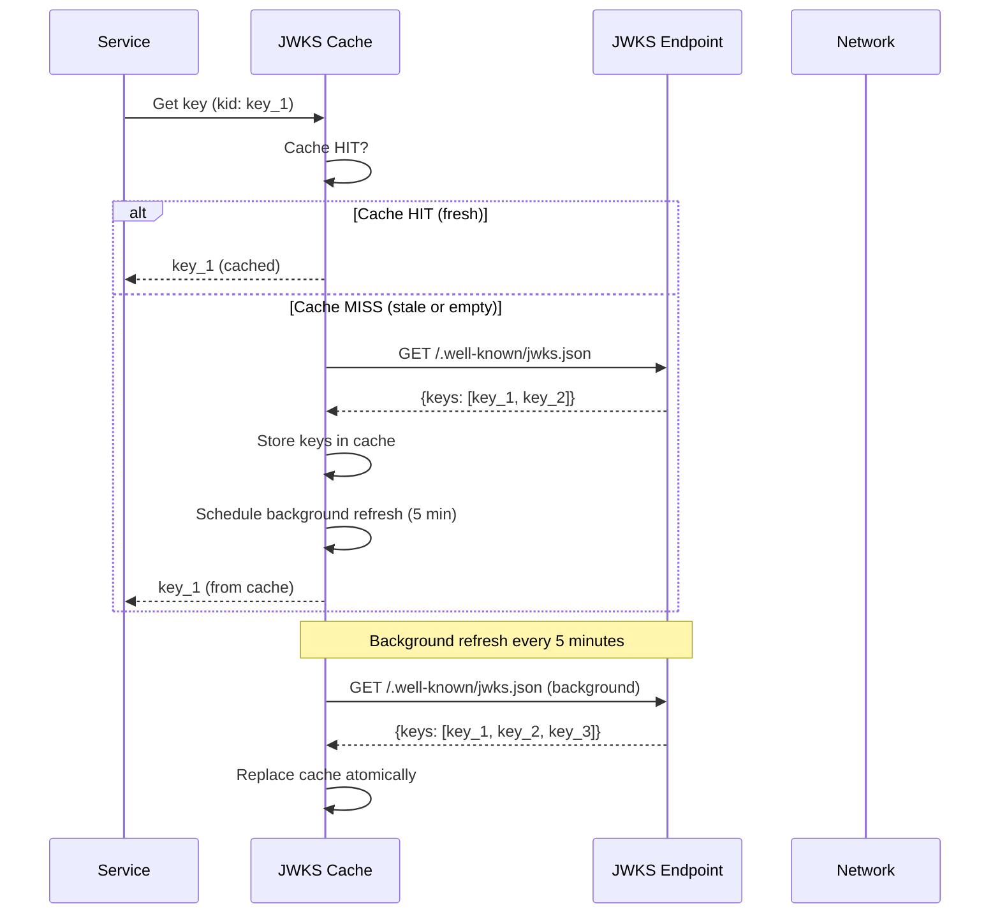
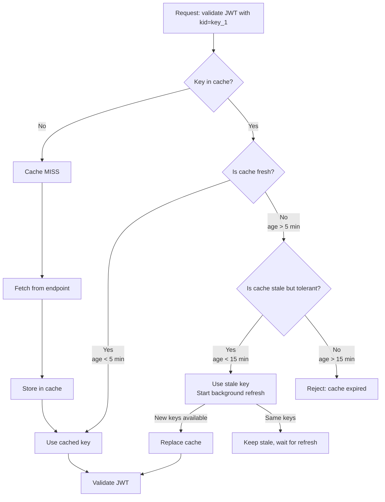
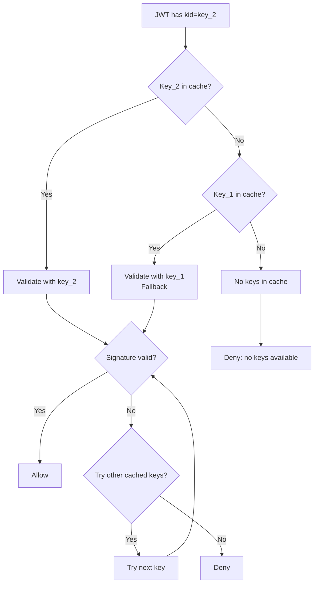

# Story 7.1: Implement JWKS Caching Strategy

## Epic

[07-caching-strategy](../caching.md)

## Parent Epic Story

Story 7.1

## Summary

Implement JWKS caching at the gateway/service level with configurable TTL, fallback to next key, and background refresh. This is the most critical cache because a JWKS outage breaks ALL token validation across all 6 services.

## Why This Story Exists

The JWT document states: "JWKS cache is the first layer -- always cache. Without it, every request requires an HTTP call to fetch keys, creating a single point of failure. A stale cache is safe for validation because key rotation is rare, and new keys are always accepted (fallback to next key)." Without JWKS caching, token validation has a hard dependency on network connectivity to the JWKS endpoint.

## Design Context

### Current State

- No JWKS cache exists in any service
- Each JWT validation makes an HTTP call to the JWKS endpoint
- If the JWKS endpoint is unavailable, ALL token validation fails
- No fallback to next key

### JWKS Cache Design

| Config | Default | Description |
|--------|---------|-------------|
| TTL | 5 minutes | Cache lifetime before refresh |
| Background refresh | true | Refresh cache in background, not on-demand |
| Stale tolerance | 15 minutes | Accept cached keys even if stale (up to 15 min) |
| Fallback to next key | true | If primary key fails, try other keys in JWKS |
| Max keys | 10 | Maximum number of keys to cache |

### Cache Structure

```rust
pub struct JwksCache {
    keys: RwLock<HashMap<String, Jwk>>,  // kid -> JWK
    last_refresh: RwLock<Option<Instant>>,
    refresh_interval: Duration,  // 5 minutes
    stale_tolerance: Duration,   // 15 minutes
    background_refresh: bool,
}
```

### Background Refresh

```rust
impl JwksCache {
    pub async fn start_background_refresh(&self, endpoint: &str) {
        let mut interval = tokio::time::interval(self.refresh_interval);
        
        loop {
            interval.tick().await;
            
            // Refresh in background without blocking request validation
            let new_keys = fetch_jwks(endpoint).await;
            
            if let Ok(keys) = new_keys {
                // Replace cache atomically
                *self.keys.write().await = keys;
                *self.last_refresh.write().await = Some(Instant::now());
                
                info!("JWKS cache refreshed with {} keys", keys.len());
            }
        }
    }
    
    pub async fn get_key(&self, kid: &str) -> Option<Jwk> {
        // 1. Check cache
        if let Some(key) = self.keys.read().await.get(kid) {
            return Some(key.clone());
        }
        
        // 2. Cache miss -- try to refresh immediately
        // This is a temporary measure; background refresh should keep cache populated
        None
    }
    
    pub async fn get_any_valid_key(&self) -> Option<Jwk> {
        // Fallback to any key in JWKS (for key rotation periods)
        let keys = self.keys.read().await;
        keys.values().next().cloned()
    }
}
```

### Validation with JWKS Cache

```rust
pub async fn validate_jwt(
    token: &str,
    cache: &JwksCache,
) -> Result<AccessClaims, JwtError> {
    let parts: Vec<&str> = token.split('.').collect();
    let header: JwtHeader = serde_json::from_str(&parts[0])?;
    
    // 1. Get key from cache (with fallback to any key)
    let key = if let Some(kid) = &header.kid {
        cache.get_key(kid).await
            .or_else(|| cache.get_any_valid_key().await)
    } else {
        cache.get_any_valid_key().await
    };
    
    // 2. Validate signature with cached key
    let claims = verify_signature(token, key)?;
    
    // 3. Validate standard claims
    validate_claims(&claims)?;
    
    Ok(claims)
}
```

## Mermaid Diagrams

### JWKS Cache Lifecycle



### JWKS Cache with Stale Tolerance



### Fallback to Next Key



## OpenAPI Changes

No OpenAPI changes. JWKS caching is internal to the validation layer. The `/.well-known/jwks.json` endpoint is already documented in the spec.

## Design Doc References

- `design-doc.md` section 10.1: Token Security -- "JWKS cache TTL of 5 minutes with fallback to next key"
- `design-doc.md` section 10.11: Caching Strategy -- JWKS cache (5 min TTL, stale tolerance 15 min)
- `design-doc.md` section 10.12: Observability -- `jwks_cache_hit_ratio`, `jwks_cache_miss_total`

## Wiki Pages to Update/Create

- `topics/topic-caching-strategy.md`: Document JWKS caching
- `topics/topic-jwt-schema.md`: Note JWKS cache requirement for validation

## Acceptance Criteria

- [ ] JWKS cache is implemented with 5-minute TTL
- [ ] Background refresh is configured (not on-demand)
- [ ] Stale tolerance of 15 minutes is implemented
- [ ] Fallback to next key when primary key is missing
- [ ] Cache is replaced atomically on refresh
- [ ] Unit tests verify: cache hit, cache miss + refresh, stale key acceptance, fallback to next key
- [ ] Metrics: `jwks_cache_hit_ratio`, `jwks_cache_miss_total`, `jwks_fetch_latency_ms` are emitted
- [ ] Error logging when JWKS endpoint is unavailable

## Dependencies

- Depends on Story 1.2 (JWKS endpoint implementation)
- Required by Story 1.3 (JWKS validation across all services)

## Risk / Trade-offs

- **Stale key risk**: If a key is rotated out and the cache still has the old key, JWTs signed with the new key will fail validation. The stale tolerance (15 minutes) means the old key is accepted for up to 15 minutes. After that, the cache is considered expired and validation fails. This is a trade-off: accept stale keys to avoid single-point-of-failure vs. rejecting stale keys to ensure immediate key rotation.
- **Background refresh failure**: If the background refresh fails (network error, JWKS endpoint down), the cache remains stale. The 15-minute stale tolerance provides a buffer, but if the endpoint is down for longer than 15 minutes, validation will fail. Mitigation: add retry logic with exponential backoff to the background refresh.
- **Memory usage**: The JWKS cache holds keys in memory. Each key is ~1-2 KB. With 6 services and 10 keys per service, the total memory usage is ~120 KB. This is negligible.
