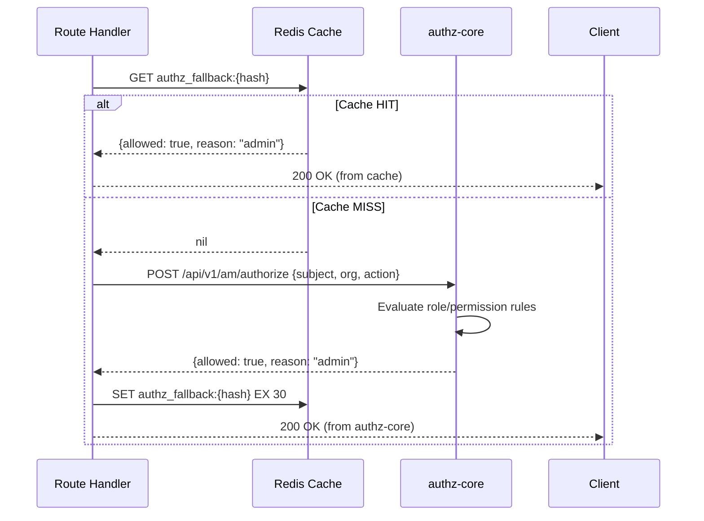
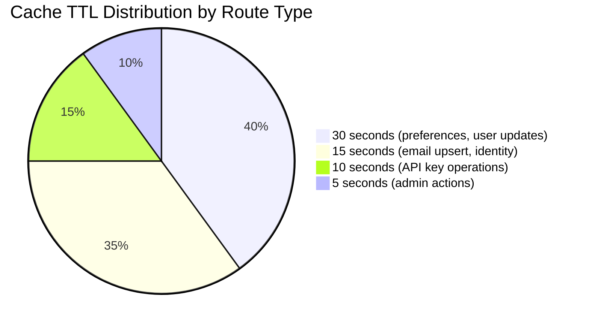
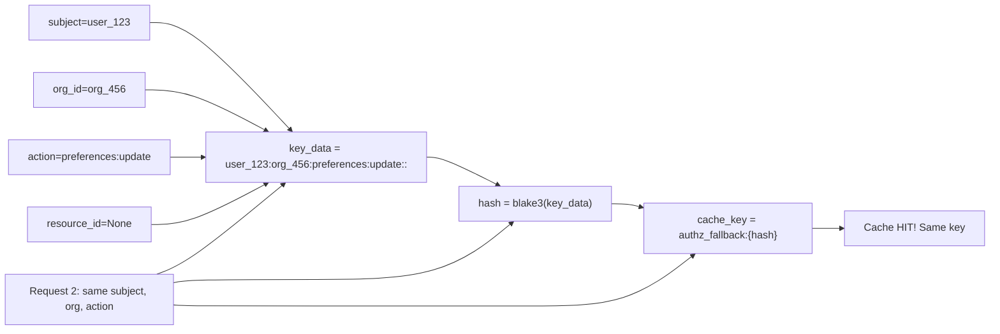

# Story 7.2: Implement Online Fallback Result Cache

## Epic

[07-caching-strategy](../caching.md)

## Parent Epic Story

Story 7.2

## Summary

Implement Redis-based caching for online fallback authorization results with per-route TTL (5-30 seconds). This is the second most critical cache because it reduces authz-core load by caching fine-grained authorization decisions for `jwt-with-fallback` routes.

## Why This Story Exists

The JWT document states: "Online fallback result cache caches the result of the first synchronous call per request pattern. Per-route TTL (5-30 seconds). Cache key based on subject + org + action." This cache is the primary mechanism for reducing authz-core load in the hybrid authorization model.

## Design Context

### Current State

- No online fallback result cache exists
- Every `jwt-with-fallback` request calls authz-core without caching
- authz-core handles all fine-grained authorization decisions
- No per-route cache TTL differentiation

### Cache Design

| Config | Default | Description |
|--------|---------|-------------|
| TTL per route | 5-30 seconds | Configured per route in RoutePolicy |
| Cache backend | Redis | Shared across services |
| Key format | `authz_fallback:{hash}` | Hash of subject + org + action |
| Key TTL | Per-route | Matches route configuration |
| Serialization | JSON | Standard JSON encoding |

### Cache Key Generation

```rust
fn generate_cache_key(
    subject: &str,
    org_id: &str,
    action: &str,
    resource_id: Option<&str>,
) -> String {
    // Create a deterministic, compact cache key
    let key_data = format!("{subject}:{org_id}:{action}:{resource_id:?}");
    let hash = blake3::hash(key_data.as_bytes());
    format!("authz_fallback:{hash}")
}
```

### Per-Route TTL Configuration

```rust
// In config/routes.yaml:
route_policies:
  - path: "/api/v1/identity/preferences"
    methods: ["PUT", "PATCH"]
    category: "jwt-with-fallback"
    fallback_ttl_secs: 30  # Low-risk write, 30s is acceptable
    
  - path: "/api/v1/identity/email/upsert"
    methods: ["PUT", "PATCH"]
    category: "jwt-with-fallback"
    fallback_ttl_secs: 15  # Data integrity needs more freshness
```

### Cache Operations

```rust
async fn get_or_annotate(
    cache: &Redis,
    authz_client: &AuthzClient,
    request: &AuthorizeRequest,
) -> Result<AuthorizeResponse, AuthError> {
    let cache_key = generate_cache_key(
        &request.subject,
        &request.org_id,
        &request.action,
        request.resource_id.as_deref(),
    );
    
    // 1. Try cache hit
    if let Some(cached) = cache.get::<_, Option<AuthorizeResponse>>(&cache_key).await? {
        return Ok(cached);  // Cache hit
    }
    
    // 2. Cache miss -- call authz-core
    let result = authz_client.authorize(request).await?;
    
    // 3. Get TTL for this route
    let ttl = get_fallback_ttl_for_route(&request.action);  // 5-30 seconds
    
    // 4. Store in cache
    cache.set_ex(&cache_key, &result, ttl).await?;
    
    Ok(result)
}
```

## Mermaid Diagrams

### Cache Hit/Miss Flow



### Cache TTL per Route Type



### Cache Key Determinism



## OpenAPI Changes

- `/api/v1/am/authorize` endpoint: Document cache behavior in description
- No changes to request/response shapes needed

```yaml
components:
  schemas:
    AuthorizeRequest:
      description: |
        Authorization check request. Results are cached in Redis with per-route TTL
        (5-30 seconds). Repeated identical requests within the TTL return cached results.
        The cache key is a hash of subject + org + action + resource_id.
```

## Design Doc References

- `design-doc.md` section 10.3: Hybrid Authorization Model -- online fallback caching
- `design-doc.md` section 10.11: Caching Strategy -- Online fallback result cache (per-route TTL 5-30s)
- `design-doc.md` section 10.12: Observability -- `authz_fallback_cache_hit_ratio` metric

## Wiki Pages to Update/Create

- `topics/topic-caching-strategy.md`: Document online fallback cache
- `topics/topic-hybrid-authz.md`: Document cache integration with hybrid model

## Acceptance Criteria

- [ ] Online fallback results are cached in Redis
- [ ] Cache key is deterministic (same request -> same key)
- [ ] Per-route TTL is configurable (5-30 seconds)
- [ ] Cache TTL is read from RoutePolicy configuration
- [ ] Cache hit returns cached result immediately
- [ ] Cache miss calls authz-core and caches result
- [ ] Metrics: `authz_fallback_cache_hit_ratio` is emitted per route
- [ ] Metrics: `authz_fallback_cache_size` is emitted
- [ ] Unit tests verify: cache hit/miss, TTL expiration, key determinism

## Dependencies

- Depends on Story 4.3 (selective online fallback)
- Intersects with Story 4.1 (RoutePolicyStore with per-route TTL config)

## Risk / Trade-offs

- **Cache staleness**: Cached results are stale by definition (up to TTL seconds old). For low-risk routes (30s TTL), the worst case is a user sees a 30-second-old authorization decision. For high-risk routes (5s TTL), this is minimal. The cache TTL should match the risk level of the route.
- **Cache key collisions**: If two requests have the same subject + org + action + resource_id, they share the same cache key. This is the desired behavior for cache efficiency. However, if the action has side effects (e.g., "orders:create"), the cache should NOT be used for the same key within a short window (to prevent duplicate order creation). This requires a separate write-optimization cache.
- **Redis dependency**: If Redis is down, the cache is unavailable. All requests go directly to authz-core, increasing load. This is acceptable because authz-core is designed to handle this (it's the default path without caching).
- **Write-after-read cache poisoning**: A read-optimized cache can cause write operations to return stale "allowed" decisions. For example, if a user was allowed to create an order 10 seconds ago, the cached "allowed" decision would still be served for a subsequent order creation request within the 15-second TTL window. Mitigation: use a very short TTL (5 seconds) for write actions or exclude write actions from caching entirely.

## Tests

### Unit Tests

- [ ] **Cache hit: deterministic key produces same result**: Given the same inputs (subject=user_1, org=org_2, action=preferences:update, resource_id=None), assert that `generate_cache_key()` returns the identical blake3 hash both times
- [ ] **Cache miss with different subject produces different key**: Given (subject=user_1, org=org_2, action=preferences:update) vs (subject=user_2, org=org_2, action=preferences:update), assert the cache keys differ
- [ ] **Cache miss with different action produces different key**: Given (subject=user_1, org=org_2, action=preferences:update) vs (subject=user_1, org=org_2, action=preferences:read), assert the cache keys differ
- [ ] **Cache miss with different org produces different key**: Given (subject=user_1, org=org_2, action=update) vs (subject=user_1, org=org_99, action=update), assert the cache keys differ
- [ ] **Cache miss with resource_id present produces different key**: Given request without resource_id vs same request with resource_id="order_123", assert the cache keys differ
- [ ] **Cache hit returns cached result immediately**: Given a Redis cache pre-populated with a result for key X, assert `get_or_annotate()` returns the cached result without calling authz-core
- [ ] **Cache miss calls authz-core and stores result**: Given a Redis cache with no entry for key X, assert `get_or_annotate()` calls authz-core, stores the result with the correct TTL, and returns the result
- [ ] **Per-route TTL read from RoutePolicy**: Given preferences PUT has fallback_ttl_secs=30 and email/upsert has fallback_ttl_secs=15, assert the cache SET command uses the route-specific TTL (not a global default)
- [ ] **Default TTL is 15 seconds when route not configured**: Given a route not found in RoutePolicy config, assert the fallback uses 15 seconds as the default TTL
- [ ] **Cache hit metric emitted on hit**: Given a cache hit, assert `authz_fallback_cache_hit_ratio` is incremented and `authz_fallback_cache_total{route}` reflects the hit
- [ ] **Cache miss metric emitted on miss**: Given a cache miss, assert `authz_fallback_cache_miss_total{route}` is incremented
- [ ] **Cache size metric reflects current entry count**: Given 5 unique cache entries in Redis, assert `authz_fallback_cache_size` returns 5
- [ ] **Authz response serialized to JSON correctly**: Given an AuthorizeResponse {allowed: true, reason: "admin"}, assert the JSON serialization preserves all fields
- [ ] **Authz response deserialized from JSON correctly**: Given a cached JSON string, assert deserialization produces the same AuthorizeResponse struct
- [ ] **Route policy lookup by path+method returns correct TTL**: Given path="/api/v1/identity/preferences" method="PUT", assert `get_fallback_ttl_for_route()` returns 30 seconds

### Integration Tests (BDD-style with `rstest_bdd`)

- [ ] **Scenario: Cache hit serves cached decision**: `given` a cached authz decision {allowed: true, reason: "admin"} for key authz_fallback:abc123 → `when` a request with matching subject/org/action arrives → `then` the handler returns the cached decision and 0 calls are made to authz-core
- [ ] **Scenario: Cache miss calls authz-core and caches result**: `given` no cached decision exists for the request → `when` the request arrives → `then` authz-core is called, the result is stored in Redis with the route-specific TTL, and the result is returned
- [ ] **Scenario: Different routes get different TTLs**: `given` preferences PUT has TTL=30 and email/upsert has TTL=15 → `when` both route types generate cache entries → `then` Redis contains entries with EX=30 for preferences and EX=15 for email/upsert (verified via TTL inspection)
- [ ] **Scenario: Cached decision is returned after TTL expiry**: `given` a cached decision with TTL=5 seconds → `when` 6 seconds pass → `then` the cache returns nil and the next request calls authz-core (cache expired)
- [ ] **Scenario: Multiple identical requests share cache**: `given` a cached decision exists → `when` 10 identical requests arrive within the TTL window → `then` authz-core is called exactly once (first request) and 9 times served from cache
- [ ] **Scenario: Different actions invalidate cache for same subject/org**: `given` a cached decision for action=preferences:update → `when` a request arrives for action=preferences:read with same subject/org → `then` the cache returns nil (different key) and authz-core is called
- [ ] **Scenario: Concurrent requests for same cache key**: `given` a cache miss for key X and 20 concurrent requests for the same key → `then` authz-core is called at most once (single-flight), all 20 requests receive a result, and the result is cached after the first completes
- [ ] **Scenario: Redis unavailable — requests go to authz-core**: `given` Redis is down (connection refused) → `when` a jwt-with-fallback request arrives → `then` the request bypasses the cache and calls authz-core directly without panic

### Security Regression Tests

- [ ] **Cache cannot return stale "allowed" for expired permissions**: Given a user's permissions were revoked 10 seconds ago (TTL=30s), assert that a cached "allowed" decision does NOT override the actual revocation — if the permission was revoked, the authz-core call on cache miss should return "denied" and overwrite the stale cache entry
- [ ] **Cache key collision attack prevention**: Given an attacker tries to craft a request that produces a blake3 hash collision with another user's cache key, assert the collision probability is negligible (2^-256) and even if a hash collision occurred, the attacker would still need the same subject, org, and action values
- [ ] **Cache does not leak authorization decisions**: Assert that cached results are NOT written to logs, metrics (beyond count/hit ratio), or error responses visible to clients
- [ ] **Cache miss does not expose authz-core internals**: Assert that authz-core errors during a cache miss are sanitized before being returned to the client — internal permission check details are not leaked
- [ ] **Write actions not cached with "allowed" decision**: Assert that write-type actions (e.g., preferences:put, email:upsert) are either excluded from the cache or use a very short TTL (5 seconds) to prevent write-after-read cache poisoning
- [ ] **Cache cannot be used for authorization bypass via key manipulation**: Assert that a client cannot craft a request that hashes to an existing cache key belonging to another user — the hash is deterministic over subject, org, and action, so each user's keys are independent

### Edge Cases

- [ ] **Cache key with very long subject (1000 chars)**: Given a subject string of 1000 characters, assert `generate_cache_key()` produces a valid hash without panicking or truncating
- [ ] **Cache key with Unicode characters in subject**: Given a subject containing Unicode (e.g., "usr_caf\u00e9"), assert the hash is deterministic across calls and the same Unicode subject produces the same cache key
- [ ] **Cache key with empty org_id**: Given org_id="" (empty string), assert the cache key is generated correctly and doesn't match a key with a non-empty org_id
- [ ] **Cache key with null resource_id vs empty string resource_id**: Given resource_id=None vs resource_id=Some(""), assert these produce different cache keys (None should be distinct from empty string)
- [ ] **Redis SET with very short TTL (1 second)**: Given a misconfiguration where a route has fallback_ttl_secs=1, assert the cache stores with EX=1 and expires after 1 second (not an error)
- [ ] **Redis response deserialization failure**: Given a corrupted cached value in Redis (binary garbage), assert the handler logs a warning, treats it as a cache miss, calls authz-core, and overwrites with a valid entry — does not panic
- [ ] **TTL configuration value of 0**: Given a route with fallback_ttl_secs=0 in config, assert the handler either uses a minimum TTL (1 second) or logs a warning and applies a sensible default
- [ ] **TTL configuration value exceeds Redis max (536870911 seconds)**: Given a route with fallback_ttl_secs=1000000000, assert the handler clamps to Redis max or logs a warning

### Cleanup

- [ ] Redis cache entries must be cleaned between test scenarios — use `FLUSHDB` or a unique Redis prefix per test run to prevent stale authorization decisions from affecting subsequent tests
- [ ] Cache key generation must be deterministic — use consistent test fixtures (fixed subject, org, action values) so cache keys are predictable across test runs
- [ ] Metrics registry must be reset between test scenarios using `prometheus::Registry::new()` to prevent cross-test metric contamination
- [ ] Mock authz-core responses must be isolated per test — each test should configure its own mock server or use different response expectations to prevent response pollution
- [ ] Redis TTL behavior in tests: when testing TTL expiry, use time control (tokio::time::pause()/advance) or override the TTL configuration to speed up test execution
- [ ] No files (cache state files, config) should be left in the filesystem after test runs — all state is in Redis, so no filesystem cleanup is needed
- [ ] Redis connection pool state must be reset between tests — use a fresh Redis connection or a test-specific Redis instance to prevent connection state leakage
