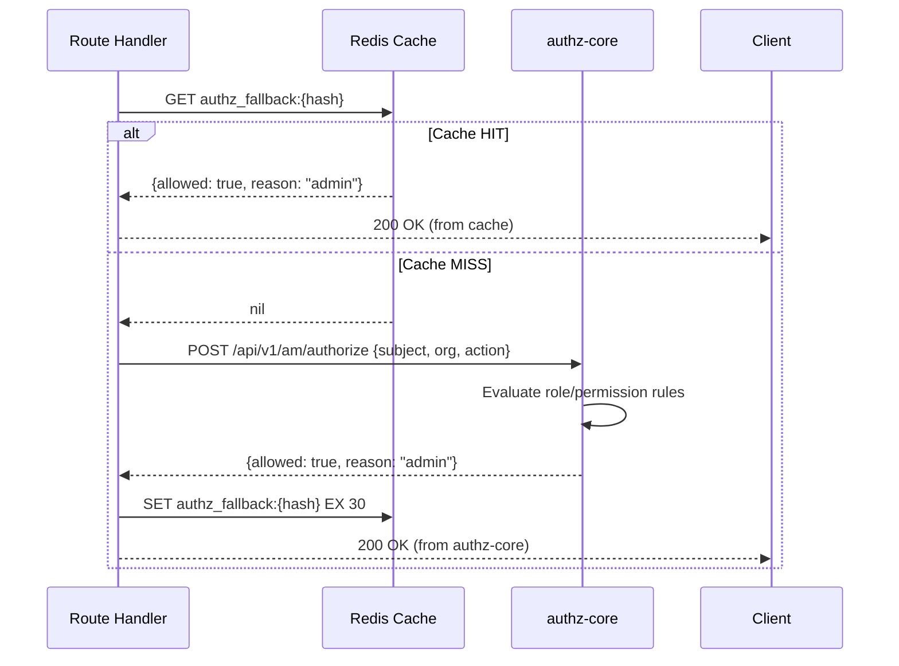
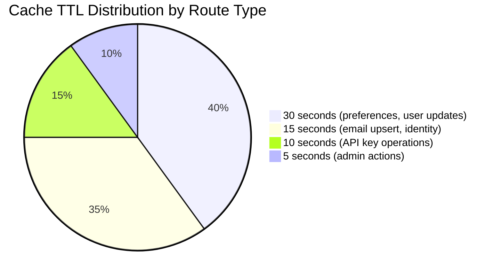
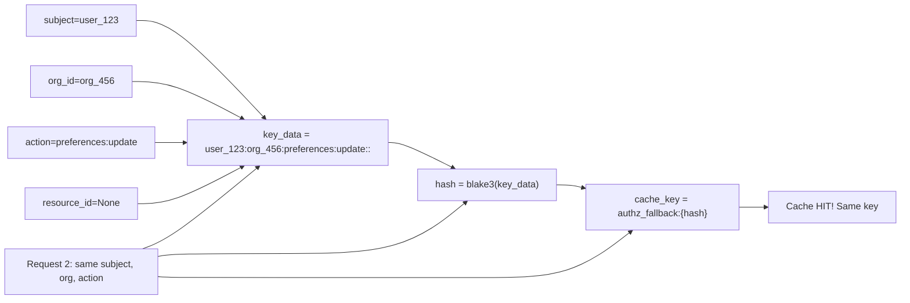

# Story 7.2: Implement Online Fallback Result Cache

## Epic

[07-caching-strategy](../caching.md)

## Parent Epic Story

Story 7.2

## Summary

Implement Redis-based caching for online fallback authorization results with per-route TTL (5-30 seconds). This is the second most critical cache because it reduces authz-core load by caching fine-grained authorization decisions for `jwt-with-fallback` routes.

## Why This Story Exists

The JWT document states: "Online fallback result cache caches the result of the first synchronous call per request pattern. Per-route TTL (5-30 seconds). Cache key based on subject + org + action." This cache is the primary mechanism for reducing authz-core load in the hybrid authorization model.

## Design Context

### Current State

- No online fallback result cache exists
- Every `jwt-with-fallback` request calls authz-core without caching
- authz-core handles all fine-grained authorization decisions
- No per-route cache TTL differentiation

### Cache Design

| Config | Default | Description |
|--------|---------|-------------|
| TTL per route | 5-30 seconds | Configured per route in RoutePolicy |
| Cache backend | Redis | Shared across services |
| Key format | `authz_fallback:{hash}` | Hash of subject + org + action |
| Key TTL | Per-route | Matches route configuration |
| Serialization | JSON | Standard JSON encoding |

### Cache Key Generation

```rust
fn generate_cache_key(
    subject: &str,
    org_id: &str,
    action: &str,
    resource_id: Option<&str>,
) -> String {
    // Create a deterministic, compact cache key
    let key_data = format!("{subject}:{org_id}:{action}:{resource_id:?}");
    let hash = blake3::hash(key_data.as_bytes());
    format!("authz_fallback:{hash}")
}
```

### Per-Route TTL Configuration

```rust
// In config/routes.yaml:
route_policies:
  - path: "/api/v1/identity/preferences"
    methods: ["PUT", "PATCH"]
    category: "jwt-with-fallback"
    fallback_ttl_secs: 30  # Low-risk write, 30s is acceptable
    
  - path: "/api/v1/identity/email/upsert"
    methods: ["PUT", "PATCH"]
    category: "jwt-with-fallback"
    fallback_ttl_secs: 15  # Data integrity needs more freshness
```

### Cache Operations

```rust
async fn get_or_annotate(
    cache: &Redis,
    authz_client: &AuthzClient,
    request: &AuthorizeRequest,
) -> Result<AuthorizeResponse, AuthError> {
    let cache_key = generate_cache_key(
        &request.subject,
        &request.org_id,
        &request.action,
        request.resource_id.as_deref(),
    );
    
    // 1. Try cache hit
    if let Some(cached) = cache.get::<_, Option<AuthorizeResponse>>(&cache_key).await? {
        return Ok(cached);  // Cache hit
    }
    
    // 2. Cache miss -- call authz-core
    let result = authz_client.authorize(request).await?;
    
    // 3. Get TTL for this route
    let ttl = get_fallback_ttl_for_route(&request.action);  // 5-30 seconds
    
    // 4. Store in cache
    cache.set_ex(&cache_key, &result, ttl).await?;
    
    Ok(result)
}
```

## Mermaid Diagrams

### Cache Hit/Miss Flow



### Cache TTL per Route Type



### Cache Key Determinism



## OpenAPI Changes

- `/api/v1/am/authorize` endpoint: Document cache behavior in description
- No changes to request/response shapes needed

```yaml
components:
  schemas:
    AuthorizeRequest:
      description: |
        Authorization check request. Results are cached in Redis with per-route TTL
        (5-30 seconds). Repeated identical requests within the TTL return cached results.
        The cache key is a hash of subject + org + action + resource_id.
```

## Design Doc References

- `design-doc.md` section 10.3: Hybrid Authorization Model -- online fallback caching
- `design-doc.md` section 10.11: Caching Strategy -- Online fallback result cache (per-route TTL 5-30s)
- `design-doc.md` section 10.12: Observability -- `authz_fallback_cache_hit_ratio` metric

## Wiki Pages to Update/Create

- `topics/topic-caching-strategy.md`: Document online fallback cache
- `topics/topic-hybrid-authz.md`: Document cache integration with hybrid model

## Acceptance Criteria

- [ ] Online fallback results are cached in Redis
- [ ] Cache key is deterministic (same request -> same key)
- [ ] Per-route TTL is configurable (5-30 seconds)
- [ ] Cache TTL is read from RoutePolicy configuration
- [ ] Cache hit returns cached result immediately
- [ ] Cache miss calls authz-core and caches result
- [ ] Metrics: `authz_fallback_cache_hit_ratio` is emitted per route
- [ ] Metrics: `authz_fallback_cache_size` is emitted
- [ ] Unit tests verify: cache hit/miss, TTL expiration, key determinism

## Dependencies

- Depends on Story 4.3 (selective online fallback)
- Intersects with Story 4.1 (RoutePolicyStore with per-route TTL config)

## Risk / Trade-offs

- **Cache staleness**: Cached results are stale by definition (up to TTL seconds old). For low-risk routes (30s TTL), the worst case is a user sees a 30-second-old authorization decision. For high-risk routes (5s TTL), this is minimal. The cache TTL should match the risk level of the route.
- **Cache key collisions**: If two requests have the same subject + org + action + resource_id, they share the same cache key. This is the desired behavior for cache efficiency. However, if the action has side effects (e.g., "orders:create"), the cache should NOT be used for the same key within a short window (to prevent duplicate order creation). This requires a separate write-optimization cache.
- **Redis dependency**: If Redis is down, the cache is unavailable. All requests go directly to authz-core, increasing load. This is acceptable because authz-core is designed to handle this (it's the default path without caching).
