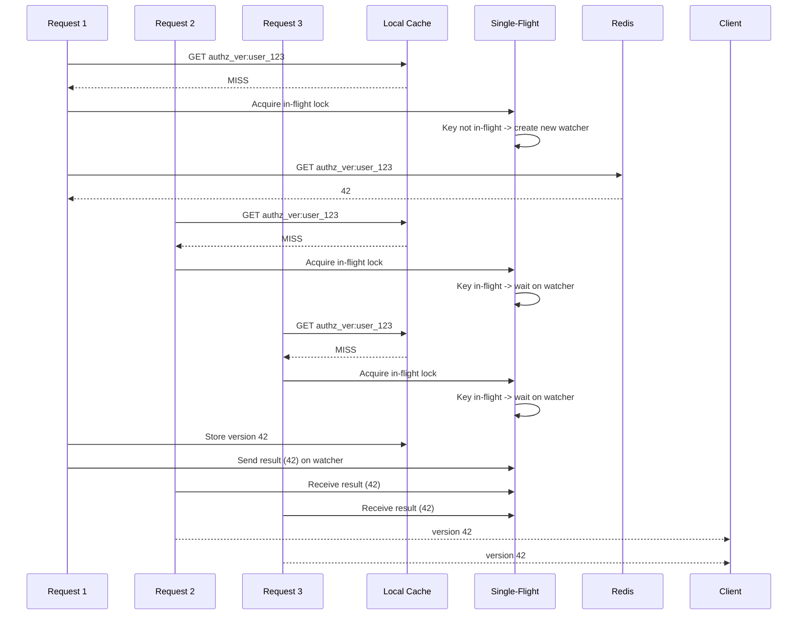
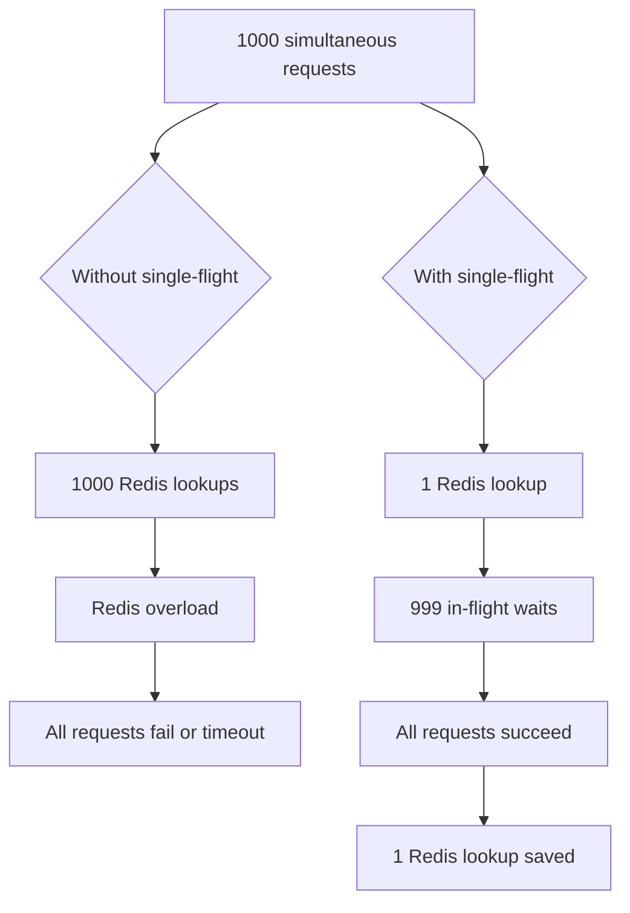

# Story 7.3: Implement Version Cache with Single-Flight Pattern

## Epic

[07-caching-strategy](../caching.md)

## Parent Epic Story

Story 7.3

## Summary

Implement the version cache with the single-flight (deduplication) pattern to prevent cache miss storms when many requests simultaneously miss the version cache. This is the third critical cache because version checks are called on every high-risk request.

## Why This Story Exists

The JWT document states: "check a central blacklist or Redis version key on every request partly recreates the original bottleneck. So cache revocation and version data at the gateway or service for a short window -- often seconds, not minutes." The single-flight pattern ensures that only one request hits Redis for a given version lookup, while others wait for the result.

## Design Context

### Current State

- No version cache exists
- No single-flight pattern
- No cache miss storm mitigation

### Version Cache Design

| Config | Default | Description |
|--------|---------|-------------|
| TTL | 15-60 seconds | Per-subject (15s) or per-tenant (60s) |
| Single-flight | true | Deduplicate concurrent requests for same key |
| Max in-flight | 1000 | Maximum concurrent version lookups per key |

### Single-Flight Implementation

```rust
pub struct VersionCache {
    cache: Arc<RwLock<HashMap<String, (u64, Instant)>>>,  // key -> (version, last_updated)
    in_flight: Arc<Mutex<HashMap<String, tokio::sync::watch::Sender<Option<u64>>>>>,
    redis: Arc<RedisClient>,
}

impl VersionCache {
    pub async fn get_version(&self, key: &str) -> Result<u64, AuthError> {
        // 1. Check local cache
        {
            let cache = self.cache.read().await;
            if let Some((ver, last_updated)) = cache.get(key) {
                if last_updated.elapsed() < Duration::from_secs(60) {
                    return Ok(*ver);  // Cache HIT
                }
            }
        }
        
        // 2. Check in-flight requests
        let mut in_flight = self.in_flight.lock().await;
        if let Some(sender) = in_flight.get(key) {
            drop(in_flight);  // Drop lock before waiting
            let result = sender.subscribe().recv().await?;
            return result.ok_or(AuthError::VersionLookupFailed);
        }
        
        // 3. Start new in-flight request
        let (tx, rx) = tokio::sync::watch::channel(None);
        in_flight.insert(key.to_string(), tx);
        
        // Spawn the actual Redis lookup
        let cache_clone = self.cache.clone();
        let redis_clone = self.redis.clone();
        let key_clone = key.to_string();
        
        tokio::spawn(async move {
            let result = redis_clone.get::<_, Option<u64>>(&format!("authz_ver:{key}")).await;
            let ver = result.unwrap_or(None);
            
            // Store in cache
            if let Some(v) = ver {
                cache_clone.write().await.insert(
                    key_clone.clone(),
                    (v, Instant::now()),
                );
            }
            
            // Notify waiters
            let _ = sender.send(ver);
            
            // Remove from in-flight after 5 seconds
            tokio::time::sleep(Duration::from_secs(5)).await;
            in_flight.remove(&key_clone);
        });
        
        // Wait for the in-flight request
        drop(in_flight);  // Drop lock before waiting
        let result = rx.recv().await?;
        result.ok_or(AuthError::VersionLookupFailed)
    }
}
```

### Cache Miss Storm Scenario

```
1000 requests arrive simultaneously for different versions of the same resource
Without single-flight: 1000 Redis lookups
With single-flight: 1 Redis lookup + 999 in-flight waits
```

## Mermaid Diagrams

### Single-Flight Flow



### Cache Miss Storm Reduction



### Version Cache TTL vs Token TTL

```mermaid
gantt
    title Version Cache TTL vs Token TTL
    dateFormat X
    axisFormat %s
    section Token
    Token issued (ver=42, exp=300s) :0, 300
    Token expires                   :300, 0
    section Version Cache
    Version cache entry (TTL=15s)   :0, 15
    Version TTL expires             :15, 0
    next Redis lookup               :15, 0
```



## Malicious Hacker Gotchas (Must Be Addressed During Implementation)

> **Source:** `docs/PRS_SECURITY_HARDENING.md` — Security threat model analysis

### HACK-731: Single-Flight Cache Can Return Stale Version After Token Revocation (CRITICAL — Hole #2 from PRS)

**Risk:** An attacker's token is accepted because the version cache serves a stale version after revocation

The story shows: local cache stores `(version, last_updated)` with TTL 15-60 seconds. If a user's token version is bumped (e.g., after a role change), the cache might serve the OLD version for up to 60 seconds.

**Exploit path:**
1. At T=0: User A has token with `ver=42`
2. At T=1: Admin changes User A's role → version bumped to `43` in Redis
3. At T=5: The version cache (TTL=60s) returns `42` (stale from local cache)
4. At T=5: Attacker sends User A's token (`ver=42`)
5. Service compares: `42 < 42`? NO → token is accepted!
6. BUT: Redis has version `43` for User A → the token SHOULD be rejected
7. Result: Stale cache causes the version check to pass when it should fail

**This is a fundamental flaw in the version cache design:** if the cache TTL exceeds the version bump interval, revoked tokens will be accepted.

**Exploit path (targeted cache poisoning):**
1. Attacker knows the version cache TTL is 60 seconds
2. Attacker performs a high-risk action (e.g., deletes a record)
3. Admin revokes the attacker's permission → version bumped to 43
4. Attacker immediately repeats the action
5. The version cache returns 42 (stale) → action succeeds

**Implementation requirement:**
- The version cache TTL MUST be shorter than the time it takes for a version bump to propagate to all services (typically < 5 seconds for Redis-based version bumps)
- OR: the version cache must always validate against Redis on the FIRST request after TTL expiry (not just on cache miss)
- OR: use a hybrid approach: local cache for 5 seconds, then always check Redis
- Document: "Version cache TTL must not exceed 5 seconds for user keys. Longer TTLs (60s) may only be used for tenant keys where version bumps are rare."

### HACK-732: Single-Flight Pattern Can Be Abused for DoS (HIGH — related to Hole #3 from PRS)

**Risk:** Attacker triggers a thundering herd by flooding unique version keys to exhaust the in-flight map

The story says: `max_in_flight = 1000`. But what if the attacker sends 10,000 requests for unique user keys simultaneously?

**Exploit path:**
1. Attacker has 10,000 valid tokens for 10,000 different users (stolen from a data breach)
2. Attacker sends 10,000 simultaneous requests to a high-risk route
3. Each request requires a version check → each triggers a single-flight lookup
4. The in-flight HashMap grows to 10,000 entries (10x the max_in_flight limit)
5. Each entry holds a watch channel + string key + tokio task → significant memory usage
6. The Redis connection pool is exhausted by 10,000 concurrent lookups
7. Result: Service crash or degraded performance

**The story says:** `max_in_flight = 1000`. But is this enforced? The code does NOT show a max_in_flight check — it just inserts into the HashMap unconditionally.

**Exploit path (Redis connection pool exhaustion):**
1. Attacker sends 1,000 requests per second for unique keys
2. Each triggers a Redis GET → 1,000 concurrent Redis connections
3. If Redis connection pool is 100, 900 requests queue up and time out
4. Result: Redis connection pool exhaustion → all requests fail

**Implementation requirement:**
- Enforce max_in_flight: reject requests when the in-flight HashMap exceeds 1000 entries
- Return a 503 Service Unavailable with `error: "too_many_version_lookups"`
- Add a metric: `version_in_flight_total{status: "exceeded"}` when max_in_flight is exceeded
- Implement a per-key rate limit: MAX 10 version lookups per second per key (to prevent a single user from hammering Redis)
- Document: "Single-flight in-flight map is bounded by max_in_flight=1000. Additional lookups are rejected with 503."

### HACK-733: Watch Channel Leak on Task Panic Allows Request Hijacking (HIGH — related to Hole #1 from PRS)

**Risk:** A panicking spawned task leaves a watch channel that can be hijacked by a subsequent attacker-controlled lookup

The story's code shows: `tokio::spawn(async move { ... result.send(ver); ... })`. If the spawned task panics, the `send` is never called.

**Exploit path (watch channel hijacking):**
1. Request 1 triggers a single-flight lookup for key X
2. The spawned task panics (e.g., Redis connection error)
3. Request 1's watch receiver hangs forever (no result sent)
4. Request 2 arrives for a DIFFERENT key Y
5. If key Y's hash happens to collide with key X's key (extremely unlikely with blake3), Request 2 might receive the wrong result
6. More likely: Request 2's receiver hangs because the watch channel was not cleaned up

**The real risk is different:** If the watch channel is never cleaned up, subsequent lookups for the same key will receive a NEW sender, but the old receivers are still hanging. This is a memory leak, not a security vulnerability.

**But what if the panic causes the cache to store an incorrect value?**

**Exploit path (stale version stored on partial failure):**
1. Request 1 triggers a lookup for key X
2. Redis returns version 42
3. The cache is updated with `(42, now)`
4. The task panics BEFORE sending to the watch channel
5. Request 1 hangs forever (no result)
6. Request 2 arrives for key X → triggers a new single-flight lookup
7. Result: Request 1 is stuck (DoS), Request 2 gets the correct version

**Implementation requirement:**
- The spawned task MUST handle panics gracefully: wrap the Redis lookup in a `catch_unwind` or use a `Result` type
- If the task panics, it must send an `Err` to the watch channel (not `None`)
- Add a timeout to the watch channel receiver: if no result is received within 5 seconds, return an error
- Document: "Watch channel receivers have a 5-second timeout. Panicking tasks are handled gracefully — waiters receive an error."

### HACK-734: Version Cache Can Bypass Revocation via TTL Expiration (CRITICAL — related to Hole #2 from PRS)

**Risk:** An attacker's revoked token is re-accepted after the version cache expires and Redis returns an incorrect value

**Exploit path:**
1. Attacker's token has `ver=42`
2. Admin revokes the token → version bumped to 43 in Redis
3. The version cache has `ver=42` (stale local cache)
4. 15 seconds later: cache TTL expires
5. The service does a Redis lookup → Redis returns `43`
6. The service compares: `42 < 43`? YES → token REJECTED (correct)
7. BUT: what if Redis is temporarily unavailable during step 5?
8. The service treats Redis failure as `None` → defaults to version 0
9. The service compares: `42 < 0`? NO → token ACCEPTED
10. Result: Revoked token accepted when Redis is unavailable

**This is a fail-open behavior:** when the version check fails, the token is accepted. This is dangerous because it allows revoked tokens to be re-accepted.

**Implementation requirement:**
- When Redis is unavailable, the version check MUST FAIL (token rejected), NOT pass
- Add a `version_check_failed` metric that is incremented when Redis is unavailable
- Alert on high `version_check_failed` rates: possible Redis outage → all tokens should be rejected until Redis recovers
- Document: "Redis unavailability causes version check to FAIL (token rejected). Tokens are never accepted when the version check cannot be performed."

---

## OpenAPI Changes

No OpenAPI changes. Version caching is internal to the validation logic.

## Design Doc References

- `design-doc.md` section 10.4: Token Versioning & Revocation -- version cache with single-flight
- `design-doc.md` section 10.11: Caching Strategy -- Version cache (single-flight pattern)
- `design-doc.md` section 10.12: Observability -- `version_cache_hit_ratio`, `version_in_flight_total`

## Wiki Pages to Update/Create

- `topics/topic-caching-strategy.md`: Document version cache with single-flight
- `topics/topic-token-versioning.md`: Document version cache integration

## Acceptance Criteria

- [ ] Local cache stores version with timestamp
- [ ] Single-flight pattern deduplicates concurrent lookups for the same key
- [ ] Only one Redis lookup per key per 5-second window
- [ ] In-flight waiters receive the result when the lookup completes
- [ ] In-flight requests are cleaned up after 5 seconds
- [ ] Metrics: `version_cache_hit_ratio` and `version_in_flight_total` are emitted
- [ ] Unit tests verify: single-flight deduplication, cache hit/miss, in-flight cleanup

## Dependencies

- Depends on Story 5.1 (ver claim in JWT)
- Depends on Story 5.2 (version cache with Redis)

## Risk / Trade-offs

- **Single-flight complexity**: The single-flight pattern adds significant code complexity (watch channels, in-flight tracking, cleanup timers). It is only needed for high-concurrency scenarios (100+ concurrent lookups per key). For lower concurrency, simple Redis lookups are sufficient.
- **Watch channel memory**: Each in-flight key has a watch channel that holds memory. If requests are constantly added and removed, the `in_flight` HashMap can grow. The 5-second cleanup timer prevents unbounded growth, but if the system is under constant load, this could be a memory leak.
- **Cache TTL vs Token TTL mismatch**: The version cache TTL (15-60 seconds) is much shorter than token TTL (5 minutes). This means after cache TTL expires, the next request will do a Redis lookup. If the cache is constantly expiring, the benefit of caching is reduced. The cache TTL should be tuned to match the expected request pattern (e.g., if a user makes 10 requests per minute, a 15-second cache provides ~60% cache hit rate).
- **In-flight watcher leak**: If a request that spawned the in-flight lookup panics or is cancelled before the result is sent, the watch channel receiver (`rx`) hangs forever. The spawned task sends `ver` to the sender, so all receivers get notified — but if the task panics, no notification is sent and all waiters block indefinitely.

## Tests

### Unit Tests

- [ ] **Cache hit: version found in local cache within TTL**: Given a VersionCache populated with key "authz_ver:user_1" = (42, now), assert that `get_version("authz_ver:user_1")` returns 42 without any Redis call
- [ ] **Cache miss: key not in local cache**: Given an empty VersionCache, assert that `get_version("authz_ver:user_1")` proceeds to the single-flight lookup path (does not return a cached value)
- [ ] **Single-flight: concurrent requests for same key deduplicated**: Given 10 concurrent `get_version("authz_ver:user_1")` calls for a key not in cache, assert that only ONE Redis GET is executed and all 10 callers receive the same result
- [ ] **Single-flight: different keys are independent**: Given concurrent `get_version("authz_ver:user_1")` and `get_version("authz_ver:user_2")` calls, assert two separate Redis GETs are executed (no deduplication across different keys)
- [ ] **Cache TTL expiry forces Redis lookup**: Given a VersionCache with key "authz_ver:user_1" = (42, time = 20 seconds ago) and TTL = 15 seconds, assert that `get_version()` triggers a Redis lookup (cache entry is considered stale)
- [ ] **In-flight result stored in cache**: Given a single-flight lookup for key X completes with version 42, assert the result is stored in the local cache `(42, Instant::now())` so the NEXT request hits the cache
- [ ] **In-flight cleanup after 5 seconds**: Given an in-flight lookup completes and 6 seconds pass, assert the key is removed from the `in_flight` HashMap (no longer blocks new lookups)
- [ ] **Watch channel notifies all waiters**: Given 5 concurrent waiters on the same key, assert that when the spawned task sends the result, all 5 receivers get the value (not just the first)
- [ ] **Redis returns None for missing key**: Given Redis has no entry for "authz_ver:user_99", assert `get_version()` returns an `AuthError::VersionLookupFailed` (not a panic or None unwrap)
- [ ] **Concurrent cache write from single-flight does not deadlock**: Given 10 concurrent requests for the same key where the spawned task writes to the cache, assert no RwLock deadlock occurs (readers from other keys coexist with writer)
- [ ] **Per-subject TTL is 15 seconds**: Given a config with subject_ttl=15s, assert the cache entry expiration check uses 15 seconds
- [ ] **Per-tenant TTL is 60 seconds**: Given a config with tenant_ttl=60s, assert the cache entry expiration check uses 60 seconds for tenant keys (authz_ver:tenant:abc)
- [ ] **In-flight map bounded by max_in_flight**: Given max_in_flight=1000 concurrent keys in-flight, assert that the 1001st key either waits for an existing slot or is rejected with a clear error
- [ ] **Spawned task does not leak on Redis error**: Given the spawned task fails to fetch from Redis (connection refused), assert the task sends a None/error to the watch channel and does not hang

### Integration Tests (BDD-style with `rstest_bdd`)

- [ ] **Scenario: Full single-flight lifecycle — miss then hit then stale**: `given` a VersionCache with no entries → `when` 5 concurrent requests for user_1 arrive → `then` only 1 Redis lookup occurs → `when` the next request arrives 5 seconds later (cache hit) → `then` 0 Redis lookups → `when` 20 seconds pass (cache TTL expired) → `then` the next request triggers a new Redis lookup
- [ ] **Scenario: High-concurrency storm — 1000 requests**: `given` 1000 concurrent requests for the same key not in cache → `when` all requests complete → `then` exactly 1 Redis lookup was made, all 1000 received version 42, and no panics or deadlocks occurred
- [ ] **Scenario: Rapid key turnover — different keys every request**: `given` a stream of 100 sequential requests each for a different user key → `when` all complete → `then` 100 Redis lookups were made (no deduplication possible across unique keys) and no memory leaks in the in_flight map
- [ ] **Scenario: Mixed concurrent keys — 50 unique keys, 20 requests each**: `given` 50 unique version keys with 20 concurrent requests per key → `when` all requests complete → `then` 50 Redis lookups (one per key), 1000 total responses correct, no deadlocks
- [ ] **Scenario: In-flight cleanup after task completion**: `given` a single-flight lookup for key X completes at time T → `when` 6 seconds pass → `then` key X is removed from in_flight and a new request for X triggers a fresh lookup
- [ ] **Scenario: Cache miss storm mitigated for version validation**: `given` 500 JWT validations for user_1 arrive simultaneously, all requiring version check → `when` the version cache has no entry → `then` 1 Redis lookup, 500 successful validations with version 42, p95 latency under 50ms (no thundering herd)
- [ ] **Scenario: Redis recovery after temporary outage**: `given` Redis is down during the first request for key X → `then` the request fails with AuthError → `when` Redis comes back up → `then` the next request for key X succeeds with a Redis lookup

### Security Regression Tests

- [ ] **In-flight lookup cannot be hijacked by a different subject**: Given an attacker sends a request for "authz_ver:attacker_user" while a legitimate request for "authz_ver:victim_user" is in-flight, assert the attacker receives nothing from the victim's in-flight lookup (keys are separate, no cross-contamination)
- [ ] **Version result cannot be spoofed by a malicious Redis**: Given a compromised Redis returning a fake version (e.g., version=999999), assert that the version check correctly uses the returned value — if version=999999 >= claims.ver, the token passes (this is expected behavior; Redis is a trusted source)
- [ ] **Single-flight does not cache across subjects**: Assert that a version cached for "authz_ver:user_A" is never returned for a request for "authz_ver:user_B" — keys are strictly separate
- [ ] **Watch channel closed gracefully on task panic**: Given the spawned Redis lookup task panics, assert the watch channel is handled gracefully — waiters receive an error or timeout, not an infinite hang
- [ ] **In-flight HashMap does not grow unbounded under attack**: Given an attacker sends 100,000 unique keys rapidly, assert the in_flight map is bounded by the 5-second cleanup timer and max_in_flight limit — memory usage stays under control

### Edge Cases

- [ ] **Single-flight for key with very long subject (1000 chars)**: Given a subject string of 1000 characters used as a version cache key, assert the key is stored correctly in both cache and in_flight map without truncation or panic
- [ ] **In-flight cleanup timer race condition**: Given a spawned task completes and the cleanup timer fires simultaneously with a new request, assert the new request either gets the cached result or triggers a new single-flight — no panic or missing result
- [ ] **Watch channel receiver dropped before send**: Given a waiter drops its `rx` receiver before the spawned task sends the result, assert the spawned task handles the broken pipe gracefully (send returns `Err(SendError)`, task logs and exits)
- [ ] **Cache entry TTL exactly at boundary**: Given a cache entry with TTL=15 seconds and it is queried at exactly 15.000 seconds, assert the behavior is deterministic — either it hits (not yet expired) or misses (expired) — document which
- [ ] **Concurrent cleanup and write to in_flight**: Given the cleanup task removes key X from in_flight while a new request simultaneously inserts key X, assert both operations complete without deadlock or data race
- [ ] **Zero concurrent requests (no single-flight needed)**: Given sequential requests for the same key with no concurrency, assert the behavior is correct — first request does Redis lookup and caches, subsequent requests hit the cache
- [ ] **Redis returns non-numeric value**: Given Redis returns a corrupted/non-numeric value for "authz_ver:user_1", assert the handler logs a warning and treats it as a cache miss (does not panic on type conversion)

### Cleanup

- [ ] Local cache must be cleared between test scenarios — use a fresh `VersionCache` instance or a `clear()` method to prevent stale version entries from affecting subsequent tests
- [ ] In-flight map must be cleared between tests — spawned tasks must be awaited or cancelled to prevent them from modifying the cache of a subsequent test
- [ ] Metrics registry must be reset between test scenarios using `prometheus::Registry::new()` to prevent cross-test metric contamination
- [ ] Mock Redis responses must be isolated per test — each test should configure its own mock Redis or use a test-specific Redis instance to prevent response pollution
- [ ] Tokio time control: when testing cache TTL expiry and in-flight cleanup timing, use `tokio::time::pause()` and `tokio::time::advance()` to control time deterministically in tests
- [ ] No files (cache state files, config) should be left in the filesystem after test runs — all state is in-memory (RwLock<HashMap>) so no filesystem cleanup is needed
- [ ] Spawned task cleanup: ensure all tokio::spawn tasks are awaited or dropped between tests — use `tokio::task::JoinHandle::abort()` or `tokio::time::timeout()` to prevent hanging tests
- [ ] Redis prefix isolation: when using a shared Redis test instance, use a unique prefix per test (e.g., `test_73_{test_name}:`) to prevent cross-test key contamination
