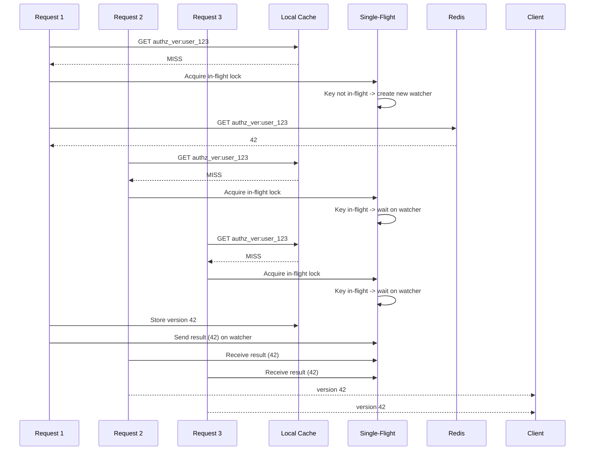
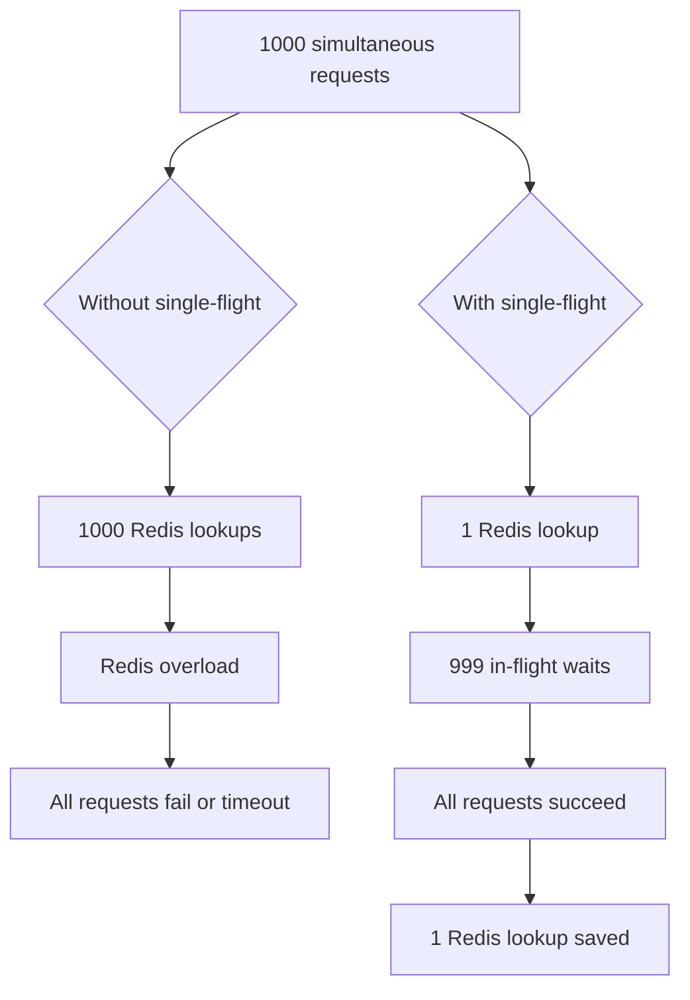

# Story 7.3: Implement Version Cache with Single-Flight Pattern

## Epic

[07-caching-strategy](../caching.md)

## Parent Epic Story

Story 7.3

## Summary

Implement the version cache with the single-flight (deduplication) pattern to prevent cache miss storms when many requests simultaneously miss the version cache. This is the third critical cache because version checks are called on every high-risk request.

## Why This Story Exists

The JWT document states: "check a central blacklist or Redis version key on every request partly recreates the original bottleneck. So cache revocation and version data at the gateway or service for a short window -- often seconds, not minutes." The single-flight pattern ensures that only one request hits Redis for a given version lookup, while others wait for the result.

## Design Context

### Current State

- No version cache exists
- No single-flight pattern
- No cache miss storm mitigation

### Version Cache Design

| Config | Default | Description |
|--------|---------|-------------|
| TTL | 15-60 seconds | Per-subject (15s) or per-tenant (60s) |
| Single-flight | true | Deduplicate concurrent requests for same key |
| Max in-flight | 1000 | Maximum concurrent version lookups per key |

### Single-Flight Implementation

```rust
pub struct VersionCache {
    cache: Arc<RwLock<HashMap<String, (u64, Instant)>>>,  // key -> (version, last_updated)
    in_flight: Arc<Mutex<HashMap<String, tokio::sync::watch::Sender<Option<u64>>>>>,
    redis: Arc<RedisClient>,
}

impl VersionCache {
    pub async fn get_version(&self, key: &str) -> Result<u64, AuthError> {
        // 1. Check local cache
        {
            let cache = self.cache.read().await;
            if let Some((ver, last_updated)) = cache.get(key) {
                if last_updated.elapsed() < Duration::from_secs(60) {
                    return Ok(*ver);  // Cache HIT
                }
            }
        }
        
        // 2. Check in-flight requests
        let mut in_flight = self.in_flight.lock().await;
        if let Some(sender) = in_flight.get(key) {
            drop(in_flight);  // Drop lock before waiting
            let result = sender.subscribe().recv().await?;
            return result.ok_or(AuthError::VersionLookupFailed);
        }
        
        // 3. Start new in-flight request
        let (tx, rx) = tokio::sync::watch::channel(None);
        in_flight.insert(key.to_string(), tx);
        
        // Spawn the actual Redis lookup
        let cache_clone = self.cache.clone();
        let redis_clone = self.redis.clone();
        let key_clone = key.to_string();
        
        tokio::spawn(async move {
            let result = redis_clone.get::<_, Option<u64>>(&format!("authz_ver:{key}")).await;
            let ver = result.unwrap_or(None);
            
            // Store in cache
            if let Some(v) = ver {
                cache_clone.write().await.insert(
                    key_clone.clone(),
                    (v, Instant::now()),
                );
            }
            
            // Notify waiters
            let _ = sender.send(ver);
            
            // Remove from in-flight after 5 seconds
            tokio::time::sleep(Duration::from_secs(5)).await;
            in_flight.remove(&key_clone);
        });
        
        // Wait for the in-flight request
        drop(in_flight);  // Drop lock before waiting
        let result = rx.recv().await?;
        result.ok_or(AuthError::VersionLookupFailed)
    }
}
```

### Cache Miss Storm Scenario

```
1000 requests arrive simultaneously for different versions of the same resource
Without single-flight: 1000 Redis lookups
With single-flight: 1 Redis lookup + 999 in-flight waits
```

## Mermaid Diagrams

### Single-Flight Flow



### Cache Miss Storm Reduction



### Version Cache TTL vs Token TTL

```mermaid
gantt
    title Version Cache TTL vs Token TTL
    dateFormat X
    axisFormat %s
    section Token
    Token issued (ver=42, exp=300s) :0, 300
    Token expires                   :300, 0
    section Version Cache
    Version cache entry (TTL=15s)   :0, 15
    Version TTL expires             :15, 0
    next Redis lookup               :15, 0
```



## OpenAPI Changes

No OpenAPI changes. Version caching is internal to the validation logic.

## Design Doc References

- `design-doc.md` section 10.4: Token Versioning & Revocation -- version cache with single-flight
- `design-doc.md` section 10.11: Caching Strategy -- Version cache (single-flight pattern)
- `design-doc.md` section 10.12: Observability -- `version_cache_hit_ratio`, `version_in_flight_total`

## Wiki Pages to Update/Create

- `topics/topic-caching-strategy.md`: Document version cache with single-flight
- `topics/topic-token-versioning.md`: Document version cache integration

## Acceptance Criteria

- [ ] Local cache stores version with timestamp
- [ ] Single-flight pattern deduplicates concurrent lookups for the same key
- [ ] Only one Redis lookup per key per 5-second window
- [ ] In-flight waiters receive the result when the lookup completes
- [ ] In-flight requests are cleaned up after 5 seconds
- [ ] Metrics: `version_cache_hit_ratio` and `version_in_flight_total` are emitted
- [ ] Unit tests verify: single-flight deduplication, cache hit/miss, in-flight cleanup

## Dependencies

- Depends on Story 5.1 (ver claim in JWT)
- Depends on Story 5.2 (version cache with Redis)

## Risk / Trade-offs

- **Single-flight complexity**: The single-flight pattern adds significant code complexity (watch channels, in-flight tracking, cleanup timers). It is only needed for high-concurrency scenarios (100+ concurrent lookups per key). For lower concurrency, simple Redis lookups are sufficient.
- **Watch channel memory**: Each in-flight key has a watch channel that holds memory. If requests are constantly added and removed, the `in_flight` HashMap can grow. The 5-second cleanup timer prevents unbounded growth, but if the system is under constant load, this could be a memory leak.
- **Cache TTL vs Token TTL mismatch**: The version cache TTL (15-60 seconds) is much shorter than token TTL (5 minutes). This means after cache TTL expires, the next request will do a Redis lookup. If the cache is constantly expiring, the benefit of caching is reduced. The cache TTL should be tuned to match the expected request pattern (e.g., if a user makes 10 requests per minute, a 15-second cache provides ~60% cache hit rate).
