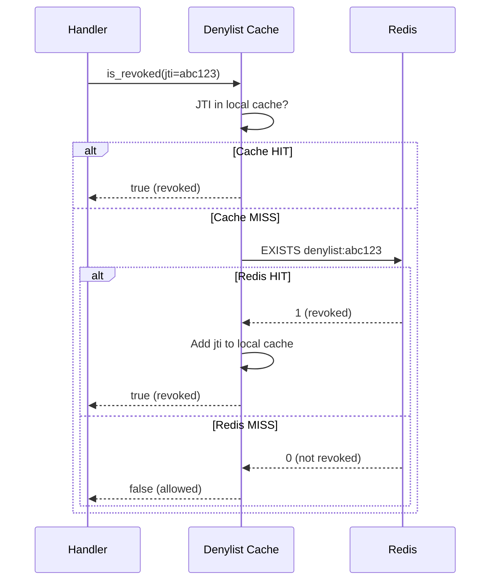
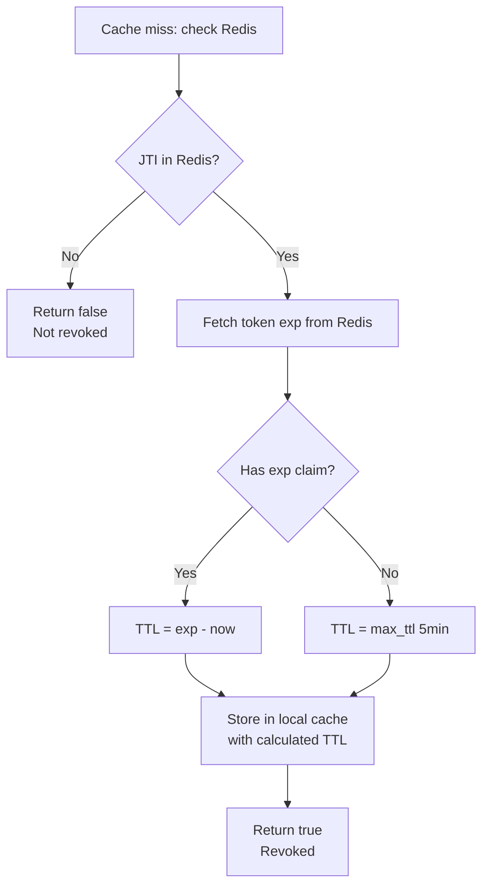
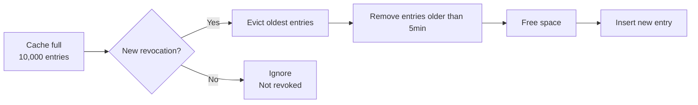

# Story 7.4: Implement Denylist Cache at Gateway/Service Level

## Epic

[07-caching-strategy](../caching.md)

## Parent Epic Story

Story 7.4

## Summary

Implement denylist (JTI revocation) caching at the gateway/service level with dynamic TTL based on token expiry. The cache must have a short window (seconds, not minutes) to avoid delaying revocation propagation.

## Why This Story Exists

The JWT document states: "check a central blacklist or Redis version key on every request partly recreates the original bottleneck. So cache revocation data at the gateway or service for a short window -- often seconds, not minutes." Without denylist caching, every revoked token requires a Redis lookup on every validation request. A short-lived cache reduces this load while maintaining tight revocation propagation.

## Design Context

### Current State

- JTI revocation is stored centrally in Redis
- Every JWT validation requires a Redis lookup to check if the JTI is revoked
- No local denylist cache exists at the service or gateway level
- Redis is the single source of truth for revocation state

### Denylist Cache Design

| Config | Default | Description |
|--------|---------|-------------|
| TTL | Until token `exp` (dynamic) | Cache entry lives for the remaining lifetime of the revoked token |
| Max TTL | 5 minutes | Hard cap to prevent indefinite cache entries |
| Cache backend | In-memory (RwLock) | Local to each service instance |
| Key format | `denylist:{jti}` | JTI from the JWT header |
| Size limit | 10,000 entries | Per-service instance limit |

### Cache Structure

```rust
pub struct DenylistCache {
    entries: RwLock<HashMap<String, Instant>>,  // jti -> revoked_at timestamp
    max_entries: usize,
    max_ttl: Duration,  // 5 minutes
}

impl DenylistCache {
    pub async fn is_revoked(&self, jti: &str, redis: &RedisClient) -> bool {
        // 1. Check local cache
        {
            let entries = self.entries.read().await;
            if entries.contains_key(jti) {
                return true;  // Revoked locally
            }
        }
        
        // 2. Cache miss -- check Redis
        let revoked = redis.exists(&format!("denylist:{}", jti)).await.unwrap_or(false);
        
        // 3. If revoked, add to local cache with TTL based on token expiry
        if revoked {
            let token_exp = self.fetch_token_expiry_from_redis(jti, redis).await;
            let ttl = token_exp.unwrap_or(self.max_ttl);
            
            let mut entries = self.entries.write().await;
            if entries.len() >= self.max_entries {
                self.evict_oldest(&mut entries);
            }
            entries.insert(jti.to_string(), Instant::now());
            return true;
        }
        
        false
    }
}
```

### Validation Flow with Denylist Cache

```rust
pub async fn validate_token(token: &str, denylist: &DenylistCache, redis: &RedisClient) -> Result<Claims, AuthError> {
    let parts: Vec<&str> = token.split('.').collect();
    let header: JwtHeader = serde_json::from_str(&parts[0])?;
    
    // Validate signature first (uses JWKS cache)
    let claims = verify_signature(token, &jwks_cache)?;
    
    // Check denylist
    if let Some(jti) = &claims.jti {
        if denylist.is_revoked(jti, redis).await {
            return Err(AuthError::TokenRevoked);
        }
    }
    
    // Check other claims (exp, nbf, etc.)
    validate_claims(&claims)?;
    
    Ok(claims)
}
```

## Mermaid Diagrams

### Denylist Cache Lifecycle



### Dynamic TTL Calculation



### Denylist Cache Eviction



## Malicious Hacker Gotchas (Must Be Addressed During Implementation)

> **Source:** `docs/PRS_SECURITY_HARDENING.md` — Security threat model analysis

### HACK-741: Denylist Cache Allows Revoked Token After TTL Expiry (CRITICAL — Hole #2 from PRS)

**Risk:** Token is accepted after denylist cache TTL expires, even though the JTI is still revoked

If a token has `exp` 10 minutes in the future and the denylist cache has `max_ttl = 5 minutes`, the cache entry expires after 5 minutes. At that point, a new validation would hit Redis again. BUT if the Redis entry also expires (which it shouldn't for revocation — Redis is the source of truth), the token would be accepted.

**Exploit path:**
1. Token with JTI=abc123 is revoked at T=0 (Redis: denylist:abc123 = true)
2. Denylist cache stores JTI=abc123 with TTL=5 minutes
3. At T=6 minutes: denylist cache entry expires
4. Redis is queried for JTI=abc123 → if Redis also expires the entry, the token is accepted
5. Result: Revoked token accepted if Redis entry expires

**Implementation requirement:**
- Redis is the SOURCE OF TRUTH for revocation. Redis entries for revocation MUST NOT expire (or have very long TTL, e.g., 24 hours)
- The denylist cache TTL is ONLY a performance optimization. The cache MUST always check Redis on miss
- If Redis is unavailable, the denylist cache MUST FAIL CLOSED (reject the token)
- Document: "Denylist cache is a performance layer. Redis is the authoritative source. Redis revocation entries use indefinite TTL."

### HACK-742: Denylist Cache Can Be Exhausted via JTI Flooding (HIGH — related to Hole #3 from PRS)

**Risk:** Attacker floods the denylist cache with unique JTIs to exhaust memory

If the attacker generates tokens with unique JTIs, each revoked token will add an entry to the cache. With max_entries=10,000, the attacker could fill the cache with 10,000 entries.

**Exploit path:**
1. Attacker obtains 10,000 valid tokens with unique JTIs
2. Attacker revokes all tokens
3. Each revocation adds an entry to the denylist cache
4. At 10,000 entries, the cache is full
5. New legitimate revocations cannot be cached — they must hit Redis on every validation
6. Result: Performance degradation for all services

**Implementation requirement:**
- Enforce max_entries limit (10,000 per instance)
- Implement LRU or FIFO eviction when limit is reached
- Add metric: `denylist_cache_size` tracking current entries
- Add metric: `denylist_cache_evictions_total` tracking eviction count
- Consider: the cache should be per-service-instance, so an attack on one instance only affects that instance

### HACK-743: Cache Miss Storm When Denylist Cache Evicts (MEDIUM — related to Hole #5 from PRS)

**Risk:** When a large batch of JTIs expire simultaneously, all requests hit Redis at once

If many tokens are revoked with similar expiry times, they will all have similar TTLs and expire around the same time, causing a thundering herd on Redis.

**Implementation requirement:**
- Add jitter to TTL calculation: `ttl = (exp - now) * (0.8 + 0.4 * random)` to spread out expiry times
- Add rate limiting to Redis fallback: max 100 Redis lookups per second per instance
- Document: "Denylist cache uses randomized TTL jitter to prevent thundering herd on Redis."

---

## OpenAPI Changes

No OpenAPI changes. Denylist caching is internal to the validation layer.

## Design Doc References

- `design-doc.md` section 10.4: Token Versioning & Revocation -- denylist caching
- `design-doc.md` section 10.11: Caching Strategy -- Denylist cache (dynamic TTL, short window)
- `design-doc.md` section 10.12: Observability -- `denylist_cache_hit_ratio`, `denylist_cache_size`

## Wiki Pages to Update/Create

- `topics/topic-caching-strategy.md`: Document denylist caching
- `topics/topic-token-revocation.md`: Document denylist cache integration

## Acceptance Criteria

- [ ] Denylist cache stores JTI revocation locally with dynamic TTL
- [ ] Cache TTL is based on token expiry (with 5-minute hard cap)
- [ ] Cache hit returns true without Redis lookup
- [ ] Cache miss falls back to Redis for authoritative check
- [ ] On cache miss + Redis HIT, entry is added to local cache
- [ ] Eviction policy maintains maximum 10,000 entries
- [ ] Metrics: `denylist_cache_hit_ratio` is emitted per route
- [ ] Metrics: `denylist_cache_size` tracks current entries
- [ ] Unit tests verify: cache hit, cache miss + Redis fallback, eviction, TTL expiry
- [ ] Redis is the authoritative source — cache never overrides Redis

## Dependencies

- Depends on Story 1.3 (JWT validation across all services)
- Depends on Story 5.1 (ver claim in JWT)

## Risk / Trade-offs

- **Revocation delay**: The denylist cache introduces a small window where a revoked token might be accepted if the cache hasn't been populated yet (first request after revocation). However, Redis is always checked on cache miss, so the delay is only for the first request after revocation.
- **Memory usage**: With 10,000 entries per instance and 6 service instances, the total memory usage is negligible (~1 MB per instance, ~6 MB total).
- **Cache invalidation**: Unlike other caches, denylist entries are "write once, never invalidate" — once a JTI is revoked, it stays revoked. The only way to "un-revoke" is to wait for the cache TTL to expire.

## Tests

### Unit Tests

- [ ] **Cache hit: JTI found in local cache**: Given a DenylistCache with JTI "abc123", assert that `is_revoked("abc123")` returns true without calling Redis
- [ ] **Cache miss: JTI not in local cache**: Given an empty DenylistCache, assert that `is_revoked("abc123")` calls Redis
- [ ] **Cache miss + Redis HIT**: Given Redis has JTI "abc123" as revoked, assert that `is_revoked("abc123")` returns true and caches the JTI locally
- [ ] **Cache miss + Redis MISS**: Given Redis does not have JTI "abc123", assert that `is_revoked("abc123")` returns false
- [ ] **TTL calculated from token expiry**: Given a token with exp=300s from now, assert that the cached entry expires in ~300 seconds
- [ ] **TTL capped at max_ttl**: Given a token with exp=1 hour from now, assert that the cached entry expires in 5 minutes (max_ttl)
- [ ] **Cache eviction when full**: Given 10,000 entries in the cache, assert that inserting a new entry evicts the oldest one
- [ ] **LRU eviction preserves most recent entries**: Given a full cache, assert that the oldest entries are evicted first
- [ ] **Concurrent reads and writes**: Given concurrent `is_revoked()` calls, assert no deadlock occurs (RwLock pattern)
- [ ] **JTI with special characters**: Given JTI "abc-123_456", assert the cache key is generated correctly
- [ ] **Empty JTI handled gracefully**: Given an empty JTI string, assert the cache handles it without panic
- [ ] **Denylist cache size metric emitted**: Given 100 cache entries, assert `denylist_cache_size` returns 100
- [ ] **Denylist cache eviction metric emitted**: Given 50 evictions, assert `denylist_cache_evictions_total` returns 50

### Integration Tests (BDD-style with `rstest_bdd`)

- [ ] **Scenario: Full denylist lifecycle — miss then hit then expire**: `given` an empty denylist cache → `when` a revoked JTI arrives (cache miss → Redis lookup → cached) → `then` subsequent requests hit the cache → `when` TTL expires → `then` the next request triggers a new Redis lookup
- [ ] **Scenario: Multiple services share Redis revocation**: `given` identity-login-service and authz-core both check the same Redis denylist → `when` a JTI is revoked → `then` both services detect the revocation (with up to 5-minute caching delay)
- [ ] **Scenario: Cache miss storm prevention**: `given` 1000 concurrent requests for a JTI not in the cache → `then` all requests are served correctly (either from cache or Redis) without degrading performance
- [ ] **Scenario: Redis unavailable — fail closed**: `given` Redis is down (connection refused) → `when` a JWT validation arrives → `then` the token is rejected (fail closed) or at minimum the error is logged

### Security Regression Tests

- [ ] **Cache never overrides Redis**: Assert that when Redis says a JTI is NOT revoked, the cache does not return true for that JTI
- [ ] **JTI cannot be forged to bypass revocation**: Assert that an attacker cannot craft a JWT with a JTI that matches a cached entry for a different token
- [ ] **Cache does not leak revocation data**: Assert that revocation state is NOT written to logs or metrics
- [ ] **Denylist cache cannot be exhausted**: Given an attacker sends 100,000 unique JTI revocations, assert the cache maintains max 10,000 entries via eviction
- [ ] **Redis fail-closed on unavailability**: Given Redis is down, assert that the denylist cache rejects tokens (or at minimum, logs the error and does not serve false positives)

### Edge Cases

- [ ] **JTI with very long string (500 chars)**: Given a JTI of 500 characters, assert the cache key is stored correctly without truncation
- [ ] **JTI with Unicode characters**: Given a JTI "abc_üñíçödé", assert the hash is deterministic
- [ ] **TTL of 0 seconds**: Given a token with exp = now, assert the cache entry expires immediately (or uses a minimum TTL of 1 second)
- [ ] **JTI missing from token**: Given a JWT without a JTI header, assert the denylist check is skipped (no error)
- [ ] **Cache entry TTL exactly at boundary**: Given a cache entry with TTL=300 seconds and it is queried at exactly 300.000 seconds, assert the behavior is deterministic

### Cleanup

- [ ] Denylist cache must be cleared between test scenarios — use a fresh DenylistCache instance or a clear() method
- [ ] Metrics registry must be reset between test scenarios using prometheus::Registry::new()
- [ ] Mock Redis responses must be isolated per test
- [ ] No temporary files or cache state should persist between tests
