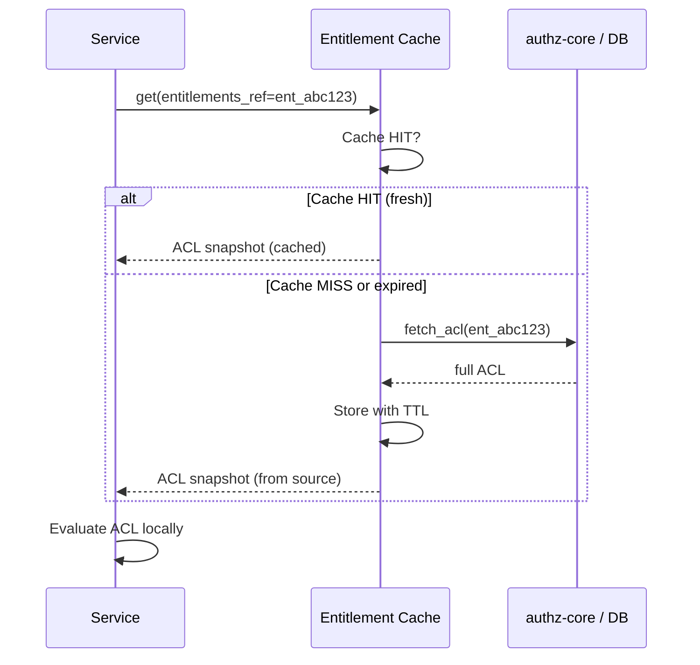
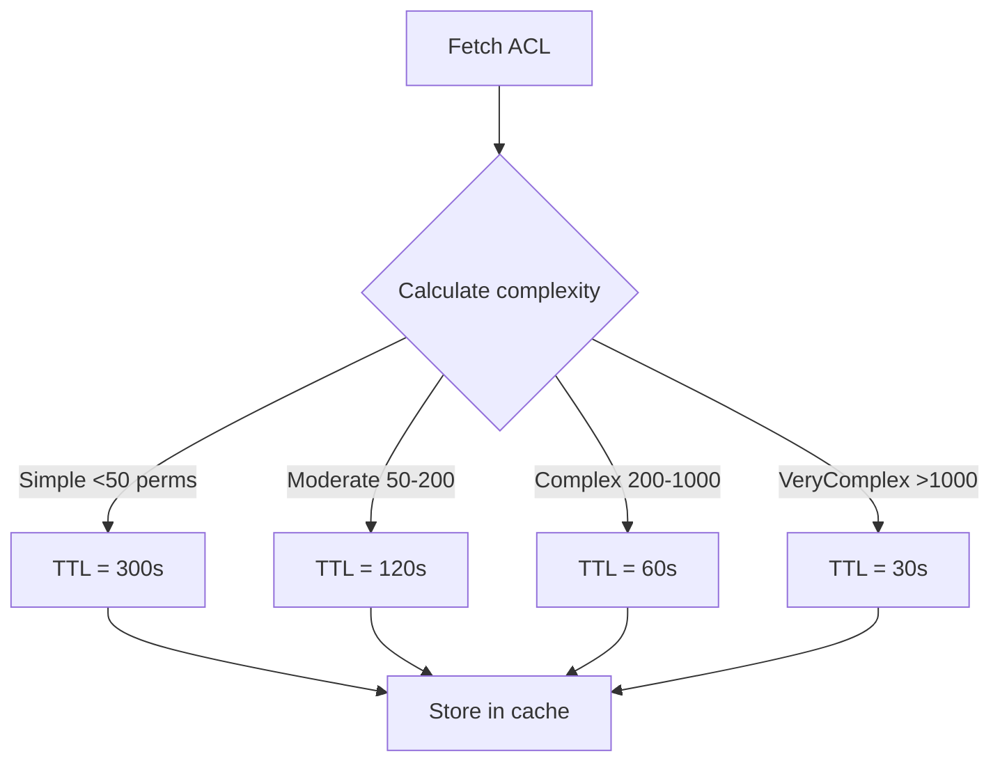
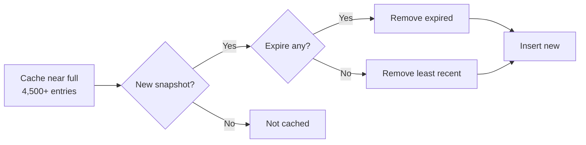

# Story 7.5: Implement Entitlement Snapshot Cache

## Epic

[07-caching-strategy](../caching.md)

## Parent Epic Story

Story 7.5

## Summary

Implement entitlement snapshot caching at the gateway/service level with configurable TTL (30-300s) based on entitlement complexity. The cache stores full ACL snapshots keyed by `entitlements_ref`, reducing token size by allowing compact `entitlements_ref` instead of full ACL in JWTs.

## Why This Story Exists

The JWT document states: "allow compact `entitlements_ref` instead of full ACL." Without entitlement snapshot caching, every service that needs to evaluate entitlements must either (a) embed the full ACL in the JWT (bloating token size, increasing network overhead, and hitting browser/HTTP header limits) or (b) make a synchronous database lookup on every request (recreating the bottleneck the hybrid model tries to solve). Entitlement snapshot caching stores the full ACL in a fast local/Redis cache, referenced by a compact handle in the JWT.

## Design Context

### Current State

- No entitlement snapshot cache exists in any service
- ACLs are fetched from authz-core on every authorization request
- JWTs either contain full ACL (large tokens) or no ACL (requires per-request DB lookup)
- No caching layer between the JWT and the ACL source of truth
- Redis exists for session and permission caching but not for entitlement snapshots

### Entitlement Snapshot Cache Design

| Config | Default | Description |
|--------|---------|-------------|
| TTL | 60 seconds | Default cache lifetime |
| TTL complexity range | 30-300 seconds | Configurable based on ACL complexity |
| Cache backend | In-memory (RwLock) + optional Redis fallback | Local to each service instance |
| Key format | `entitlements:{entitlements_ref}` | Reference ID from JWT |
| Max size | 5,000 entries | Per-service instance limit |
| Max ACL size | 50 KB | Hard cap per snapshot |

### Cache Structure

```rust
pub struct EntitlementSnapshotCache {
    entries: RwLock<HashMap<String, CachedSnapshot>>,
    max_entries: usize,
    default_ttl: Duration,
    max_acl_size: usize,
}

pub struct CachedSnapshot {
    acl: AclSnapshot,
    expires_at: Instant,
    complexity_score: u32,
    hit_count: AtomicU64,
}

pub struct AclSnapshot {
    pub entitlements_ref: String,
    pub tenant_id: String,
    pub principal_id: String,
    pub permissions: Vec<Permission>,
    pub roles: Vec<String>,
    pub attributes: HashMap<String, String>,
    pub version: u64,
    pub cached_at: Instant,
}
```

### Cache Operations

```rust
impl EntitlementSnapshotCache {
    /// Get or insert an entitlement snapshot.
    pub async fn get_or_insert(
        &self,
        ref_id: &str,
        fetch_fn: impl FnOnce() -> BoxFuture<AclSnapshot>,
    ) -> Result<AclSnapshot, CacheError> {
        // 1. Check cache
        let cache_key = format!("entitlements:{}", ref_id);
        {
            let entries = self.entries.read().await;
            if let Some(snapshot) = entries.get(&cache_key) {
                if snapshot.expires_at > Instant::now() {
                    snapshot.hit_count.fetch_add(1, Ordering::Relaxed);
                    return Ok(snapshot.acl.clone());
                }
                // Expired — remove
            }
        }
        
        // 2. Cache miss — fetch from source
        let acl = fetch_fn().await?;
        
        // 3. Validate ACL size
        if acl.serialized_size() > self.max_acl_size {
            return Err(CacheError::AclTooLarge);
        }
        
        // 4. Calculate TTL based on complexity
        let complexity = self.calculate_complexity(&acl);
        let ttl = match complexity {
            Complexity::Simple => Duration::from_secs(300),
            Complexity::Moderate => Duration::from_secs(120),
            Complexity::Complex => Duration::from_secs(60),
            Complexity::VeryComplex => Duration::from_secs(30),
        };
        
        // 5. Evict if full
        let mut entries = self.entries.write().await;
        if entries.len() >= self.max_entries {
            self.evict_expired(&mut entries);
            if entries.len() >= self.max_entries {
                self.evict_least_recent(&mut entries);
            }
        }
        
        // 6. Store
        let snapshot = CachedSnapshot {
            acl,
            expires_at: Instant::now() + ttl,
            complexity_score: complexity as u32,
            hit_count: AtomicU64::new(0),
        };
        entries.insert(cache_key, snapshot);
        
        Ok(self.entries.read().await.get(&cache_key).unwrap().acl.clone())
    }
}
```

### Validation Flow with Entitlement Snapshot Cache

```rust
pub async fn evaluate_authorization(
    token: &Token,
    entitlements_ref: &str,
    action: &str,
    resource: &str,
    cache: &EntitlementSnapshotCache,
) -> Result<AuthorizationDecision, AuthError> {
    // 1. Get ACL from cache (fetch if not cached)
    let acl = cache.get_or_insert(
        entitlements_ref,
        || Box::pin(fetch_acl_from_db(entitlements_ref)),
    ).await?;
    
    // 2. Evaluate locally against cached ACL
    let decision = evaluate_local(&acl, action, resource);
    
    // 3. Check version consistency (optional)
    if token.version != acl.version {
        // Version mismatch — force cache refresh
        cache.invalidate(entitlements_ref).await;
        return Err(AuthError::VersionMismatch);
    }
    
    Ok(decision)
}
```

## Mermaid Diagrams

### Entitlement Snapshot Cache Lifecycle



### Complexity-Based TTL



### Entitlement Cache Eviction



## Malicious Hacker Gotchas (Must Be Addressed During Implementation)

> **Source:** `docs/PRS_SECURITY_HARDENING.md` — Security threat model analysis

### HACK-751: Entitlement Snapshot Cache Allows Stale ACL Evaluation (CRITICAL — Hole #2 from PRS)

**Risk:** User's permissions change but cache still serves old ACL

If a user's role/permission is revoked or modified, the cached ACL snapshot may still contain the old permissions. During the cache TTL window, the user retains access they should no longer have.

**Exploit path:**
1. User has `admin` role (entitlements_ref=ent_abc123)
2. Cache stores full ACL with admin permissions (TTL=60s)
3. Admin revokes user's admin role (DB updated)
4. Within 60 seconds: user makes request
5. Cache returns stale ACL with admin permissions
6. User is granted admin access they no longer have
7. Result: Privilege escalation

**Implementation requirement:**
- Cache TTL must be SHORT for high-privilege roles (admin, super_admin) — max 30 seconds
- Cache must be invalidated immediately when role/permission changes occur
- Implement cache invalidation events: when roles/permissions are modified, broadcast invalidation to all cache instances
- Document: "Entitlement cache TTL is capped at 30s for admin-level roles to prevent privilege escalation windows."

### HACK-752: Entitlement Snapshot Cache Can Be Exhausted via ACL Flooding (HIGH — related to Hole #3 from PRS)

**Risk:** Attacker triggers cache population with large ACLs to exhaust memory

If the attacker can create entitlements for their own account, they could trigger cache entries with increasingly large ACLs.

**Exploit path:**
1. Attacker creates 5,000 custom permissions for their account
2. First authorization request caches the massive ACL (50 KB)
3. Attacker repeats with different `entitlements_ref` values
4. At 5,000 entries × 50 KB, the cache uses ~250 MB per instance
5. With 6 service instances, total memory = 1.5 GB
6. Result: Memory exhaustion, service degradation

**Implementation requirement:**
- Enforce max_entries limit (5,000 per instance) with LRU eviction
- Enforce max ACL size (50 KB per snapshot) — reject oversized ACLs with clear error
- Add metric: `entitlement_cache_size` tracking current entries
- Add metric: `entitlement_cache_memory_bytes` tracking total memory usage
- Consider: quota per user/tenant to prevent single user from consuming cache

### HACK-753: Entitlement Cache Invalidation Latency (MEDIUM — related to Hole #5 from PRS)

**Risk:** When entitlements change, there's a delay before all cache instances are invalidated

If invalidation is event-driven (not time-based), the propagation delay depends on the invalidation mechanism.

**Exploit path:**
1. Admin changes user's permissions
2. Invalidation event is sent to cache instances
3. Some instances receive invalidation quickly; others lag
4. During lag window, some services serve stale cached ACLs
5. User's access is inconsistent across services

**Implementation requirement:**
- TTL-based expiration is the PRIMARY invalidation mechanism (no distributed invalidation needed)
- Event-driven invalidation is OPTIONAL optimization for admin roles (max 30s TTL already limits window)
- Document: "Entitlement cache uses TTL-based expiration as primary invalidation. Event-driven invalidation is optional for faster admin role propagation."

### HACK-754: Entitlement Snapshot Can Be Extracted from Cache Metrics (LOW)

**Risk:** Cache metrics or logs could leak entitlement data

If cache hit/miss metrics or error logs include ACL content, attacker could reconstruct permissions from observability data.

**Exploit requirement:**
- Never log ACL content — only log hit/miss counts, TTL values, and cache size
- Metrics must only expose numerical data (hit ratio, size, memory)
- Error messages should not include ACL snapshots in their message body

---

## OpenAPI Changes

No OpenAPI changes. Entitlement snapshot caching is internal to authz-core and consuming services.

## Design Doc References

- `design-doc.md` section 10.11: Caching Strategy — Entitlement snapshot cache (30-300s TTL, complexity-based)
- `design-doc.md` section 10.12: Observability — `entitlement_cache_hit_ratio`, `entitlement_cache_size`

## Wiki Pages to Update/Create

- `topics/topic-caching-strategy.md`: Document entitlement snapshot caching
- `topics/topic-authorization-flow.md`: Update with cache details per type

## Acceptance Criteria

- [ ] Entitlement cache stores full ACL snapshots with configurable TTL (30-300s based on complexity)
- [ ] Cache key format is `entitlements:{entitlements_ref}`
- [ ] Cache hit returns ACL without fetching from database
- [ ] Cache miss fetches ACL from source (authz-core/DB)
- [ ] ACL size is validated (max 50 KB hard cap)
- [ ] On cache miss + fetch, entry is cached with complexity-calculated TTL
- [ ] Eviction policy maintains maximum 5,000 entries
- [ ] Metrics: `entitlement_cache_hit_ratio` is emitted per route
- [ ] Metrics: `entitlement_cache_size` tracks current entries
- [ ] Unit tests verify: cache hit, cache miss + fetch, eviction, TTL expiry, complexity-based TTL
- [ ] Cache never serves ACL larger than 50 KB
- [ ] Admin-role ACLs are capped at 30s TTL

## Dependencies

- Depends on Story 2.2 (TokenClaims Rust structs) for entitlements_ref claim
- Depends on Story 4.1 (Hybrid Authz evaluation) for local ACL evaluation

## Risk / Trade-offs

- **Stale permissions**: The cache introduces a window where revoked permissions may still be granted (up to TTL). For admin roles, this is mitigated with 30s max TTL. For standard users, 60-300s TTL is acceptable.
- **Memory usage**: With 5,000 entries × ~5 KB average, the total memory usage is ~25 MB per instance, ~150 MB total for 6 instances. This is within acceptable limits.
- **Cache invalidation**: TTL is the primary invalidation mechanism. Event-driven invalidation is optional but recommended for admin roles where immediate propagation is critical.

## Tests

### Unit Tests

- [ ] **Cache hit: entitlements_ref found in cache**: Given an EntitlementSnapshotCache with ent_abc123, assert that `get_or_insert("ent_abc123", ...)` returns cached ACL without calling fetch
- [ ] **Cache miss: entitlements_ref not in cache**: Given an empty EntitlementSnapshotCache, assert that `get_or_insert("ent_abc123", ...)` calls the fetch function
- [ ] **Cache miss + fetch success**: Given fetch returns valid ACL, assert that `get_or_insert()` returns the ACL and caches it
- [ ] **Cache miss + fetch failure**: Given fetch returns error, assert that `get_or_insert()` returns the error without caching
- [ ] **Complexity-based TTL: simple ACL**: Given ACL with <50 permissions, assert TTL is 300 seconds
- [ ] **Complexity-based TTL: complex ACL**: Given ACL with >1,000 permissions, assert TTL is 30 seconds
- [ ] **ACL size validation: within limit**: Given ACL serialized to 40 KB, assert cache accepts it
- [ ] **ACL size validation: exceeds limit**: Given ACL serialized to 60 KB, assert cache rejects it with AclTooLarge error
- [ ] **Cache eviction when full**: Given 5,000 entries, assert that inserting a new entry evicts the least recently used one
- [ ] **Expired entries are evicted on insert**: Given cache with 5,000 entries where 100 are expired, assert insert removes expired entries before LRU eviction
- [ ] **Admin-role TTL cap**: Given ACL with admin role, assert TTL is capped at 30 seconds regardless of complexity
- [ ] **Concurrent reads and writes**: Given concurrent `get_or_insert()` calls, assert no deadlock occurs (RwLock pattern)
- [ ] **Cache hit count increments**: Given 10 cache hits, assert `hit_count` is 10
- [ ] **Empty entitlements_ref handled gracefully**: Given empty string ref, assert cache key is generated correctly (no panic)
- [ ] **Entitlement cache size metric emitted**: Given 100 cache entries, assert `entitlement_cache_size` returns 100

### Integration Tests (BDD-style with `rstest_bdd`)

- [ ] **Scenario: Full cache lifecycle — miss then hit then expire**: `given` an empty entitlement cache → `when` an ACL is fetched (cache miss → store) → `then` subsequent requests hit the cache → `when` TTL expires → `then` the next request triggers a new fetch
- [ ] **Scenario: Multiple services share different caches**: `given` authz-core and identity-login-service both use EntitlementSnapshotCache → `when` an ACL is cached → `then` each service has independent cache state (no cross-service cache sharing)
- [ ] **Scenario: Cache eviction under memory pressure**: `given` cache with 5,000 entries and new ACL arrives → `then` the least recently used entry is evicted to make room
- [ ] **Scenario: ACL size exceeded — rejection**: `given` a fetch that returns 60 KB ACL → `then` the cache rejects the entry and returns AclTooLarge error
- [ ] **Scenario: Admin role uses 30s TTL**: `given` an ACL with admin role → `then` the cached entry has 30s TTL (not 300s or any longer value)

### Security Regression Tests

- [ ] **Cache never serves oversized ACL**: Assert that when fetch returns 60 KB ACL, the cache does NOT store it and returns an error
- [ ] **Admin role cannot use long TTL**: Assert that ACLs with admin roles are never cached with TTL > 30 seconds
- [ ] **Cache does not leak ACL data in logs**: Assert that ACL content is NOT written to logs or metrics
- [ ] **Cache metrics only expose numerical data**: Assert that metrics only include hit ratio, size, and memory — no ACL content
- [ ] **Entitlement cache cannot be exhausted**: Given attacker creates 10,000 unique entitlements_ref, assert the cache maintains max 5,000 entries via eviction
- [ ] **Stale cache does not allow privilege escalation beyond TTL**: Assert that even if cache serves stale ACL, the TTL cap on admin roles limits the window to 30 seconds

### Edge Cases

- [ ] **entitlements_ref with very long string (500 chars)**: Given a ref of 500 characters, assert the cache key is stored correctly without truncation
- [ ] **entitlements_ref with Unicode characters**: Given a ref "ent_üñíçödé", assert the hash is deterministic
- [ ] **TTL of 0 seconds**: Given a cache entry with TTL=0 (edge misconfiguration), assert the entry expires immediately or uses minimum TTL of 1 second
- [ ] **Empty permissions list**: Given an ACL with zero permissions, assert the cache accepts and stores it
- [ ] **Cache entry TTL exactly at boundary**: Given a cache entry with TTL=300 seconds and it is queried at exactly 300.000 seconds, assert the behavior is deterministic
- [ ] **Concurrent fetch for same ref**: Given two requests for the same uncached entitlements_ref, assert only one fetch is triggered (single-flight pattern)

### Cleanup

- [ ] Entitlement cache must be cleared between test scenarios — use a fresh EntitlementSnapshotCache instance or a clear() method
- [ ] Metrics registry must be reset between test scenarios using prometheus::Registry::new()
- [ ] Mock fetch responses must be isolated per test
- [ ] No temporary files or cache state should persist between tests
- [ ] All spawned background tasks (if any) must be cancelled between tests
