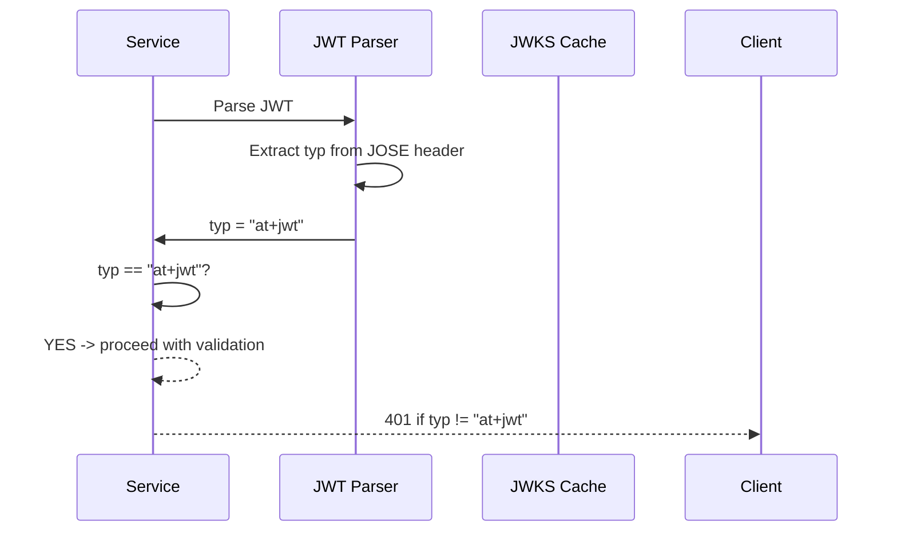

# Story 8.1: Enforce JWT typ Claim (at+jwt)

## Epic

[08-security-hardening](../security.md)

## Parent Epic Story

Story 8.1

## Summary

Enforce the JWT `typ` (type) claim as `at+jwt` (access token) in all JWT validation logic. This prevents type confusion attacks where a refresh token or API key is mistakenly accepted as an access token. This is a baseline security requirement that should be implemented first.

## Why This Story Exists

RFC 7519 defines the `typ` header parameter for JWTs. Sesame specifies `typ: at+jwt` for access tokens. Without type enforcement, a service might accidentally accept a different token type (refresh token, self-issued ID token) as an access token, bypassing authorization checks. The JWT document explicitly states: "Enforce `typ` claim in all services -- this is a baseline security requirement."

## Design Context

### Current State

- No `typ` claim enforcement in any service
- All JWT validation only checks signature, exp, iss, aud
- No differentiation between token types in validation

### typ Enforcement

Every access token MUST include:

```json
{
  "typ": "at+jwt"
}
```

The JOSE header:

```json
{
  "alg": "ES256",
  "typ": "at+jwt",
  "kid": "key_1"
}
```

### Validation Logic

```rust
pub fn validate_typ(claims: &AccessClaims) -> Result<(), AuthError> {
    if claims.typ != Some("at+jwt".to_string()) {
        return Err(AuthError::InvalidTokenType {
            expected: "at+jwt".to_string(),
            actual: claims.typ.unwrap_or_default(),
        });
    }
    Ok(())
}
```

### Token Type Differentiation

| Token Type | typ claim | Use Case |
|------------|-----------|----------|
| Access token | `at+jwt` | API requests (Bearer token) |
| Refresh token | Not a JWT | Opaque string (stored in Redis) |
| Self-issued ID token | `id+at+jwt` (future) | Client-side identity (not current) |

## Mermaid Diagrams

### typ Enforcement Flow



### Token Type Comparison

```mermaid
flowchart TD
    A[JWT received] --> B{Check typ}
    B -->|typ = "at+jwt"| C[Access token - Proceed]
    B -->|typ = "id+at+jwt"| D[Reject: wrong type]
    B -->|typ = "jwt"| E[Reject: wrong type]
    B -->|no typ| F[Reject: missing typ]
    B -->|typ = ""| G[Reject: empty typ]
    
    C --> H[Validate signature]
    D --> I[Return 401 InvalidTokenType]
    E --> I
    F --> I
    G --> I
```

## OpenAPI Changes

- No OpenAPI changes. `typ` is a JOSE header field, not part of the API schema.

## Design Doc References

- `design-doc.md` section 6.2: JWT Schema -- `typ: at+jwt` in standard claims table
- `design-doc.md` section 10.1: Token Security -- "Enforce typ claim in all services"

## Wiki Pages to Update/Create

- `topics/topic-jwt-schema.md`: Document typ requirement
- `topics/topic-token-security.md`: Document type enforcement

## Acceptance Criteria

- [ ] All 6 services enforce `typ == "at+jwt"` on JWT validation
- [ ] Tokens without `typ` claim are rejected
- [ ] Tokens with wrong `typ` value are rejected
- [ ] Rejection returns 401 with error "invalid_token_type"
- [ ] Unit tests verify: correct typ accepted, missing typ rejected, wrong typ rejected

## Dependencies

- Depends on Story 1.1 (asymmetric key generation)
- This is a foundational story -- implement first

## Risk / Trade-offs

- **Breaking change**: If any current services issue JWTs without `typ`, enforcing this will break them. However, this is a security requirement that must be implemented regardless. Any services without `typ` must be updated before this story is considered complete.
- **No operational impact**: Enforcing `typ` does not change the token format -- it only adds a validation check. The token format already includes `typ: at+jwt` (see design-doc.md), so this is a validation improvement, not a format change.
