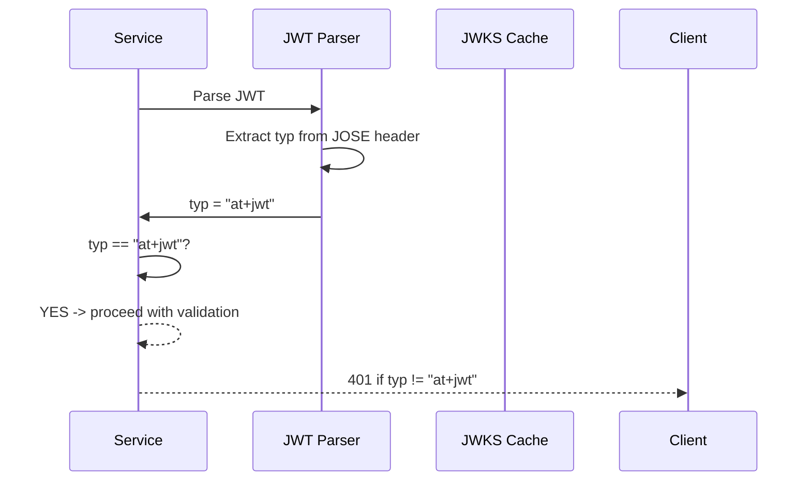
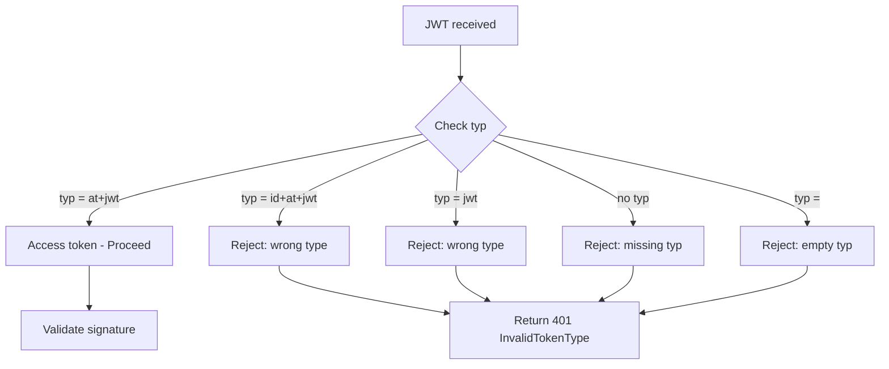

# Story 8.1: Enforce JWT typ Claim (at+jwt)

## Epic

[08-security-hardening](../security.md)

## Parent Epic Story

Story 8.1

## Summary

Enforce the JWT `typ` (type) claim as `at+jwt` (access token) in all JWT validation logic. This prevents type confusion attacks where a refresh token or API key is mistakenly accepted as an access token. This is a baseline security requirement that should be implemented first.

## Why This Story Exists

> **Cross-reference:** Story 1.1 deferred the JWT `typ=at+jwt` enforcement to this story. See Story 1.1's "Deferred Items" section.

RFC 7519 defines the `typ` header parameter for JWTs. Sesame specifies `typ: at+jwt` for access tokens. Without type enforcement, a service might accidentally accept a different token type (refresh token, self-issued ID token) as an access token, bypassing authorization checks. The JWT document explicitly states: "Enforce `typ` claim in all services -- this is a baseline security requirement."

## Design Context

### Current State

- No `typ` claim enforcement in any service
- All JWT validation only checks signature, exp, iss, aud
- No differentiation between token types in validation

### typ Enforcement

Every access token MUST include:

```json
{
  "typ": "at+jwt"
}
```

The JOSE header:

```json
{
  "alg": "ES256",
  "typ": "at+jwt",
  "kid": "key_1"
}
```

### Validation Logic

```rust
pub fn validate_typ(claims: &AccessClaims) -> Result<(), AuthError> {
    if claims.typ != Some("at+jwt".to_string()) {
        return Err(AuthError::InvalidTokenType {
            expected: "at+jwt".to_string(),
            actual: claims.typ.unwrap_or_default(),
        });
    }
    Ok(())
}
```

### Token Type Differentiation

| Token Type | typ claim | Use Case |
|------------|-----------|----------|
| Access token | `at+jwt` | API requests (Bearer token) |
| Refresh token | Not a JWT | Opaque string (stored in Redis) |
| Self-issued ID token | `id+at+jwt` (future) | Client-side identity (not current) |

## Mermaid Diagrams

### typ Enforcement Flow



### Token Type Comparison



## Malicious Hacker Gotchas (Must Be Addressed During Implementation)

> **Source:** `docs/PRS_SECURITY_HARDENING.md` — Security threat model analysis

### HACK-811: typ Check Before Signature Verification Is Insufficient (CRITICAL — Hole #1 from PRS)

**Risk:** A type confusion attack exploits the pipeline ordering

The story says: "typ check occurs before signature verification" and the story in 1.3 shows:
```
1. Parse JOSE header
2. Require typ = at+jwt  <-- BEFORE signature check
3. Require algorithm from allow
4. Choose key by kid from JWKS
5. Verify signature
```

**Exploit path:**
1. Attacker forges a JWT with `typ: "at+jwt"` and `alg: "HS256"` (not in allow-list)
2. The typ check passes (`typ == "at+jwt"`)
3. The algorithm check rejects HS256
4. But what if the attacher uses `typ: "at+jwt"` with `alg: "ES256"` (valid algorithm) and a FORGED signature?
5. The typ check passes
6. The algorithm check passes
7. The key lookup finds the kid
8. The signature check FAILS (forged)
9. Token is rejected — correct

**So far, no exploit.** But what if the validation library has a BUG where step 5 is SKIPPED for some code path? Then the typ check alone would accept a forged token.

**The story's ordering is CORRECT:** typ must be checked BEFORE signature to prevent unnecessary crypto work. The risk is if signature verification is ever SKIPPED, not if it's done in the right order.

**The real exploit is different:** What if the typ check is implemented incorrectly?

**Exploit path (typ coercion via null bytes):**
1. Attacker crafts a JWT with `typ: "at+jwt\x00"` (null byte appended)
2. The typ comparison uses string equality: `"at+jwt\x00" == "at+jwt"` → false → rejected
3. BUT: if the comparison is case-insensitive or ignores null bytes → accepted
4. Result: token with forged typ passes the check

**Implementation requirement:**
- The typ check must use EXACT string comparison (no trimming, no null byte stripping)
- Add validation: `typ` must match `[a-zA-Z0-9+.]+` pattern (ASCII alphanumeric + `.` and `+` only)
- Reject `typ` values containing null bytes, whitespace, or control characters

### HACK-812: Refresh Token Sent as Bearer Token Is Not Caught (HIGH — related to Hole #1 from PRS)

**Risk:** A refresh token (opaque string) is sent as a Bearer token and passes typ check

The story says: "Refresh token: Not a JWT — Opaque string (stored in Redis)." So a refresh token sent as a Bearer token would fail JWT parsing (not a valid JWT format), not typ enforcement.

**But what if the refresh token happens to be a JWT (misconfiguration or future change)?**

**Exploit path:**
1. Attacker obtains a refresh token (which is an opaque string stored in Redis)
2. Attacker sends it as `Authorization: Bearer <refresh_token>`
3. JWT parser tries to parse it → fails (not a valid JWT) → 401
4. CORRECT — no exploit

**But what if a future change makes refresh tokens into JWTs?** Then the typ check is essential.

**Implementation requirement:**
- Refresh tokens MUST NOT be JWTs
- If refresh tokens are ever made into JWTs (e.g., for offline access), they MUST have `typ: "refresh+token"`
- All services must reject tokens with `typ: "refresh+token"` as access tokens

### HACK-813: typ Enforcement Bypass via Missing typ Claim (MEDIUM — related to Hole #1 from PRS)

**Risk:** A JWT without the typ claim passes validation

The story says: "Tokens without typ claim are rejected." But is this enforced?

**Exploit path:**
1. Attacker forges a JWT WITHOUT a `typ` header (the header only has `alg` and `kid`)
2. The typ check: `claims.typ != Some("at+jwt".to_string())`
3. `claims.typ` is `None` → `None != Some("at+jwt")` → `true` → rejected
4. CORRECT — no exploit

**But what if the typ check is NOT in the validation pipeline?** Then the token is accepted.

**Implementation requirement:**
- The typ check must be the FIRST validation step after header parsing
- It must be in EVERY service's validation pipeline (all 6 services)
- Add a test: "Verify that the typ check is present in ALL 6 services' validation logic"
- Document: "Typ check is the first validation step. All 6 services enforce typ == 'at+jwt'."

### HACK-814: typ Is Case-Sensitive But May Not Be Enforced (MEDIUM — related to Hole #6 from PRS)

**Risk:** A token with `typ: "AT+JWT"` (uppercase) passes validation

The story says: "typ is case-sensitive: Given a JWT with typ = 'AT+JWT' (uppercase), assert validation rejects it."

**Exploit path:**
1. Attacker forges a JWT with `typ: "AT+JWT"` or `typ: "At+Jwt"` or `typ: "at+jwt "` (trailing space)
2. If the typ comparison is case-insensitive (`==` vs `eq_ignore_ascii_case`) → accepted
3. Result: token with wrong typ passes

**Implementation requirement:**
- The typ comparison must use EXACT string comparison (case-sensitive, no trimming)
- Add bounds checking: `typ` must be exactly `"at+jwt"` (no extra characters)
- Reject `typ` values with whitespace, null bytes, or control characters

### HACK-815: typ Field Type Confusion (MEDIUM — related to Hole #6 from PRS)

**Risk:** A non-string typ value (number, object, array) passes parsing

The story has tests for this: "JWT header with typ as non-string (JSON number)", "JWT header with typ as JSON object", "JWT header with typ as JSON array."

**Exploit path:**
1. Attacker forges a JWT with `typ: 123` (number) or `typ: true` (boolean) or `typ: []` (array)
2. If the JSON parser does not strictly enforce `typ` as a string → accepted
3. If the typ comparison treats non-strings as empty/missing → `Some("") != Some("at+jwt")` → rejected
4. BUT: if the parser silently coerces `typ: 123` to `typ: "123"` and the comparison is case-insensitive → accepted

**Implementation requirement:**
- The JSON parser must STRICTLY enforce `typ` as a string type
- If `typ` is not a string → reject with `invalid_header_type` (not `invalid_token_type`)
- Document: "The typ field must be a JSON string. Non-string typ values cause a parse error, not a typ error."

---

## OpenAPI Changes

- No OpenAPI changes. `typ` is a JOSE header field, not part of the API schema.

## Design Doc References

- `design-doc.md` section 6.2: JWT Schema -- `typ: at+jwt` in standard claims table
- `design-doc.md` section 10.1: Token Security -- "Enforce typ claim in all services"

## Wiki Pages to Update/Create

- `topics/topic-jwt-schema.md`: Document typ requirement
- `topics/topic-token-security.md`: Document type enforcement

## Acceptance Criteria

- [ ] All 6 services enforce `typ == "at+jwt"` on JWT validation
- [ ] Tokens without `typ` claim are rejected
- [ ] Tokens with wrong `typ` value are rejected
- [ ] Rejection returns 401 with error "invalid_token_type"
- [ ] Unit tests verify: correct typ accepted, missing typ rejected, wrong typ rejected

## Dependencies

- Depends on Story 1.1 (asymmetric key generation)
- This is a foundational story -- implement first

## Risk / Trade-offs

- **Breaking change**: If any current services issue JWTs without `typ`, enforcing this will break them. However, this is a security requirement that must be implemented regardless. Any services without `typ` must be updated before this story is considered complete.
- **No operational impact**: Enforcing `typ` does not change the token format -- it only adds a validation check. The token format already includes `typ: at+jwt` (see design-doc.md), so this is a validation improvement, not a format change.
- **Future token type extensibility**: If future token types are introduced (e.g., `id+at+jwt` for self-issued ID tokens), the typ check must be service-context-aware — an endpoint expecting access tokens rejects `id+at+jwt`, but a client-identity endpoint might accept it. The typ enforcement in the JWT middleware applies to Bearer-token API access only.

## Tests

### Unit Tests

- [ ] **Valid typ at+jwt accepted**: Given a JWT with JOSE header `typ = "at+jwt"`, assert `validate_typ()` returns `Ok(())` — no error
- [ ] **Missing typ claim rejected**: Given a JWT with no `typ` in the JOSE header, assert `validate_typ()` returns `AuthError::InvalidTokenType { expected: "at+jwt", actual: "" }`
- [ ] **Wrong typ rejected (typ=jwt)**: Given a JWT with `typ = "jwt"`, assert validation returns `AuthError::InvalidTokenType { expected: "at+jwt", actual: "jwt" }`
- [ ] **Wrong typ rejected (typ=id+at+jwt)**: Given a JWT with `typ = "id+at+jwt"`, assert validation rejects it for API access (wrong type)
- [ ] **Empty typ rejected**: Given a JWT with `typ = ""` (empty string), assert validation rejects it — empty typ is not valid
- [ ] **typ is case-sensitive**: Given a JWT with `typ = "AT+JWT"` (uppercase), assert validation rejects it — typ comparison is case-sensitive
- [ ] **typ rejects whitespace**: Given a JWT with `typ = " at+jwt"` (leading space) or `typ = "at+jwt "` (trailing space), assert validation rejects it — no trimming
- [ ] **typ rejected when set to refresh token identifier**: Given a JWT where typ = "refresh" (even if it looks like a valid JWT), assert it is rejected as an access token
- [ ] **Error message includes expected and actual typ**: Given a JWT with `typ = "self-issued"`, assert the error message is `"Invalid token type: expected at+jwt, got self-issued"` for clear debugging
- [ ] **typ check occurs before signature verification**: Assert the typ check happens in the JWT validation pipeline BEFORE signature verification — a token with wrong typ is rejected immediately without computing or checking the signature (defense in depth, prevents unnecessary crypto work)
- [ ] **typ check occurs after header parsing**: Assert the JOSE header is successfully parsed and the `typ` field is extracted before validation — a malformed JOSE header causes a parse error, not a typ error

### Integration Tests (BDD-style with `rstest_bdd`)

- [ ] **Scenario: Login service issues typ at+jwt**: `given` a successful login flow → `when` the access token is parsed → `then` the JOSE header contains `typ: "at+jwt"` and the payload is correctly decoded
- [ ] **Scenario: Service rejects token without typ**: `given` a client sends a JWT with no `typ` in the JOSE header → `when` the request reaches the JWT middleware → `then` the response is 401 with error code "invalid_token_type"
- [ ] **Scenario: Service rejects token with wrong typ**: `given` a client sends a JWT with `typ: "jwt"` → `when` the request reaches the JWT middleware → `then` the response is 401 with error code "invalid_token_type" and message "expected at+jwt, got jwt"
- [ ] **Scenario: All 6 services enforce typ**: `given` a token with missing `typ` → `when` the token is sent to each of the 6 services → `then` all 6 services reject it with 401 invalid_token_type (no service accepts it)
- [ ] **Scenario: typ enforcement works with JWKS validation**: `given` a JWT with valid signature, valid exp, valid iss, valid aud, but `typ: "jwt"` → `when` the service validates → `then` the typ check fails BEFORE signature verification completes (or fails regardless)
- [ ] **Scenario: typ enforcement works with HS256 tokens**: `given` a JWT signed with HS256 and `typ: "at+jwt"` → `when` the service validates → `then` it is accepted (typ enforcement is algorithm-independent)
- [ ] **Scenario: typ enforcement works with ES256 tokens**: `given` a JWT signed with ES256 and `typ: "at+jwt"` → `when` the service validates → `then` it is accepted

### Security Regression Tests

- [ ] **Refresh token cannot be used as access token**: Given a refresh token (opaque string, not a JWT) is sent as a Bearer token, assert it is rejected — either it fails JWT parsing (not a valid JWT) or it fails typ enforcement if it happens to be a JWT
- [ ] **Self-issued ID token cannot bypass authz**: Given a self-issued JWT with `typ: "id+at+jwt"` is sent as a Bearer token to an API endpoint, assert it is rejected by typ enforcement — it cannot bypass authorization
- [ ] **Typ claim cannot be used to confuse the validator**: Given an attacker crafts a JWT with `typ: "at+jwt"` but with an invalid signature or expired timestamp, assert the typ check passes but signature/exp checks still reject it — typ alone does not grant access
- [ ] **No information leakage through typ error message**: Assert the error message for wrong typ does not leak internal token processing details — it should say "invalid_token_type" or "expected at+jwt, got X" without revealing the validation pipeline order or internal structures
- [ ] **Typ enforcement does not create a side-channel**: Assert that the time-to-reject for a wrong-typ token is approximately the same as for a wrong-signature token — reject at typ parse time so timing-based attacks cannot distinguish "missing typ" from "valid typ + bad signature"

### Edge Cases

- [ ] **JWT with typ but no header (JWS compact format)**: Given a JWT in compact serialization where the header base64url-decodes correctly and contains `typ`, assert the typ is extracted and validated
- [ ] **JWT header with typ as non-string (JSON number)**: Given a JWT where the header has `typ: 123` (number instead of string), assert the handler rejects it — typ must be a string per JWT spec, not a number
- [ ] **JWT header with typ as JSON object**: Given a JWT where the header has `typ: {"value": "at+jwt"}`, assert the handler rejects it — typ must be a plain string, not a complex type
- [ ] **JWT with typ containing null bytes**: Given a JWT header with `typ: "at+\u0000jwt"`, assert the handler rejects it — typ must be ASCII alphanumeric plus + and . characters only
- [ ] **Extremely long typ value**: Given a JWT with `typ` set to a 10KB string, assert the handler rejects it — typ should be bounded to a reasonable length (e.g., 64 chars max)
- [ ] **JWT with multiple typ values (JSON array)**: Given a malformed header where typ is an array `[\"at+jwt\", \"id+at+jwt\"]`, assert the handler rejects it — typ must be a single string

### Cleanup

- [ ] No state changes are needed — typ enforcement is a read-only validation check with no cache or database writes
- [ ] Metrics registry must be reset between test scenarios using `prometheus::Registry::new()` to prevent cross-test metric contamination
- [ ] Test JWT fixtures must be isolated — each test should generate its own JWT or use a unique `jti` to prevent key collisions between concurrent tests
- [ ] No temporary files should be left in the filesystem after test runs
- [ ] If tests use a shared JWT signing key, ensure the key is not persisted between tests — use fresh keys per test or a test-specific key store
