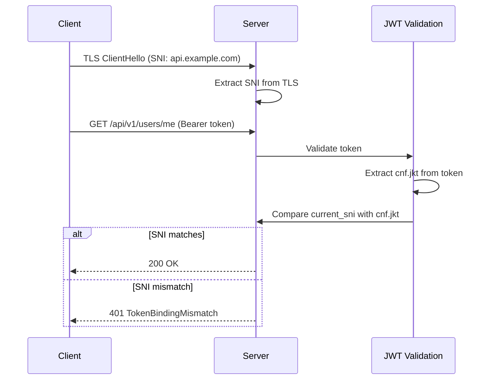
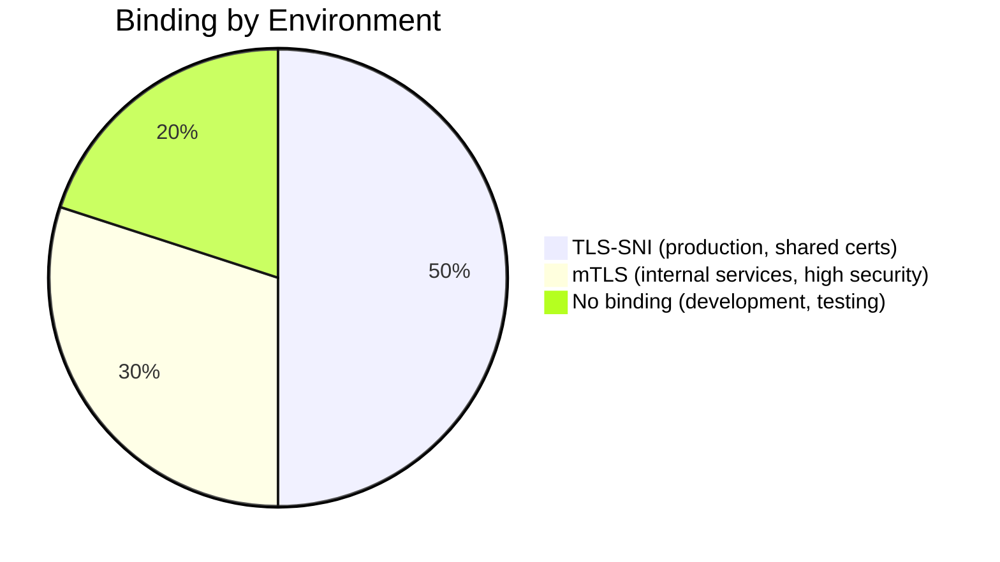

# Story 8.2: Implement RFC 8725 Token Binding

## Epic

[08-security-hardening](../security.md)

## Parent Epic Story

Story 8.2

## Summary

Implement DPoP (Demonstrating Proof-of-Possession, RFC 9449) as the primary token binding mechanism. DPoP binds access tokens and refresh tokens to a client-held cryptographic key pair, preventing replay attacks even when TLS terminates at a load balancer. TLS-SNI can be added as a secondary mechanism for internal service-to-service communication.

This replaces the original RFC 8725 TLS-SNI-only approach because:
1. DPoP works at the application layer and protects browser-based clients (TLS-SNI does not reach the app when TLS terminates at NGINX)
2. DPoP binds refresh tokens, not just access tokens (RFC 8725 only covers access tokens)
3. DPoP is the standards-track mechanism for OAuth 2.0 token binding; TLS-SNI is not an OAuth standard
4. DPoP protects against proxy-based token theft and NGINX-level token interception

## Why This Story Exists

The JWT document mentions RFC 8725 as a future enhancement: "Not currently visible in public API. Can be added as a future enhancement." Token binding ties the JWT to the TLS connection, so even if a token is stolen, it cannot be used from a different client or network.

## Design Context

### DPoP Implementation (F-004 Fix)

DPoP binds tokens to a cryptographic proof key held by the client. The flow:

1. Client generates an Ed25519 key pair (DPoP key)
2. Client sends a DPoP proof JWT with the initial login/token request:
   - Header: `{"typ": "dpop+jwt", "alg": "EdDSA", "jwk": {...}}`
   - Payload: `{"jti": "...", "iat": ..., "htm": "POST", "htu": "/auth/token", "jti": "..."}`
3. Server validates the DPoP proof:
   - `jwk` in proof header must match the `dpop_jkt` in the issued token's `cnf` claim
   - `htm`/`htu` must match the actual request method and path
   - Proof must be signed by the private key corresponding to `jwk`
4. Server issues the access token with `cnf.jkt` = `SHA-256(DPoP public key)`
5. On subsequent requests, client includes `DPoP` header with proof JWT
6. Server validates `cnf.jkt` matches the public key in the DPoP proof's `jwk`

```json
{
  "cnf": {
    "jkt": "base64url(SHA-256(DPoP_public_key_bytes))"
  }
}
```

### DPoP Proof Validation

```rust
pub fn verify_dpop_proof(
    claims: &AccessClaims,
    dpop_header: &DpopProof,
) -> Result<(), AuthError> {
    // 1. Verify dpop_proof.jwk thumbprint matches claims.cnf.jkt
    let expected_jkt = sha256(&dpop_header.jwk);
    if claims.cnf.jkt != expected_jkt {
        return Err(AuthError::DpopBindingMismatch);
    }
    // 2. Verify proof signature
    verify_eddsa(&dpop_header, &dpop_header.jwk)?;
    // 3. Validate htm/htu match actual request
    if dpop_header.htm != actual_method || dpop_header.htu != actual_path {
        return Err(AuthError::DpopMethodMismatch);
    }
    // 4. Verify proof is fresh (iat within 60 seconds)
    if now - dpop_header.iat > 60 {
        return Err(AuthError::DpopProofExpired);
    }
    Ok(())
}
```

### Refresh Token Binding

DPoP must also bind refresh tokens (F-015 Fix). The refresh token response includes the DPoP key confirmation:

- The refresh token is stored in Redis with an associated `dpop_jkt` (DPoP key thumbprint)
- On refresh, the client MUST present a valid DPoP proof
- The `dpop_jkt` in the proof must match the stored `dpop_jkt`
- This prevents stolen refresh tokens from being replayed from a different device

### TLS-SNI (Secondary, Internal Services Only)

For internal service-to-service communication (e.g., between microservices behind a shared cluster), TLS-SNI can be added as a secondary binding mechanism:

1. Service extracts SNI from TLS handshake
2. Computes SHA-256 of SNI bytes
3. Includes as `cnf.jkt_tls` in JWT (secondary binding)
4. On each request, verifies SNI matches
5. **Not for browser-based clients** — TLS-SNI is only valid when the service sees the original TLS handshake

### Binding Enforcement

Binding is applied differently by token type:

| Token Type | Binding Mechanism | When Checked |
|---|---|---|
| Access token | DPoP proof in `DPoP` header | Every API request |
| Refresh token | DPoP proof in refresh request | Every `/auth/refresh` call |
| Internal service | TLS-SNI (optional secondary) | Every inter-service call |

### F-015 Fix: Refresh Token Binding

Refresh tokens MUST be DPoP-bound (not just access tokens). Without refresh token binding, a stolen refresh token can be replayed from any device until reuse is detected. The refresh flow requires:

1. Client sends refresh request with valid DPoP proof
2. Server verifies `cnf.jkt` matches stored `dpop_jkt` for the refresh token
3. If mismatch: reject 401 (stolen refresh token detected)
4. If match: proceed with normal rotation and issue new access token with same `cnf.jkt`

## Mermaid Diagrams

### Token Binding with TLS-SNI



### Token Binding vs Token Replay

```mermaid
flowchart TD
    A[Attacker steals token] --> B{With binding}
    B --> C[Attacker uses token from different IP]
    C --> D{TLS SNI different?}
    D -->|Yes| E[Rejected: binding mismatch]
    D -->|No| F[Token accepted (but attacker needs same SNI)]
    
    A --> G{Without binding}
    G --> H[Attacker uses token from any IP]
    H --> I[Token accepted (no binding check)]
    I --> J[Data breach]
```

### Binding Environments



## OpenAPI Changes

No OpenAPI changes. Token binding is a transport-level security feature, not part of the API schema.

## Design Doc References

- `design-doc.md` section 10.8: Security Hardening -- RFC 8725 token binding
- `design-doc.md` section 10.1: Token Security -- token binding for replay prevention

## Wiki Pages to Update/Create

- `topics/topic-token-security.md`: Document token binding
- `topics/topic-delegation.md`: Note binding implications for delegation

## Acceptance Criteria

- [ ] Token binding is implemented using TLS-SNI (production) or mTLS (high-security)
- [ ] JWT includes `cnf.jkt` claim with binding hash
- [ ] Binding is verified on every request
- [ ] Binding mismatch returns 401
- [ ] Development/testing environment allows no binding
- [ ] Metrics: `token_binding_mismatch_total` is emitted

## Dependencies

- Depends on Story 8.1 (typ enforcement -- implement first)
- Optional enhancement -- can be implemented after baseline security

## Risk / Trade-offs

- **TLS-SNI reliability**: TLS-SNI depends on the SNI field being present and unchanged. If the request goes through a proxy that strips or modifies SNI, binding will fail. This is more of an issue in load-balanced environments where the SNI at the client level may differ from the SNI at the service level.
- **mTLS complexity**: mTLS requires client certificates, which adds complexity to client setup. It is appropriate for internal service-to-service communication but may be too heavy for browser-based clients.
- **No binding in development**: For development and testing, token binding may be disabled to simplify debugging. This is acceptable because development environments are not exposed to the internet.
