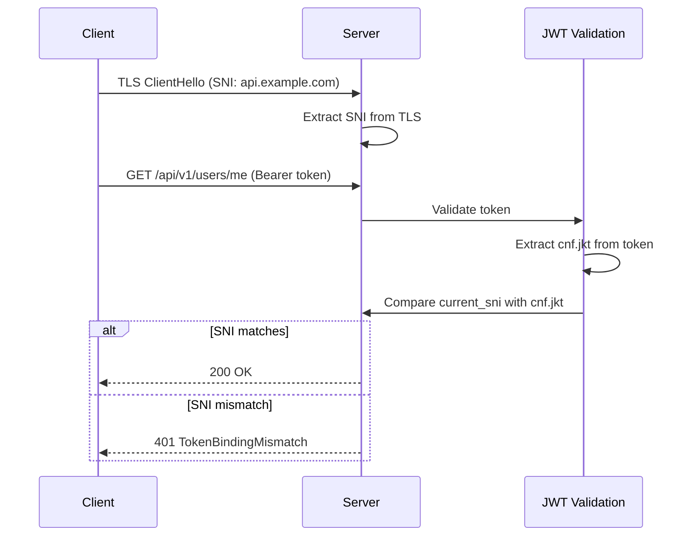
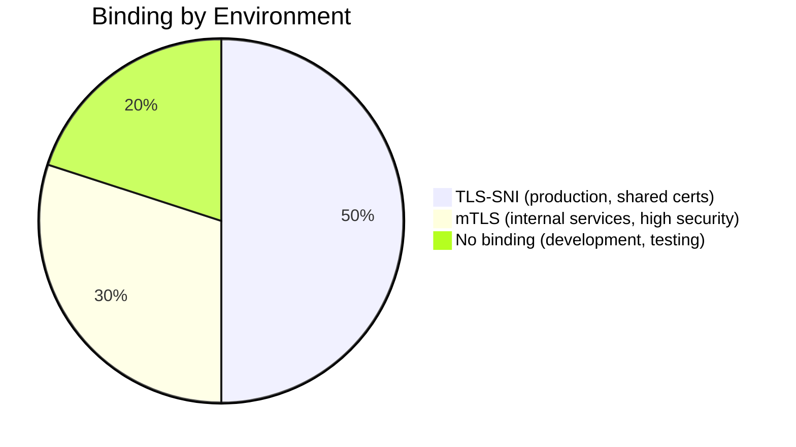

# Story 8.2: Implement RFC 8725 Token Binding

## Epic

[08-security-hardening](../security.md)

## Parent Epic Story

Story 8.2

## Summary

Implement token binding to the TLS connection (TLS-SNI or client certificate) so that a stolen token cannot be replayed from a different connection. This is a high-security enhancement that prevents token theft via network sniffing or proxy attacks.

## Why This Story Exists

The JWT document mentions RFC 8725 as a future enhancement: "Not currently visible in public API. Can be added as a future enhancement." Token binding ties the JWT to the TLS connection, so even if a token is stolen, it cannot be used from a different client or network.

## Design Context

### Current State

- No token binding
- Tokens are sent in the Authorization header (over TLS)
- A stolen token can be replayed from any client

### Token Binding Design

Token binding works by including a binding hash in the JWT:

```json
{
  "cnf": {
    "jkt": "base64url(SHA-256(TLS-SNI-binding-data))"
  }
}
```

- `cnf` = confirmation (RFC 7800)
- `jkt` = JWT thumbprint of the binding data

### TLS-SNI Binding

For the most common case (TLS Server Name Indication):

1. Client sends TLS ClientHello with SNI
2. Service extracts the SNI from the TLS handshake
3. Service computes SHA-256 of SNI bytes
4. Service includes SHA-256 hash in JWT as `cnf.jkt`
5. On each request, service verifies the current SNI matches `cnf.jkt`

### Alternative: mTLS (Mutual TLS)

For higher security, use mutual TLS (client certificate):

1. Client presents X.509 certificate during TLS handshake
2. Service extracts certificate fingerprint
3. Service includes fingerprint in JWT as `cnf.jkt`
4. On each request, service verifies the client certificate matches

### Binding Enforcement

```rust
pub fn verify_token_binding(
    claims: &AccessClaims,
    current_sni: &str,
) -> Result<(), AuthError> {
    if let Some(cnf) = &claims.cnf {
        let expected_jkt = cnf.jkt;
        let current_jkt = compute_sha256_hash(current_sni);
        
        if current_jkt != expected_jkt {
            return Err(AuthError::TokenBindingMismatch);
        }
    }
    Ok(())
}
```

## Mermaid Diagrams

### Token Binding with TLS-SNI



### Token Binding vs Token Replay

```mermaid
flowchart TD
    A[Attacker steals token] --> B{With binding}
    B --> C[Attacker uses token from different IP]
    C --> D{TLS SNI different?}
    D -->|Yes| E[Rejected: binding mismatch]
    D -->|No| F[Token accepted (but attacker needs same SNI)]
    
    A --> G{Without binding}
    G --> H[Attacker uses token from any IP]
    H --> I[Token accepted (no binding check)]
    I --> J[Data breach]
```

### Binding Environments



## OpenAPI Changes

No OpenAPI changes. Token binding is a transport-level security feature, not part of the API schema.

## Design Doc References

- `design-doc.md` section 10.8: Security Hardening -- RFC 8725 token binding
- `design-doc.md` section 10.1: Token Security -- token binding for replay prevention

## Wiki Pages to Update/Create

- `topics/topic-token-security.md`: Document token binding
- `topics/topic-delegation.md`: Note binding implications for delegation

## Acceptance Criteria

- [ ] Token binding is implemented using TLS-SNI (production) or mTLS (high-security)
- [ ] JWT includes `cnf.jkt` claim with binding hash
- [ ] Binding is verified on every request
- [ ] Binding mismatch returns 401
- [ ] Development/testing environment allows no binding
- [ ] Metrics: `token_binding_mismatch_total` is emitted

## Dependencies

- Depends on Story 8.1 (typ enforcement -- implement first)
- Optional enhancement -- can be implemented after baseline security

## Risk / Trade-offs

- **TLS-SNI reliability**: TLS-SNI depends on the SNI field being present and unchanged. If the request goes through a proxy that strips or modifies SNI, binding will fail. This is more of an issue in load-balanced environments where the SNI at the client level may differ from the SNI at the service level.
- **mTLS complexity**: mTLS requires client certificates, which adds complexity to client setup. It is appropriate for internal service-to-service communication but may be too heavy for browser-based clients.
- **No binding in development**: For development and testing, token binding may be disabled to simplify debugging. This is acceptable because development environments are not exposed to the internet.
