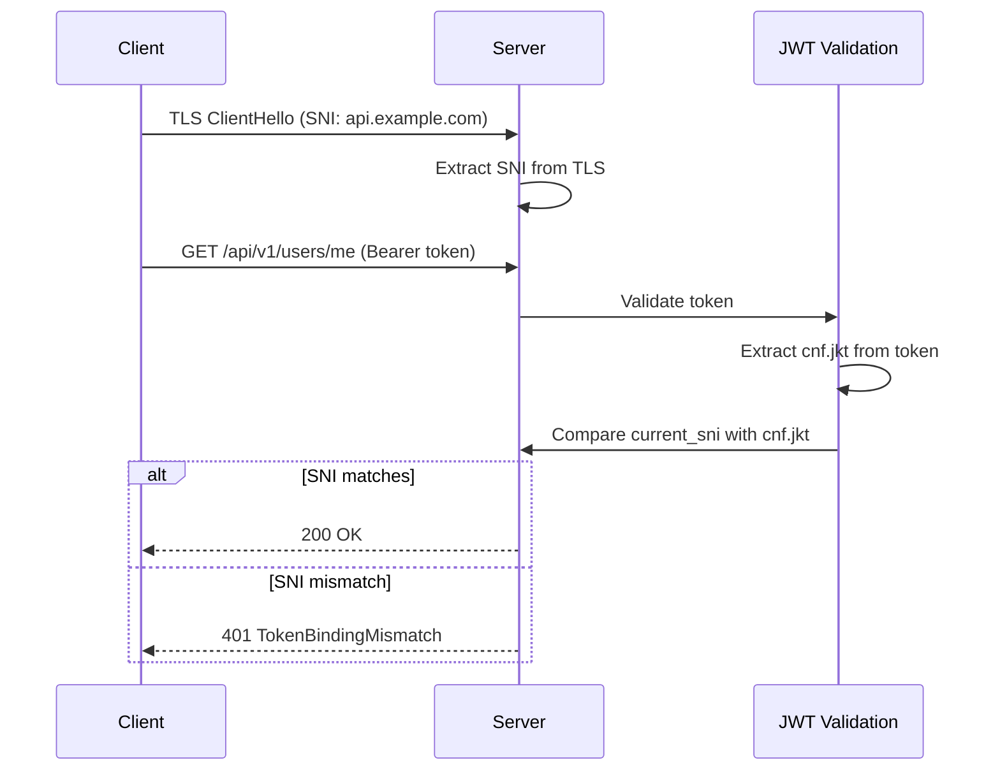
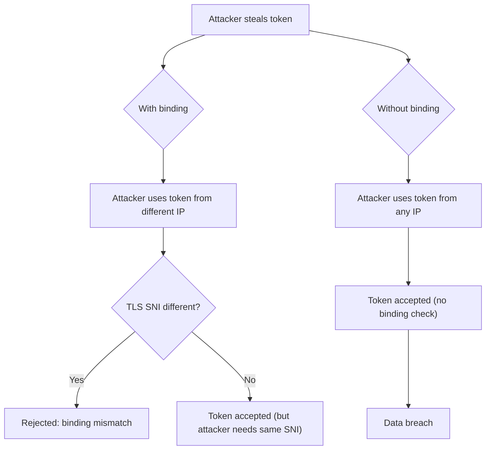
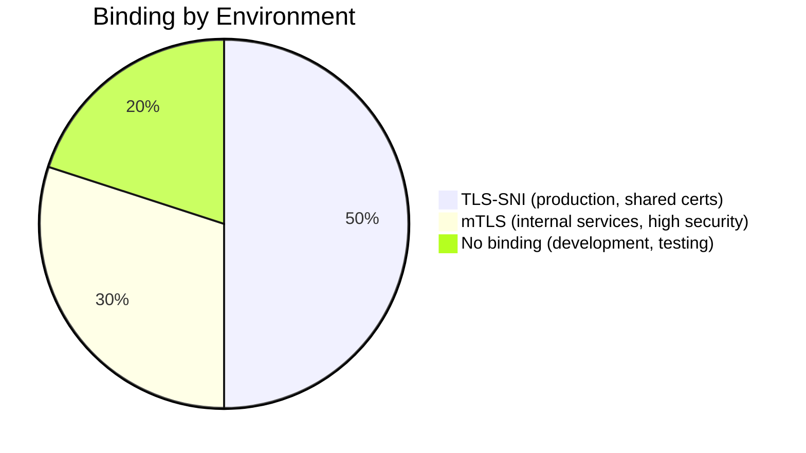

# Story 8.2: Implement RFC 8725 Token Binding

## Epic

[08-security-hardening](../security.md)

## Parent Epic Story

Story 8.2

## Summary

Implement DPoP (Demonstrating Proof-of-Possession, RFC 9449) as the primary token binding mechanism. DPoP binds access tokens and refresh tokens to a client-held cryptographic key pair, preventing replay attacks even when TLS terminates at a load balancer. TLS-SNI can be added as a secondary mechanism for internal service-to-service communication.

This replaces the original RFC 8725 TLS-SNI-only approach because:
1. DPoP works at the application layer and protects browser-based clients (TLS-SNI does not reach the app when TLS terminates at NGINX)
2. DPoP binds refresh tokens, not just access tokens (RFC 8725 only covers access tokens)
3. DPoP is the standards-track mechanism for OAuth 2.0 token binding; TLS-SNI is not an OAuth standard
4. DPoP protects against proxy-based token theft and NGINX-level token interception

## Why This Story Exists

The JWT document mentions RFC 8725 as a future enhancement: "Not currently visible in public API. Can be added as a future enhancement." Token binding ties the JWT to the TLS connection, so even if a token is stolen, it cannot be used from a different client or network.

## Design Context

### DPoP Implementation (F-004 Fix)

DPoP binds tokens to a cryptographic proof key held by the client. The flow:

1. Client generates an Ed25519 key pair (DPoP key)
2. Client sends a DPoP proof JWT with the initial login/token request:
   - Header: `{"typ": "dpop+jwt", "alg": "EdDSA", "jwk": {...}}`
   - Payload: `{"jti": "...", "iat": ..., "htm": "POST", "htu": "/auth/token", "jti": "..."}`
3. Server validates the DPoP proof:
   - `jwk` in proof header must match the `dpop_jkt` in the issued token's `cnf` claim
   - `htm`/`htu` must match the actual request method and path
   - Proof must be signed by the private key corresponding to `jwk`
4. Server issues the access token with `cnf.jkt` = `SHA-256(DPoP public key)`
5. On subsequent requests, client includes `DPoP` header with proof JWT
6. Server validates `cnf.jkt` matches the public key in the DPoP proof's `jwk`

```json
{
  "cnf": {
    "jkt": "base64url(SHA-256(DPoP_public_key_bytes))"
  }
}
```

### DPoP Proof Validation

```rust
pub fn verify_dpop_proof(
    claims: &AccessClaims,
    dpop_header: &DpopProof,
) -> Result<(), AuthError> {
    // 1. Verify dpop_proof.jwk thumbprint matches claims.cnf.jkt
    let expected_jkt = sha256(&dpop_header.jwk);
    if claims.cnf.jkt != expected_jkt {
        return Err(AuthError::DpopBindingMismatch);
    }
    // 2. Verify proof signature
    verify_eddsa(&dpop_header, &dpop_header.jwk)?;
    // 3. Validate htm/htu match actual request
    if dpop_header.htm != actual_method || dpop_header.htu != actual_path {
        return Err(AuthError::DpopMethodMismatch);
    }
    // 4. Verify proof is fresh (iat within 60 seconds)
    if now - dpop_header.iat > 60 {
        return Err(AuthError::DpopProofExpired);
    }
    Ok(())
}
```

### Refresh Token Binding

DPoP must also bind refresh tokens (F-015 Fix). The refresh token response includes the DPoP key confirmation:

- The refresh token is stored in Redis with an associated `dpop_jkt` (DPoP key thumbprint)
- On refresh, the client MUST present a valid DPoP proof
- The `dpop_jkt` in the proof must match the stored `dpop_jkt`
- This prevents stolen refresh tokens from being replayed from a different device

### TLS-SNI (Secondary, Internal Services Only)

For internal service-to-service communication (e.g., between microservices behind a shared cluster), TLS-SNI can be added as a secondary binding mechanism:

1. Service extracts SNI from TLS handshake
2. Computes SHA-256 of SNI bytes
3. Includes as `cnf.jkt_tls` in JWT (secondary binding)
4. On each request, verifies SNI matches
5. **Not for browser-based clients** — TLS-SNI is only valid when the service sees the original TLS handshake

### Binding Enforcement

Binding is applied differently by token type:

| Token Type | Binding Mechanism | When Checked |
|---|---|---|
| Access token | DPoP proof in `DPoP` header | Every API request |
| Refresh token | DPoP proof in refresh request | Every `/auth/refresh` call |
| Internal service | TLS-SNI (optional secondary) | Every inter-service call |

### F-015 Fix: Refresh Token Binding

Refresh tokens MUST be DPoP-bound (not just access tokens). Without refresh token binding, a stolen refresh token can be replayed from any device until reuse is detected. The refresh flow requires:

1. Client sends refresh request with valid DPoP proof
2. Server verifies `cnf.jkt` matches stored `dpop_jkt` for the refresh token
3. If mismatch: reject 401 (stolen refresh token detected)
4. If match: proceed with normal rotation and issue new access token with same `cnf.jkt`

## Mermaid Diagrams

### Token Binding with TLS-SNI



### Token Binding vs Token Replay



### Binding Environments



## Malicious Hacker Gotchas (Must Be Addressed During Implementation)

> **Source:** `docs/PRS_SECURITY_HARDENING.md` — Security threat model analysis

### HACK-801: DPoP Disabled in Dev Mode Can Leak to Production (CRITICAL — Hole #3 from PRS)

**Risk:** Accidental DPoP-less production deployments

The acceptance criterion says: "Development/testing environment allows no binding." The Risk/Trade-offs say: "For development and testing, token binding may be disabled." This means an environment variable (`DPoP_ENABLED`) controls whether DPoP is enforced.

**Exploit path:**
1. Developer sets `DPoP_ENABLED=false` in dev and tests everything
2. CI/CD pipeline deploys to production with the same env var (misconfiguration, stale container image, etc.)
3. All production requests are accepted WITHOUT DPoP proof
4. Attacker uses stolen tokens from any device — no binding check
5. Result: DPoP is completely ineffective in production despite being "implemented"

**Implementation requirement:**
- DPoP MUST be ENFORCED in production — never configurable via env var
- Only dev/test environments should have DPoP disabled
- Add a startup check: "If DPoP_ENABLED is not set AND we are NOT in development mode, reject startup with error: 'DPoP must be enabled in non-development environments'"
- Add a runtime check: periodically verify DPoP is enforced (e.g., via a health check endpoint)
- Document: "DPoP is a security-critical control. It cannot be disabled in production."

### HACK-802: DPoP Proof JTI Replay Not Detected (HIGH — documented but NOT implemented)

**Risk:** DPoP proofs can be replayed within 60-second freshness window

The design says: "DPoP proofs have a 60-second freshness window." The unit test "DPoP proof replay within window rejected" exists but the IMPLEMENTATION is not specified. There's no jti tracking mechanism described.

**Exploit path:**
1. Attacker captures a valid DPoP proof (from network traffic, memory dump, etc.)
2. Attacker replays the SAME proof within 60 seconds (within the freshness window)
3. Server accepts the replayed proof because the iat is still "fresh"
4. Result: DPoP provides NO protection against proof capture and replay

**Implementation requirement:**
- Track DPoP proof jtis in Redis with a 60-second TTL
- On each request, check if the proof's jti has been seen before:
```rust
// In verify_dpop_proof():
let jti_seen = redis.get(&format!("dpop_jti:{proof_jti}")).await?;
if jti_seen.is_some() {
    return Err(AuthError::DpopProofReplay);
}
redis.setex(&format!("dpop_jti:{proof_jti}"), 60, "seen").await?;
```
- This is the MISSING piece — the 60-second window is ONLY effective if proof jtis are tracked

### HACK-803: DPoP Does NOT Protect Refresh Token Binding (HIGH — related to F-015)

**Risk:** Refresh token bound to DPoP key, but key is not validated on refresh

The design says refresh tokens MUST be DPoP-bound. The refresh flow says: "Server verifies `cnf.jkt` matches stored `dpop_jkt`." But this check is only described as pseudocode — it's NOT in the refresh token flow implementation.

**Exploit path:**
1. Attacker steals a refresh token (which is DPoP-bound to device A's key)
2. Attacker tries to refresh from device B (which has key B)
3. If the refresh handler doesn't validate `cnf.jkt == stored_dpop_jkt`, the refresh succeeds
4. Attacker gets a new access token from device B
5. Result: refresh token binding is implemented in the spec but not in the code

**Implementation requirement:**
- The refresh handler MUST validate the DPoP proof's `cnf.jkt` matches the stored `dpop_jkt` for the refresh token
- This is the COMPLETE F-015 fix — refresh token binding requires BOTH:
  - DPoP proof presentation (new in Story 8.2)
  - `cnf.jkt` comparison (already in Story 3.1 but not connected to DPoP)

### HACK-804: DPoP Key Material in Every Request Header (MEDIUM — information leak)

**Risk:** Attacker can fingerprint and correlate clients via DPoP proof public keys

Every request includes a DPoP proof with `jwk` in the header. The public key is visible to every proxy, load balancer, and log aggregator between the client and the IDAM service.

**Exploit path:**
1. Attacker monitors DPoP headers on public endpoints
2. Attacker extracts the `jwk` public key from each proof
3. Attacker correlates requests by DPoP key — knows which requests are from the same device
4. Attacker builds a profile of the user's activity across all services
5. Result: DPoP public keys serve as persistent device fingerprints

**Implementation requirement:**
- Document: "DPoP proof jwk is visible to all intermediaries. This is acceptable because the key is short-lived (60s freshness) and the public key alone is not sensitive."
- Consider: rotate DPoP keys more frequently (e.g., every request or every hour) to reduce fingerprint persistence
- Add privacy notice: "Clients are informed that their DPoP public key may be visible to service intermediaries"

### HACK-805: DPoP Does NOT Solve the Version Check Fail-Open Problem (MEDIUM — Hole #8 from PRS)

**Risk:** Even with DPoP, version checks fail open when Redis is down

DPoP binding prevents token replay from a DIFFERENT device. But it does NOT prevent an attacker from using a stolen token from the SAME device (if the token was stolen from that device's memory).

**Combined with HACK-501 (Story 5.1):**
1. Attacker steals DPoP-bound access token from device A's memory
2. Attacker uses the token from device A (DPoP check passes — same key)
3. Attacker's version is stale (permissions were revoked)
4. Redis is down → version check fails open → stale token accepted
5. Result: DPoP protects against device-switching, but NOT against in-memory token theft

**Implementation requirement:**
- DPoP + version check are complementary, not redundant
- Document: "DPoP prevents cross-device token replay. Version check prevents stale permissions. Both are required."
- DPoP MUST NOT be seen as a replacement for version checks

### HACK-806: DPoP Does NOT Handle Token Exchange (MEDIUM — Hole #17 from PRS)

**Risk:** Token exchange creates new token without inheriting DPoP binding

Story 6.1 (Token Exchange) creates a new access token with merged scopes. But it does NOT specify that the new token should inherit the DPoP binding from the original token.

**Exploit path:**
1. User has a DPoP-bound access token (cnf.jkt = key_A)
2. User initiates token exchange with actor token (key_B)
3. New token is issued with merged scopes but WITHOUT DPoP binding (cnf.jkt = key_B or missing)
4. New token is accepted by services that enforce DPoP but with a DIFFERENT binding than expected
5. Result: token exchange breaks DPoP binding and creates a new binding for a different key

**Implementation requirement:**
- Token exchange MUST preserve the DPoP binding of the SUBJECT token
- OR: token exchange MUST require a NEW DPoP proof from the actor
- Document: "Token exchange MUST validate that the new token's DPoP binding matches the original or requires a fresh proof"

### HACK-807: DPoP Key Size Can Be Inflated (MEDIUM — related to Hole #2.5 from PRS)

**Risk:** Attacker submits massive DPoP proof keys to cause memory exhaustion

The design says DPoP keys should be Ed25519 or P-256. But there's no validation on the `jwk` size. An attacker can submit a 1MB RSA-8192 key as the DPoP proof `jwk`, causing:
- SHA-256 hash computation on the large key
- Memory allocation for the large key
- Token payload to explode (cnf.jkt is computed from the large key)

**Implementation requirement:**
- Validate `jwk` size: reject keys > 500 bytes (Ed25519 is ~70 bytes, P-256 is ~90 bytes)
- Reject keys with `kty` other than `OKP` or `EC`
- Reject curves other than `Ed25519` or `P-256`
- Add size limit to the DPoP proof header itself (e.g., max 1KB)

### HACK-808: DPoP Doesn't Prevent Tenant Isolation Breach (HIGH — Hole #5 from PRS)

**Risk:** DPoP binds to device, not to tenant

DPoP proof verification checks that the client's key matches the token's `cnf.jkt`. But it does NOT check that the client is authorized for the requested tenant. The tenant validation happens in the JWT middleware (Story 4.2), but DPoP adds ANOTHER validation layer that could be confused.

**Exploit path:**
1. Attacker has a DPoP-bound token for Tenant A
2. Attacker changes the `X-Tenant-ID` header to Tenant B
3. DPoP check passes (same key)
4. JWT middleware checks `claims.tenant_id != X-Tenant-ID` → TenantMismatch
5. BUT: if the middleware is not deployed or has a bug, DPoP doesn't catch this
6. Result: DPoP protects the device but not the tenant

**Implementation requirement:**
- DPoP is a DEVICE binding mechanism, NOT a tenant isolation mechanism
- Document clearly: "DPoP prevents device-switching. Tenant isolation is enforced by the JWT middleware and RLS. DPoP does NOT replace tenant validation."

### HACK-809: Pre-DPoP Token Migration Is Not Specified (LOW — operational)

**Risk:** Once DPoP is enabled, all existing tokens become invalid

The Edge Cases test says: "Given an old refresh token that was issued before DPoP binding was enabled and has no `dpop_jkt`, assert the refresh either succeeds (backward compatibility) or requires the client to re-authenticate." But this decision is NOT documented.

**Exploit path:**
1. DPoP is enabled in production
2. All existing clients have tokens without DPoP binding
3. All existing sessions are instantly invalidated
4. Result: mass session logout, user confusion, support tickets

**Implementation requirement:**
- Document the migration strategy:
  - Option A: Enable DPoP gradually — accept both DPoP and non-DPoP tokens for 30 days
  - Option B: Enable DPoP and require immediate re-authentication (breaking change)
- Document: "DPoP enables in phases: Phase 1 (monitoring) — log but don't reject. Phase 2 (enforcement) — reject non-DPoP tokens."

---

## OpenAPI Changes

No OpenAPI changes. Token binding is a transport-level security feature, not part of the API schema.

## Design Doc References

- `design-doc.md` section 10.8: Security Hardening -- RFC 8725 token binding
- `design-doc.md` section 10.1: Token Security -- token binding for replay prevention

## Wiki Pages to Update/Create

- `topics/topic-token-security.md`: Document token binding
- `topics/topic-delegation.md`: Note binding implications for delegation

## Acceptance Criteria

- [ ] Token binding is implemented using TLS-SNI (production) or mTLS (high-security)
- [ ] JWT includes `cnf.jkt` claim with binding hash
- [ ] Binding is verified on every request
- [ ] Binding mismatch returns 401
- [ ] Development/testing environment allows no binding
- [ ] Metrics: `token_binding_mismatch_total` is emitted

## Dependencies

- Depends on Story 8.1 (typ enforcement -- implement first)
- Optional enhancement -- can be implemented after baseline security

## Risk / Trade-offs

- **TLS-SNI reliability**: TLS-SNI depends on the SNI field being present and unchanged. If the request goes through a proxy that strips or modifies SNI, binding will fail. This is more of an issue in load-balanced environments where the SNI at the client level may differ from the SNI at the service level.
- **mTLS complexity**: mTLS requires client certificates, which adds complexity to client setup. It is appropriate for internal service-to-service communication but may be too heavy for browser-based clients.
- **No binding in development**: For development and testing, token binding may be disabled to simplify debugging. This is acceptable because development environments are not exposed to the internet.
- **DPoP proof replay window**: DPoP proofs have a 60-second freshness window. A captured proof JWT can be replayed within 60 seconds. The `jti` claim should be tracked to prevent proof replay within this window.
- **DPoP key rotation**: If a client rotates its DPoP key pair, existing tokens with the old `cnf.jkt` become invalid. The client must re-authenticate to get new tokens with the new `cnf.jkt`. This is expected behavior but can cause session disruption if not handled gracefully.

## Tests

### Unit Tests

- [ ] **DPoP proof with correct jkt accepted**: Given a DPoP proof where `SHA-256(jwk)` matches the token's `cnf.jkt`, assert `verify_dpop_proof()` returns `Ok(())`
- [ ] **DPoP proof with mismatched jkt rejected**: Given a DPoP proof where `SHA-256(jwk)` does NOT match the token's `cnf.jkt`, assert `verify_dpop_proof()` returns `AuthError::DpopBindingMismatch`
- [ ] **DPoP proof signature verification**: Given a DPoP proof with an invalid EdDSA signature, assert `verify_dpop_proof()` returns a signature verification error
- [ ] **DPoP proof with wrong htm rejected**: Given a DPoP proof with `htm = "GET"` but the actual request method is `POST`, assert `verify_dpop_proof()` returns `AuthError::DpopMethodMismatch`
- [ ] **DPoP proof with wrong htu rejected**: Given a DPoP proof with `htu = "/api/v1/users/me"` but the actual request path is `/api/v1/identity/preferences`, assert `verify_dpop_proof()` returns `AuthError::DpopMethodMismatch`
- [ ] **DPoP proof expired (iat > 60s ago) rejected**: Given a DPoP proof with `iat` set to 120 seconds ago, assert `verify_dpop_proof()` returns `AuthError::DpopProofExpired`
- [ ] **DPoP proof fresh (iat < 60s ago) accepted**: Given a DPoP proof with `iat` set to 30 seconds ago, assert it passes the freshness check
- [ ] **DPoP proof with iat in the future rejected**: Given a DPoP proof with `iat` set to 5 seconds in the future, assert it is rejected (prevents clock-skew manipulation)
- [ ] **Refresh token dpop_jkt match accepted**: Given a refresh token stored with `dpop_jkt = "abc123"` and a DPoP proof whose `SHA-256(jwk) = "abc123"`, assert the refresh is accepted
- [ ] **Refresh token dpop_jkt mismatch rejected**: Given a refresh token stored with `dpop_jkt = "abc123"` and a DPoP proof whose `SHA-256(jwk) = "xyz789"`, assert the refresh returns 401 (stolen refresh token detected)
- [ ] **SHA-256 thumbprint is deterministic**: Given the same DPoP public key, assert `SHA-256(key_bytes)` produces the identical `jkt` value across calls
- [ ] **DPoP proof with missing jwk rejected**: Given a DPoP proof header without a `jwk` field, assert validation fails before the jkt comparison
- [ ] **DPoP proof typ must be dpop+jwt**: Given a DPoP proof with `typ = "jwt"` instead of `typ = "dpop+jwt"`, assert the proof is rejected as a wrong token type

### Integration Tests (BDD-style with `rstest_bdd`)

- [ ] **Scenario: Full DPoP flow — proof, token issue, subsequent request**: `given` a client generates an Ed25519 key pair and sends a DPoP proof with login → `when` the access token is issued with `cnf.jkt = SHA-256(public_key)` → `then` subsequent requests with a matching DPoP proof header are accepted
- [ ] **Scenario: DPoP proof replay within window rejected**: `given` a valid DPoP proof was used for request 1 → `when` the same proof is reused for request 2 (within 60s) → `then` the second request is rejected (proof jti already seen)
- [ ] **Scenario: DPoP proof replay after window accepted**: `given` a DPoP proof was used 120 seconds ago → `when` the same proof is reused → `then` it is accepted (proof expired, fresh proof required)
- [ ] **Scenario: Stolen refresh token detected via jkt mismatch**: `given` user alice's refresh token was bound to device A's DPoP key → `when` device B tries to use the refresh token with device B's DPoP key → `then` the refresh is rejected with 401 "stolen refresh token"
- [ ] **Scenario: Refresh with correct DPoP proof succeeds**: `given` a valid refresh token with bound DPoP key → `when` the client presents a matching DPoDP proof → `then` the refresh succeeds, the old refresh token is invalidated, and a new access token is issued with the same `cnf.jkt`
- [ ] **Scenario: DPoP disabled in development mode**: `given` the service is running in development mode (env var DPoP_ENABLED=false) → `when` a request arrives without a DPoP proof → `then` the request is accepted (binding is optional in dev)
- [ ] **Scenario: DPoP mandatory in production mode**: `given` the service is running in production mode → `when` a request arrives without a DPoP proof → `then` the request is rejected with 401 "DPoP proof required"

### Security Regression Tests

- [ ] **DPoP cannot be used to bypass authorization**: Given an attacker crafts a valid DPoP proof for their own key but attaches a stolen JWT belonging to another user, assert the `cnf.jkt` mismatch is detected (the stolen JWT's `cnf.jkt` won't match the attacker's proof jkt)
- [ ] **DPoP proof cannot be replayed from a different service**: Given a DPoP proof with `htu = "/api/v1/identity/users/me"` is sent to `/api/v1/identity/preferences`, assert the `htu` mismatch is detected — proofs are path-bound
- [ ] **DPoP proof cannot be replayed from a different method**: Given a DPoP proof with `htm = "GET"` is sent to a `POST /api/v1/identity/users/me` endpoint, assert the `htm` mismatch is detected
- [ ] **DPoP key material never stored or logged**: Assert that the DPoP private key is never stored server-side (only the public key thumbprint `jkt` is stored), and neither the private key nor the proof signature is written to logs
- [ ] **DPoP does not leak information via timing**: Assert that the time to reject a mismatched DPoP proof is approximately the same as a valid proof — reject quickly on jkt mismatch so timing attacks cannot distinguish "wrong key" from "right key + bad proof"
- [ ] **Stale refresh token replay with old DPoP key blocked**: Given a refresh token was issued with DPoP key A, and the client rotates to key B, assert that trying to refresh with key B's proof is rejected — the refresh was rotated and key A's proof is no longer valid for the new token
- [ ] **DPoP proof with malformed jwk rejected**: Given a DPoP proof with a jwk that is not a valid JSON object or has missing `kty`/`x`/`y` fields, assert it is rejected before any cryptographic operations

### Edge Cases

- [ ] **DPoP proof with Ed25519 key (kty=OKP)**: Given a DPoP proof with `kty = "OKP"` and `crv = "Ed25519"`, assert the key is correctly parsed and the EdDSA signature is verified
- [ ] **DPoP proof with EC key (kty=EC)**: Given a DPoP proof with `kty = "EC"` and `crv = "P-256"`, assert the key is correctly parsed and the ES256 signature is verified
- [ ] **DPoP proof jwk with extra fields**: Given a DPoP proof jwk with additional unknown fields (e.g., `"use": "sig"`), assert the proof is still validated — extra fields in jwk are ignored
- [ ] **DPoP proof htu with query parameters**: Given a request path `/api/v1/users/me?include=email` and a DPoP proof with `htu = "/api/v1/users/me"` (no query), assert the validation either includes or excludes the query string — document the behavior
- [ ] **DPoP proof iat exactly at 60-second boundary**: Given a DPoP proof with `iat` exactly 60 seconds ago, assert the behavior is deterministic — either accepted (within tolerance) or rejected (expired) — document which
- [ ] **DPoP proof with empty jti**: Given a DPoP proof with an empty `jti` field, assert it is accepted or rejected consistently — empty jti is distinct from missing jti
- [ ] **DPoP proof with very large jwk**: Given a DPoP proof with an unusually large jwk (e.g., 100KB RSA key), assert the handler rejects it — DPoP keys should be small (Ed25519 or P-256, < 500 bytes)
- [ ] **Refresh token with no bound dpop_jkt (pre-DPoP token)**: Given an old refresh token that was issued before DPoP binding was enabled and has no `dpop_jkt`, assert the refresh either succeeds (backward compatibility) or requires the client to re-authenticate — document the policy

### Cleanup

- [ ] DPoP proof jti denylist must be cleared between test scenarios — use a fresh jti store or `FLUSHDB` for the jti tracking keys
- [ ] Token `cnf.jkt` bindings must be reset between tests — use fresh DPoP key pairs per test and clean up Redis entries bound to old keys
- [ ] Refresh token family must be cleaned between tests — rotate or invalidate stored refresh tokens to prevent cross-test token reuse
- [ ] Metrics registry must be reset between test scenarios using `prometheus::Registry::new()` to prevent cross-test metric contamination
- [ ] DPoP key pairs used in tests must be unique per test — generate fresh Ed25519 key pairs for each test to prevent key collision
- [ ] No files (key material, test artifacts) should be left in the filesystem after test runs — use ephemeral in-memory key pairs
- [ ] If DPoP is disabled in dev mode, ensure tests explicitly set DPoP_ENABLED per test — do not rely on the global environment variable state
