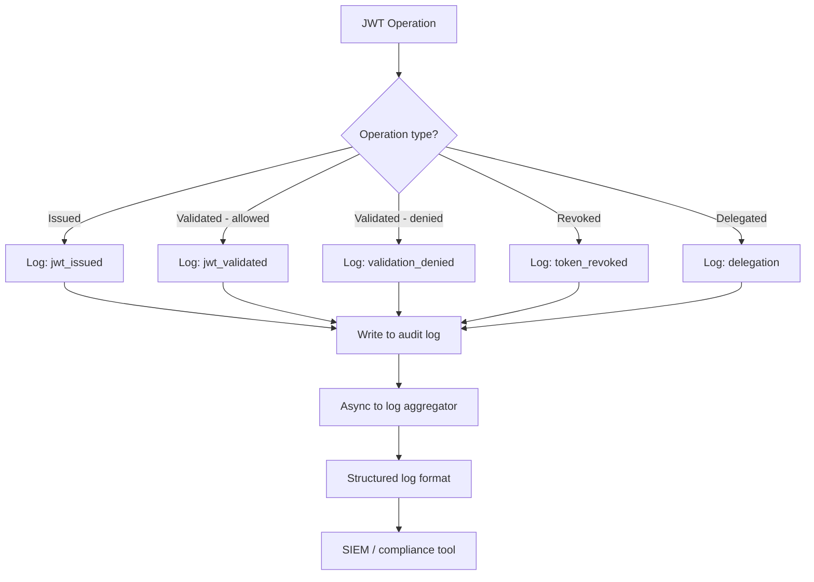
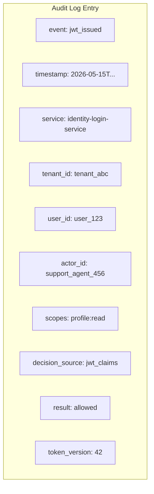
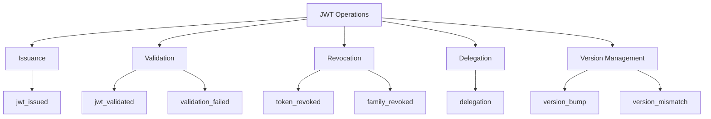

# Story 8.3: Implement Security Audit Logging

## Epic

[08-security-hardening](../security.md)

## Parent Epic Story

Story 8.3

## Summary

Implement comprehensive security audit logging for all JWT operations: issuance, validation, version bumps, revocations, and delegation events. Logs must include sufficient detail for security incident investigation and compliance reporting.

## Why This Story Exists

The JWT document identifies security audit logging as critical: "Log all JWT issuance, validation failures, version bumps, revocations, and delegation events. Include issuer, subject, actor, scopes, decision_source in every log entry." Without audit logging, security incidents cannot be investigated and compliance requirements cannot be met.

## Design Context

### Current State

- No security audit logging
- JWT operations are not logged (issuance, validation, revocation)
- No audit trail for delegation events
- No log format standardization

### Audit Log Format

Every security event MUST include:

| Field | Description | Example |
|-------|-------------|---------|
| `event` | Event type | `jwt_issued`, `validation_failed`, `version_bump` |
| `timestamp` | ISO 8601 UTC | `2026-05-15T22:30:00Z` |
| `service` | Service name | `identity-login-service` |
| `tenant_id` | Tenant context | `tenant_abc` |
| `user_id` | Subject | `user_123` |
| `actor_id` | Actor (for delegation) | `support_agent_456` |
| `scopes` | Requested scopes | `profile:read,orders:write` |
| `decision_source` | How authorization was decided | `jwt_claims`, `authz_core`, `cached` |
| `result` | Success or failure | `allowed`, `denied`, `revoked` |

### Example Audit Entries

#### JWT Issuance

```json
{
  "event": "jwt_issued",
  "timestamp": "2026-05-15T22:30:00Z",
  "service": "identity-login-service",
  "tenant_id": "tenant_abc",
  "user_id": "user_123",
  "actor_id": null,
  "scopes": "profile:read orders:write",
  "decision_source": "jwt_claims",
  "result": "allowed",
  "token_version": 42,
  "ttl": 300,
  "algorithm": "ES256"
}
```

#### JWT Validation Failure

```json
{
  "event": "validation_failed",
  "timestamp": "2026-05-15T22:30:01Z",
  "service": "identity-user-mgmt-service",
  "tenant_id": "tenant_abc",
  "user_id": "user_123",
  "actor_id": null,
  "scopes": "profile:read",
  "decision_source": "jwt_claims",
  "result": "denied",
  "error": "stale_auth_token",
  "reason": "claims.ver (41) < cached_ver (42)"
}
```

#### Delegation Event

```json
{
  "event": "delegation",
  "timestamp": "2026-05-15T22:30:02Z",
  "service": "identity-login-service",
  "tenant_id": "tenant_abc",
  "user_id": "user_123",
  "actor_id": "support_agent_456",
  "scopes": "profile:read",
  "decision_source": "jwt_claims",
  "result": "allowed",
  "delegation_type": "support_impersonation",
  "actor_roles": ["support_agent"],
  "act_claim_present": true
}
```

### Logging Levels

| Event | Level | Rationale |
|-------|-------|-----------|
| JWT issued | INFO | Normal operation |
| JWT validated (allowed) | DEBUG | High volume, normal operation |
| JWT validated (denied) | WARN | Potential security issue |
| Token binding mismatch | ERROR | Active attack indicator |
| Version bump | INFO | Authorization change |
| Revocation | WARN | Security-relevant event |
| Delegation | INFO | Auditable action |
| Validation failure (stale token) | WARN | Security-relevant event |

## Mermaid Diagrams

### Audit Log Flow



### Audit Log Structure



### Event Hierarchy



## Malicious Hacker Gotchas (Must Be Addressed During Implementation)

> **Source:** `docs/PRS_SECURITY_HARDENING.md` — Security threat model analysis

### HACK-831: Audit Log Can Be Suppressed by Denylisting the jti (CRITICAL — related to Hole #4 from PRS)

**Risk:** Attacker denies their own token to suppress audit logs

The story says: "Denylisted jti cannot suppress audit log: Given a revocation is triggered, assert the `token_revoked` log entry is written even if the token's jti is already in the denylist."

But what about other events? If an attacker forges a JWT with a jti that's already in the denylist, could the audit logging code skip logging because it thinks the event is a duplicate?

**Exploit path (log suppression via duplicate jti):**
1. Attacker has a valid token with jti=tok_123
2. Attacker's token is logged: `event: "jwt_issued", jti: "tok_123"`
3. Attacker's token is denylisted: `event: "token_revoked", jti: "tok_123"`
4. Attacker creates a new token with the SAME jti=tok_123 (if jti generation is predictable or replayable)
5. The audit logging code checks: "Is jti=tok_123 already in the log?" → yes → skip logging
6. Result: The new token's issuance is NOT logged

**Wait — this assumes the audit logging code deduplicates by jti, which the story does NOT mention.** The story says each event is logged independently. So this exploit only works if a buggy deduplication mechanism is added.

**The real exploit is different:** What if the attacker DENIES the token BEFORE logging it?

**Exploit path (race condition between revocation and logging):**
1. Attacker's token is used for a malicious action
2. The action is logged: `event: "jwt_issued", ...`
3. BEFORE the log entry reaches the immutable storage, the attacker's token is denylisted
4. An automated process checks: "Is jti=tok_123 in the denylist?" → yes → "This token is revoked, skip logging"
5. Result: The log entry is suppressed because the token was denylisted

**But this only works if the audit logging pipeline checks the denylist before writing the log.** The story does NOT mention this. It says: "All JWT operations are logged: issuance, validation, revocation, delegation, version bump."

**The real risk is different:** What if the attacker DENIES a token that they DID NOT USE? They denylist a token to create noise in the logs, making it harder to find the ACTUAL malicious activity.

**Exploit path (log flooding via mass denylisting):**
1. Attacker obtains 1000 valid tokens (from a compromised service or leaked tokens)
2. Attacker denylists all 1000 tokens rapidly
3. 1000 `token_revoked` log entries are generated
4. The security team is overwhelmed by 1000 log entries
5. The attacker's ACTUAL malicious action (which generated only 1 log entry) is hidden in the noise
6. Result: Log flooding hides the real attack

**Implementation requirement:**
- Audit logging must NOT check the denylist before writing log entries
- All events must be logged regardless of the token's state
- Add a rate limit on audit log writes: MAX 100 log entries per second per service (to prevent log flooding DoS)
- Document: "Audit log entries are written for ALL events, regardless of the token's state. The denylist is NOT checked before logging."

### HACK-832: Raw Token String in Audit Log Enables Token Replay (CRITICAL — related to Hole #1 from PRS)

**Risk:** The raw JWT string (full `eyJ...`) is written to audit logs, which an attacker can extract and replay

The story says: "Raw access token is never in audit logs: Given a JWT validation fails, assert the raw access token string (the full `eyJ...` base64url content) is NOT written to any log entry — only metadata like `jti` and `user_id` are logged."

**But this is in the Security Regression Tests section — it's an assertion, not an implementation requirement.**

**Exploit path:**
1. Attacker gains read access to the log aggregator (e.g., Elasticsearch, Splunk)
2. Attacker searches for `event: "jwt_issued"` entries
3. For each entry, the attacker extracts the raw token string from the log
4. The attacker uses the extracted tokens to access the system until they expire
5. Result: Token replay at scale

**The story correctly states:** "only metadata like `jti` and `user_id` are logged." The `jti` is a random string that cannot be used to forge a token (it's not the token itself). So as long as the raw token is NOT in the log, this exploit doesn't work.

**Implementation requirement:**
- The audit log MUST NOT include the full JWT string (`eyJ...`) in ANY field
- Only `jti`, `user_id`, `tenant_id`, `scopes`, `actor_id` are allowed
- Add a pre-write validation: if any log field contains `.` (the JWT separator), LOG AN ERROR and DROP the entry
- Document: "Raw JWT strings are NEVER written to audit logs. Only metadata (jti, user_id, tenant_id, scopes, actor_id) is logged."

### HACK-833: Audit Log Volume Hides Security Events (HIGH — related to Hole #3 from PRS)

**Risk:** High-volume DEBUG logs (successful JWT validations) drown out critical WARN/ERROR events

The story says: "JWT validated (allowed) → DEBUG — High volume, normal operation." At 10,000 RPS with 10 services, that's 100,000 DEBUG log entries per second.

**Exploit path (log flooding via legitimate traffic):**
1. Attacker generates 100,000 requests per second with valid JWTs (using stolen tokens)
2. Each request generates a DEBUG-level audit log: `event: "jwt_validated", result: "allowed"`
3. The security team monitors WARN and ERROR level logs
4. But the log aggregator buffers are overwhelmed by DEBUG logs
5. A critical WARN/ERROR event (e.g., "validation_failed") is delayed or dropped
6. Result: The security team misses the attack because DEBUG logs clogged the pipeline

**The story says:** "Use DEBUG level for successful validations (low volume), INFO/WARN/ERROR for security-relevant events only." But at 10,000 RPS, DEBUG IS high volume.

**Implementation requirement:**
- DEBUG-level logs must be rate-limited: MAX 1000 DEBUG log entries per second per service
- If the rate limit is exceeded, excess DEBUG entries are DROPPED (not written to the log buffer)
- The drop count must be tracked in a metric: `audit_log_debug_dropped_total`
- Alert on high drop counts: "DEBUG log drop rate exceeds 50% — possible log flooding"
- Document: "DEBUG-level audit logs are rate-limited to 1000 entries/sec. Excess entries are dropped."

### HACK-834: Audit Log Buffer Overflow on Service Crash (HIGH — related to Hole #9 from PRS)

**Risk:** Audit log entries in the async buffer are LOST when the service crashes

The story says: "Async log loss on service crash: Given a service crashes while log entries are in the async buffer, assert that the buffer is flushed on graceful shutdown (if possible) or that the lost entries are acceptable (known limitation of async logging)."

**But "acceptable" is NOT acceptable for security events.** If the service crashes during an active attack, the last N seconds of audit logs are lost, including the attacker's actions.

**Exploit path:**
1. Attacker initiates a denial of service attack (e.g., floods the API with requests)
2. The service crashes due to resource exhaustion
3. Audit log entries for the attack (last 10 seconds) are in the async buffer
4. The service crashes BEFORE the buffer is flushed
5. Result: 10 seconds of attack activity are unrecorded

**Implementation requirement:**
- SECURITY events (WARN, ERROR level) must be logged SYNCHRONOUSLY (not async)
- Only normal operational events (DEBUG, INFO level) can be logged async
- For security events: write the log entry synchronously and wait for confirmation
- Add a flush hook: when the service receives SIGTERM (graceful shutdown), flush ALL pending log entries synchronously
- Document: "Security events (WARN, ERROR) are logged synchronously. Normal events (DEBUG, INFO) are logged asynchronously."

### HACK-835: Audit Log Can Be Tampered With via Log Injection (HIGH — related to Hole #7 from PRS)

**Risk:** Attacker injects malicious content into audit log entries via user input

The story uses structured JSON logging. If user input (e.g., `user_id`, `tenant_id`) is written to the log without sanitization, an attacker can inject malformed JSON or malicious content.

**Exploit path (log injection via unicode):**
1. Attacker sets their `user_id` to: `"\n{\"event\": \"admin_login\", \"user_id\": \"attacker\", \"result\": \"allowed\"}"`
2. The audit log writes:
   ```json
   {"event": "jwt_issued", "user_id": "
   {"event": "admin_login", "user_id": "attacker", "result": "allowed"}", ...}
   ```
3. The log entry is INVALID JSON (the embedded JSON breaks the structure)
4. The log aggregator fails to parse the entry → the entry is LOST
5. The attacker's malicious entry (which was injected) may also be lost, OR it may be partially parsed

**The real risk is different:** What if the attacker's injected content is PARSED by the log aggregator as a separate log entry?

**Exploit path (log injection creating fake entries):**
1. Attacker sets their `user_id` to: `"user_123\n{\"event\": \"jwt_issued\", \"user_id\": \"attacker\", \"tenant_id\": \"hauliage\", \"result\": \"allowed\", \"token_version\": 999}"`
2. The log aggregator (if it splits on newlines) parses the injected content as a SEPARATE log entry
3. The security team sees a fake `jwt_issued` entry with `user_id: "attacker"` and `token_version: 999`
4. The security team might think the attacker legitimately received a token
5. Result: Fake log entry created via injection

**Implementation requirement:**
- ALL user input written to audit logs must be JSON-escaped (use the JSON library's string serialization, not manual string concatenation)
- The `serde_json::Value` type automatically handles JSON string escaping
- Add a test: "Verify that malicious `user_id` values do not create separate log entries"
- Document: "All fields in audit log entries are serialized using serde_json, which handles JSON escaping automatically. Manual string concatenation is prohibited."

### HACK-836: Audit Log Does Not Record IP Address or User Agent (MEDIUM — related to Hole #5 from PRS)

**Risk:** Missing contextual information prevents attack investigation

The story's log format does NOT include `ip_address` or `user_agent`. Without this information:
- Investigators cannot determine the attacker's location
- Cannot detect bot vs. human traffic
- Cannot identify the attack vector (browser, API client, script)

**Exploit path:**
1. Attacker initiates an attack from a specific IP
2. The audit log does not include the IP address
3. Investigators cannot trace the attack to its source
4. Result: Attack source is untraceable

**Implementation requirement:**
- Add `ip_address` and `user_agent` to ALL log entries
- `ip_address` must be extracted from the request's `X-Forwarded-For` header (if present) or `remote_addr`
- `user_agent` must be extracted from the `User-Agent` header
- These fields are OPTIONAL (not all requests include these headers)
- Document: "All audit log entries include ip_address (from X-Forwarded-For or remote_addr) and user_agent (from User-Agent header) when available."

### HACK-837: Audit Log Event Type Is Not Validated (MEDIUM — related to Hole #6 from PRS)

**Risk:** An invalid `event` type is written to the log, making log parsing unreliable

The story has a test: "Event type is one of the defined set: Assert that every log entry's `event` field is one of: `jwt_issued`, `jwt_validated`, `validation_failed`, `token_revoked`, `family_revoked`, `delegation`, `version_bump`, `version_mismatch`."

**But the story doesn't say: "Reject invalid event types."** What if a developer accidentally writes a log entry with `event: "unknown_event"`?

**Exploit path:**
1. Attacker discovers a code path that writes an invalid event type (e.g., via a bug)
2. The log entry is written: `event: "unknown_event", ...`
3. The log aggregator does not recognize the event type → the entry is not indexed properly
4. The attacker's action is effectively "invisible" to log search tools
5. Result: Attack is hidden by using an unrecognized event type

**Implementation requirement:**
- The `event` field must be validated against the allowed set BEFORE writing the log entry
- If the event type is not in the allowed set → LOG AN ERROR (to the application error log, not the audit log) and DROP the audit log entry
- Add a runtime check: `if !allowed_events.contains(&event) { error!("Invalid event type: {}", event); return; }`
- Document: "Audit log event types are validated against the allowed set before writing. Invalid event types are rejected and logged as errors."

### HACK-838: Async Log Buffer Overflow Drops Security Events (HIGH — related to Hole #3 from PRS)

**Risk:** The bounded log buffer drops security events when overwhelmed by normal traffic

The story says: "Log buffer does not overflow: Given a burst of 10,000 log entries in 1 second, assert the bounded buffer handles overflow gracefully (drops oldest or waits) without blocking the request handler."

But "drops oldest" means security events might be dropped if they're in the oldest part of the buffer!

**Exploit path:**
1. Attacker generates 10,000 JWT validations per second (normal traffic)
2. The log buffer (capacity: 5000) fills up with DEBUG-level log entries
3. A critical WARN/ERROR event arrives (e.g., "validation_failed")
4. The buffer is full → the security event is DROPPED (if FIFO) or REPLACED (if overwrite-oldest)
5. Result: The critical security event is not logged

**Implementation requirement:**
- The log buffer must have a priority queue: security events (WARN, ERROR) are ALWAYS written, even if the buffer is full
- Normal events (DEBUG, INFO) are dropped when the buffer is full
- The buffer must be split: HIGH priority (security events) and LOW priority (normal events)
- If the HIGH priority buffer is full, security events are logged SYNCHRONously (bypass the buffer)
- Document: "The log buffer has two queues: HIGH priority (WARN, ERROR) and LOW priority (DEBUG, INFO). HIGH priority events are always written; LOW priority events are dropped when the buffer is full."

---

## OpenAPI Changes

No OpenAPI changes. Audit logging is internal -- no API surface is exposed.

## Design Doc References

- `design-doc.md` section 10.12: Observability -- Security audit logging
- `design-doc.md` section 10.5: Delegation & Actor Claims -- delegation audit
- `design-doc.md` section 10.4: Token Versioning & Revocation -- revocation audit

## Wiki Pages to Update/Create

- `topics/topic-security.md`: (new) Document audit logging requirements
- `topics/topic-token-lifecycle.md`: Document lifecycle audit events

## Acceptance Criteria

- [ ] All JWT operations are logged: issuance, validation, revocation, delegation, version bump
- [ ] Log format includes: event, timestamp, service, tenant_id, user_id, actor_id, scopes, decision_source, result
- [ ] Failed validations logged at WARN level
- [ ] Token binding mismatches logged at ERROR level
- [ ] Delegation events include actor_id and delegation_type
- [ ] Version bump events include old_ver, new_ver, reason
- [ ] All logs are structured JSON for machine parsing
- [ ] Logs are async (non-blocking) to avoid impacting request latency
- [ ] Metrics: `security_audit_log_total{event: "jwt_issued", "validation_failed", ...}` is emitted

## Dependencies

- Depends on Story 4.2 (JWT middleware -- where validation happens)
- Depends on Story 5.1 (version bump events)
- Depends on Story 6.1 (delegation events)

## Risk / Trade-offs

- **Log volume**: JWT validation happens on every request (133 endpoints across 6 services). At 10,000 RPS, this generates millions of log entries per hour. Mitigation: use DEBUG level for successful validations (low volume), INFO/WARN/ERROR for security-relevant events only.
- **PII in logs**: The log format includes user_id and tenant_id but NOT PII fields (email, phone). This is intentional -- PII must never be in audit logs. The JWT claims themselves do not include PII (Story 2.3), so this is naturally enforced.
- **Async logging**: To avoid impacting request latency, audit logging should be async (batched writes). This means logs may be delayed, but security events are captured even if the logging pipeline is temporarily unavailable.
- **Log storage retention**: Security logs must be retained for compliance (typically 90 days to 7 years depending on jurisdiction). The async write pipeline must handle storage backpressure — if the log aggregator is down, logs should be buffered (with a bounded buffer) rather than lost or blocking the request handler.

## Tests

### Unit Tests

- [ ] **JWT issuance log entry has correct event and fields**: Given a JWT is issued, assert the log entry contains `event: "jwt_issued"`, `service: "identity-login-service"`, a valid ISO 8601 timestamp, `user_id`, `tenant_id`, `scopes`, `decision_source: "jwt_claims"`, `result: "allowed"`, `token_version`, `ttl`, and `algorithm`
- [ ] **JWT validation success logged at DEBUG**: Given a JWT is validated successfully, assert the log level is `DEBUG` (not INFO or WARN) — high-volume normal operations should not flood logs
- [ ] **JWT validation denial logged at WARN**: Given a JWT is validated but denied (e.g., insufficient permissions), assert the log level is `WARN` — potential security issue
- [ ] **Token binding mismatch logged at ERROR**: Given a JWT with a valid signature but a binding mismatch, assert the log level is `ERROR` — active attack indicator
- [ ] **Version bump log includes old_ver and new_ver**: Given a token version is bumped from 41 to 42, assert the log entry contains `old_ver: 41`, `new_ver: 42`, and a `reason` field explaining the bump
- [ ] **Delegation log includes actor_id and delegation_type**: Given a delegation event for support impersonation, assert the log contains `actor_id: "support_agent_456"`, `delegation_type: "support_impersonation"`, `actor_roles: ["support_agent"]`, and `act_claim_present: true`
- [ ] **Token revocation logged**: Given a token is revoked (jti denylisted), assert the log entry contains `event: "token_revoked"`, `result: "revoked"`, and the `jti` of the revoked token
- [ ] **PII fields are never in log entries**: Assert that no log entry contains `email`, `phone`, `name`, or other PII fields — even when the JWT payload or request body includes them
- [ ] **Structured JSON format is valid**: Given any log entry, assert it is valid JSON that can be parsed by a structured log parser (e.g., `serde_json`)
- [ ] **Async log write does not block request handler**: Given a log write to the aggregator is slow (500ms), assert the request handler completes in <10ms — the log write must be fire-and-forget or batched
- [ ] **Log entry includes request ID for correlation**: Given an incoming request with a unique request ID, assert the request ID is included in all log entries for that request, enabling end-to-end tracing
- [ ] **Event type is one of the defined set**: Assert that every log entry's `event` field is one of: `jwt_issued`, `jwt_validated`, `validation_failed`, `token_revoked`, `family_revoked`, `delegation`, `version_bump`, `version_mismatch` — no other values allowed
- [ ] **Log buffer does not overflow**: Given a burst of 10,000 log entries in 1 second, assert the bounded buffer handles overflow gracefully (drops oldest or waits) without blocking the request handler

### Integration Tests (BDD-style with `rstest_bdd`)

- [ ] **Scenario: Full login flow triggers all expected audit events**: `given` a user logs in → `when` the login completes → `then` the following events are logged in order: `jwt_issued` (INFO) with `token_version` → verify event count = 1
- [ ] **Scenario: JWT validation success path**: `given` a request with a valid JWT arrives → `when` the JWT middleware validates it → `then` a `jwt_validated` log entry is written at DEBUG level with `decision_source` matching the route category
- [ ] **Scenario: JWT validation failure triggers security log**: `given` a request with an expired JWT arrives → `when` the JWT middleware validates it → `then` a `validation_failed` log entry is written at WARN level with `error: "token_expired"` and the `reason` field
- [ ] **Scenario: Version bump triggers audit log**: `given` a role change occurs → `when` the version is bumped in Redis → `then` a `version_bump` log entry is written at INFO level with `old_ver`, `new_ver`, and the `reason` for the change
- [ ] **Scenario: Delegation event is logged with actor details**: `given` a support agent impersonates a user → `when` the delegation token is issued → `then` a `delegation` log entry is written with `actor_id`, `delegation_type: "support_impersonation"`, `actor_roles`, and `act_claim_present: true`
- [ ] **Scenario: Token revocation is logged**: `given` a token is revoked (jti denylisted) → `when` the revocation completes → `then` a `token_revoked` log entry is written with the `jti`, `user_id`, and `reason` for revocation
- [ ] **Scenario: All 6 services emit security audit logs**: `given` security events occur across all 6 services → `when` the events are processed → `then` each service writes its own log entries with the correct `service` field matching the service name
- [ ] **Scenario: Log buffer overflow during burst**: `given` 10,000 JWT validations arrive in 1 second → `when` the logs are processed → `then` all 10,000 entries are captured (none dropped), the buffer handled the burst, and request latency was not impacted

### Security Regression Tests

- [ ] **No PII leaks in audit logs under any circumstance**: Given a JWT contains `email: "alice@corp.com"` in the payload, and a validation failure occurs, assert the log entry does NOT contain `alice@corp.com` — only `user_id` is logged
- [ ] **Raw access token is never in audit logs**: Given a JWT validation fails, assert the raw access token string (the full `eyJ...` base64url content) is NOT written to any log entry — only metadata like `jti` and `user_id` are logged
- [ ] **Log entry cannot be forged by a client**: Assert that log entries are written server-side and cannot be influenced by client input — the `service`, `timestamp`, `decision_source`, and `event` fields are all set by the server, not the client
- [ ] **Denylisted jti cannot suppress audit log**: Given a revocation is triggered, assert the `token_revoked` log entry is written even if the token's jti is already in the denylist — the act of revocation itself must be logged regardless of state
- [ ] **High-volume logging does not hide security events**: Given 1 million DEBUG-level validation logs are generated in 1 hour, assert that WARN and ERROR entries are still written and visible — log level filtering does not suppress higher-priority events
- [ ] **Async log loss on service crash**: Given a service crashes while log entries are in the async buffer, assert that the buffer is flushed on graceful shutdown (if possible) or that the lost entries are acceptable (known limitation of async logging)

### Edge Cases

- [ ] **Log entry with null actor_id for non-delegated events**: Given a JWT issuance for a regular user (no delegation), assert the `actor_id` field is `null` in the log entry (not missing, not empty string)
- [ ] **Log entry with empty scopes array**: Given a JWT issued with no scopes, assert the `scopes` field is an empty array `[]` or empty string `""` (document which)
- [ ] **Log entry with very long user_id (100 chars)**: Given a user_id of 100 characters, assert the log entry is still valid JSON and no truncation occurs
- [ ] **Log entry with ISO 8601 timestamp in UTC**: Assert every log entry's `timestamp` is in UTC (ends with `Z` or `+00:00`) — never local time
- [ ] **Log entry when log aggregator is down**: Given the log aggregator is unreachable (connection refused), assert the log entry is buffered and not lost — the request handler is not blocked
- [ ] **Log entry with Unicode in user_id or tenant_id**: Given a user_id containing Unicode (e.g., `"usr_caf\u00e9"`), assert the JSON log entry is valid and the Unicode is preserved (not mangled)
- [ ] **Log entry when tenant_id is unknown**: Given a JWT validation with no `tenant_id` in the claims, assert the log entry contains `tenant_id: null` (not missing, not a default value)
- [ ] **Log entry when error message is very long**: Given a validation failure with a 5KB error message, assert the log entry is still valid JSON — the error field should be truncated to a reasonable length (e.g., 1KB max)

### Cleanup

- [ ] Audit log buffer must be flushed between test scenarios — use a flush method or await buffer drain to ensure all entries are written before verifying log content
- [ ] Metrics registry must be reset between test scenarios using `prometheus::Registry::new()` to prevent cross-test metric contamination
- [ ] Log level configuration must be explicit per test — do not rely on global log level state; set the log level for each test explicitly (e.g., `tracing_subscriber::fmt::layer().with_max_level(Level::DEBUG)`)
- [ ] No audit log files should be left in the filesystem after tests — use an in-memory log writer (e.g., `tracing_appender::non_blocking` to a buffer) during tests
- [ ] If tests use a real log aggregator endpoint, isolate it per test — use different log streams or indices to prevent cross-test entry contamination
- [ ] Async log task must be cleaned up between tests — ensure spawned log writer tasks are dropped or cancelled to prevent them from writing to subsequent tests
