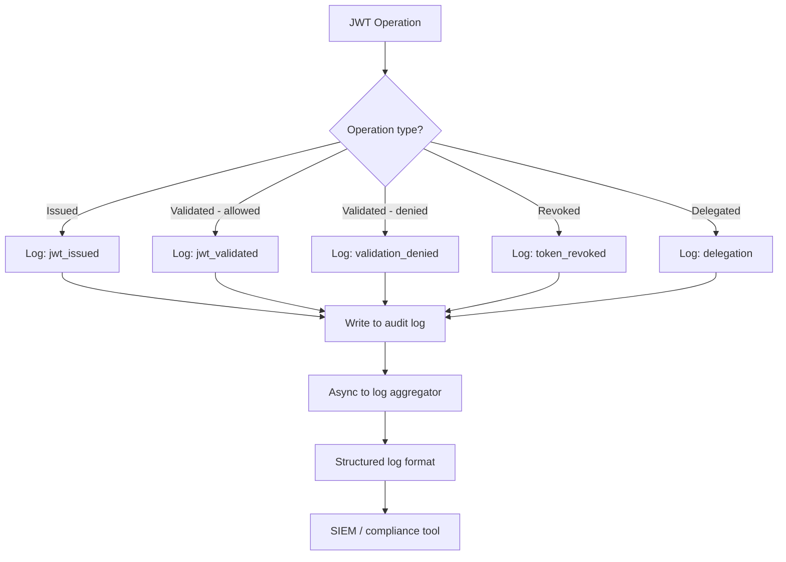
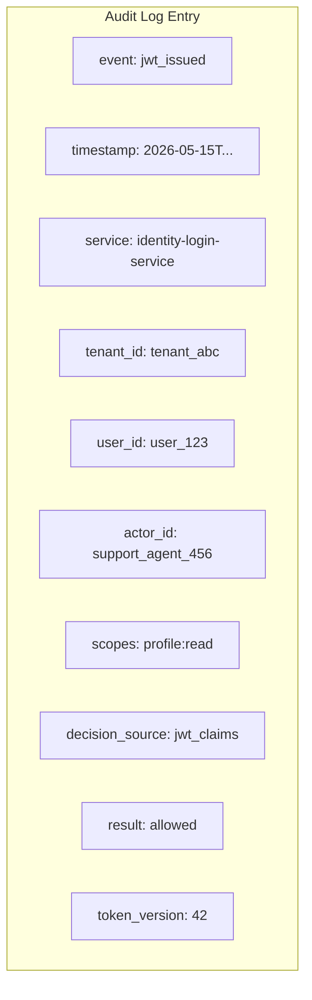
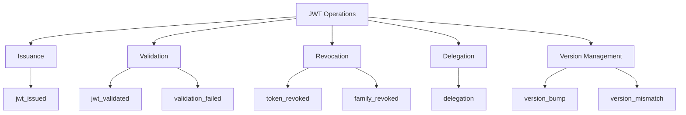

# Story 8.3: Implement Security Audit Logging

## Epic

[08-security-hardening](../security.md)

## Parent Epic Story

Story 8.3

## Summary

Implement comprehensive security audit logging for all JWT operations: issuance, validation, version bumps, revocations, and delegation events. Logs must include sufficient detail for security incident investigation and compliance reporting.

## Why This Story Exists

The JWT document identifies security audit logging as critical: "Log all JWT issuance, validation failures, version bumps, revocations, and delegation events. Include issuer, subject, actor, scopes, decision_source in every log entry." Without audit logging, security incidents cannot be investigated and compliance requirements cannot be met.

## Design Context

### Current State

- No security audit logging
- JWT operations are not logged (issuance, validation, revocation)
- No audit trail for delegation events
- No log format standardization

### Audit Log Format

Every security event MUST include:

| Field | Description | Example |
|-------|-------------|---------|
| `event` | Event type | `jwt_issued`, `validation_failed`, `version_bump` |
| `timestamp` | ISO 8601 UTC | `2026-05-15T22:30:00Z` |
| `service` | Service name | `identity-login-service` |
| `tenant_id` | Tenant context | `tenant_abc` |
| `user_id` | Subject | `user_123` |
| `actor_id` | Actor (for delegation) | `support_agent_456` |
| `scopes` | Requested scopes | `profile:read,orders:write` |
| `decision_source` | How authorization was decided | `jwt_claims`, `authz_core`, `cached` |
| `result` | Success or failure | `allowed`, `denied`, `revoked` |

### Example Audit Entries

#### JWT Issuance

```json
{
  "event": "jwt_issued",
  "timestamp": "2026-05-15T22:30:00Z",
  "service": "identity-login-service",
  "tenant_id": "tenant_abc",
  "user_id": "user_123",
  "actor_id": null,
  "scopes": "profile:read orders:write",
  "decision_source": "jwt_claims",
  "result": "allowed",
  "token_version": 42,
  "ttl": 300,
  "algorithm": "ES256"
}
```

#### JWT Validation Failure

```json
{
  "event": "validation_failed",
  "timestamp": "2026-05-15T22:30:01Z",
  "service": "identity-user-mgmt-service",
  "tenant_id": "tenant_abc",
  "user_id": "user_123",
  "actor_id": null,
  "scopes": "profile:read",
  "decision_source": "jwt_claims",
  "result": "denied",
  "error": "stale_auth_token",
  "reason": "claims.ver (41) < cached_ver (42)"
}
```

#### Delegation Event

```json
{
  "event": "delegation",
  "timestamp": "2026-05-15T22:30:02Z",
  "service": "identity-login-service",
  "tenant_id": "tenant_abc",
  "user_id": "user_123",
  "actor_id": "support_agent_456",
  "scopes": "profile:read",
  "decision_source": "jwt_claims",
  "result": "allowed",
  "delegation_type": "support_impersonation",
  "actor_roles": ["support_agent"],
  "act_claim_present": true
}
```

### Logging Levels

| Event | Level | Rationale |
|-------|-------|-----------|
| JWT issued | INFO | Normal operation |
| JWT validated (allowed) | DEBUG | High volume, normal operation |
| JWT validated (denied) | WARN | Potential security issue |
| Token binding mismatch | ERROR | Active attack indicator |
| Version bump | INFO | Authorization change |
| Revocation | WARN | Security-relevant event |
| Delegation | INFO | Auditable action |
| Validation failure (stale token) | WARN | Security-relevant event |

## Mermaid Diagrams

### Audit Log Flow



### Audit Log Structure



### Event Hierarchy



## OpenAPI Changes

No OpenAPI changes. Audit logging is internal -- no API surface is exposed.

## Design Doc References

- `design-doc.md` section 10.12: Observability -- Security audit logging
- `design-doc.md` section 10.5: Delegation & Actor Claims -- delegation audit
- `design-doc.md` section 10.4: Token Versioning & Revocation -- revocation audit

## Wiki Pages to Update/Create

- `topics/topic-security.md`: (new) Document audit logging requirements
- `topics/topic-token-lifecycle.md`: Document lifecycle audit events

## Acceptance Criteria

- [ ] All JWT operations are logged: issuance, validation, revocation, delegation, version bump
- [ ] Log format includes: event, timestamp, service, tenant_id, user_id, actor_id, scopes, decision_source, result
- [ ] Failed validations logged at WARN level
- [ ] Token binding mismatches logged at ERROR level
- [ ] Delegation events include actor_id and delegation_type
- [ ] Version bump events include old_ver, new_ver, reason
- [ ] All logs are structured JSON for machine parsing
- [ ] Logs are async (non-blocking) to avoid impacting request latency
- [ ] Metrics: `security_audit_log_total{event: "jwt_issued", "validation_failed", ...}` is emitted

## Dependencies

- Depends on Story 4.2 (JWT middleware -- where validation happens)
- Depends on Story 5.1 (version bump events)
- Depends on Story 6.1 (delegation events)

## Risk / Trade-offs

- **Log volume**: JWT validation happens on every request (133 endpoints across 6 services). At 10,000 RPS, this generates millions of log entries per hour. Mitigation: use DEBUG level for successful validations (low volume), INFO/WARN/ERROR for security-relevant events only.
- **PII in logs**: The log format includes user_id and tenant_id but NOT PII fields (email, phone). This is intentional -- PII must never be in audit logs. The JWT claims themselves do not include PII (Story 2.3), so this is naturally enforced.
- **Async logging**: To avoid impacting request latency, audit logging should be async (batched writes). This means logs may be delayed, but security events are captured even if the logging pipeline is temporarily unavailable.
