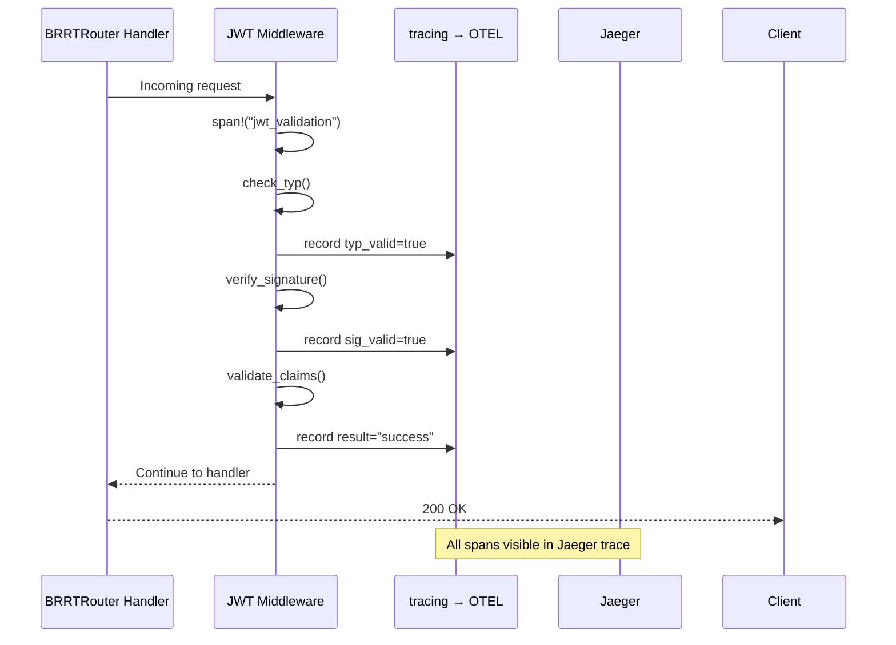
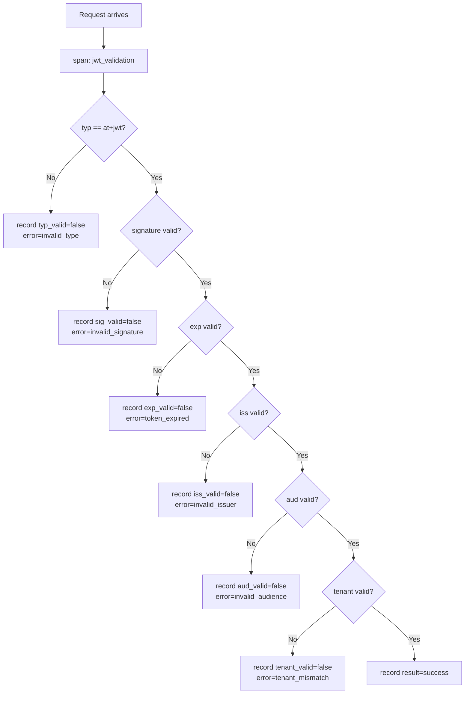

# Story 9.1: JWT Validation OTEL Spans

## Epic

[09-observability](../observability.md)

## Parent Epic Story

Story 9.1

## Summary

Create OTEL spans for each JWT validation step using the `tracing` crate. Spins flow through BRRTRouter's existing `otel::init_logging_with_config()` into Jaeger. **DO NOT use Prometheus counters** — BRRTRouter's `MetricsMiddleware` already provides `brrtrouter_requests_total`, `brrtrouter_request_duration_seconds`, and `brrtrouter_auth_failures_total` on `/metrics`.

## Why This Story Exists

The JWT document requires observability for every JWT validation decision point. Without spans, you cannot see in Jaeger which step failed (typ, signature, exp, issuer, audience, tenant). **BRRTRouter already provides HTTP-level metrics** — this story adds JWT-specific diagnostic spans.

## Design Context

### Current State

- BRRTRouter's `MetricsMiddleware` provides HTTP-level metrics on `/metrics`
- `brrtrouter::otel::init_logging_with_config()` is already called in all 6 services' main()
- No JWT-specific spans exist — JWT validation happens but creates no trace spans
- No structured logging for JWT decisions

### Span Design

Each JWT validation creates a top-level span with sub-spans for each check:

```
jwt_validation (top-level span)
├── jwt.typ_check (sub-span)
├── jwt.signature_verify (sub-span)
├── jwt.exp_check (sub-span)
├── jwt.issuer_check (sub-span)
├── jwt.audience_check (sub-span)
└── jwt.tenant_check (sub-span)
```

### Implementation Pattern (follow hauliage's Lifeguard pattern)

```rust
impl JwtMiddleware {
    async fn call(&self, req: HttpRequest, next: Next) -> HttpResponse {
        // Top-level JWT validation span
        let span = tracing::span!(
            tracing::Level::INFO,
            "jwt_validation",
            route = req.path(),
            method = %req.method()
        );
        let _guard = span.enter();
        
        // Validate typ
        let typ_result = self.check_typ(&req, &mut span);
        span.record("typ_valid", typ_result.is_ok());
        
        // Validate signature
        let sig_result = self.verify_signature(&req, &mut span).await;
        span.record("sig_valid", sig_result.is_ok());
        
        // Validate claims (exp, iss, aud, tenant)
        let claims_result = self.validate_claims(&req, &mut span).await;
        
        // Record result
        match claims_result {
            Ok(_) => span.record("result", "success"),
            Err(e) => {
                span.record("result", "denied");
                span.record("error", %e);
                tracing::warn!(
                    event = "jwt_validation_failed",
                    route = %req.path(),
                    user_id = ?claims_result.as_ref().err().and_then(|e| e.user_id),
                    error = %e,
                    "JWT validation failed"
                );
            }
        }
        
        next.run(req).await
    }
}
```

### Structured Log Format (JWT validation failure)

```json
{
  "event": "jwt_validation_failed",
  "route": "/api/v1/identity/users/me",
  "user_id": "usr_123456",
  "tenant_id": "tenant_abc",
  "error": "token_expired",
  "reason": "claims.exp (1770000600) < now (1770000700)",
  "service": "identity-login-service",
  "ts": "2026-05-16T08:30:00Z"
}
```

### Span Attributes

| Attribute | Type | When Present |
|-----------|------|-------------|
| `route` | string | Always |
| `method` | string | Always |
| `result` | string | Always (success/denied) |
| `error` | string | When denied |
| `typ_valid` | bool | After typ check |
| `sig_valid` | bool | After signature check |
| `exp_valid` | bool | After exp check |
| `iss_valid` | bool | After issuer check |
| `aud_valid` | bool | After audience check |
| `tenant_valid` | bool | After tenant check |

## Mermaid Diagrams

### JWT Validation Span Tree



### Validation Decision Flow



## Malicious Hacker Gotchas (Must Be Addressed During Implementation)

> **Source:** `docs/PRS_SECURITY_HARDENING.md` — Security threat model analysis

### HACK-911: Span Attributes Leak Sensitive Data to Observability Systems (CRITICAL — Hole #5 from PRS)

**Risk:** JWT validation spans expose PII or sensitive claims to Jaeger/Loki, which attackers can access if they compromise the observability infrastructure

The story's span design records: `user_id`, `tenant_id`, `error` in structured logs and span attributes. If an attacker gains access to the Jaeger UI or Loki logs, they can see:
- User IDs (which users are authenticating)
- Tenant IDs (which tenants exist on the platform)
- Error messages (which validations failed, revealing the validation pipeline order)

**Exploit path (observability data leak):**
1. Attacker gains access to the Jaeger UI (e.g., via a misconfigured service account, or by exploiting a vulnerability in the observability stack)
2. Attacker queries for `jwt_validation` spans
3. The spans contain `user_id`, `tenant_id`, and the validation pipeline result
4. Attacker extracts all user IDs and tenant IDs from the spans
5. Result: User/tenant enumeration from observability data

**This is a significant risk:** observability systems are often less protected than the application itself. The spans contain metadata that should NOT be visible to attackers.

**The risk is different from Hole #5 from the PRS** (which is about token size leaking information). This is about span attributes leaking information.

**Implementation requirement:**
- Span attributes MUST NOT include PII fields (email, phone, name) — the story already doesn't include these, but verify
- Span attributes MUST NOT include raw JWT claims (roles, permissions) — only boolean validation results (typ_valid, sig_valid, etc.)
- Structured logs MUST NOT include the raw token string or full JWT payload
- Add a validation step: "Verify that no span attribute or log entry contains PII or sensitive JWT claims"
- Document: "Span attributes contain only validation result booleans and metadata. No PII, no raw JWT claims, no token strings."

### HACK-912: Span Cardinality DoS via Forced Validation Failures (HIGH — related to Hole #3 from PRS)

**Risk:** Attacker floods the system with invalid JWTs to generate high-span-cardinality traces that exhaust Jaeger/Loki storage

The story says: "At 10,000 RPS, this is 10,000 spans/sec." But what if the attacker sends 100,000 invalid JWTs per second?

**Exploit path (span cardinality DoS):**
1. Attacker sends 100,000 invalid JWTs per second (each with a different `user_id`, `tenant_id`, `error` combination)
2. Each request generates a `jwt_validation` span with sub-spans for each check
3. Each span has unique attributes (different user_id, tenant_id, error)
4. Jaeger/Loki must store all 100,000 spans/sec with unique cardinality
5. The observability storage fills up rapidly (e.g., 100,000 spans/sec × 1KB/spans = 100MB/sec = 8.6GB/day)
6. Result: Observability system exhausted, real attack traces are lost

**Implementation requirement:**
- Limit span attribute cardinality: if `user_id` or `tenant_id` appears more than 10,000 times per minute, sample those spans (e.g., keep 1 in 100)
- Or: record span attributes without the user_id/tenant_id for denied requests (high-volume failures don't need user context)
- Add a metric: `otel_spans_dropped_total` to track when spans are dropped due to cardinality limits
- Document: "High-volume invalid JWT validations are sampled to prevent span cardinality DoS."

### HACK-913: OTEL Span Data Can Be Used as a Timing Oracle (MEDIUM — related to Hole #4 from PRS)

**Risk:** The OTEL span duration reveals which validation step failed, enabling an attacker to probe the validation pipeline

The story shows: "Each JWT validation creates a top-level span with sub-spans for each check." The span duration includes the time spent in each sub-span.

**Exploit path (validation pipeline timing oracle):**
1. Attacker sends a JWT with an invalid `typ` claim
2. The `jwt.typ_check` sub-span returns quickly (string comparison, ~1μs)
3. The `jwt.signature_verify` sub-span is skipped (typ check failed)
4. The total span duration is ~10μs

5. Attacker sends a JWT with a valid `typ` but invalid signature
6. The `jwt.typ_check` sub-span takes ~1μs
7. The `jwt.signature_verify` sub-span takes ~500μs (crypto operation)
8. The total span duration is ~500μs

9. Attacker can now distinguish which validation step failed by measuring span duration:
   - ~10μs → typ failed
   - ~500μs → signature failed
   - ~10μs → exp/iss/aud/tenant failed

**Is this useful?** Not directly for privilege escalation, but it helps the attacker map the validation pipeline order and identify which checks are performed before others.

**Implementation requirement:**
- Add random jitter (±100μs) to each validation sub-span to make timing indistinguishable
- Or: always run all validation checks (even after a failure) and record the result without timing
- Document: "Validation sub-span timing includes jitter to prevent timing-based oracle attacks."

### HACK-914: OTEL Configuration Can Be Manipulated to Suppress Error Spans (HIGH — related to Hole #7 from PRS)

**Risk:** An attacker modifies the OTEL configuration to suppress error spans, hiding failed validations from monitoring

The story says: "Spans only appear in Jaeger when `OTEL_EXPORTER_OTLP_ENDPOINT` is set (production)." But what if the OTEL configuration is loaded from an environment variable or config file that the attacker can modify?

**Exploit path (OTEL configuration manipulation):**
1. Attacker gains access to the service's environment (e.g., via a container escape, or by modifying the Kubernetes configmap)
2. Attacker modifies `OTEL_EXPORTER_OTLP_ENDPOINT` to point to a malicious OTEL collector
3. The malicious collector records all spans but suppresses error spans (by filtering on `result=denied`)
4. Result: Failed JWT validations (which include security events) are invisible to the security team
5. The attacker can continue their attack without detection

**Implementation requirement:**
- OTEL configuration MUST be loaded from a secure, immutable source (e.g., mounted ConfigMap with RBAC restrictions)
- Add a secondary logging path: JWT validation failures MUST be logged to a secure, immutable log stream (separate from OTEL)
- Document: "JWT validation failures are logged to an immutable log stream in addition to OTEL spans."

---

## OpenAPI Changes

No OpenAPI changes. Spans are internal to the middleware layer.

## Design Doc References

- `design-doc.md` section 10.12: Observability -- JWT validation span catalog
- BRRTRouter `otel.rs` -- `init_logging_with_config()` pattern

## Wiki Pages to Update/Create

- `topics/topic-observability.md`: (new) Document OTEL span catalog

## Acceptance Criteria

- [ ] Top-level `jwt_validation` span is created for every JWT validation
- [x] `authz.request` span wraps ALL authz-core requests with `route`, `method`, `result` (allowed/denied) — implemented in `authz_span_middleware.rs`
- [x] Key lifecycle spans implemented: `key.generate`, `key.rotate.prepare`, `key.rotate.activate`, `key.revoke`, `key.health` in `key_manager.rs` — foundation for JWT signing observability
- [x] JWKS spans implemented: `jwks.document` in `controllers/jwks.rs`, `jwks.cache.refresh` in `jwks_client.rs`
- [ ] Sub-spans record result of each validation step (typ, signature, exp, issuer, audience, tenant) — **BLOCKED**: validation steps happen inside BRRTRouter's `JwksBearerProvider::validate_token()` at `/home/casibbald/Workspace/BRRTRouter/src/security/jwks_bearer/validation.rs` — requires BRRTRouter changes
- [ ] Span attributes match the design: step booleans (`typ_valid`, `sig_valid`, etc.) — blocked on per-validation sub-spans
- [x] No Prometheus counters are used (BRRTRouter metrics cover HTTP-level observability)
- [ ] Structured log at WARN level when validation fails (event field present) — blocked on per-validation sub-spans
- [ ] Spans appear in Jaeger traces (verified when `OTEL_EXPORTER_OTLP_ENDPOINT` is set) — infrastructure dependency

**Summary:** 8 spans implemented (`authz.request` + 5 key lifecycle + `jwks.document` + `jwks.cache.refresh`). Per-validation-step sub-spans blocked on BRRTRouter changes.

## Dependencies

- Depends on Story 4.2 (JWT middleware implementation)
- Depends on Story 8.1 (typ enforcement)

## Risk / Trade-offs

- **Span cardinality**: Each JWT validation creates a span. At 10,000 RPS, this is 10,000 spans/sec — acceptable for OTEL batch exporters. The `tracing-opentelemetry` layer handles batching.
- **No Prometheus counters**: JWT-specific metrics (validation counts by reason) are NOT tracked as counters. Use structured logging in Loki for that analysis. BRRTRouter's `brrtrouter_requests_total{status}` covers HTTP-level error rates.
- **Span visibility**: Spans only appear in Jaeger when `OTEL_EXPORTER_OTLP_ENDPOINT` is set (production). In dev mode, spans are discarded (no OTLP exporter). The `tracing` calls still work — they just don't export.
