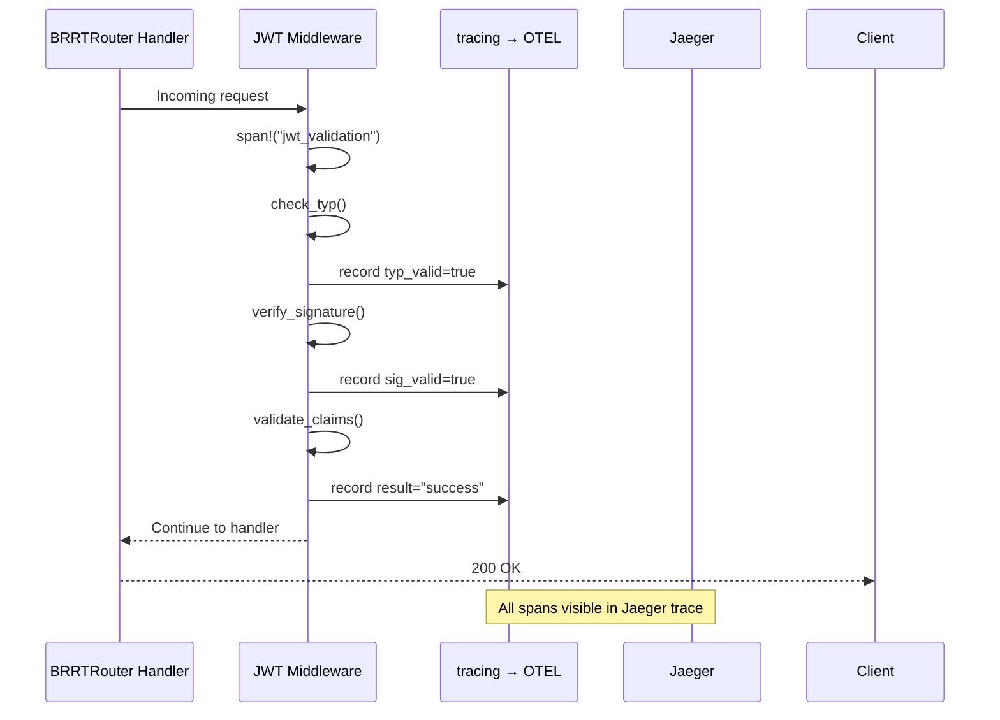
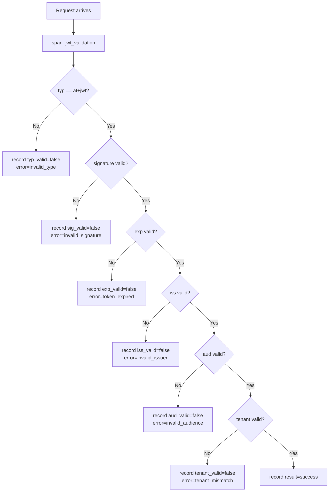

# Story 9.1: JWT Validation OTEL Spans

## Epic

[09-observability](../observability.md)

## Parent Epic Story

Story 9.1

## Summary

Create OTEL spans for each JWT validation step using the `tracing` crate. Spins flow through BRRTRouter's existing `otel::init_logging_with_config()` into Jaeger. **DO NOT use Prometheus counters** — BRRTRouter's `MetricsMiddleware` already provides `brrtrouter_requests_total`, `brrtrouter_request_duration_seconds`, and `brrtrouter_auth_failures_total` on `/metrics`.

## Why This Story Exists

The JWT document requires observability for every JWT validation decision point. Without spans, you cannot see in Jaeger which step failed (typ, signature, exp, issuer, audience, tenant). **BRRTRouter already provides HTTP-level metrics** — this story adds JWT-specific diagnostic spans.

## Design Context

### Current State

- BRRTRouter's `MetricsMiddleware` provides HTTP-level metrics on `/metrics`
- `brrtrouter::otel::init_logging_with_config()` is already called in all 6 services' main()
- No JWT-specific spans exist — JWT validation happens but creates no trace spans
- No structured logging for JWT decisions

### Span Design

Each JWT validation creates a top-level span with sub-spans for each check:

```
jwt_validation (top-level span)
├── jwt.typ_check (sub-span)
├── jwt.signature_verify (sub-span)
├── jwt.exp_check (sub-span)
├── jwt.issuer_check (sub-span)
├── jwt.audience_check (sub-span)
└── jwt.tenant_check (sub-span)
```

### Implementation Pattern (follow hauliage's Lifeguard pattern)

```rust
impl JwtMiddleware {
    async fn call(&self, req: HttpRequest, next: Next) -> HttpResponse {
        // Top-level JWT validation span
        let span = tracing::span!(
            tracing::Level::INFO,
            "jwt_validation",
            route = req.path(),
            method = %req.method()
        );
        let _guard = span.enter();
        
        // Validate typ
        let typ_result = self.check_typ(&req, &mut span);
        span.record("typ_valid", typ_result.is_ok());
        
        // Validate signature
        let sig_result = self.verify_signature(&req, &mut span).await;
        span.record("sig_valid", sig_result.is_ok());
        
        // Validate claims (exp, iss, aud, tenant)
        let claims_result = self.validate_claims(&req, &mut span).await;
        
        // Record result
        match claims_result {
            Ok(_) => span.record("result", "success"),
            Err(e) => {
                span.record("result", "denied");
                span.record("error", %e);
                tracing::warn!(
                    event = "jwt_validation_failed",
                    route = %req.path(),
                    user_id = ?claims_result.as_ref().err().and_then(|e| e.user_id),
                    error = %e,
                    "JWT validation failed"
                );
            }
        }
        
        next.run(req).await
    }
}
```

### Structured Log Format (JWT validation failure)

```json
{
  "event": "jwt_validation_failed",
  "route": "/api/v1/identity/users/me",
  "user_id": "usr_123456",
  "tenant_id": "tenant_abc",
  "error": "token_expired",
  "reason": "claims.exp (1770000600) < now (1770000700)",
  "service": "identity-login-service",
  "ts": "2026-05-16T08:30:00Z"
}
```

### Span Attributes

| Attribute | Type | When Present |
|-----------|------|-------------|
| `route` | string | Always |
| `method` | string | Always |
| `result` | string | Always (success/denied) |
| `error` | string | When denied |
| `typ_valid` | bool | After typ check |
| `sig_valid` | bool | After signature check |
| `exp_valid` | bool | After exp check |
| `iss_valid` | bool | After issuer check |
| `aud_valid` | bool | After audience check |
| `tenant_valid` | bool | After tenant check |

## Mermaid Diagrams

### JWT Validation Span Tree



### Validation Decision Flow



## OpenAPI Changes

No OpenAPI changes. Spans are internal to the middleware layer.

## Design Doc References

- `design-doc.md` section 10.12: Observability -- JWT validation span catalog
- BRRTRouter `otel.rs` -- `init_logging_with_config()` pattern

## Wiki Pages to Update/Create

- `topics/topic-observability.md`: (new) Document OTEL span catalog

## Acceptance Criteria

- [ ] Top-level `jwt_validation` span is created for every JWT validation
- [ ] Sub-spans record result of each validation step (typ, signature, exp, issuer, audience, tenant)
- [ ] Span attributes match the design: `route`, `method`, `result`, `error`, step booleans
- [ ] Structured log at WARN level when validation fails (event field present)
- [ ] Spans appear in Jaeger traces (verified when `OTEL_EXPORTER_OTLP_ENDPOINT` is set)
- [ ] No Prometheus counters are used (BRRTRouter metrics cover HTTP-level observability)

## Dependencies

- Depends on Story 4.2 (JWT middleware implementation)
- Depends on Story 8.1 (typ enforcement)

## Risk / Trade-offs

- **Span cardinality**: Each JWT validation creates a span. At 10,000 RPS, this is 10,000 spans/sec — acceptable for OTEL batch exporters. The `tracing-opentelemetry` layer handles batching.
- **No Prometheus counters**: JWT-specific metrics (validation counts by reason) are NOT tracked as counters. Use structured logging in Loki for that analysis. BRRTRouter's `brrtrouter_requests_total{status}` covers HTTP-level error rates.
- **Span visibility**: Spans only appear in Jaeger when `OTEL_EXPORTER_OTLP_ENDPOINT` is set (production). In dev mode, spans are discarded (no OTLP exporter). The `tracing` calls still work — they just don't export.
