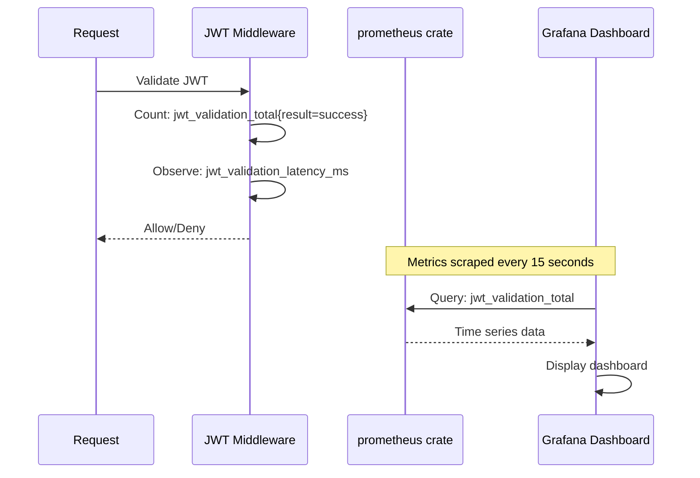
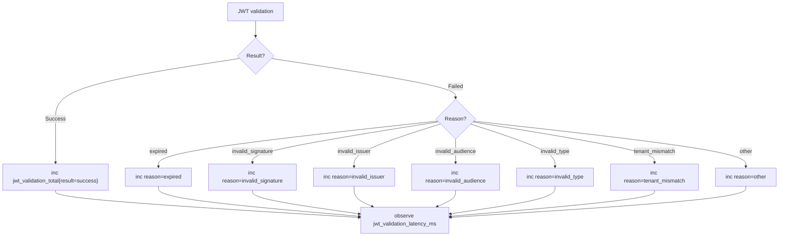

# Story 9.1: Implement JWT Validation Metrics

## Epic

[09-observability](../observability.md)

## Parent Epic Story

Story 9.1

## Summary

Implement Prometheus-compatible metrics for JWT validation: `jwt_validation_total{result, reason}` counting successes/failures by reason (expiry, signature, issuer, audience, type), and `jwt_validation_latency_ms` tracking p50/p95/p99 latency for common-path JWT validation across all 6 services.

## Why This Story Exists

The JWT document requires explicit metrics for every JWT validation decision point: "jwt_validation_total{result, reason} -- counts of success/failure by reason (expiry, signature, issuer, audience, type)." Without these metrics, you cannot measure how many validations pass/fail or identify which validation step is the bottleneck.

## Design Context

### Metric Definitions

| Metric | Type | Labels | Purpose |
|--------|------|--------|---------|
| `jwt_validation_total` | Counter | result: "success", "denied" reason: "expired", "invalid_signature", "invalid_issuer", "invalid_audience", "invalid_type", "tenant_mismatch" | Count validation decisions |
| `jwt_validation_latency_ms` | Histogram | route (path pattern) | Track validation speed |

### Implementation with Prometheus Rust Crate

```rust
use prometheus::{register_counter_vec, register_histogram, CounterVec, Histogram};

static JWT_VALIDATION_TOTAL: CounterVec = register_counter_vec!(
    "jwt_validation_total",
    "Total JWT validations by result and reason",
    &["result", "reason"]
).unwrap();

static JWT_VALIDATION_LATENCY: Histogram = register_histogram!(
    "jwt_validation_latency_ms",
    "JWT validation latency in milliseconds",
    vec![1.0, 2.0, 5.0, 10.0, 25.0, 50.0, 100.0, 250.0, 500.0]
).unwrap();

// In the JWT middleware:
use std::time::Instant;

let start = Instant::now();
let result = validate_jwt(token);
let latency = start.elapsed().as_millis();

JWT_VALIDATION_LATENCY.observe(latency as f64);

match &result {
    Ok(_) => JWT_VALIDATION_TOTAL.with(&[("result", "success")]).inc(),
    Err(AuthError::TokenExpired) => JWT_VALIDATION_TOTAL
        .with(&[("result", "denied"), ("reason", "expired")]).inc(),
    Err(AuthError::InvalidSignature) => JWT_VALIDATION_TOTAL
        .with(&[("result", "denied"), ("reason", "invalid_signature")]).inc(),
    Err(AuthError::InvalidIssuer) => JWT_VALIDATION_TOTAL
        .with(&[("result", "denied"), ("reason", "invalid_issuer")]).inc(),
    Err(AuthError::InvalidAudience) => JWT_VALIDATION_TOTAL
        .with(&[("result", "denied"), ("reason", "invalid_audience")]).inc(),
    Err(AuthError::InvalidTokenType) => JWT_VALIDATION_TOTAL
        .with(&[("result", "denied"), ("reason", "invalid_type")]).inc(),
    Err(AuthError::TenantMismatch) => JWT_VALIDATION_TOTAL
        .with(&[("result", "denied"), ("reason", "tenant_mismatch")]).inc(),
    Err(_) => JWT_VALIDATION_TOTAL
        .with(&[("result", "denied"), ("reason", "other")]).inc(),
}
```

### Validation Failure Breakdown

| Reason | What It Means | Alert Level |
|--------|--------------|-------------|
| `expired` | Token TTL exceeded (5 min) | INFO (normal, expected) |
| `invalid_signature` | Wrong key or tampered token | ERROR (attack indicator) |
| `invalid_issuer` | Wrong `iss` claim | ERROR (misconfigured service) |
| `invalid_audience` | Wrong `aud` claim | ERROR (misconfigured service) |
| `invalid_type` | Wrong `typ` claim | ERROR (type confusion) |
| `tenant_mismatch` | claims.tenant_id != request X-Tenant-ID | ERROR (data breach indicator) |

## Mermaid Diagrams

### Metric Collection Flow



### Validation Decision Tree with Metrics



### Latency Distribution

```mermaid
gantt
    title JWT Validation Latency Distribution (target)
    dateFormat X
    axisFormat %dms
    section p50
    p50 latency        :0, 5
    section p95
    p95 latency        :0, 25
    section p99
    p99 latency        :0, 50
```



## OpenAPI Changes

No OpenAPI changes. Metrics are internal to the service.

## Design Doc References

- `design-doc.md` section 10.12: Observability -- jwt_validation_total and jwt_validation_latency_ms metrics

## Wiki Pages to Update/Create

- `topics/topic-observability.md`: (new) Document metrics catalog
- `topics/topic-jwt-schema.md`: Note metrics tracking per validation step

## Acceptance Criteria

- [ ] `jwt_validation_total{result, reason}` counter is implemented across all 6 services
- [ ] All validation failure reasons are tracked: expired, invalid_signature, invalid_issuer, invalid_audience, invalid_type, tenant_mismatch
- [ ] `jwt_validation_latency_ms` histogram with buckets: 1, 2, 5, 10, 25, 50, 100, 250, 500ms
- [ ] p50 < 5ms, p95 < 25ms, p99 < 50ms (target SLAs)
- [ ] Metrics exposed at `/metrics` endpoint (Prometheus format)
- [ ] Unit tests verify: counter increments on validation outcomes, latency observation

## Dependencies

- Depends on Story 1.3 (JWKS validation -- where JWT validation happens)
- Can be implemented in parallel with other epics (metrics infrastructure is independent)

## Risk / Trade-offs

- **Counter cardinality explosion**: `jwt_validation_total{result, reason}` has low cardinality (2 results × 6-7 reasons = ~12-14 series). This is safe. Adding `route` as a label would create ~133 routes × ~14 reasons = ~1,800 series -- this is borderline acceptable but should be added only if needed.
- **Histogram cardinality**: `jwt_validation_latency_ms` with `route` label creates ~133 time series -- this is acceptable. Without the route label, you lose per-route insight (e.g., "which route is slowest?"). The route label is recommended.
- **Metrics endpoint exposure**: The `/metrics` endpoint must be protected — it should only be accessible from the monitoring stack (e.g., Prometheus pods in the same namespace). Exposing it publicly leaks internal service information.

## Tests

### Unit Tests

- [ ] **jwt_validation_total counter incremented on success**: Given a JWT with valid signature, exp, iss, aud, typ passes validation, assert `jwt_validation_total{result="success", reason=""}` is incremented by 1
- [ ] **jwt_validation_total counter incremented on expired token**: Given a JWT with `exp` in the past, assert `jwt_validation_total{result="denied", reason="expired"}` is incremented by 1
- [ ] **jwt_validation_total counter incremented on invalid signature**: Given a JWT with a tampered signature, assert `jwt_validation_total{result="denied", reason="invalid_signature"}` is incremented by 1
- [ ] **jwt_validation_total counter incremented on invalid issuer**: Given a JWT with `iss` that does not match the expected issuer, assert `jwt_validation_total{result="denied", reason="invalid_issuer"}` is incremented by 1
- [ ] **jwt_validation_total counter incremented on invalid audience**: Given a JWT with `aud` that does not match the expected audience, assert `jwt_validation_total{result="denied", reason="invalid_audience"}` is incremented by 1
- [ ] **jwt_validation_total counter incremented on invalid type**: Given a JWT with `typ` not equal to `"at+jwt"`, assert `jwt_validation_total{result="denied", reason="invalid_type"}` is incremented by 1
- [ ] **jwt_validation_total counter incremented on tenant mismatch**: Given a JWT where `claims.tenant_id` does not match the `X-Tenant-ID` header, assert `jwt_validation_total{result="denied", reason="tenant_mismatch"}` is incremented by 1
- [ ] **jwt_validation_total counter incremented on unknown error**: Given a JWT validation fails with an error not covered by the specific reasons, assert `jwt_validation_total{result="denied", reason="other"}` is incremented by 1
- [ ] **jwt_validation_latency_ms histogram records latency**: Given a JWT validation takes 3.5ms, assert `jwt_validation_latency_ms` observes 3.5 — the value falls into the appropriate histogram bucket
- [ ] **jwt_validation_latency_ms histogram bucket configuration**: Assert the histogram has buckets `[1.0, 2.0, 5.0, 10.0, 25.0, 50.0, 100.0, 250.0, 500.0]` — matching the design spec
- [ ] **Counter is thread-safe (concurrent increments)**: Given 1000 concurrent JWT validations, assert the total counter value equals the number of validations — no lost increments due to race conditions
- [ ] **Histogram bucket counts are accurate**: Given 100 validations at 3ms, 50 validations at 30ms, and 10 validations at 200ms, assert the histogram bucket counts are correct (bucket 5ms has 100+ cumulative, bucket 50ms has 150+ cumulative, etc.)
- [ ] **Metrics are reset when registry is recreated**: Given `prometheus::Registry::new()` is called, assert all counters and histograms are reset to zero — old values do not persist

### Integration Tests (BDD-style with `rstest_bdd`)

- [ ] **Scenario: Successful validation emits correct metric**: `given` a request with a valid JWT arrives at the JWT middleware → `when` the middleware completes validation → `then` `jwt_validation_total{result="success"}` is incremented and `jwt_validation_latency_ms` reflects the actual validation time
- [ ] **Scenario: Expired token emits correct metric and reason**: `given` a request with an expired JWT (exp 1 minute ago) arrives → `when` the middleware validates it → `then` `jwt_validation_total{result="denied", reason="expired"}` is incremented and the response is 401
- [ ] **Scenario: All 6 services emit jwt_validation_total**: `given` a valid JWT is sent to each of the 6 services → `when` each validates the token → `then` each service increments its own `jwt_validation_total{result="success"}` counter (6 total increments across all services)
- [ ] **Scenario: Latency histogram reflects p50/p95/p99 under load**: `given` 1000 JWT validations arrive over 10 seconds → `when` the metrics are scraped → `then` p50 < 5ms, p95 < 25ms, p99 < 50ms (target SLAs are met)
- [ ] **Scenario: Metrics endpoint returns Prometheus format**: `given` a GET request to `/metrics` → `when` the response is parsed → `then` the response is valid Prometheus text format (can be parsed by `prometheus::TextEncoder`) and contains `jwt_validation_total` and `jwt_validation_latency_ms`
- [ ] **Scenario: Metrics are service-specific**: `given` identity-login-service and authz-core both emit metrics → `when` `/metrics` is scraped from each service → `then` each service returns its own counters (not mixed)

### Security Regression Tests

- [ ] **Metrics endpoint not publicly accessible**: Assert that `/metrics` returns 403 Forbidden to unauthenticated requests — only the monitoring stack (Prometheus pods) can scrape it
- [ ] **Metrics do not leak PII**: Assert that metric labels never contain PII fields (email, phone, name) — only structurally safe labels like `result`, `reason`, `route`
- [ ] **Metrics do not leak raw JWT tokens**: Assert that the `/metrics` response does not contain any raw JWT token strings or partial tokens
- [ ] **Counter cannot be manipulated by client input**: Assert that metric labels (`result`, `reason`) are set by server-side validation logic and cannot be influenced by client-provided values — a malformed JWT changes `reason` to a predefined enum value, not an arbitrary string
- [ ] **Metrics endpoint does not cause denial of service**: Assert that hitting `/metrics` 1000 times in 1 second does not significantly impact request handling — the metrics endpoint should be lightweight (in-memory counter read, no disk I/O)

### Edge Cases

- [ ] **Metric counter with zero validations**: Given no JWT validations have occurred, assert `jwt_validation_total` returns 0 for all label combinations (no missing label values)
- [ ] **Histogram with single observation**: Given exactly 1 JWT validation at 2ms, assert the histogram reports p50 = p95 = p99 = 2ms (all percentiles are the same with one data point)
- [ ] **Metric name collision across services**: Assert that each service uses the same metric names (`jwt_validation_total`, `jwt_validation_latency_ms`) — Prometheus service discovery differentiates by pod namespace, not by metric name
- [ ] **Metric recording during service startup**: Given JWT validation begins before the `/metrics` endpoint handler is fully registered, assert the counters still record correctly — the global `prometheus` registry is set up at module load time, before the HTTP server starts
- [ ] **Histogram overflow (latency > 500ms)**: Given a JWT validation takes 1000ms (exceeds max bucket), assert it is recorded in the `+Inf` bucket and the histogram still reports accurate counts
- [ ] **Counter overflow (u64 max)**: Given `jwt_validation_total` reaches `u64::MAX` (18,446,744,073,709,551,615 validations), assert the counter saturates or wraps gracefully — this is practically impossible at 10,000 RPS (would take ~58 million years)
- [ ] **Metrics with route label containing special characters**: Given a route path `/api/v1/auth/callback/github` contains special characters, assert the label value is properly escaped in the Prometheus text format output

### Cleanup

- [ ] Metrics registry must be reset between test scenarios using `prometheus::Registry::new()` to prevent cross-test metric contamination
- [ ] No persistent state is left by counter/histogram operations — all metrics are in-memory (RwLock-backed) so no filesystem cleanup is needed
- [ ] If tests use a real `/metrics` endpoint, ensure the HTTP server is stopped and restarted between tests to prevent stale metric state
- [ ] Metrics endpoint must not be accessible externally during tests — use a test-specific port or disable the endpoint when not needed
