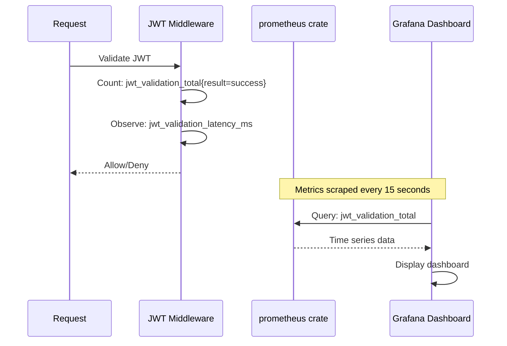

# Story 9.1: Implement JWT Validation Metrics

## Epic

[09-observability](../observability.md)

## Parent Epic Story

Story 9.1

## Summary

Implement Prometheus-compatible metrics for JWT validation: `jwt_validation_total{result, reason}` counting successes/failures by reason (expiry, signature, issuer, audience, type), and `jwt_validation_latency_ms` tracking p50/p95/p99 latency for common-path JWT validation across all 6 services.

## Why This Story Exists

The JWT document requires explicit metrics for every JWT validation decision point: "jwt_validation_total{result, reason} -- counts of success/failure by reason (expiry, signature, issuer, audience, type)." Without these metrics, you cannot measure how many validations pass/fail or identify which validation step is the bottleneck.

## Design Context

### Metric Definitions

| Metric | Type | Labels | Purpose |
|--------|------|--------|---------|
| `jwt_validation_total` | Counter | result: "success", "denied" reason: "expired", "invalid_signature", "invalid_issuer", "invalid_audience", "invalid_type", "tenant_mismatch" | Count validation decisions |
| `jwt_validation_latency_ms` | Histogram | route (path pattern) | Track validation speed |

### Implementation with Prometheus Rust Crate

```rust
use prometheus::{register_counter_vec, register_histogram, CounterVec, Histogram};

static JWT_VALIDATION_TOTAL: CounterVec = register_counter_vec!(
    "jwt_validation_total",
    "Total JWT validations by result and reason",
    &["result", "reason"]
).unwrap();

static JWT_VALIDATION_LATENCY: Histogram = register_histogram!(
    "jwt_validation_latency_ms",
    "JWT validation latency in milliseconds",
    vec![1.0, 2.0, 5.0, 10.0, 25.0, 50.0, 100.0, 250.0, 500.0]
).unwrap();

// In the JWT middleware:
use std::time::Instant;

let start = Instant::now();
let result = validate_jwt(token);
let latency = start.elapsed().as_millis();

JWT_VALIDATION_LATENCY.observe(latency as f64);

match &result {
    Ok(_) => JWT_VALIDATION_TOTAL.with(&[("result", "success")]).inc(),
    Err(AuthError::TokenExpired) => JWT_VALIDATION_TOTAL
        .with(&[("result", "denied"), ("reason", "expired")]).inc(),
    Err(AuthError::InvalidSignature) => JWT_VALIDATION_TOTAL
        .with(&[("result", "denied"), ("reason", "invalid_signature")]).inc(),
    Err(AuthError::InvalidIssuer) => JWT_VALIDATION_TOTAL
        .with(&[("result", "denied"), ("reason", "invalid_issuer")]).inc(),
    Err(AuthError::InvalidAudience) => JWT_VALIDATION_TOTAL
        .with(&[("result", "denied"), ("reason", "invalid_audience")]).inc(),
    Err(AuthError::InvalidTokenType) => JWT_VALIDATION_TOTAL
        .with(&[("result", "denied"), ("reason", "invalid_type")]).inc(),
    Err(AuthError::TenantMismatch) => JWT_VALIDATION_TOTAL
        .with(&[("result", "denied"), ("reason", "tenant_mismatch")]).inc(),
    Err(_) => JWT_VALIDATION_TOTAL
        .with(&[("result", "denied"), ("reason", "other")]).inc(),
}
```

### Validation Failure Breakdown

| Reason | What It Means | Alert Level |
|--------|--------------|-------------|
| `expired` | Token TTL exceeded (5 min) | INFO (normal, expected) |
| `invalid_signature` | Wrong key or tampered token | ERROR (attack indicator) |
| `invalid_issuer` | Wrong `iss` claim | ERROR (misconfigured service) |
| `invalid_audience` | Wrong `aud` claim | ERROR (misconfigured service) |
| `invalid_type` | Wrong `typ` claim | ERROR (type confusion) |
| `tenant_mismatch` | claims.tenant_id != request X-Tenant-ID | ERROR (data breach indicator) |

## Mermaid Diagrams

### Metric Collection Flow



### Validation Decision Tree with Metrics

```mermaid
flowchart TD
    A[JWT validation] --> B{Result?}
    B -->|Success| C[inc jwt_validation_total{result=success}]
    B -->|Failed| D{Reason?}
    D -->|expired| E[inc reason=expired]
    D -->|invalid_signature| F[inc reason=invalid_signature]
    D -->|invalid_issuer| G[inc reason=invalid_issuer]
    D -->|invalid_audience| H[inc reason=invalid_audience]
    D -->|invalid_type| I[inc reason=invalid_type]
    D -->|tenant_mismatch| J[inc reason=tenant_mismatch]
    D -->|other| K[inc reason=other]
    
    C --> L[observe jwt_validation_latency_ms]
    E --> L
    F --> L
    G --> L
    H --> L
    I --> L
    J --> L
    K --> L
```

### Latency Distribution

```mermaid
gantt
    title JWT Validation Latency Distribution (target)
    dateFormat X
    axisFormat %dms
    section p50
    p50 latency        :0, 5
    section p95
    p95 latency        :0, 25
    section p99
    p99 latency        :0, 50
```



## OpenAPI Changes

No OpenAPI changes. Metrics are internal to the service.

## Design Doc References

- `design-doc.md` section 10.12: Observability -- jwt_validation_total and jwt_validation_latency_ms metrics

## Wiki Pages to Update/Create

- `topics/topic-observability.md`: (new) Document metrics catalog
- `topics/topic-jwt-schema.md`: Note metrics tracking per validation step

## Acceptance Criteria

- [ ] `jwt_validation_total{result, reason}` counter is implemented across all 6 services
- [ ] All validation failure reasons are tracked: expired, invalid_signature, invalid_issuer, invalid_audience, invalid_type, tenant_mismatch
- [ ] `jwt_validation_latency_ms` histogram with buckets: 1, 2, 5, 10, 25, 50, 100, 250, 500ms
- [ ] p50 < 5ms, p95 < 25ms, p99 < 50ms (target SLAs)
- [ ] Metrics exposed at `/metrics` endpoint (Prometheus format)
- [ ] Unit tests verify: counter increments on validation outcomes, latency observation

## Dependencies

- Depends on Story 1.3 (JWKS validation -- where JWT validation happens)
- Can be implemented in parallel with other epics (metrics infrastructure is independent)

## Risk / Trade-offs

- **Counter cardinality explosion**: `jwt_validation_total{result, reason}` has low cardinality (2 results × 6-7 reasons = ~12-14 series). This is safe. Adding `route` as a label would create ~133 routes × ~14 reasons = ~1,800 series -- this is borderline acceptable but should be added only if needed.
- **Histogram cardinality**: `jwt_validation_latency_ms` with `route` label creates ~133 time series -- this is acceptable. Without the route label, you lose per-route insight (e.g., "which route is slowest?"). The route label is recommended.
