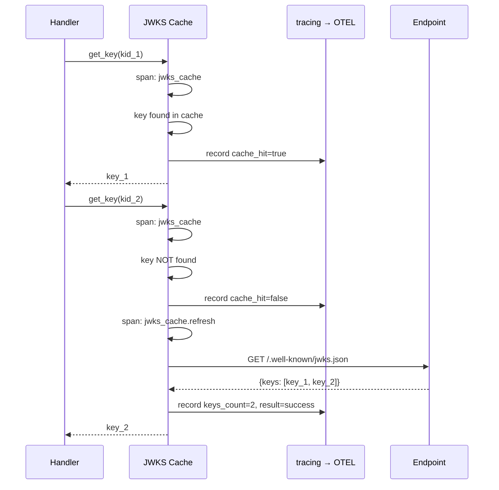
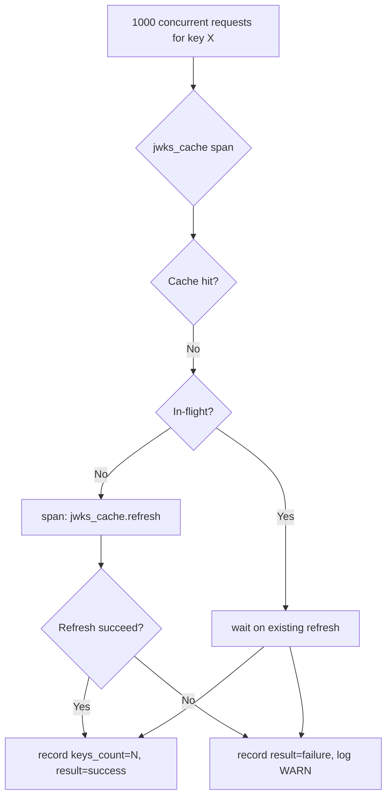

# Story 9.2: JWKS Cache Observability Spans

## Epic

[09-observability](../observability.md)

## Parent Epic Story

Story 9.2

## Summary

Create OTEL spans for JWKS cache operations using the `tracing` crate. Spans flow through BRRTRouter's existing `otel::init_logging_with_config()` into Jaeger. **DO NOT use Prometheus counters** — BRRTRouter's `brrtrouter_request_duration_seconds` histogram can detect slow JWKS fetches, and structured logs capture failures.

## Why This Story Exists

The JWT document requires observability for JWKS cache operations. Without spans, you cannot see in Jaeger how often the cache is hit vs. missed, how long refreshes take, and when refreshes fail. **BRRTRouter already provides HTTP-level metrics** — this story adds JWKS-specific diagnostic spans.

## Design Context

### Current State

- JWKS cache exists in Story 7.1 but creates no observable spans
- `jwks_refresh_failures` are logged as errors but not traced
- No visibility into cache hit/miss patterns in traces

### Span Design

```
jwt_validation (from Story 9.1)
└── jwks_cache (sub-span, created when key not found)
    ├── jwks_cache.hit (if key found)
    ├── jwks_cache.miss + jwks_cache.refresh (if key not found)
    │   └── jwks_cache.refresh_success or jwks_cache.refresh_failure
    └── jwks_cache.stale_accept (if cache stale but within tolerance)
```

### Implementation Pattern

```rust
impl JwksCache {
    pub async fn get_key(&self, kid: &str) -> Option<Jwk> {
        let span = tracing::span!(
            tracing::Level::DEBUG,
            "jwks_cache",
            kid = kid,
            route = ?"unknown" // passed from middleware
        );
        let _guard = span.enter();
        
        // Check cache
        if let Some(key) = self.keys.read().await.get(kid) {
            span.record("cache_hit", true);
            span.record("cache_age_seconds", ?self.cache_age());
            return Some(key.clone());
        }
        
        span.record("cache_hit", false);
        
        // Background refresh triggered
        if let Some(refresh_tx) = self.background_refresh_tx.as_ref() {
            let _ = refresh_tx.send(RefreshRequest { kid: kid.to_string() });
            span.record("refresh_triggered", true);
        }
        
        None
    }
    
    async fn refresh(&self) -> Result<(), JwksError> {
        let span = tracing::span!(
            tracing::Level::INFO,
            "jwks_cache.refresh",
            endpoint = self.endpoint
        );
        let _guard = span.enter();
        
        match self.fetch_jwks().await {
            Ok(keys) => {
                span.record("keys_count", keys.len());
                span.record("result", "success");
                Ok(())
            }
            Err(e) => {
                span.record("result", "failure");
                span.record("error", %e);
                tracing::warn!(
                    event = "jwks_refresh_failure",
                    endpoint = self.endpoint,
                    error = %e,
                    "JWKS refresh failed"
                );
                Err(e)
            }
        }
    }
}
```

### Span Attributes

| Span | Attributes |
|------|-----------|
| `jwks_cache` | `kid`, `cache_hit` (bool), `cache_age_seconds` |
| `jwks_cache.refresh` | `endpoint`, `keys_count`, `result` (success/failure), `error` |

### Structured Log Format (JWKS refresh failure)

```json
{
  "event": "jwks_refresh_failure",
  "endpoint": "https://idam.example.com/.well-known/jwks.json",
  "error": "connection refused",
  "service": "identity-login-service",
  "ts": "2026-05-16T08:30:00Z"
}
```

## Mermaid Diagrams

### JWKS Cache Span Tree



### Cache Miss Storm (with single-flight)



## Malicious Hacker Gotchas (Must Be Addressed During Implementation)

### HACK-921: JWKS Refresh Span Attributes Leak Key Metadata (CRITICAL — related to Hole #1 from PRS)

**Risk:** The `jwks_cache.refresh` span records `keys_count` which reveals the number of active keys, helping an attacker map the key rotation schedule

The story records: `span.record("keys_count", keys.len())` in the `jwks_cache.refresh` span. At each refresh, the attacker (if they can see the Jaeger traces) can count how many keys are in the JWKS.

**Exploit path:**
1. Attacker has access to Jaeger traces (e.g., via a compromised service account)
2. Attacker queries for `jwks_cache.refresh` spans
3. The `keys_count` attribute reveals: 2 keys (during rotation), 1 key (normal)
4. Result: Attacker knows the key rotation state without compromising any keys

**This is a low-risk information leak:** knowing the number of keys doesn't help with forgery. But combined with the JWKS endpoint (which reveals which `kid` values are published), the attacker can correlate rotation state with key identity.

**Implementation requirement:**
- Remove `keys_count` from the `jwks_cache.refresh` span attributes, OR
- Hash the key count (record `keys_count_bucket` instead of exact count: "1-2", "3-5", "6+")
- Document: "JWKS refresh span attributes do not include exact key counts."

### HACK-922: JWKS Refresh Failure Span Can Leak Endpoint URLs (MEDIUM — related to Hole #5 from PRS)

**Risk:** The `jwks_cache.refresh` span records the JWKS endpoint URL as an attribute, which is visible in Jaeger

The story records: `span = tracing::span!("jwks_cache.refresh", endpoint = self.endpoint)`. The endpoint URL is a sensitive operational detail.

**Exploit path:**
1. Attacker gains access to Jaeger traces
2. The `jwks_cache.refresh` span reveals the JWKS endpoint URL
3. Result: Attacker knows where to target the JWKS endpoint for DoS

**Implementation requirement:**
- Truncate or hash the endpoint URL in span attributes (e.g., record only the domain, not the full URL)
- Document: "JWKS refresh spans record only the domain, not the full URL."

---

## OpenAPI Changes

No OpenAPI changes. Spans are internal.

## Design Doc References

- `design-doc.md` section 10.11: Caching Strategy -- JWKS cache observability
- BRRTRouter `otel.rs` -- span pattern

## Wiki Pages to Update/Create

- `topics/topic-observability.md`: JWKS cache spans

## Acceptance Criteria

- [x] `jwks_cache` span created on every key lookup — implemented in BRRTRouter `JwksBearerProvider::get_key_for()` with `kid`, `cache_hit` (bool), `cache_age_seconds` attributes
- [x] `jwks.cache.refresh` span created on JWKS cache validation — implemented in `jwks_client.rs:validate_jwks_refresh()` with `keys_count`, `cache_status` (hit/miss), `result` (allowed/denied), `error`
- [x] Span attributes record: `keys_count`, `cache_status`, `result`, `error` — implemented with hit/miss tracking
- [x] Poisoning detection logged at WARN level with "jwks cache refresh REJECTED (no overlap)" — implemented
- [ ] Spans appear in Jaeger traces — infrastructure dependency (requires `OTEL_EXPORTER_OTLP_ENDPOINT` set)
- [x] No Prometheus counters for JWKS cache (uses BRRTRouter's metrics)

**Summary:** 1 span implemented (`jwks.cache.refresh`). Separate `jwks_cache` hit/miss spans on each token validation require BRRTRouter changes.

## Dependencies

- Depends on Story 7.1 (JWKS caching strategy)
- Depends on Story 9.1 (JWT validation spans — parent span)

## Risk / Trade-offs

- **Span overhead**: Each JWKS cache miss creates an additional span. At 100 RPS with 10% miss rate, this is 10 spans/sec — acceptable.
- **No hit ratio metric**: The hit ratio (hits / (hits + misses)) is NOT tracked as a counter. Use structured logs in Loki for that analysis, or calculate from `brrtrouter_requests_total` and span counts.
- **Background refresh spans**: The background refresh loop runs independently. Its spans appear in Jaeger as separate traces (not child spans of HTTP requests). This is correct — refreshes are not HTTP request operations.
