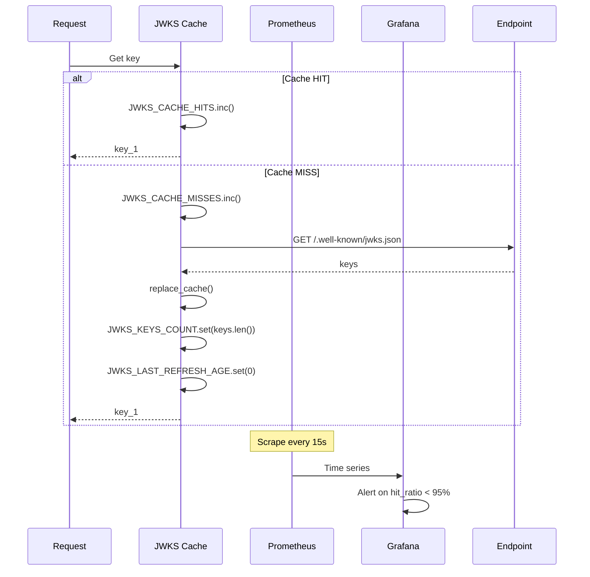
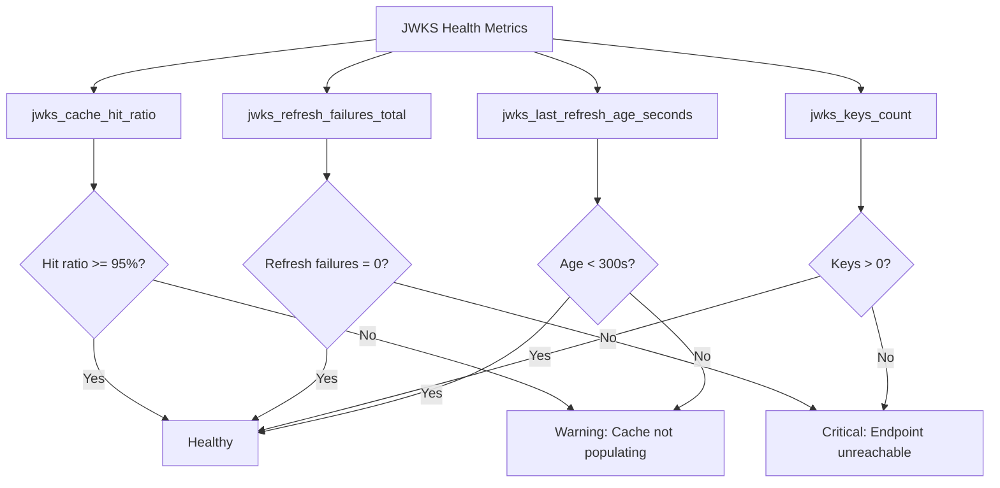
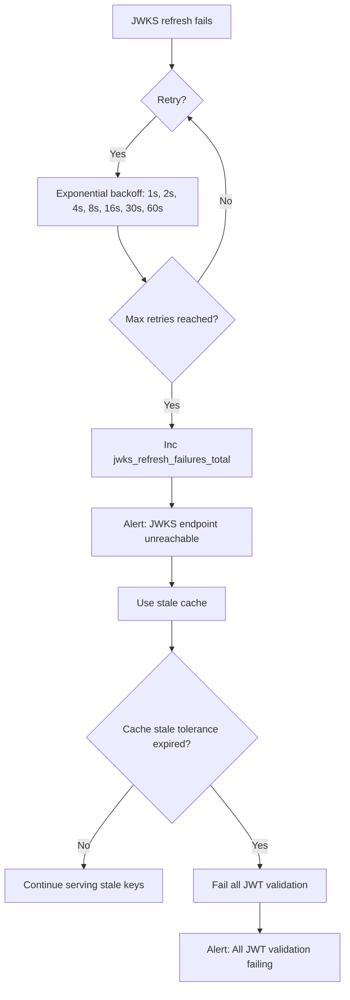

# Story 9.2: Implement JWKS Cache Metrics

## Epic

[09-observability](../observability.md)

## Parent Epic Story

Story 9.2

## Summary

Implement Prometheus metrics for JWKS caching: `jwks_cache_hit_ratio` tracking the percentage of requests served from the JWKS cache versus fetching from the endpoint, and `jwks_refresh_failures_total` counting failed JWKS fetch attempts. Alert on refresh failures.

## Why This Story Exists

The JWT document states: "jwks_cache_hit_ratio -- percentage of requests served from JWKS cache" and "jwks_refresh_failures_total -- count of failed JWKS fetches." JWKS cache is the first layer of token validation -- without it, every request requires an HTTP call. If the cache hit ratio drops below 99%, something is wrong (cache not populating, or background refresh is failing).

## Design Context

### Metric Definitions

| Metric | Type | Labels | Purpose |
|--------|------|--------|---------|
| `jwks_cache_hit_ratio` | Gauge | None | Percentage of requests served from cache (0.0 to 1.0) |
| `jwks_refresh_failures_total` | Counter | None | Count of failed JWKS fetch attempts |
| `jwks_keys_count` | Gauge | None | Number of keys currently cached |
| `jwks_last_refresh_age_seconds` | Gauge | None | Seconds since last successful refresh |

### Implementation

```rust
use prometheus::{register_gauge, register_counter, Gauge, Counter};

static JWKS_CACHE_HITS: Counter = register_counter!(
    "jwks_cache_hits_total",
    "Total JWKS cache hits"
).unwrap();

static JWKS_CACHE_MISSES: Counter = register_counter!(
    "jwks_cache_misses_total",
    "Total JWKS cache misses (forced refresh)"
).unwrap();

static JWKS_REFRESH_FAILURES: Counter = register_counter!(
    "jwks_refresh_failures_total",
    "Total JWKS refresh failures"
).unwrap();

static JWKS_KEYS_COUNT: Gauge = register_gauge!(
    "jwks_keys_count",
    "Number of keys currently cached in JWKS cache"
).unwrap();

static JWKS_LAST_REFRESH_AGE: Gauge = register_gauge!(
    "jwks_last_refresh_age_seconds",
    "Seconds since last successful JWKS refresh"
).unwrap();

// In JWKS cache:
impl JwksCache {
    fn on_hit(&self) {
        JWKS_CACHE_HITS.inc();
    }
    
    fn on_miss(&self) {
        JWKS_CACHE_MISSES.inc();
    }
    
    fn on_refresh_failure(&self) {
        JWKS_REFRESH_FAILURES.inc();
    }
    
    fn on_refresh_success(&self, keys_count: usize) {
        JWKS_KEYS_COUNT.set(keys_count as f64);
        JWKS_LAST_REFRESH_AGE.set(0.0);
    }
    
    // Background refresh loop:
    async fn background_refresh_loop(&self) {
        loop {
            tokio::time::sleep(Duration::from_secs(300)).await;  // 5 minutes
            match fetch_jwks(&self.endpoint).await {
                Ok(keys) => {
                    self.replace_cache(keys);
                    self.on_refresh_success(keys.len());
                }
                Err(e) => {
                    warn!("JWKS refresh failed: {:?}", e);
                    self.on_refresh_failure();
                }
            }
            // Update last refresh age continuously
            JWKS_LAST_REFRESH_AGE.set(
                tokio::time::Instant::now()
                    .duration_since(self.last_refresh)
                    .as_secs_f64()
            );
        }
    }
}
```

### Alert Thresholds

| Metric | Warning | Critical | Action |
|--------|---------|----------|--------|
| `jwks_cache_hit_ratio` | < 95% | < 90% | Investigate cache population |
| `jwks_refresh_failures_total` | Rate > 0 | Rate > 5/min | Alert: JWKS endpoint unreachable |
| `jwks_last_refresh_age_seconds` | > 300s (5 min) | > 600s (10 min) | Alert: cache stale |
| `jwks_keys_count` | != expected | 0 | Alert: no keys cached |

## Mermaid Diagrams

### JWKS Cache Metrics Flow



### JWKS Cache Health Dashboard



### JWKS Fetch Failure Recovery



## OpenAPI Changes

No OpenAPI changes. Metrics are internal.

## Design Doc References

- `design-doc.md` section 10.11: Caching Strategy -- JWKS cache metrics
- `design-doc.md` section 10.12: Observability -- jwks_cache_hit_ratio and jwks_refresh_failures_total

## Wiki Pages to Update/Create

- `topics/topic-observability.md`: Document JWKS cache metrics

## Acceptance Criteria

- [ ] `jwks_cache_hit_ratio` is tracked (derived from hits vs total requests)
- [ ] `jwks_refresh_failures_total` counter is incremented on each failed refresh
- [ ] `jwks_keys_count` gauge reflects current cache size
- [ ] `jwks_last_refresh_age_seconds` gauge is updated continuously
- [ ] Alerts configured on: hit_ratio < 95%, refresh_failures > 0, last_refresh_age > 300s, keys_count = 0
- [ ] Unit tests verify: counter increments on hits/misses/failures, gauge values

## Dependencies

- Depends on Story 7.1 (JWKS caching strategy)

## Risk / Trade-offs

- **Hit ratio calculation**: The hit ratio is derived from two counters (hits / (hits + misses)). This is a computed metric -- Grafana/Prometheus computes it at query time. There is no `jwks_cache_hit_ratio` gauge -- the ratio is calculated as `jwks_cache_hits_total / (jwks_cache_hits_total + jwks_cache_misses_total)`. This is the standard Prometheus pattern.
- **Alert noise**: `jwks_refresh_failures_total` alerts on any failure. During routine network blips, this may generate false positives. Mitigation: use rate-based alerts (`rate(jwks_refresh_failures_total[5m]) > 0`) instead of absolute counts, and require sustained failures (e.g., 3 consecutive failures) before alerting.
