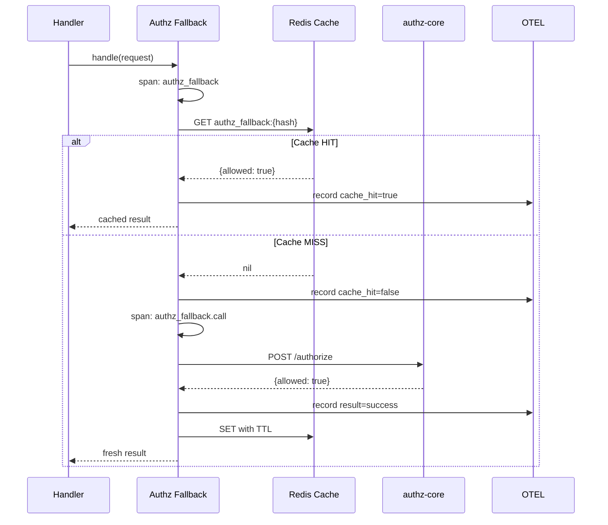
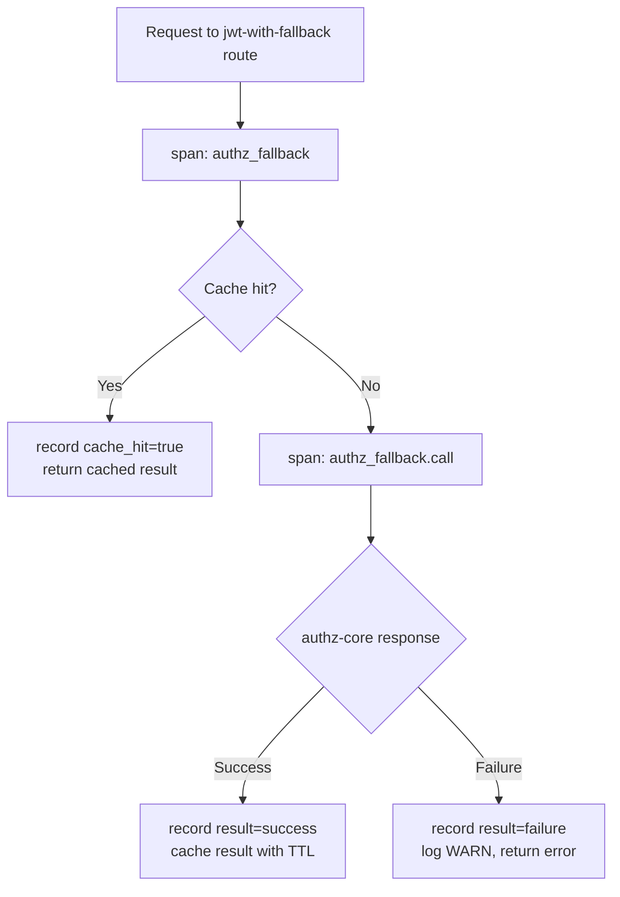

# Story 9.3: Authz Fallback Observability Spans

## Epic

[09-observability](../observability.md)

## Parent Epic Story

Story 9.3

## Summary

Create OTEL spans for authz fallback operations using the `tracing` crate. Spans flow through BRRTRouter's existing `otel::init_logging_with_config()` into Jaeger. **DO NOT use Prometheus counters** — BRRTRouter's `brrtrouter_requests_total{path, status}` already tracks per-route request counts and authz-core call latency is visible in Jaeger traces.

## Why This Story Exists

The JWT document requires observability for the hybrid authorization model. Without spans, you cannot see in Jaeger which routes trigger fallback calls, how often the fallback cache is hit vs. misses, and whether fallback calls are successful. **BRRTRouter already provides HTTP-level metrics** — this story adds authz fallback-specific diagnostic spans.

## Design Context

### Current State

- Authz fallback cache exists in Story 7.2 but creates no observable spans
- Fallback cache hit/miss is not traced
- No visibility into authz-core call success/failure patterns in traces

### Span Design

```
jwt_validation (from Story 9.1)
└── authz_fallback (sub-span, created only for jwt-with-fallback routes)
    ├── authz_fallback.cache_hit (if cached result returned)
    └── authz_fallback.call (if authz-core called)
        └── authz_fallback.call_success or authz_fallback.call_failure
```

### Implementation Pattern

```rust
impl AuthzFallbackHandler {
    async fn handle(&self, req: &AuthorizeRequest) -> Result<AuthorizeResponse, AuthError> {
        let span = tracing::span!(
            tracing::Level::DEBUG,
            "authz_fallback",
            route = req.route,
            action = req.action
        );
        let _guard = span.enter();
        
        // Check cache
        let cache_key = generate_cache_key(&req.subject, &req.org_id, &req.action);
        if let Some(cached) = self.cache.get(&cache_key).await {
            span.record("cache_hit", true);
            span.record("cached_ttl_remaining_secs", ?self.cache_ttl_remaining(&cache_key));
            return Ok(cached);
        }
        
        span.record("cache_hit", false);
        
        // Call authz-core
        let call_span = tracing::span!(
            tracing::Level::INFO,
            "authz_fallback.call",
            route = req.route,
            action = req.action
        );
        let _call_guard = call_span.enter();
        
        match self.authz_client.authorize(req).await {
            Ok(result) => {
                call_span.record("result", "success");
                // Cache result
                self.cache.set(&cache_key, &result, ttl).await;
                Ok(result)
            }
            Err(e) => {
                call_span.record("result", "failure");
                call_span.record("error", %e);
                tracing::warn!(
                    event = "authz_fallback_call_failure",
                    route = req.route,
                    action = req.action,
                    error = %e,
                    "Authz fallback call failed"
                );
                Err(e)
            }
        }
    }
}
```

### Span Attributes

| Span | Attributes |
|------|-----------|
| `authz_fallback` | `route`, `action`, `cache_hit` (bool), `cached_ttl_remaining_secs` |
| `authz_fallback.call` | `route`, `action`, `result` (success/failure), `error` |

### Structured Log Format (fallback call failure)

```json
{
  "event": "authz_fallback_call_failure",
  "route": "/api/v1/identity/preferences",
  "action": "preferences:write",
  "error": "authz-core timeout",
  "service": "identity-user-mgmt-service",
  "ts": "2026-05-16T08:30:00Z"
}
```

## Mermaid Diagrams

### Authz Fallback Span Tree



### Fallback Decision Flow



## OpenAPI Changes

No OpenAPI changes. Spans are internal.

## Design Doc References

- `design-doc.md` section 10.3: Hybrid Authorization Model -- fallback observability
- BRRTRouter `otel.rs` -- span pattern

## Wiki Pages to Update/Create

- `topics/topic-observability.md`: Authz fallback spans

## Acceptance Criteria

- [ ] `authz_fallback` span created for every jwt-with-fallback request
- [ ] `authz_fallback.call` span created when authz-core is invoked (cache miss)
- [ ] Span attributes record: `route`, `action`, `cache_hit`, `cached_ttl_remaining_secs`, `result`, `error`
- [ ] Fallback call failures logged at WARN level with `event: "authz_fallback_call_failure"`
- [ ] Spans appear in Jaeger traces
- [ ] No Prometheus counters for fallback (BRRTRouter's `brrtrouter_requests_total` covers HTTP-level)

## Dependencies

- Depends on Story 4.3 (selective online fallback)
- Depends on Story 7.2 (online fallback result cache)
- Depends on Story 9.1 (JWT validation spans — parent span)

## Risk / Trade-offs

- **Span volume**: Each jwt-with-fallback request creates a span. At 100 RPS, this is 100 spans/sec — acceptable for OTEL batch exporters.
- **No fallback ratio metric**: The fallback ratio (fallback calls / total requests) is NOT tracked as a counter. Use Jaeger to filter by `authz_fallback.call` spans and calculate ratios manually during migration.
- **Cache TTL visibility**: `cached_ttl_remaining_secs` is a best-effort attribute — it reflects the time at span creation, not at span completion. For precise TTL tracking, use Prometheus (which we're not doing).
