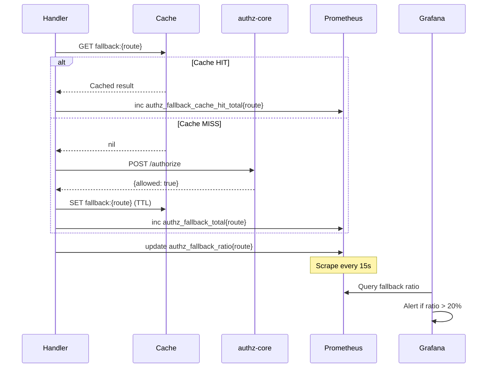
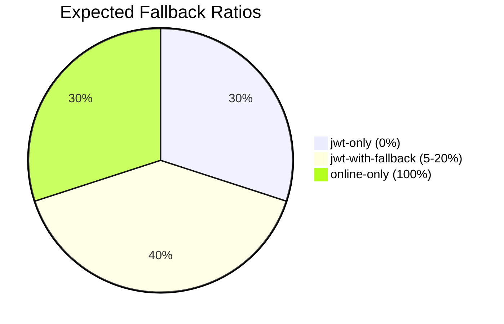
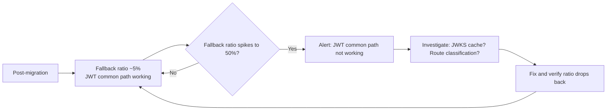

# Story 9.3: Implement Authz Fallback Metrics

## Epic

[09-observability](../observability.md)

## Parent Epic Story

Story 9.3

## Summary

Implement Prometheus metrics for authz fallback: `authz_fallback_total{route}` counting fallback calls per route, and `authz_fallback_ratio` tracking the ratio of fallback calls to total requests per route. Alert on fallback ratio spikes (indicates JWT common path is not working properly).

## Why This Story Exists

The JWT document states: "authz_fallback_total{route} -- count of fallback calls per route" and "authz_fallback_ratio -- ratio of fallback calls to total requests per route. Alert on fallback ratio spikes (indicates JWT common path is not working)." The fallback ratio is the primary indicator of whether the hybrid authorization model is achieving its goals.

## Design Context

### Metric Definitions

| Metric | Type | Labels | Purpose |
|--------|------|--------|---------|
| `authz_fallback_total` | Counter | route (path pattern) | Count of online authz calls per route |
| `authz_fallback_cache_hit_total` | Counter | route | Count of cache hits per route |
| `authz_fallback_ratio` | Gauge | route | Fallback ratio per route (fallback / total) |

### Implementation

```rust
use prometheus::{register_counter_vec, register_gauge_vec, CounterVec, GaugeVec};

static AUTHZ_FALLBACK_TOTAL: CounterVec = register_counter_vec!(
    "authz_fallback_total",
    "Total authz fallback calls per route",
    &["route"]
).unwrap();

static AUTHZ_FALLBACK_CACHE_HIT: CounterVec = register_counter_vec!(
    "authz_fallback_cache_hit_total",
    "Total authz fallback cache hits per route",
    &["route"]
).unwrap();

static AUTHZ_FALLBACK_RATIO: GaugeVec = register_gauge_vec!(
    "authz_fallback_ratio",
    "Ratio of fallback calls to total requests per route",
    &["route"]
).unwrap();

// In the fallback handler:
async fn handle_fallback(
    route: &str,
    request: &AuthorizeRequest,
) -> Result<AuthorizeResponse, AuthError> {
    // Check cache
    let result = if let Some(cached) = cache.get(route, request) {
        AUTHZ_FALLBACK_CACHE_HIT.with(&[("route", route)]).inc();
        Ok(cached)
    } else {
        // Call authz-core
        let result = authz_client.authorize(request).await?;
        cache.set(route, request, &result)?;
        AUTHZ_FALLBACK_TOTAL.with(&[("route", route)]).inc();
        Ok(result)
    };
    
    // Update ratio (computed periodically, not per-request)
    update_fallback_ratio(route);
    
    result
}

fn update_fallback_ratio(route: &str) {
    let total = AUTHZ_FALLBACK_TOTAL
        .with(&[("route", route)])
        .get() + AUTHZ_FALLBACK_CACHE_HIT
        .with(&[("route", route)])
        .get();
    
    let fallback = AUTHZ_FALLBACK_TOTAL
        .with(&[("route", route)])
        .get();
    
    let ratio = if total > 0 {
        fallback / total
    } else {
        0.0
    };
    
    AUTHZ_FALLBACK_RATIO.with(&[("route", route)]).set(ratio);
}
```

### Expected Fallback Ratios by Route Type

| Route Type | Expected Fallback Ratio | Rationale |
|------------|------------------------|-----------|
| `jwt-only` | 0% | No fallback by design |
| `jwt-with-fallback` | 5-20% | Fallback only when JWT claims insufficient |
| `online-only` | 100% | Always fallback |
| **Overall** | **< 5%** | **Target: >95% of requests handled by JWT common path** |

### Alert Thresholds

| Metric | Warning | Critical | Action |
|--------|---------|----------|--------|
| `authz_fallback_ratio` (jwt-with-fallback routes) | > 20% | > 40% | Investigate JWT common path |
| `authz_fallback_total` (rate) | Spiking | Sustained high | Load spike on authz-core |
| Overall fallback ratio | > 10% | > 20% | JWT common path not working |

## Mermaid Diagrams

### Fallback Metrics Collection



### Fallback Ratio by Route Type



### Fallback Ratio Trend



## OpenAPI Changes

No OpenAPI changes. Metrics are internal.

## Design Doc References

- `design-doc.md` section 10.3: Hybrid Authorization Model -- fallback metrics
- `design-doc.md` section 10.12: Observability -- authz_fallback_total and authz_fallback_ratio

## Wiki Pages to Update/Create

- `topics/topic-observability.md`: Document authz fallback metrics

## Acceptance Criteria

- [ ] `authz_fallback_total{route}` counter is implemented per route
- [ ] `authz_fallback_cache_hit_total{route}` counter is implemented per route
- [ ] `authz_fallback_ratio{route}` gauge is computed per route
- [ ] Overall fallback ratio < 5% (target: >95% JWT common path)
- [ ] Per-route fallback ratio < 20% for jwt-with-fallback routes
- [ ] Alerts on: overall fallback > 10%, per-route fallback > 20%
- [ ] Unit tests verify: counter increments, ratio calculation, alert thresholds

## Dependencies

- Depends on Story 4.3 (selective online fallback)
- Intersects with Story 9.1 (metrics infrastructure)

## Risk / Trade-outs

- **Route label cardinality**: `authz_fallback_total{route}` creates one time series per route. With 133 routes, this creates ~133 time series. This is acceptable -- Prometheus can handle thousands of time series per metric.
- **Ratio computation**: The ratio is computed by the service periodically (not per-request) to avoid per-request counter division. This means the ratio may be up to 15 seconds stale (scrape interval) when displayed in Grafana. For alerting purposes, this is acceptable.
- **Baseline calibration**: The expected fallback ratio (5%) is a target based on the JWT document's assumptions. The actual ratio will depend on traffic patterns and route classification. The baseline should be established during migration (shadow mode) before production deployment.
- **Gauge is overwritten, not incremented**: `authz_fallback_ratio` is a Gauge, not a Counter. It is set to the computed ratio value at each update interval. Tests must verify the set operation, not an increment.

## Tests

### Unit Tests

- [ ] **authz_fallback_total incremented on cache miss**: Given a fallback handler with a cache miss, assert `authz_fallback_total{route="/preferences"}` is incremented by 1
- [ ] **authz_fallback_cache_hit_total incremented on cache hit**: Given a fallback handler with a cache hit, assert `authz_fallback_cache_hit_total{route="/preferences"}` is incremented by 1
- [ ] **authz_fallback_ratio computed correctly**: Given `authz_fallback_total{route}=100` and `authz_fallback_cache_hit_total{route}=900`, assert `authz_fallback_ratio{route}=0.1` (10%)
- [ ] **authz_fallback_ratio is zero when no fallbacks**: Given `authz_fallback_total{route}=0` for a jwt-only route, assert `authz_fallback_ratio{route}=0.0`
- [ ] **authz_fallback_ratio is 1.0 when all requests are fallbacks**: Given a 100% fallback route (online-only), assert `authz_fallback_ratio{route}=1.0`
- [ ] **Per-route counters are independent**: Given route A has 50 fallbacks and route B has 10 fallbacks, assert `authz_fallback_total{route=A}=50` and `authz_fallback_total{route=B}=10` — no cross-contamination
- [ ] **Ratio computation handles division by zero**: Given both counters are 0, assert `authz_fallback_ratio` is set to 0.0 (not NaN or panic)
- [ ] **Ratio gauge set (not incremented)**: Given `authz_fallback_ratio{route}` is updated from 0.1 to 0.15, assert the gauge reads 0.15 — not 0.25 (set, not inc)
- [ ] **Route label matches path pattern exactly**: Given a route at path `/api/v1/identity/preferences`, assert the label value is exactly `/api/v1/identity/preferences` (not trimmed, not URL-encoded)
- [ ] **Counter is thread-safe under concurrent fallbacks**: Given 500 concurrent fallback requests, assert the sum of `authz_fallback_total` across all routes equals 500 — no lost increments

### Integration Tests (BDD-style with `rstest_bdd`)

- [ ] **Scenario: jwt-only route has zero fallbacks**: `given` a request to a jwt-only route (e.g., GET /users/me) → `when` the request is processed → `then` `authz_fallback_total` is 0 for that route (all handled by JWT common path)
- [ ] **Scenario: jwt-with-fallback route has expected fallback ratio**: `given` 100 requests to a jwt-with-fallback route (PUT /preferences) → `when` the requests are processed → `then` the fallback ratio is between 5% and 20% (some calls require online authz, most are served by JWT claims)
- [ ] **Scenario: online-only route has 100% fallback**: `given` 50 requests to an online-only route (e.g., POST /am/authorize) → `when` the requests are processed → `then` `authz_fallback_ratio` is 1.0 (all calls go to authz-core)
- [ ] **Scenario: Cache hit reduces fallback ratio**: `given` the same request pattern hits the fallback cache → `when` repeated requests arrive within the TTL window → `then` `authz_fallback_cache_hit_total` increases while `authz_fallback_total` stays constant, driving the ratio down
- [ ] **Scenario: Fallback ratio spikes trigger metric alert**: `given` a JWT common path failure causes all requests to fall back → `when` the overall fallback ratio exceeds 10% → `then` the `authz_fallback_ratio` metric reflects the spike and the alerting rule fires
- [ ] **Scenario: All 6 services report fallback metrics independently**: `given` requests arrive across all 6 services → `when` the metrics are scraped → `then` each service reports its own per-route fallback counters
- [ ] **Scenario: Metrics endpoint includes fallback metrics**: `given` a GET to `/metrics` → `when` the response is parsed → `then` it contains `authz_fallback_total{route=...}`, `authz_fallback_cache_hit_total{route=...}`, and `authz_fallback_ratio{route=...}`

### Security Regression Tests

- [ ] **Fallback ratio metric cannot be manipulated by client**: Assert that a client cannot influence `authz_fallback_ratio` — it is computed from server-side counters, not influenced by request content
- [ ] **No route label injection**: Assert that route label values are derived from the server's route table and cannot be injected by client input — a client cannot create arbitrary label values like `authz_fallback_total{route="admin:drop_table"}`
- [ ] **Fallback counter does not leak authorization decisions**: Assert that `authz_fallback_total` only counts the number of fallback calls — it does not reveal whether the fallback returned "allowed" or "denied"
- [ ] **Metrics endpoint does not expose route enumeration to unauthenticated users**: Assert that a scraping of `/metrics` by an unauthenticated user reveals route labels but not the business data behind them — route names alone are acceptable disclosure

### Edge Cases

- [ ] **Fallback metric with 133 unique routes**: Given all 133 routes have at least one request, assert `authz_fallback_total` has 133 distinct `route` label values — no label collision or truncation
- [ ] **Fallback ratio gauge with floating-point precision**: Given a fallback ratio of 1/3 (0.33333...), assert the gauge stores the correct floating-point value without precision loss that would affect alerting thresholds
- [ ] **Counter overflow (u64 max)**: Given `authz_fallback_total{route}` reaches `u64::MAX`, assert it saturates gracefully — at 10,000 RPS this would take ~58 million years
- [ ] **Route with special characters in path**: Given a route path like `/api/v1/auth/callback/github`, assert the label value is correctly escaped in the Prometheus text format
- [ ] **Ratio update during counter modification**: Given a fallback ratio update runs simultaneously with a counter increment, assert no data race — the gauge read uses the current counter values at the moment of computation
- [ ] **Fallback metric for non-existent route**: Given a request for a route not in the route policy store, assert the fallback handler either uses a default label (e.g., `route="unknown"`) or skips metrics — document the policy

### Cleanup

- [ ] Metrics registry must be reset between test scenarios using `prometheus::Registry::new()` to prevent cross-test metric contamination
- [ ] No persistent state is left by counter/gauge operations — all metrics are in-memory so no filesystem cleanup is needed
- [ ] If tests use a real `/metrics` endpoint, ensure the HTTP server is stopped and restarted between tests to prevent stale metric state
- [ ] Mock authz-core responses must be isolated per test — each test should configure its own mock server or use different response expectations to prevent response pollution
- [ ] Route policy store must be isolated per test — each test should use its own route classification to prevent cross-test route label contamination
