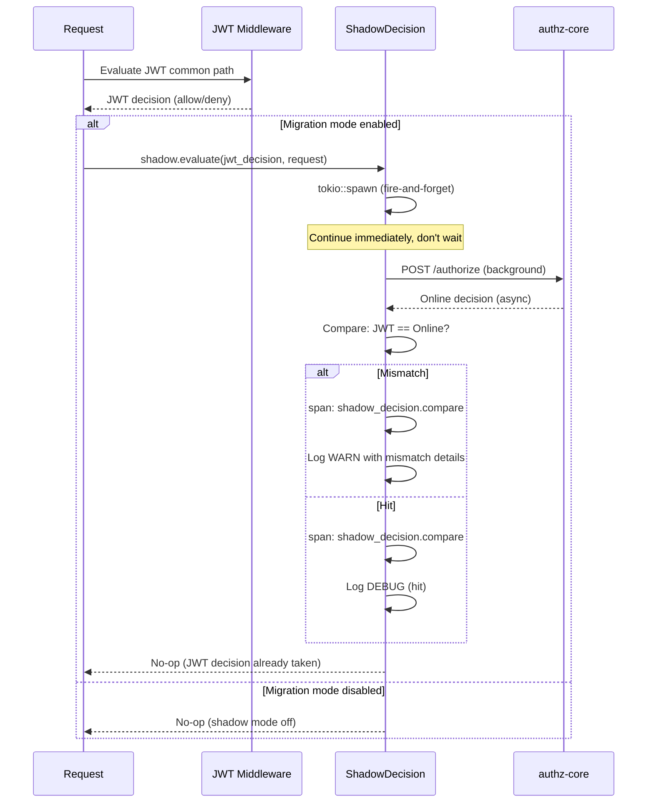
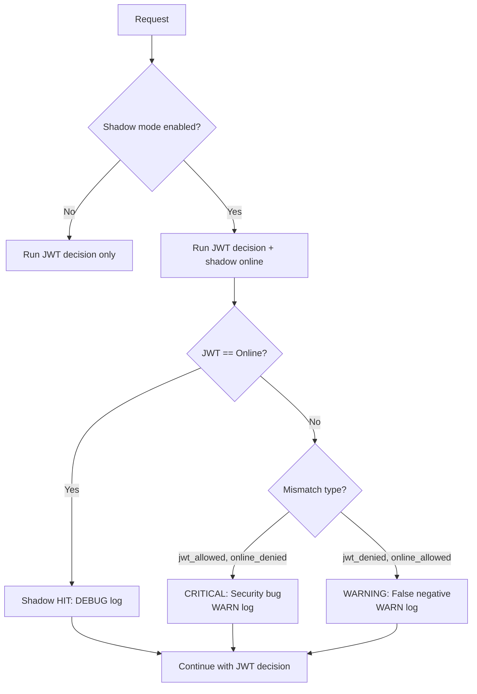
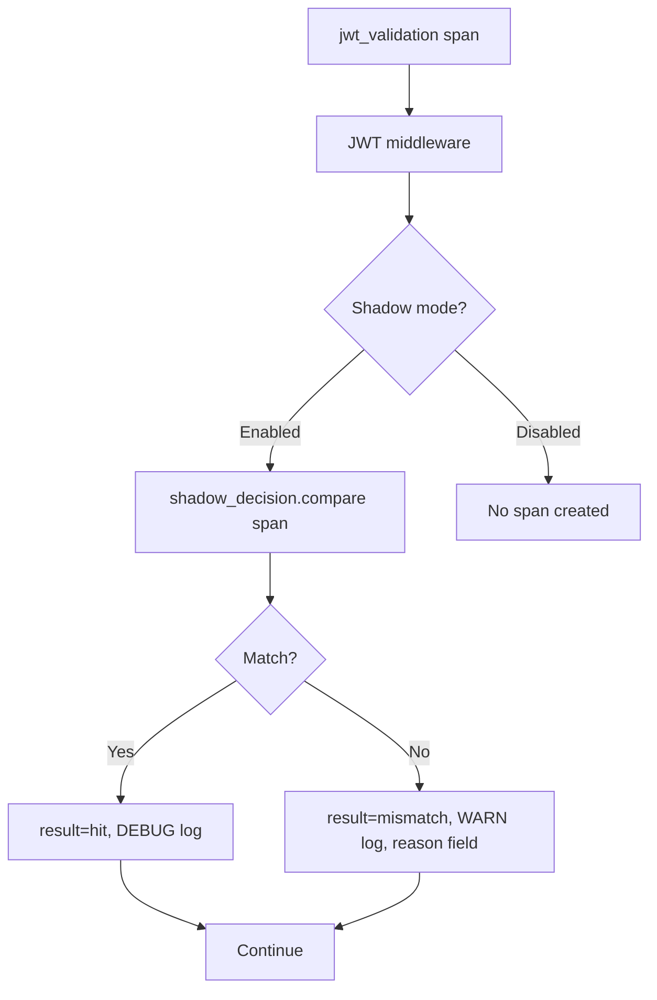

# Story 9.4: Shadow Decision Observability Spans

## Epic

[09-observability](../observability.md)

## Parent Epic Story

Story 9.4

## Summary

Create OTEL spans and structured logs for shadow decision comparisons using the `tracing` crate. Spans flow through BRRTRouter's existing `otel::init_logging_with_config()` into Jaeger. **DO NOT use Prometheus counters** — use structured logs for mismatch analysis and Jaeger span attributes for shadow decision visibility.

## Why This Story Exists

The JWT document requires observability for shadow decisions during migration: compare local JWT decisions against online authz-core decisions, track mismatches, and validate the JWT common path. Without spans and structured logs, you cannot prove during migration that the JWT common path produces the same results as online evaluation. **BRRTRouter already provides HTTP-level metrics** — this story adds shadow decision-specific diagnostic spans and structured logs.

## Design Context

### Current State

- No shadow decision spans exist
- No shadow decision logging
- No visibility into shadow decision matches/mismatches

### Shadow Mode Architecture

```
Request -> JWT middleware (common path) -> JWT decision
Request -> authz-core /authorize (background) -> Online decision
  -> Compare: JWT decision == Online decision?
  -> If YES: shadow hit (no-op)
  -> If NO: shadow mismatch (log WARN, create mismatch span)
```

The JWT decision always takes precedence. The online decision is shadow-only.

### Span Design

```
jwt_validation (from Story 9.1)
└── shadow_decision (sub-span, only when migration mode enabled)
    ├── shadow_decision.compare (when shadow mode enabled)
    │   ├── result: hit (JWT == online) or mismatch (JWT != online)
    │   ├── jwt_decision: allowed/denied
    │   ├── online_decision: allowed/denied
    │   └── mismatch_reason: jwt_allowed_but_online_denied | jwt_denied_but_online_allowed
    └── shadow_decision.disabled (when migration mode disabled, no-op)
```

### Implementation Pattern

```rust
pub struct ShadowDecision {
    enabled: bool,  // Toggle for migration mode (env var or config)
}

impl ShadowDecision {
    pub async fn evaluate(
        &self,
        route: &str,
        jwt_decision: &AuthDecision,
        request: &AuthorizeRequest,
    ) {
        // Shadow mode disabled: no-op
        if !self.enabled {
            return;
        }
        
        // Compare decisions (non-blocking, fire-and-forget)
        let route = route.to_string();
        let jwt_dec = jwt_decision.clone();
        let req = request.clone();
        
        // Spawn background comparison task
        tokio::spawn(async move {
            let span = tracing::span!(
                tracing::Level::INFO,
                "shadow_decision.compare",
                route = route,
                jwt_decision = ?jwt_dec
            );
            let _guard = span.enter();
            
            // Call authz-core in background
            let online_result = call_authz_core(&req).await;
            
            let jwt_allowed = matches!(jwt_dec, AuthDecision::Allowed { .. });
            
            match online_result {
                Ok(online_allowed) => {
                    span.record("online_decision", if online_allowed { "allowed" } else { "denied" });
                    
                    if jwt_allowed == online_allowed {
                        // HIT: decisions match
                        span.record("result", "hit");
                        tracing::debug!(
                            event = "shadow_decision_match",
                            route = &route,
                            jwt_decision = if jwt_allowed { "allowed" } else { "denied" },
                            online_decision = if online_allowed { "allowed" } else { "denied" },
                            "Shadow decision: hit (decisions match)"
                        );
                    } else {
                        // MISMATCH: decisions differ
                        let reason = if jwt_allowed && !online_allowed {
                            "jwt_allowed_but_online_denied"
                        } else {
                            "jwt_denied_but_online_allowed"
                        };
                        span.record("result", "mismatch");
                        span.record("mismatch_reason", reason);
                        tracing::warn!(
                            event = "shadow_mismatch",
                            route = &route,
                            jwt_decision = if jwt_allowed { "allowed" } else { "denied" },
                            online_decision = if online_allowed { "allowed" } else { "denied" },
                            reason = reason,
                            "Shadow decision: mismatch"
                        );
                    }
                }
                Err(e) => {
                    // Online check failed: ignore (shadow is best-effort)
                    span.record("result", "error");
                    span.record("error", %e);
                    tracing::debug!(
                        event = "shadow_decision_error",
                        route = &route,
                        error = %e,
                        "Shadow decision: online check failed (ignored)"
                    );
                }
            }
        });
    }
}
```

### Structured Log Format

| Event | Level | Fields |
|-------|-------|--------|
| `shadow_decision_match` | DEBUG | `route`, `jwt_decision`, `online_decision` |
| `shadow_mismatch` | WARN | `route`, `jwt_decision`, `online_decision`, `reason` |
| `shadow_decision_error` | DEBUG | `route`, `error` |

### Shadow Decision Mismatch Reasons

| Reason | What It Means | Severity |
|--------|--------------|----------|
| `jwt_allowed_but_online_denied` | JWT allows but online would deny | CRITICAL: Security vulnerability |
| `jwt_denied_but_online_allowed` | JWT denies but online would allow | WARNING: False negative, degraded UX |

### Migration Timeline

| Phase | Duration | Shadow Mode | Action |
|-------|----------|-------------|--------|
| Phase 1: Shadow only | 2 weeks | Enabled, JWT decision stands | Compare JWT vs online decisions |
| Phase 2: Shadow + alert | 1 week | Enabled, alert on mismatch | Log mismatches to Slack |
| Phase 3: Production cutover | - | Disabled | Enable JWT-only, disable shadow |

### Enabling/Disabling Shadow Mode

Shadow mode is controlled by an environment variable or config flag — NEVER by client input:

```yaml
# config.yaml (server-side only)
shadow_mode:
  enabled: true  # Set to false for production
```

## Mermaid Diagrams

### Shadow Decision Flow



### Migration Timeline

```mermaid
gantt
    title Shadow Decision Migration Timeline
    dateFormat YYYY-MM-DD
    axisFormat %m/%d
    section Shadow Mode
    Phase 1: Shadow only          :2026-05-01, 14d
    Phase 2: Shadow + alert       :2026-05-15, 7d
    Phase 3: Production cutover   :2026-05-22, 0d
    
    section Mismatch Events
    Expected: 0 mismatches after Phase 1 :2026-05-01, 14d
    Alert: mismatch logged to Slack       :2026-05-15, 7d
    Disabled                              :2026-05-22, 0d
```

### Shadow Decision Decision Tree



### Span Hierarchy



## Malicious Hacker Gotchas (Must Be Addressed During Implementation)

> **Source:** `docs/PRS_SECURITY_HARDENING.md` — Security threat model analysis

### HACK-941: Shadow Mode as Authorization Backdoor (CRITICAL — Hole #1 from PRS)

**Risk:** Shadow mode is left enabled in production, allowing an attacker to use the shadow online check as an authorization oracle

The story says: "Shadow mode must be disabled after production cutover." But what if it's forgotten?

**Exploit path (shadow mode enabled in production):**
1. Shadow mode is enabled in production (accidentally or intentionally by a compromised admin)
2. The shadow online check runs in background for every `jwt-with-fallback` route
3. An attacker sends a request to a jwt-with-fallback route
4. The shadow check calls authz-core and compares with the JWT decision
5. If the JWT allows but online denies → the mismatch is logged at WARN level
6. The attacker can monitor the shadow decision logs (if they have access to the structured log stream)
7. Result: The attacker can determine if a specific action would be allowed by the online system, even if the JWT says it's denied

**This is an authorization oracle:** the shadow mode reveals the online authorization decision without the client seeing it directly.

**But wait:** the story says the shadow check is fire-and-forget and the client only sees the JWT decision. So the client cannot directly observe the shadow result.

**The real exploit is different:** If the attacker has access to the structured log stream (Loki/SIEM), they can search for `shadow_mismatch` events and see the `jwt_decision` and `online_decision` fields.

**Exploit path (shadow mismatch log as oracle):**
1. Attacker has access to Loki/SIEM (e.g., via a compromised service account or log injection)
2. Attacker searches for `event=shadow_mismatch` with `jwt_decision=allowed` and `online_decision=denied`
3. For each route, the attacker checks if a mismatch exists: if YES, the online system would deny; if NO, the online system would allow
4. Result: The attacker maps the online authorization system without triggering any alerts

**Implementation requirement:**
- Shadow mode MUST be disabled in production. The startup check must be enforced (not just "alert if enabled").
- Add a hardware/software watchdog that disables shadow mode if it detects production traffic patterns
- NEVER log `online_decision` in shadow mismatch events if the log stream is accessible to attackers
- Document: "Shadow mode is NEVER enabled in production. If enabled, it must be detected and disabled by a watchdog."

### HACK-942: Shadow Mode Increases Attack Surface by Doubling Authz-Core Calls (HIGH — related to Hole #3 from PRS)

**Risk:** Shadow mode doubles the authz-core load, creating a DoS vector

The story says: "Shadow mode doubles the authz-core load for jwt-with-fallback routes." An attacker can exploit this.

**Exploit path (shadow-induced authz-core DoS):**
1. Attacker enables shadow mode (if they have access to the config) OR shadow mode is already enabled
2. Attacker sends 1000 requests per second to jwt-with-fallback routes
3. Authz-core receives 1000 real requests + 1000 shadow requests = 2000 requests
4. Authz-core becomes overloaded and starts returning errors
5. The real requests fail, causing a service outage
6. Result: DoS via shadow mode amplification

**The story already mentions this as a trade-off:** "This is acceptable during migration (2 weeks) but NOT in production." The risk is that shadow mode is NOT disabled in production.

**Implementation requirement:**
- Shadow mode MUST be disabled in production via a config check that blocks startup if shadow mode is enabled
- Add a `SHADOW_MODE_ENABLED` environment variable that defaults to `false` and can ONLY be changed via a secure config management system
- If shadow mode is enabled in production, the service MUST refuse to start
- Document: "Shadow mode is disabled in production. The service refuses to start if shadow mode is enabled."

---

## OpenAPI Changes

No OpenAPI changes. Shadow mode is internal to the validation layer.

## Design Doc References

- `design-doc.md` section 10.3: Hybrid Authorization Model -- shadow decision migration
- `design-doc.md` section 10.12: Observability -- shadow decision structured logs

## Wiki Pages to Update/Create

- `topics/topic-observability.md`: Document shadow decision spans
- `topics/topic-hybrid-authz.md`: Document migration shadow mode

## Acceptance Criteria

- [ ] Shadow mode can be toggled on/off via server-side config (env var or config file)
- [ ] Shadow online check runs in background (non-blocking, fire-and-forget)
- [ ] `shadow_decision.compare` span created for every shadow evaluation when enabled
- [ ] Span attributes: `route`, `jwt_decision`, `online_decision`, `result`, `mismatch_reason`
- [ ] Mismatch logged at WARN level with `event="shadow_mismatch"` and full details
- [ ] Match logged at DEBUG level with `event="shadow_decision_match"`
- [ ] JWT decision always takes precedence (shadow does not affect decisions)
- [ ] Shadow mode is disabled in production (enabled only during migration)
- [ ] No Prometheus counters for shadow decisions (use structured logs for analysis)

## Dependencies

- Depends on Story 4.3 (selective online fallback)
- Depends on Story 4.2 (JWT common path middleware)
- Depends on Story 9.1 (JWT validation spans — parent span)
- This story is ONLY needed during migration — not in production

## Risk / Trade-offs

- **Shadow load**: Shadow mode doubles the authz-core load for `jwt-with-fallback` routes (1 real call + 1 shadow call). This is acceptable during migration (2 weeks) but NOT in production. The `enabled` toggle must be enforced to disable shadow mode in production.
- **False negatives**: If the JWT common path denies a request that online would allow, this is a false negative (degraded UX, not security). These are less severe than false positives (allowing what online would deny). The structured log tracks both types.
- **Migration completion**: Shadow mode must be disabled after production cutover. Forgetting to disable it would double authz-core load permanently. Mitigation: add a config check that fires a Slack alert if shadow mode is still enabled in production.
- **Shadow online check is async but still consumes resources**: The spawned tasks accumulate under high concurrency — a Tokio task has ~8KB stack, so 10,000 concurrent shadow tasks use ~80MB. The `tokio::spawn` must be bounded.
- **Mismatch reason classification ambiguity**: `jwt_denied_but_online_allowed` could mean the JWT claims are too restrictive, or the online system has different rules. The structured log includes full details for diagnosis.

## Tests

### Unit Tests

- [ ] **Shadow mode disabled: no span created**: Given `shadow_mode.enabled = false`, assert that `evaluate()` returns immediately without creating any `shadow_decision.compare` span
- [ ] **Shadow mode enabled: span created**: Given `shadow_mode.enabled = true`, assert that `evaluate()` creates a `shadow_decision.compare` span with correct attributes
- [ ] **Shadow hit: DEBUG log with matching decisions**: Given JWT decision = allowed and online decision = allowed, assert DEBUG-level structured log with `event="shadow_decision_match"`, `result="hit"`
- [ ] **Shadow mismatch (jwt_allowed, online_denied)**: Given JWT decision = allowed and online decision = denied, assert WARN-level structured log with `event="shadow_mismatch"`, `reason="jwt_allowed_but_online_denied"`
- [ ] **Shadow mismatch (jwt_denied, online_allowed)**: Given JWT decision = denied and online decision = allowed, assert WARN-level structured log with `event="shadow_mismatch"`, `reason="jwt_denied_but_online_allowed"`
- [ ] **Shadow online check does not block JWT decision**: Given an online check takes 500ms, assert the JWT middleware returns in <10ms — the shadow check must be fully async and fire-and-forget
- [ ] **Shadow online check failure is ignored**: Given the online check returns an error (authz-core down), assert DEBUG-level structured log with `event="shadow_decision_error"` and no mismatch counted
- [ ] **Span attributes record full decision details**: Given a mismatch, assert the span records `route`, `jwt_decision`, `online_decision`, `result`, and `mismatch_reason` attributes
- [ ] **Shadow mode toggle can be set at runtime**: Given the shadow mode is enabled via config, assert it can be set to `false` at runtime and subsequent calls to `evaluate()` skip creating spans
- [ ] **Concurrent shadow evaluations create independent spans**: Given 100 concurrent requests, assert 100 independent `shadow_decision.compare` spans are created — no span deduplication

### Integration Tests (BDD-style with `rstest_bdd`)

- [ ] **Scenario: Shadow mode enabled — all decisions match**: `given` shadow mode is enabled and JWT claims accurately reflect online authorization → `when` 100 requests arrive across jwt-with-fallback routes → `then` DEBUG-level logs show 100 `shadow_decision_match` events with `result="hit"`
- [ ] **Scenario: Shadow mode enabled — mismatch detected**: `given` shadow mode is enabled and JWT claims are missing a role that online requires → `when` 100 requests arrive → `then` WARN-level logs show `shadow_mismatch` events with correct `reason` field
- [ ] **Scenario: Shadow mode disabled — no shadow spans**: `given` shadow mode is disabled → `when` 100 requests arrive on jwt-with-fallback routes → `then` NO `shadow_decision.compare` spans are created in Jaeger traces
- [ ] **Scenario: Shadow mode does not affect actual authorization**: `given` a mismatch occurs (JWT allows, online denies) → `when` the request is processed → `then` the JWT decision stands (user is allowed) — shadow does not block or override decisions
- [ ] **Scenario: Shadow mode doubles authz-core load**: `given` shadow mode is enabled → `when` 100 requests arrive on jwt-with-fallback routes → `then` authz-core receives 100 real requests + 100 shadow requests = 200 total calls
- [ ] **Scenario: Shadow online check timeout handled gracefully**: `given` authz-core takes >5s to respond to a shadow request → `when` the shadow task times out → `then` DEBUG log with `event="shadow_decision_error"` and no mismatch counted

### Security Regression Tests

- [ ] **Shadow mode cannot be enabled by client input**: Assert that `shadow_mode.enabled` can only be set via server-side configuration — a client cannot enable shadow mode by sending a special header or request parameter
- [ ] **Mismatch details do not leak PII**: Assert that the structured log includes JWT claims and online decision but does NOT include PII fields (email, phone, name) — only `user_id`, `role`, `permission`
- [ ] **Shadow online check cannot be used as a side-channel**: Assert that the shadow check does not provide the client with any information about online authorization — the client only sees the JWT decision, not whether a shadow mismatch occurred
- [ ] **Shadow mode toggle cannot be manipulated mid-request**: Given a shadow mode toggle from enabled to disabled occurs while a shadow task is in-flight, assert the in-flight task completes (or is cancelled) without corrupting state

### Edge Cases

- [ ] **Shadow mode enabled with zero jwt-with-fallback routes**: Given shadow mode is enabled but no routes are classified as jwt-with-fallback, assert no shadow spans are created — no unnecessary online checks
- [ ] **Mismatch with same decision but different reasons**: Given JWT decision = allowed (reason: "role:admin") and online decision = allowed (reason: "permission:users.read"), assert this is a HIT (both allowed) — the reason field is not compared for matching
- [ ] **Shadow mode toggled from enabled to disabled mid-migration**: Given shadow mode is enabled and toggled to disabled early, assert subsequent requests no longer spawn shadow online checks — the toggle is checked at the start of each request
- [ ] **Concurrent shadow evaluations for same route**: Given 1000 concurrent requests for the same route with shadow mode enabled, assert all 1000 online checks are spawned (no deduplication in shadow mode)
- [ ] **Shadow online check with authz-core returning empty response**: Given authz-core returns an empty or malformed response to a shadow request, assert the shadow handler treats it as an error (no mismatch counted, request continues)
- [ ] **Shadow mode enabled in production**: Assert that a startup check verifies shadow mode is disabled and fires a Slack alert if it detects shadow mode is enabled in the production environment

### Cleanup

- [ ] No persistent state is left by shadow decision processing — all state is in-memory so no filesystem cleanup is needed
- [ ] If tests use a real `shadow_decision.compare` span, ensure the tracing subscriber is reset between tests using `tracing_subscriber::registry().reset()` to prevent cross-test span pollution
- [ ] Mock authz-core responses must be isolated per test — each test should configure its own mock server or use different response expectations to prevent response pollution
- [ ] Spawned shadow tasks must be awaited or cancelled between tests — use `tokio::task::JoinHandle::abort()` or `tokio::time::timeout()` to prevent hanging tests from in-flight shadow online checks
- [ ] Shadow mode configuration must be explicit per test — do not rely on global config state; set `shadow_mode.enabled` explicitly for each test
- [ ] If tests verify structured log output, use `tracing_subscriber::fmt::TestLayer` or `tracing-test` crate to capture logs in-memory rather than writing to stdout
