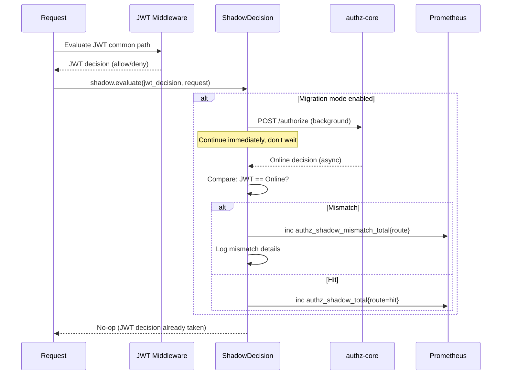
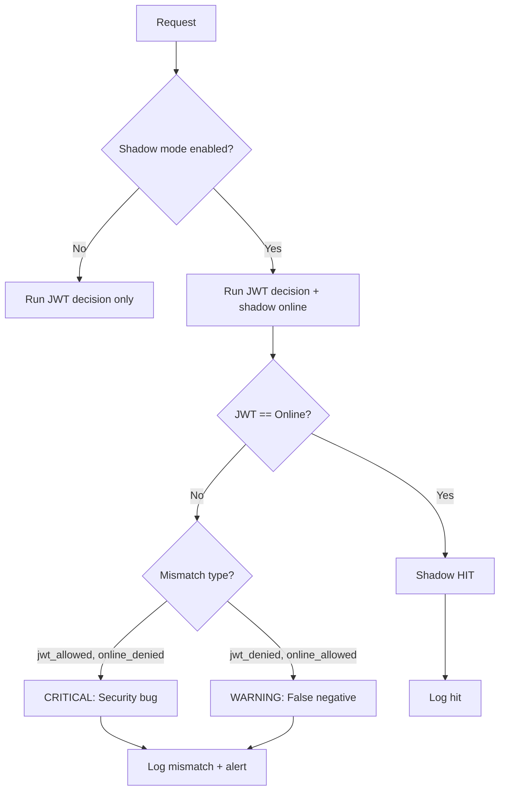

# Story 9.4: Implement Shadow-Decision Metrics (Migration Mode)

## Epic

[09-observability](../observability.md)

## Parent Epic Story

Story 9.4

## Summary

Implement shadow-decision metrics for migration mode: `authz_shadow_mismatch_total{route}` counting times when the local JWT decision differs from the online authz-core decision. This is enabled during migration and disabled after production cutover. Essential for validating the hybrid model before going live.

## Why This Story Exists

The JWT document states: "authz_shadow_mismatch_total{route} -- count of times local JWT decision differs from online decision. Enabled during migration, disabled after production cut-over." Without shadow decisions, you cannot prove that the JWT common path produces the same results as online evaluation. Shadow mode runs both paths simultaneously and compares results -- if they differ, the difference is logged but the JWT common path decision stands (it's "shadow", not "blocking").

## Design Context

### Shadow Mode Architecture

During migration, every `jwt-with-fallback` route runs TWO authorization checks in parallel:

```
Request -> JWT middleware (common path) -> JWT decision
Request -> authz-core /authorize -> Online decision
  -> Compare: JWT decision == Online decision?
  -> If YES: no-op (shadow hit)
  -> If NO: inc authz_shadow_mismatch_total{route}, log difference
```

The JWT decision always takes precedence (the common path is the production decision). The online decision is shadow-only -- it's used to validate the common path, not to make decisions.

### Implementation

```rust
pub struct ShadowDecision {
    enabled: bool,  // Toggle for migration mode
    mismatches: CounterVec,  // authz_shadow_mismatch_total{route, reason}
    shadows: CounterVec,  // authz_shadow_total{route, result}
}

impl ShadowDecision {
    pub async fn evaluate(
        &self,
        route: &str,
        jwt_decision: &AuthDecision,
        request: &AuthorizeRequest,
    ) -> Result<(), AuthError> {
        // Only run shadow if migration mode is enabled
        if !self.enabled {
            return Ok(());  // No-op in production
        }
        
        // Run online check in background (non-blocking)
        let online_decision = tokio::spawn(async {
            authz_client.authorize(request).await
        });
        
        // Continue with JWT decision immediately
        // (do NOT wait for online decision)
        
        // Compare results when online decision arrives
        match online_decision.await {
            Ok(Ok(online_resp)) => {
                let jwt_allowed = matches!(jwt_decision, AuthDecision::Allowed { .. });
                let online_allowed = online_resp.allowed;
                
                if jwt_allowed != online_allowed {
                    // MISMATCH
                    let reason = if jwt_allowed && !online_allowed {
                        "jwt_allowed_but_online_denied"
                    } else {
                        "jwt_denied_but_online_allowed"
                    };
                    
                    self.mismatches
                        .with(&[("route", route), ("reason", reason)])
                        .inc();
                    
                    // Log the mismatch for investigation
                    warn!(
                        "Shadow decision mismatch: route={}, jwt_decision={:?}, online_decision={:?}",
                        route, jwt_decision, online_resp
                    );
                } else {
                    // HIT
                    self.shadows
                        .with(&[("route", route), ("result", "hit")])
                        .inc();
                }
            }
            _ => {
                // Online check failed -- ignore (shadow is best-effort)
            }
        }
        
        Ok(())
    }
}
```

### Migration Timeline

| Phase | Duration | Shadow Mode | Action |
|-------|----------|-------------|--------|
| Phase 1: Shadow only | 2 weeks | Enabled, JWT decision stands | Compare JWT vs online decisions |
| Phase 2: Shadow + alert | 1 week | Enabled, alert on mismatch | Alert on mismatches > 0 |
| Phase 3: Production cutover | - | Disabled | Enable JWT-only, disable shadow |

### Shadow Decision Mismatch Reasons

| Reason | What It Means | Severity |
|--------|--------------|----------|
| `jwt_allowed_but_online_denied` | JWT allows but online would deny | CRITICAL: Security vulnerability |
| `jwt_denied_but_online_allowed` | JWT denies but online would allow | WARNING: False negative, degraded UX |

## Mermaid Diagrams

### Shadow Decision Flow



### Migration Timeline

```mermaid
gantt
    title Shadow Decision Migration Timeline
    dateFormat YYYY-MM-DD
    axisFormat %m/%d
    section Shadow Mode
    Phase 1: Shadow only          :2026-05-01, 14d
    Phase 2: Shadow + alert       :2026-05-15, 7d
    Phase 3: Production cutover   :2026-05-22, 0d
    
    section Mismatch Count
    Expected: 0 mismatches after Phase 1 :2026-05-01, 14d
    Alert: mismatch > 0                    :2026-05-15, 7d
    Disabled                               :2026-05-22, 0d
```

### Shadow Decision Decision Tree



## OpenAPI Changes

No OpenAPI changes. Shadow mode is internal to the validation layer.

## Design Doc References

- `design-doc.md` section 10.3: Hybrid Authorization Model -- shadow decision migration
- `design-doc.md` section 10.12: Observability -- authz_shadow_mismatch_total metric

## Wiki Pages to Update/Create

- `topics/topic-observability.md`: Document shadow decision metrics
- `topics/topic-hybrid-authz.md`: Document migration shadow mode

## Acceptance Criteria

- [ ] Shadow mode can be toggled on/off (environment variable or config)
- [ ] Shadow online check runs in background (non-blocking)
- [ ] `authz_shadow_mismatch_total{route, reason}` counter is emitted per route
- [ ] `authz_shadow_total{route, result}` counter is emitted per route
- [ ] JWT decision always takes precedence (shadow does not affect decisions)
- [ ] Mismatch logging includes: route, JWT decision, online decision, reason
- [ ] Shadow mode is disabled in production (enabled only during migration)
- [ ] Unit tests verify: shadow hit tracking, mismatch detection, toggle on/off

## Dependencies

- Depends on Story 4.3 (selective online fallback)
- Depends on Story 4.2 (JWT common path middleware)
- This story is ONLY needed during migration -- not in production

## Risk / Trade-offs

- **Shadow load**: Shadow mode doubles the authz-core load for `jwt-with-fallback` routes (1 real call + 1 shadow call). This is acceptable during migration (2 weeks) but NOT in production. The `enabled` toggle must be enforced to disable shadow mode in production.
- **False negatives**: If the JWT common path denies a request that online would allow, this is a false negative (degraded UX, not security). These are less severe than false positives (allowing what online would deny). The shadow mismatch counter tracks both types.
- **Migration completion**: Shadow mode must be disabled after production cutover. Forgetting to disable it would double authz-core load permanently. Mitigation: add an alert that fires if shadow mode is enabled in production (e.g., after Phase 3 ends).
