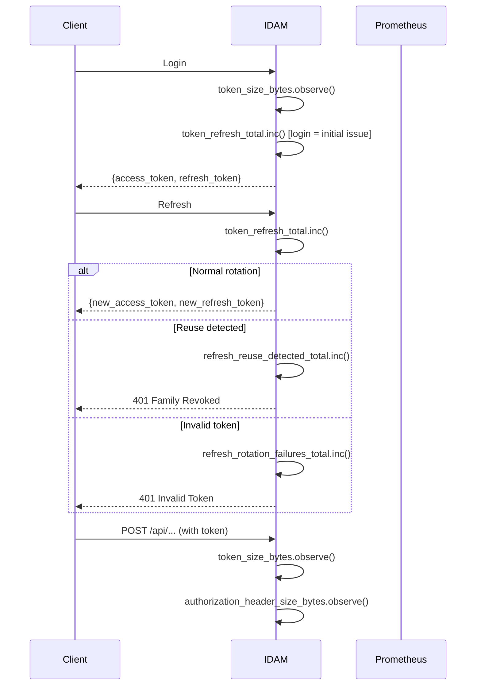

# Story 9.5: Implement Token Lifecycle Metrics

## Epic

[09-observability](../observability.md)

## Parent Epic Story

Story 9.5

## Summary

Implement Prometheus metrics for token lifecycle: `token_refresh_total`, `refresh_reuse_detected_total`, `refresh_rotation_failures_total`, `token_revocation_total`, `revocation_propagation_seconds`, `token_size_bytes`, `authorization_header_size_bytes`. These metrics track the full token lifecycle from issuance through refresh, reuse, and revocation.

## Why This Story Exists

The JWT document requires explicit metrics for every token lifecycle event: "token_refresh_total, refresh_reuse_detected_total, refresh_rotation_failures_total, token_revocation_total, revocation_propagation_seconds, token_size_bytes, authorization_header_size_bytes." Without these metrics, you cannot track token usage patterns, detect token theft, or monitor token size budgets.

## Design Context

### Metric Definitions

| Metric | Type | Labels | Purpose |
|--------|------|--------|---------|
| `token_refresh_total` | Counter | None | Total refresh calls |
| `refresh_reuse_detected_total` | Counter | None | Reuse detection (token theft indicator) |
| `refresh_rotation_failures_total` | Counter | reason | Failed rotations (invalid token, expired, etc.) |
| `token_revocation_total` | Counter | type (logout, family_revoked, version_bump) | Revocation events |
| `revocation_propagation_seconds` | Histogram | None | Time from revocation to service awareness |
| `token_size_bytes` | Histogram | None | JWT token size in bytes |
| `authorization_header_size_bytes` | Histogram | None | Total Authorization header size |

### Implementation

```rust
use prometheus::{register_counter_vec, register_histogram, CounterVec, Histogram};

static TOKEN_REFRESH_TOTAL: Counter = register_counter!(
    "token_refresh_total",
    "Total refresh calls"
).unwrap();

static REFRESH_REUSE_DETECTED_TOTAL: Counter = register_counter!(
    "refresh_reuse_detected_total",
    "Refresh token reuse detected (token theft indicator)"
).unwrap();

static REFRESH_ROTATION_FAILURES: CounterVec = register_counter_vec!(
    "refresh_rotation_failures_total",
    "Failed refresh rotations by reason",
    &["reason"]
).unwrap();

static TOKEN_REVOCATION_TOTAL: CounterVec = register_counter_vec!(
    "token_revocation_total",
    "Token revocation events by type",
    &["type"]
).unwrap();

static REVOCATION_PROPAGATION_SECONDS: Histogram = register_histogram!(
    "revocation_propagation_seconds",
    "Time from revocation to service awareness"
).unwrap();

static TOKEN_SIZE_BYTES: Histogram = register_histogram!(
    "token_size_bytes",
    "JWT token size in bytes"
).unwrap();

static AUTHORIZATION_HEADER_SIZE_BYTES: Histogram = register_histogram!(
    "authorization_header_size_bytes",
    "Total Authorization header size in bytes"
).unwrap();

// Token refresh:
TOKEN_REFRESH_TOTAL.inc();

// Reuse detected:
REFRESH_REUSE_DETECTED_TOTAL.inc();

// Rotation failure:
REFRESH_ROTATION_FAILURES.with(&[("reason", "invalid_token")]).inc();

// Revocation:
TOKEN_REVOCATION_TOTAL.with(&[("type", "logout")]).inc();

// Revocation propagation (measured from version bump to service awareness):
REVOCATION_PROPAGATION_SECONDS.observe(duration.as_secs_f64());

// Token size:
TOKEN_SIZE_BYTES.observe(token.len() as f64);
AUTHORIZATION_HEADER_SIZE_BYTES.observe(header_size as f64);
```

### Token Size Budget Alerts

| Metric | Warning | Critical | Action |
|--------|---------|----------|--------|
| `token_size_bytes` p95 | > 600 bytes | > 750 bytes | Token too large for NGINX default header buffer |
| `authorization_header_size_bytes` p95 | > 900 bytes | > 1024 bytes | Header rejection by NGINX |
| `refresh_reuse_detected_total` | Rate > 0 | Sustained > 0 | Token theft indicator -- investigate |
| `token_revocation_total` | Rate > 5/min | Rate > 20/min | Mass revocation -- possible attack |

### Token Size Budget

```
Target: token_size_bytes < 750 (unencoded)
With base64url (33% overhead): ~1,000 bytes encoded
Plus "Authorization: Bearer " (21 bytes): ~1,021 bytes total header

NGINX default client_header_buffer_size: 1KB (1,024 bytes)

Therefore: token_size_bytes < 750 fits within NGINX default header buffer
```

## Mermaid Diagrams

### Token Lifecycle with Metrics



### Token Size Distribution

```mermaid
gantt
    title Token Size Budget Distribution
    dateFormat X
    axisFormat %dB
    section Standard claims (~180B)
    iss, sub, aud, client_id, scope, exp, nbf, iat, jti :0, 180
    section Version claims (~60B)
    ver, sid :180, 60
    section Tenancy claims (~70B)
    tenant_id, sx.tenant :240, 70
    section Authz claims (~100B)
    roles, permissions, ent_ref, ent_hash, risk :310, 100
    section JOSE header (~80B)
    alg, typ, kid :410, 80
    section Buffer headroom
    NGINX 1KB budget headroom :490, 260
```



### Refresh Token Reuse Detection Timeline

```mermaid
flowchart TD
    A[Token stolen at t=0] --> B[Legitimate user uses token at t=5]
    B --> C[Token rotated, old jti in denylist]
    C --> D[Attacker uses stolen token at t=10]
    D --> E[Reuse detected: refresh_reuse_detected_total.inc()]
    E --> F[All family tokens revoked]
    F --> G[Both parties know compromised]
    
    G --> H[Legitimate user re-authenticates]
    G --> I[Attacker gets 401]
```

## OpenAPI Changes

No OpenAPI changes. Metrics are internal.

## Design Doc References

- `design-doc.md` section 10.1: Token Security -- token lifecycle metrics
- `design-doc.md` section 10.4: Token Versioning & Revocation -- revocation propagation
- `design-doc.md` section 10.12: Observability -- token lifecycle metrics

## Wiki Pages to Update/Create

- `topics/topic-observability.md`: Document token lifecycle metrics
- `topics/topic-token-lifecycle.md`: Document token lifecycle events

## Acceptance Criteria

- [ ] `token_refresh_total` counter is implemented
- [ ] `refresh_reuse_detected_total` counter is implemented
- [ ] `refresh_rotation_failures_total{reason}` counter is implemented
- [ ] `token_revocation_total{type}` counter is implemented
- [ ] `revocation_propagation_seconds` histogram is implemented
- [ ] `token_size_bytes` histogram is implemented
- [ ] `authorization_header_size_bytes` histogram is implemented
- [ ] Token size budget: p95 < 600 bytes, max < 750 bytes
- [ ] Alert on: refresh_reuse_detected_total > 0, token_size p95 > 600, header p95 > 900
- [ ] Unit tests verify: counter increments on each lifecycle event, histogram observations

## Dependencies

- Depends on Story 3.1 (refresh rotation)
- Depends on Story 3.2 (family/reuse detection)
- Depends on Story 5.3 (jti denylist)
- Depends on Story 2.5 (token size budget)

## Risk / Trade-offs

- **Histogram cardinality**: None of these metrics use labels (except `refresh_rotation_failures_total{reason}` and `token_revocation_total{type}`). This keeps the cardinality low. Adding `route` or `user_id` labels would create unbounded cardinality -- never do this for token lifecycle metrics.
- **Token size measurement**: The token size is measured at the point of JWT issuance and at the point of request validation. These are two different measurements: issuance measures the raw token, validation measures the actual Authorization header (which includes "Bearer " prefix and any encoding overhead). Both are needed for complete coverage.
