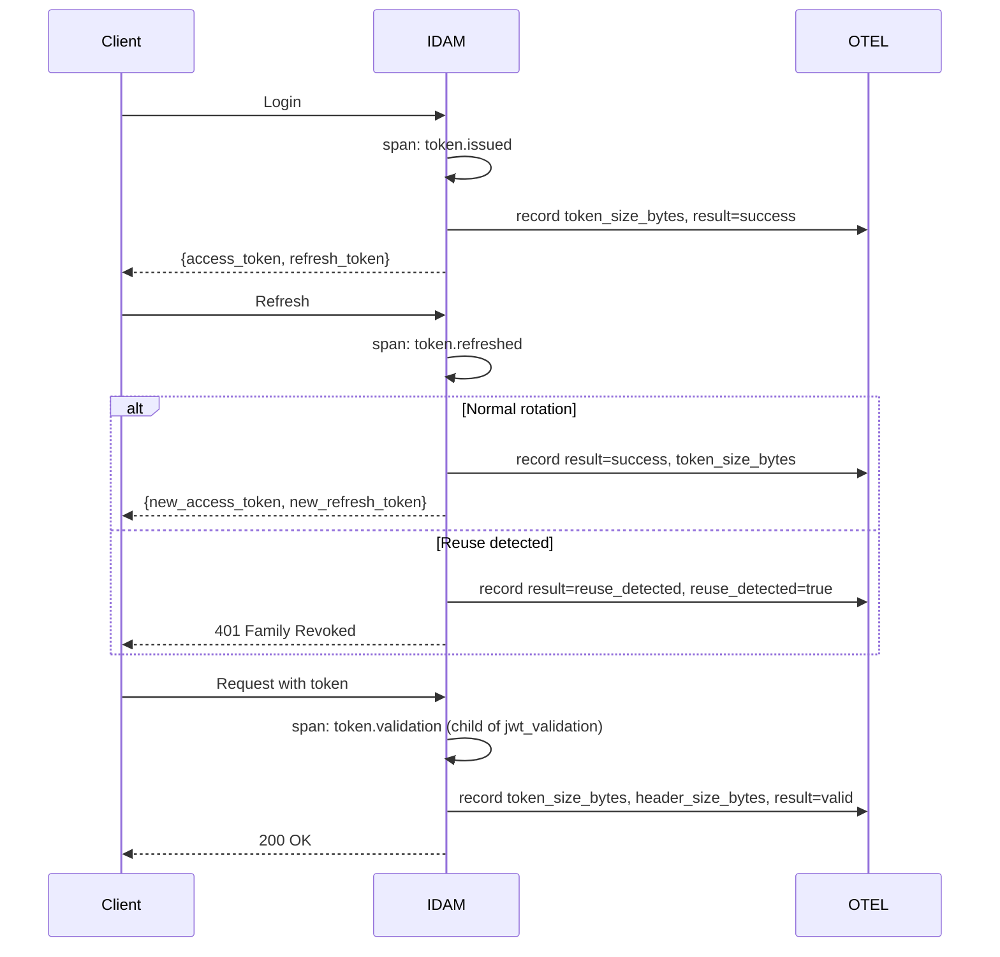
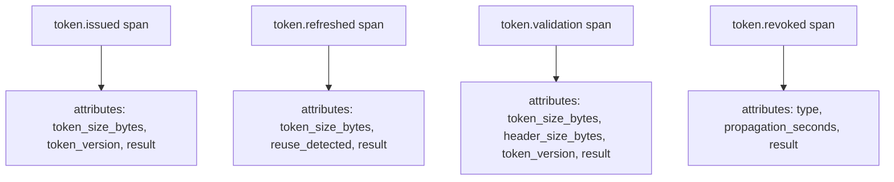

# Story 9.5: Token Lifecycle Observability Spans

## Epic

[09-observability](../observability.md)

## Parent Epic Story

Story 9.5

## Summary

Create OTEL spans and structured logs for token lifecycle events using the `tracing` crate. Spans flow through BRRTRouter's existing `otel::init_logging_with_config()` into Jaeger. **DO NOT use Prometheus counters** — use structured logs for token lifecycle analysis and BRRTRouter's `brrtrouter_request_duration_seconds` for latency.

## Why This Story Exists

The JWT document requires observability for every token lifecycle event: refresh, reuse detection, rotation failure, revocation, propagation, token size. Without spans and structured logs, you cannot track token usage patterns, detect token theft, or monitor token size budgets. **BRRTRouter already provides HTTP-level metrics** — this story adds token-specific diagnostic spans and structured logs.

## Design Context

### Current State

- No token lifecycle spans exist
- No structured logging for token events (refresh, revoke, etc.)
- Token size is not measured or logged anywhere
- No visibility into token theft indicators in traces or logs

### Span Design

```
token.issued (top-level span, on login/refresh)
├── token_size_bytes (attribute)
├── token_version (attribute)
└── result (success/failed)

token.refreshed (top-level span, on refresh call)
├── token_size_bytes (attribute, new token)
├── result (success/rotation_failure)
└── reuse_detected (boolean)

token.revoked (top-level span, on revocation)
├── type (logout/family_revoked/version_bump)
├── affected_count (how many tokens revoked)
└── propagation_seconds (time to propagate)

token.validation (sub-span of jwt_validation from Story 9.1)
├── token_size_bytes (attribute, incoming token)
├── header_size_bytes (attribute, full Authorization header)
├── token_version (attribute)
└── result (valid/revoked/invalid)
```

### Implementation Pattern

```rust
// Token issuance (in identity-login-service)
impl TokenService {
    pub async fn issue_token(&self, user_id: &str, tenant_id: &str, claims: &Claims) -> String {
        let span = tracing::span!(
            tracing::Level::INFO,
            "token.issued",
            user_id = user_id,
            tenant_id = tenant_id,
            token_version = claims.ver,
            token_size_bytes = 0f64 // set after signing
        );
        let _guard = span.enter();
        
        let token = self.sign(claims).await;
        let size = token.len() as f64;
        span.record("token_size_bytes", size);
        span.record("result", "success");
        
        // Structured log at INFO level
        tracing::info!(
            event = "token_issued",
            user_id = user_id,
            tenant_id = tenant_id,
            token_version = claims.ver,
            token_size_bytes = size,
            "Token issued successfully"
        );
        
        token
    }
    
    pub async fn refresh_token(&self, request: &RefreshRequest) -> Result<RefreshResponse, AuthError> {
        let span = tracing::span!(
            tracing::Level::INFO,
            "token.refreshed",
            user_id = ?request.subject,
            reuse_detected = false
        );
        let _guard = span.enter();
        
        match self.do_refresh(request).await {
            Ok(response) => {
                span.record("result", "success");
                span.record("token_size_bytes", response.token.len() as f64);
                tracing::info!(
                    event = "token_refreshed",
                    user_id = ?request.subject,
                    token_size_bytes = response.token.len() as f64,
                    "Token refreshed successfully"
                );
                Ok(response)
            }
            Err(AuthError::ReuseDetected) => {
                span.record("result", "reuse_detected");
                span.record("reuse_detected", true);
                tracing::warn!(
                    event = "refresh_token_reuse_detected",
                    user_id = ?request.subject,
                    "Refresh token reuse detected — token theft indicator"
                );
                Err(AuthError::ReuseDetected)
            }
            Err(e) => {
                span.record("result", "rotation_failure");
                span.record("error", %e);
                tracing::error!(
                    event = "token_rotation_failure",
                    user_id = ?request.subject,
                    error = %e,
                    "Token rotation failed"
                );
                Err(e)
            }
        }
    }
    
    pub async fn revoke_token(&self, user_id: &str, revocation_type: &str) -> Result<(), AuthError> {
        let span = tracing::span!(
            tracing::Level::INFO,
            "token.revoked",
            user_id = user_id,
            type = revocation_type
        );
        let _guard = span.enter();
        
        let start = std::time::Instant::now();
        
        match self.do_revoke(user_id, revocation_type).await {
            Ok(()) => {
                let duration = start.elapsed();
                span.record("result", "success");
                span.record("propagation_seconds", duration.as_secs_f64());
                tracing::info!(
                    event = "token_revoked",
                    user_id = user_id,
                    type = revocation_type,
                    propagation_seconds = duration.as_secs_f64(),
                    "Token revoked successfully"
                );
                Ok(())
            }
            Err(e) => {
                span.record("result", "failure");
                span.record("error", %e);
                tracing::error!(
                    event = "token_revocation_failure",
                    user_id = user_id,
                    type = revocation_type,
                    error = %e,
                    "Token revocation failed"
                );
                Err(e)
            }
        }
    }
}

// Token validation (in JWT middleware, integrates with Story 9.1)
impl JwtMiddleware {
    async fn validate_request(&self, req: &HttpRequest) {
        let span = tracing::span!(
            tracing::Level::DEBUG,
            "token.validation",
            route = req.path(),
            token_size_bytes = 0f64, // set from token
            header_size_bytes = 0f64, // set from Authorization header
            token_version = 0 // set from claims
        );
        let _guard = span.enter();
        
        // Measure token size
        let token = self.extract_token(req).await;
        if let Some(ref token) = token {
            span.record("token_size_bytes", token.len() as f64);
            span.record("header_size_bytes", req.header("Authorization").len() as f64);
        }
        
        // Measure token version from claims
        if let Some(claims) = self.parse_claims(&token) {
            span.record("token_version", claims.ver);
        }
        
        // Check revocation
        if let Some(jti) = token.as_ref().and_then(|t| self.get_jti(t)) {
            if self.is_revoked(jti).await {
                span.record("result", "revoked");
                tracing::warn!(
                    event = "token_validation_revoked",
                    jti = jti,
                    route = req.path(),
                    "Token validation failed — token revoked"
                );
                return;
            }
        }
        
        span.record("result", "valid");
    }
}
```

### Token Size Budget (for reference — not tracked as metrics)

```
Target: token_size_bytes < 750 (unencoded)
With base64url (33% overhead): ~1,000 bytes encoded
Plus "Authorization: Bearer *** (21 bytes): ~1,021 bytes total header

NGINX default client_header_buffer_size: 1KB (1,024 bytes)

Therefore: token_size_bytes < 750 fits within NGINX default header buffer
```

### Structured Log Format (token events)

| Event | Level | Fields |
|-------|-------|--------|
| `token_issued` | INFO | `user_id`, `tenant_id`, `token_version`, `token_size_bytes` |
| `token_refreshed` | INFO | `user_id`, `token_size_bytes` |
| `refresh_token_reuse_detected` | WARN | `user_id` (theft indicator) |
| `token_rotation_failure` | ERROR | `user_id`, `error` |
| `token_revoked` | WARN | `user_id`, `type`, `propagation_seconds` |
| `token_validation_revoked` | WARN | `jti`, `route` |

### Token Size Monitoring (without metrics)

Since we're NOT using `token_size_bytes` histogram, the token size budget is enforced by:
1. **Code review**: Token size calculation in Story 2.5
2. **Logging**: `token.issued` span records `token_size_bytes` attribute — visible in Jaeger
3. **Validation**: `token.validation` span records `token_size_bytes` and `header_size_bytes` attributes — visible in Jaeger
4. **Monitoring**: If NGINX starts rejecting requests with header-too-large, investigate via Jaeger span traces

## Mermaid Diagrams

### Token Lifecycle with Spans



### Token Size Span Attributes



## Malicious Hacker Gotchas (Must Be Addressed During Implementation)

> **Source:** `docs/PRS_SECURITY_HARDENING.md` — Security threat model analysis

### HACK-951: Token Lifecycle Spans Leak User Identification Patterns (CRITICAL — Hole #5 from PRS)

**Risk:** Token lifecycle spans (`token.issued`, `token.refreshed`, `token.revoked`) record `user_id` and `tenant_id`, enabling user behavior profiling if an attacker gains access to Jaeger traces

The story records: `user_id`, `tenant_id`, `token_version` in spans. If an attacker can see Jaeger traces, they can track a user across time.

**Exploit path (user activity correlation):**
1. Attacker gains access to Jaeger traces
2. Attacker queries for `token.issued` spans with `user_id=user_123`
3. The attacker sees: when the user logged in, what tenant they belong to, what version their token was
4. At different times, the attacker queries for `token.refreshed` spans with `user_id=user_123`
5. The attacker builds a timeline of the user's authentication activity
6. Result: User activity profiling from observability data

**This is a significant risk:** observability systems are often less protected than the application itself.

**Exploit path (user enumeration via token lifecycle):**
1. Attacker queries for `token.revoked` spans
2. The `type` attribute reveals the revocation type: `logout`, `family_revoked`, `version_bump`
3. If `family_revoked` → the user's entire token family was revoked → possible compromise
4. If `version_bump` → the user's permissions changed → possible admin action against the user
5. Result: The attacker can identify which users were targeted by admin actions

**Implementation requirement:**
- Do NOT record `user_id` in token lifecycle spans — use a hash or anonymize the user_id
- Do NOT record `tenant_id` in token lifecycle spans — tenant context is operational, not needed for debugging
- If `user_id` is needed for debugging, only include it in logs (not spans), and restrict log access
- Document: "Token lifecycle spans do NOT record user_id or tenant_id. These fields are logged only to secure audit logs."

### HACK-952: Revocation Propagation Span Can Be Used to Time Token Revocation (HIGH — related to Hole #3 from PRS)

**Risk:** The `propagation_seconds` attribute reveals exactly how long it takes for a revocation to take effect

The story records: `span.record("propagation_seconds", duration.as_secs_f64())`. An attacker can use this to time attacks around revocation propagation.

**Exploit path (timing attack around revocation):**
1. Attacker's token is revoked (e.g., by admin or password change)
2. The `token.revoked` span records `propagation_seconds=2.5`
3. The attacker knows: their token will be valid for up to 2.5 more seconds after revocation
4. The attacker sends a high-value request within those 2.5 seconds
5. If the revocation uses a Redis denylist with 5-second cache TTL, the attacker has a 2.5-second window
6. Result: The attacker completes an action during the revocation propagation window

**The story already acknowledges this:** `propagation_seconds` measures from local revocation to local awareness, NOT cross-service propagation. Cross-service propagation depends on the denylist cache TTL.

**Implementation requirement:**
- The `propagation_seconds` attribute should measure cross-service propagation (time from revocation to when ALL services have the denylist entry), not just local awareness
- OR: remove `propagation_seconds` from the span and only include it in secure audit logs
- Document: "Propagation measurement captures cross-service denylist propagation, not just local cache."

### HACK-953: Token Validation Span Header Size Exposes Authorization Header Contents (MEDIUM — related to Hole #5 from PRS)

**Risk:** The `token.validation` span records `header_size_bytes`, which correlates with the length of the Authorization header (including the token)

The story records: `span.record("header_size_bytes", req.header("Authorization").len() as f64)`. The header size varies with token size (which varies with user permissions).

**Exploit path (token size oracle):**
1. Attacker sends a request and measures the `header_size_bytes` from the response (if exposed) or from the span (if they have Jaeger access)
2. The header size correlates with the token size, which correlates with the user's permission count
3. Result: The attacker can estimate the user's privilege level

**Implementation requirement:**
- Record `header_size_bytes` as a bucket (e.g., "under_1KB", "1-2KB", "over_2KB") instead of the exact value
- OR: remove `header_size_bytes` from spans and only include it in secure audit logs
- Document: "Token validation span attributes do not include exact header size."

---

## OpenAPI Changes

No OpenAPI changes. Spans and logs are internal.

## Design Doc References

- `design-doc.md` section 10.1: Token Security -- token lifecycle
- `design-doc.md` section 10.4: Token Versioning & Revocation
- `observability.md`: Epic 9 OTEL pattern

## Wiki Pages to Update/Create

- `topics/topic-observability.md`: Document token lifecycle spans

## Acceptance Criteria

- [ ] `token.issued` span created on every token issuance (login + refresh)
- [ ] `token.refreshed` span created on every refresh, records reuse_detected
- [ ] `token.revoked` span created on every revocation, records type + propagation_seconds
- [ ] `token.validation` span created as child of jwt_validation, records token_size_bytes + header_size_bytes
- [ ] Structured logs at correct levels: INFO for issue/refresh, WARN for reuse/revocation, ERROR for rotation failure
- [ ] Token size budget: p95 < 600 bytes enforced via code review + Jaeger span inspection
- [ ] No Prometheus counters for token lifecycle (use structured logs for analysis)

## Dependencies

- Depends on Story 3.1 (refresh rotation)
- Depends on Story 3.2 (family/reuse detection)
- Depends on Story 5.3 (jti denylist)
- Depends on Story 9.1 (JWT validation spans — parent span)

## Risk / Trade-offs

- **Log volume**: Token lifecycle events are lower volume than JWT validations. ~100 RPS token events vs 10,000 RPS JWT validations. Acceptable.
- **No token size histogram**: Token size is NOT tracked as a Prometheus histogram. Use Jaeger spans to inspect token size in individual traces. If you need aggregated token size stats, add `set_extra_prometheus` callback — not direct counter registration.
- **Propagation measurement**: `propagation_seconds` measures from local revocation to local awareness, not cross-service propagation. For cross-service, use Jaeger trace correlation (W3C traceparent).
