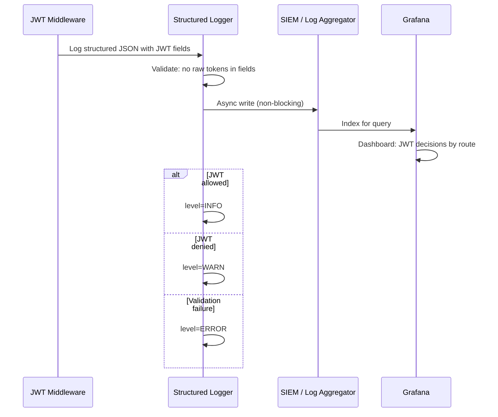
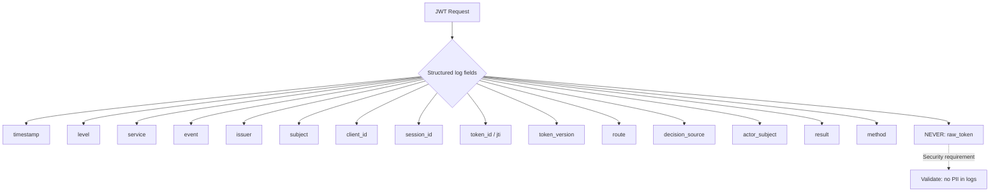
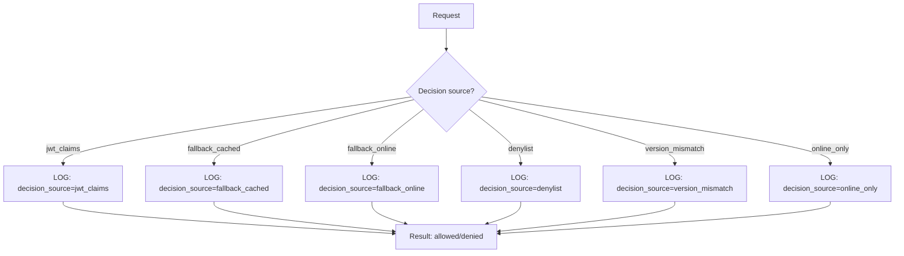

# Story 9.6: Implement Structured JWT Logging

## Epic

[09-observability](../observability.md)

## Parent Epic Story

Story 9.6

## Summary

Implement per-request structured JWT logging with standard fields: issuer, subject, client_id, session_id, token_id (jti), token_version, route, decision_source, actor subject (when act is present). NEVER log raw access tokens or refresh tokens. Log at INFO level for audit trail, WARN for mismatches, ERROR for validation failures.

## Why This Story Exists

The JWT document requires: "Per-request structured log fields: issuer, subject, client_id, session_id, token_id, token_version, route, decision_source (jwt/fallback/denylist/version_mismatch), actor subject when act is present. NEVER log raw access tokens or refresh tokens." Structured logging enables programmatic analysis of JWT decisions, incident investigation, and compliance reporting.

## Design Context

### Current State

- No structured JWT logging
- JWT validation failures appear in service logs but without standard fields
- No decision_source field (can't tell if JWT or authz-core made the decision)
- No actor subject in logs (delegation events are untraceable)

### Structured Log Format

```json
{
  "timestamp": "2026-05-15T22:30:00Z",
  "level": "WARN",
  "service": "identity-user-mgmt-service",
  "event": "jwt_validation",
  "issuer": "https://idam.example.com",
  "subject": "user_123",
  "client_id": "web-portal",
  "session_id": "ses_01JV8W...",
  "token_id": "tok_abc123",
  "token_version": 42,
  "route": "/api/v1/identity/users/me",
  "decision_source": "jwt_claims",
  "actor_subject": null,
  "result": "allowed",
  "method": "GET"
}
```

### Decision Source Values

| Value | When Used |
|-------|-----------|
| `jwt_claims` | JWT common path evaluated and decided |
| `fallback_cached` | Online fallback result came from cache |
| `fallback_online` | Online fallback called authz-core |
| `denylist` | Token was in jti denylist |
| `version_mismatch` | claims.ver < cached_ver |
| `online_only` | Route was online-only, always called authz-core |

### Actor Subject

The actor subject is populated when the JWT contains an `act` claim (delegation):

```json
{
  "actor_subject": "support_agent_456"
}
```

When there is no act claim, it is null:

```json
{
  "actor_subject": null
}
```

### Security: Never Log Tokens

Raw access tokens and refresh tokens MUST NEVER appear in logs. This is a hard requirement -- tokens are secrets that should never be persisted in log files, SIEMs, or any persistent storage.

```rust
// WRONG: logs the raw token
error!("Invalid token: {}", token);  // NEVER DO THIS

// CORRECT: logs the token ID (jti)
error!("Invalid token: jti={}", claims.jti);
```

### Logging Levels

| Event | Level | Fields Logged |
|-------|-------|--------------|
| JWT allowed | INFO | All standard fields |
| JWT denied | WARN | All standard fields + error_reason |
| Validation failure | ERROR | All standard fields + error_details |
| Version mismatch | WARN | All standard fields + expected_ver, actual_ver |
| Token revocation | WARN | All standard fields + revocation_reason |
| Delegation | INFO | All standard fields + actor_subject + delegation_type |

## Mermaid Diagrams

### Structured Log Flow



### Log Field Completeness



### Decision Source Flow



## Malicious Hacker Gotchas (Must Be Addressed During Implementation)

> **Source:** `docs/PRS_SECURITY_HARDENING.md` — Security threat model analysis

### HACK-961: Log Field Injection via JWT Claims (CRITICAL — Hole #7 from PRS)

**Risk:** Attacker crafts a JWT with a claim that has the same key name as a log field (e.g., `level`, `event`, `service`) to overwrite the log metadata

The story says: "NEVER log raw access tokens or refresh tokens." But what about the structured log field names? If the attacker can inject a claim called `level`, could they change the log level?

**Exploit path (log field name injection via JWT):**
1. The structured logger builds a log entry with fields: `event`, `level`, `user_id`, `tenant_id`, `route`, `decision_source`, `result`, etc.
2. If the logger uses the JWT claims directly in the log entry (e.g., `claims` as a JSON blob), the attacker can inject fields
3. BUT: the attacker can ALSO inject fields if the logger merges JWT claims into the log entry at the top level

**Exploit path (log level override):**
1. Attacker forges a JWT with claim `level: "INFO"` (instead of WARN or ERROR)
2. The logger reads the JWT claims and includes them in the structured log
3. If the logger sets the log level from the claim (instead of from the event severity), the attacker downgrades a WARN/ERROR to INFO
4. Result: Security events are logged at INFO level instead of WARN/ERROR, potentially being filtered out by log aggregation rules

**The real exploit is different:** What if the attacker crafts a JWT where the `event` claim has the value `event: "jwt_validation"` and the logger uses this directly?

**Exploit path (log event injection):**
1. Attacker forges a JWT with a claim `event: "security_audit_success"`
2. The structured logger includes this claim in the log entry
3. The log entry now has TWO `event` fields: one from the middleware (e.g., `event: "jwt_validation"`) and one from the JWT claims (e.g., `event: "security_audit_success"`)
4. If the log aggregation tool uses the FIRST `event` field, it might use the attacker's value
5. Result: The log entry is misclassified, and security monitoring misses the event

**Implementation requirement:**
- NEVER merge JWT claims directly into the structured log entry at the top level
- All log fields MUST be set explicitly by the middleware, not from JWT claims
- If JWT claims need to be included in the log, they MUST be in a nested `claims` object, not at the top level
- Add a validation step: "Verify that no JWT claim name matches a log field name"
- Document: "Structured log fields are set explicitly by the middleware. JWT claims are NEVER merged into the log entry at the top level."

### HACK-962: Structured Log Contains Subject/Issuer/Tenant Which Enables User/tenant Enumeration (HIGH — related to Hole #5 from PRS)

**Risk:** The structured log includes `issuer`, `subject`, `client_id`, `session_id`, `token_id`, `token_version`, `tenant_id` — all visible in the log stream

The story includes these fields in every structured log entry. If an attacker gains access to the log stream (e.g., Loki/SIEM), they can:
1. Extract all `subject` values (user IDs)
2. Extract all `tenant_id` values (tenant enumeration)
3. Extract all `issuer` values (trust chain mapping)
4. Correlate users with tenants, clients, and sessions

**Exploit path (user enumeration via log analysis):**
1. Attacker has access to Loki/SIEM (e.g., via a compromised service account)
2. Attacker queries: `{service=~".*idam.*"} | json | "event"="jwt_validation" | table subject, tenant_id`
3. Result: A list of all user IDs and their tenant IDs
4. Attacker can now target specific users (e.g., platform admins, org admins)

**This is the inherent risk of structured logging:** you need user context for audit trails, but that context is visible to anyone with log access.

**The mitigation is access control:** restrict log stream access to authorized personnel only.

**Implementation requirement:**
- Structured log access MUST be restricted to authorized personnel via RBAC on the log aggregation system (Loki/Grafana)
- Add a note in the design doc: "Structured logs contain user context (subject, tenant_id, session_id). Access to log streams MUST be restricted via RBAC."
- Consider: hashing the `subject` and `tenant_id` in logs for compliance with data protection regulations (if required by the jurisdiction)
- Document: "Structured logs contain user context. Log access is restricted via RBAC on the log aggregation system."

### HACK-963: Decision Source Field Can Be Used to Probe Authorization Logic (MEDIUM — related to Hole #4 from PRS)

**Risk:** The `decision_source` field reveals which authorization path was used for each request

The story defines `decision_source` values: `jwt_claims`, `fallback_cached`, `fallback_online`, `denylist`, `version_mismatch`, `online_only`. An attacker can use this to map the authorization logic.

**Exploit path (authorization logic mapping):**
1. Attacker sends requests to different routes
2. For each route, the attacker checks the `decision_source` in the structured log (if accessible)
3. Routes with `decision_source=jwt_claims` → JWT-only routes
4. Routes with `decision_source=fallback_cached` or `fallback_online` → jwt-with-fallback routes
5. Routes with `decision_source=online_only` → authz-core-only routes
6. Result: The attacker maps the authorization classification of all routes

**This is useful for an attacker:** knowing which routes are jwt-only helps them identify routes that can be accessed with a forged JWT (if they can forge a valid JWT signature).

**Implementation requirement:**
- `decision_source` MUST NOT be included in logs that are accessible to attackers
- OR: use a generic value (e.g., `decision_source=jwt_or_fallback`) instead of the specific value
- Document: "The decision_source field in structured logs should not be accessible to untrusted parties."

### HACK-964: Structured Log Volume Can Cause Log Ingestion DoS (HIGH — related to Hole #3 from PRS)

**Risk:** An attacker floods the system with requests, generating massive structured log volumes that exhaust the log ingestion pipeline

The story says: "At 10,000 RPS, this generates ~600,000 log lines per minute." But what if the attacker generates 100,000 RPS?

**Exploit path (log ingestion DoS):**
1. Attacker sends 100,000 requests per second to jwt-with-fallback routes
2. Each request generates a structured log entry (INFO/WARN level)
3. The log ingestion pipeline (Loki/Fluentd/Vector) is overwhelmed
4. The log pipeline drops entries or becomes delayed
5. When a REAL security event occurs (e.g., token theft), it is lost in the noise
6. Result: The security team misses the real event because the log pipeline was DoS'd

**Implementation requirement:**
- Structured logging for successful JWT validations (INFO level) should be rate-limited: MAX 10,000 log entries per second per service
- If the rate limit is exceeded, excess INFO-level logs are dropped (not written to the log stream)
- WARN/ERROR-level logs are NEVER rate-limited (they are security-critical)
- Add a metric: `structured_log_dropped_total{level: "INFO"}` to track dropped entries
- Document: "INFO-level structured logs are rate-limited to 10,000 entries/sec. WARN/ERROR logs are never rate-limited."

### HACK-965: Actor Subject Field Can Be Used to Spoof Delegation Context (MEDIUM — related to Hole #1 from PRS)

**Risk:** If the attacker can forge a JWT with an `act` claim, the structured log will record the forged actor subject

The story says: "Actor subject is populated when the JWT contains an `act` claim." If the attacker forges an `act` claim, the log will include the forged actor subject.

**Exploit path (delegation context spoofing in logs):**
1. Attacker forges a JWT with `act.sub = "support_agent_admin"`
2. The attacker sends a request to an admin route
3. The structured log records `actor_subject = "support_agent_admin"`
4. If the log stream is accessible, the attacker can see that the request was logged as coming from "support_agent_admin"
5. Result: The attacker can manipulate the audit trail by spoofing the actor subject in logs

**The log does NOT prevent the attack:** the log records what the JWT claims say, not what the ACTUAL actor is. The real verification happens at the authz-core level (Story 4.1).

**Implementation requirement:**
- The `actor_subject` in the structured log MUST be cross-checked against the actual actor identity verified by authz-core
- If the actor subject in the JWT does NOT match the verified actor identity from authz-core, log a WARN event: `event="actor_subject_mismatch"`
- Document: "The actor_subject in structured logs is cross-checked against authz-core verification."

---

## OpenAPI Changes

No OpenAPI changes. Logging is internal to the service.

## Design Doc References

- `design-doc.md` section 10.12: Observability -- structured JWT logging format
- `design-doc.md` section 10.5: Delegation & Actor Claims -- actor subject in logs

## Wiki Pages to Update/Create

- `topics/topic-observability.md`: Document structured log format
- `topics/topic-token-security.md`: Document security: never log tokens

## Acceptance Criteria

- [ ] All JWT validation requests produce structured JSON log entries
- [ ] All required fields are present: timestamp, level, service, event, issuer, subject, client_id, session_id, token_id, token_version, route, decision_source, actor_subject, result, method
- [ ] decision_source is one of: jwt_claims, fallback_cached, fallback_online, denylist, version_mismatch, online_only
- [ ] actor_subject is populated when act claim is present, null otherwise
- [ ] Raw tokens are NEVER in log entries (verified by unit test)
- [ ] PII fields (email, phone) are NEVER in log entries
- [ ] Logging is async (non-blocking) -- does not add latency to request
- [ ] Log levels: INFO for allowed, WARN for denied, ERROR for validation failures
- [ ] Unit tests verify: structured log format, no raw tokens, required fields present

## Dependencies

- Depends on Story 4.2 (JWT middleware -- where logging happens)
- Depends on Story 6.1 (act claim -- for actor_subject field)
- Can be implemented in parallel with other epics

## Risk / Trade-offs

- **Log volume**: Structured JSON logging is more verbose than plain text. At 10,000 RPS, this generates ~600,000 log lines per minute. Mitigation: use DEBUG level for successful JWT validations (low-value logs), INFO/WARN/ERROR for security-relevant events. The `event: "jwt_validation"` field allows filtering to only security-relevant events.
- **Subject privacy**: The subject (user_id) is logged in every request. This is necessary for audit trail but could be considered PII in some jurisdictions. Mitigation: user_id is an opaque identifier (not email or phone), so it's not PII under GDPR. If user_id needs to be hashed for privacy, add a `hash_subject` flag in the logging configuration.
- **Token_id vs raw token**: The `token_id` (jti) is logged, not the raw token. The jti is a UUID that identifies the token but cannot be used as a token. This is the correct approach -- the jti is metadata, the raw token is a secret.

## Tests

### Unit Tests

- [ ] **All required fields present in log entry**: Given a JWT validation event, assert the structured log contains: `event`, `user_id`, `tenant_id`, `route`, `decision_source`, `result`, `method`
- [ ] **Actor subject populated when act claim present**: Given JWT with `act` claim = `support_agent_456`, assert `actor_subject` field = `"support_agent_456"`
- [ ] **Actor subject null when no act claim**: Given JWT without `act` claim, assert `actor_subject` field is absent or null
- [ ] **No raw token in log entry**: Assert the log entry does NOT contain the raw access token string (verify by checking log output after validation of a known token)
- [ ] **No PII in log entry**: Assert the log entry does NOT contain email, phone, or name fields — only `user_id` (opaque identifier)
- [ ] **decision_source reflects correct value**: Given JWT common path decided, assert `decision_source` = `"jwt_claims"`. Given fallback cached, assert `decision_source` = `"fallback_cached"`
- [ ] **Log level matches severity**: Given JWT allowed, assert INFO level. Given JWT denied, assert WARN level. Given validation failure, assert ERROR level
- [ ] **jti logged, not raw token**: Given token with jti `"tok_abc123"`, assert log contains `"jti": "tok_abc123"` and does NOT contain the raw JWT string

### Integration Tests (BDD-style with `rstest_bdd`)

- [ ] **Scenario: JWT allowed — INFO log with all fields**: `given` a valid JWT for route `/api/v1/identity/users/me` → `when` the request is processed → `then` an INFO-level structured log is written with `event=jwt_validation`, `result=allowed`, `decision_source=jwt_claims`, and all required fields
- [ ] **Scenario: JWT denied — WARN log with error reason**: `given` an expired JWT → `when` the request is processed → `then` a WARN-level structured log is written with `event=jwt_validation_failed`, `error=token_expired`, and all required fields
- [ ] **Scenario: Fallback cached — decision_source=fallback_cached**: `given` a jwt-with-fallback route with cached result → `when` the request is processed → `then` the structured log contains `decision_source=fallback_cached`
- [ ] **Scenario: Fallback online — decision_source=fallback_online**: `given` a jwt-with-fallback route with cache miss → `when` the request is processed → `then` the structured log contains `decision_source=fallback_online`
- [ ] **Scenario: Delegation request — actor_subject populated**: `given` a JWT with `act` claim → `when` the request is processed → `then` the structured log contains `actor_subject` with the delegate's subject
- [ ] **Scenario: Denylist denial — decision_source=denylist**: `given` a token in the jti denylist → `when` the request is processed → `then` the structured log contains `decision_source=denylist`
- [ ] **Scenario: Structured log is async (non-blocking)**: `given` a JWT validation → `when` the handler returns → `then` the structured log write completed within 1ms (does not add noticeable latency)

### Security Regression Tests

- [ ] **Raw access token NEVER appears in any log level**: Assert that after every validation path (allowed, denied, revoked, expired), no log entry contains the raw JWT token string — use a regex match against log output
- [ ] **Raw refresh token NEVER appears in any log level**: Same as above but for refresh tokens — assert no log entry contains the refresh token string
- [ ] **Email/phone NEVER in structured logs**: Assert that no log entry contains fields like `email`, `phone`, `name` — only opaque identifiers (`user_id`, `tenant_id`, `jti`)
- [ ] **Structured log field injection via JWT claims**: Given a malicious JWT with claims that match log field names (e.g., a `level` or `event` claim), assert the structured logger uses the correct value and does not allow claim values to overwrite the log level or event field

### Edge Cases

- [ ] **JWT with empty claims**: Given a JWT with minimal claims (only iss, sub, exp), assert the structured log is still produced with all fields present (missing fields use null or are omitted)
- [ ] **JWT with maximum claim size**: Given a JWT with oversized claims (e.g., very long permissions array), assert the structured log does not panic or truncate — all claims are safely serialized to JSON
- [ ] **Act claim with complex delegation chain**: Given a nested act claim (agent acting on behalf of another agent), assert the structured log captures the top-level actor subject correctly
- [ ] **Structured log during service shutdown**: Given the service is shutting down and the log subscriber is being dropped, assert the structured log write is either completed or silently discarded — no panic or crash
- [ ] **Very high RPS structured logging**: Given 10,000 RPS with structured logging enabled, assert the logging layer does not drop entries or cause request latency increase > 0.5ms

### Cleanup

- [ ] No persistent state is left by structured logging — all logs go through the tracing subscriber (stdout or OTLP), no filesystem writes
- [ ] If tests use a real tracing subscriber (for log verification), reset the subscriber between tests using `tracing_subscriber::registry().reset()` to prevent cross-test log pollution
- [ ] Mock authz-core responses must be isolated per test — each test should configure its own mock server or use different response expectations to prevent response pollution
- [ ] JWT claims used in tests must be independent — each test should create its own token to prevent jti denylist cross-test contamination
- [ ] If tests verify log output (e.g., check for structured fields), use `tracing_subscriber::fmt::TestLayer` or `tracing-test` crate to capture logs in-memory rather than writing to stdout
- [ ] Structured log level configuration must be explicit per test — set `BRRTR_LOG_LEVEL` explicitly for each test to ensure consistent log capture
