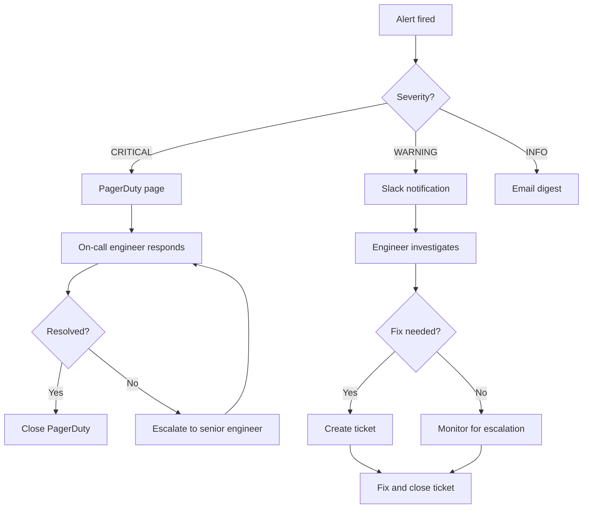
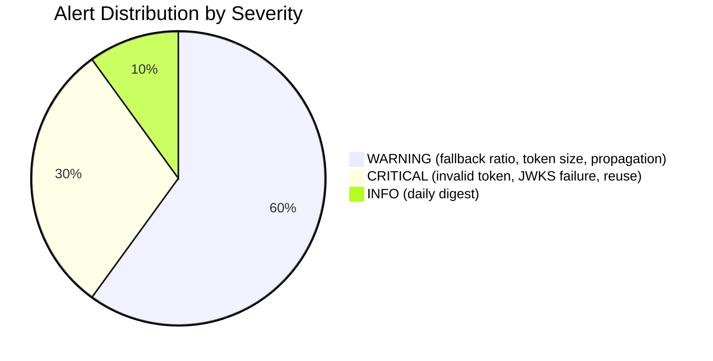
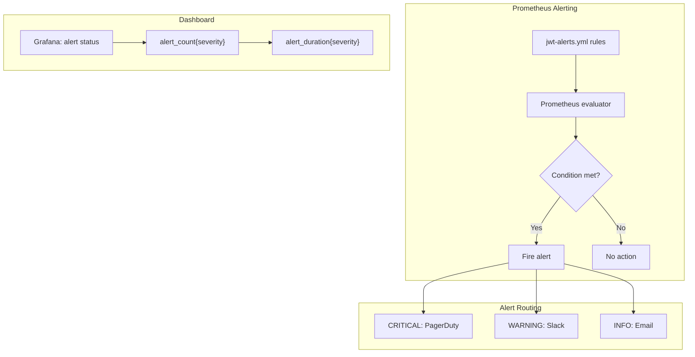

# Story 9.7: Configure Alerting

## Epic

[09-observability](../observability.md)

## Parent Epic Story

Story 9.7

## Summary

Configure Prometheus alerting rules for all JWT-related metrics: invalid-token error spikes, JWKS refresh failures, fallback ratio spikes, token-size percentile growth, refresh-token reuse detection, and revocation propagation exceeding route-class SLO. Alert thresholds defined per metric.

## Why This Story Exists

The JWT document states: "Sudden increases in invalid-token errors, JWKS refresh failures, fallback ratio spikes, token-size percentile growth, refresh-token reuse detection, revocation propagation exceeding route-class SLO." Without alerting, you won't know that something is wrong until users start reporting problems.

## Design Context

### Alert Rule Catalog

| Alert | Metric | Condition | Severity | Action |
|-------|--------|-----------|----------|--------|
| InvalidTokenSpike | `rate(jwt_validation_total{result="denied"}[5m])` | > 10% of total JWT validations | CRITICAL | Page on-call |
| JwksRefreshFailure | `jwks_refresh_failures_total` | Rate > 0 in last 5m | CRITICAL | Page on-call |
| JwksCacheStale | `jwks_last_refresh_age_seconds` | > 300 | WARNING | Ticket for SRE |
| FallbackRatioSpike | `authz_fallback_ratio` | > 20% for any jwt-with-fallback route | WARNING | Ticket for dev |
| OverallFallbackSpike | `authz_fallback_total / jwt_validation_total` | > 10% overall | CRITICAL | Page on-call |
| TokenSizeGrowth | `histogram_quantile(0.95, rate(token_size_bytes[1h]))` | > 600 bytes | WARNING | Ticket for dev |
| TokenSizeCritical | `histogram_quantile(0.99, rate(token_size_bytes[1h]))` | > 750 bytes | CRITICAL | Page on-call |
| RefreshTokenReuse | `rate(refresh_reuse_detected_total[5m])` | > 0 | CRITICAL | Page on-call -- possible theft |
| RevocationPropagationSlow | `revocation_propagation_seconds` | p95 > 60 seconds | WARNING | Ticket for dev |
| ShadowDecisionMismatch | `authz_shadow_mismatch_total` | > 0 during migration | WARNING | Investigate JWT common path |

### Prometheus Alerting Rules

```yaml
# prometheus/alerts/jwt-alerts.yml
groups:
  - name: jwt-authz-alerts
    rules:
      # CRITICAL: Sudden increase in invalid-token errors
      - alert: InvalidTokenSpike
        expr: >
          rate(jwt_validation_total{result="denied"}[5m])
          /
          rate(jwt_validation_total[5m])
          > 0.10
        for: 5m
        labels:
          severity: critical
        annotations:
          summary: "JWT validation denial rate > 10% over 5 minutes"
          description: "Sudden spike in invalid JWT errors. Rate: {{ $value | humanizePercentage }}"

      # CRITICAL: JWKS refresh failures
      - alert: JwksRefreshFailure
        expr: >
          increase(jwks_refresh_failures_total[5m]) > 0
        for: 1m
        labels:
          severity: critical
        annotations:
          summary: "JWKS refresh failing"
          description: "JWKS endpoint unreachable. {{ $value }} failures in last 5 minutes."

      # WARNING: JWKS cache stale
      - alert: JwksCacheStale
        expr: >
          jwks_last_refresh_age_seconds > 300
        for: 5m
        labels:
          severity: warning
        annotations:
          summary: "JWKS cache is stale (> 5 minutes old)"
          description: "Last JWKS refresh was {{ $value | humanizeDuration }} ago."

      # WARNING: Fallback ratio spike per route
      - alert: FallbackRatioSpike
        expr: >
          authz_fallback_ratio > 0.20
        for: 10m
        labels:
          severity: warning
        annotations:
          summary: "Fallback ratio > 20% for route {{ $labels.route }}"
          description: "JWT common path may not be working. Fallback ratio: {{ $value | humanizePercentage }}"

      # CRITICAL: Overall fallback ratio spike
      - alert: OverallFallbackSpike
        expr: >
          rate(authz_fallback_total[5m])
          /
          rate(jwt_validation_total[5m])
          > 0.10
        for: 5m
        labels:
          severity: critical
        annotations:
          summary: "Overall fallback ratio > 10% over 5 minutes"
          description: "More than 10% of requests are hitting authz-core. JWT common path is not effective."

      # WARNING: Token size growing
      - alert: TokenSizeGrowth
        expr: >
          histogram_quantile(0.95, rate(token_size_bytes_bucket[1h])) > 600
        for: 30m
        labels:
          severity: warning
        annotations:
          summary: "Token p95 size > 600 bytes"
          description: "JWT tokens are growing. p95: {{ $value | humanize }} bytes. Risk of header rejection."

      # CRITICAL: Token size too large
      - alert: TokenSizeCritical
        expr: >
          histogram_quantile(0.99, rate(token_size_bytes_bucket[1h])) > 750
        for: 5m
        labels:
          severity: critical
        annotations:
          summary: "Token p99 size > 750 bytes"
          description: "JWT tokens exceed 750 bytes. NGINX header rejection likely."

      # CRITICAL: Refresh token reuse (theft indicator)
      - alert: RefreshTokenReuse
        expr: >
          rate(refresh_reuse_detected_total[5m]) > 0
        for: 1m
        labels:
          severity: critical
        annotations:
          summary: "Refresh token reuse detected -- possible token theft"
          description: "A refresh token was used twice. This indicates a compromised token. Family has been revoked."

      # WARNING: Slow revocation propagation
      - alert: RevocationPropagationSlow
        expr: >
          histogram_quantile(0.95, revocation_propagation_seconds) > 60
        for: 10m
        labels:
          severity: warning
        annotations:
          summary: "Revocation propagation p95 > 60 seconds"
          description: "Time from revocation to service awareness is too high. p95: {{ $value | humanizeDuration }}"

      # WARNING: Shadow decision mismatches during migration
      - alert: ShadowDecisionMismatch
        expr: >
          increase(authz_shadow_mismatch_total[5m]) > 0
        for: 1m
        labels:
          severity: warning
        annotations:
          summary: "Shadow decision mismatch detected during migration"
          description: "JWT common path disagrees with online authz. {{ $value }} mismatches in last 5 minutes."
```

### Alert Routing

| Severity | Channel | Response Time |
|----------|---------|---------------|
| CRITICAL | PagerDuty + Slack #idam-incidents | 15 minutes |
| WARNING | Slack #idam-alerts | 1 hour |
| INFO | Email digest (daily) | Next business day |

## Mermaid Diagrams

### Alert Severity Escalation



### Alert Trigger Conditions



### Alert Monitoring Dashboard



## OpenAPI Changes

No OpenAPI changes. Alerting is internal to the operations layer.

## Design Doc References

- `design-doc.md` section 10.12: Observability -- alerting thresholds

## Wiki Pages to Update/Create

- `topics/topic-observability.md`: Document alerting configuration
- `topics/topic-ops-runbook.md`: (new) Document alert response procedures

## Acceptance Criteria

- [ ] All 10 alert rules are defined in Prometheus rules file
- [ ] CRITICAL alerts route to PagerDuty + Slack #idam-incidents
- [ ] WARNING alerts route to Slack #idam-alerts
- [ ] INFO alerts included in daily email digest
- [ ] Alert thresholds match the documented values in the alert catalog
- [ ] Alert annotations include: summary, description, current metric value
- [ ] Alerts have `for:` duration to prevent flapping
- [ ] Grafana dashboard shows: alert_count{severity}, alert_duration{severity}
- [ ] Runbook: each alert has a documented response procedure

## Dependencies

- Depends on Stories 9.1-9.5 (metrics that alerts monitor)
- Can be implemented in parallel with other epics

## Risk / Trade-offs

- **Alert fatigue**: Too many alerts lead to alert fatigue, where engineers ignore alerts. Mitigation: only alert on things that require human intervention. Most metrics (e.g., token refresh total) do NOT need alerts -- they are for dashboards and trend analysis, not real-time notification. Only alerts on conditions that indicate system degradation or security incidents.
- **False positives**: Alerts fire when conditions are met, even if the condition is benign (e.g., a temporary spike in invalid tokens during a client update). Mitigation: use `for:` duration (e.g., 5 minutes) to require sustained violations before alerting. Also, document each alert's expected benign triggers.
- **PagerDuty cost**: Each CRITICAL page generates a PagerDuty notification that may include SMS/phone. This costs money and can wake engineers at night. Mitigation: only use PagerDuty for truly critical alerts that require immediate response. Use Slack for warnings.
