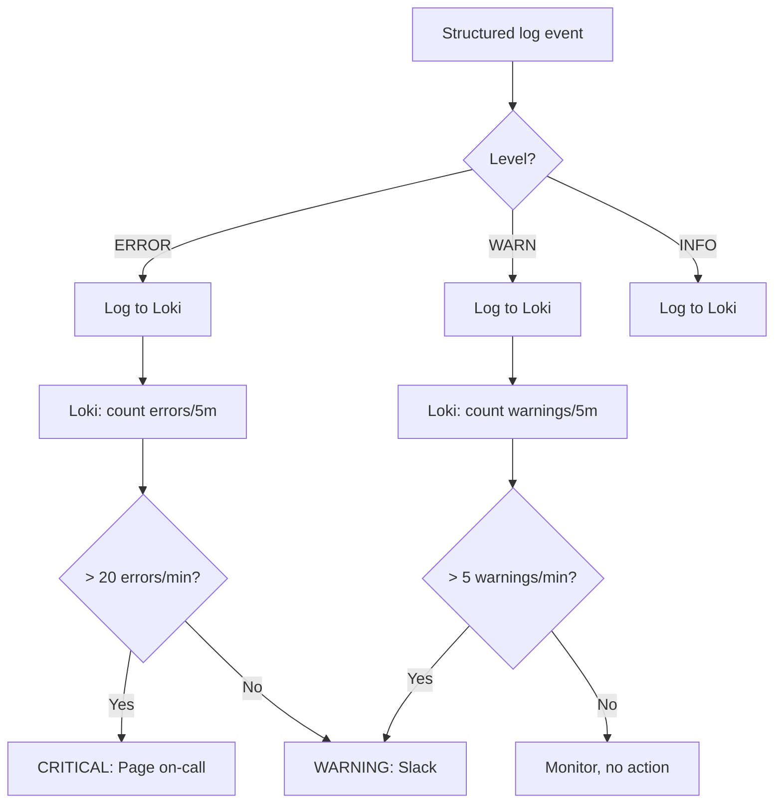
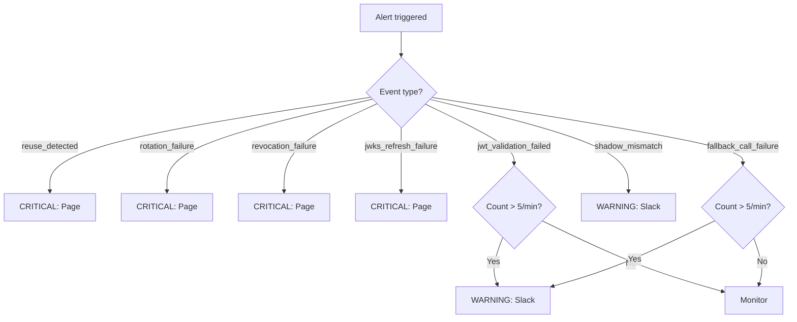
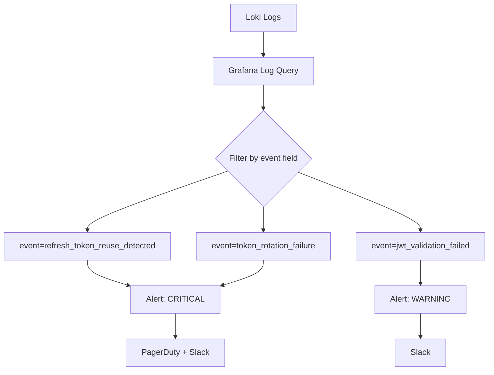

# Story 9.7: Alerting Configuration

## Epic

[09-observability](../observability.md)

## Parent Epic Story

Story 9.7

## Summary

Configure log-based alerting in Loki/Grafana for JWT-related security events. Alerts fire on WARN/ERROR structured log events from all stories in Epic 9. **DO NOT use Prometheus alerting rules** — there are no custom Prometheus metrics for JWT observability. Use Loki log filtering for alerts.

## Why This Story Exists

The JWT document states: "Sudden increases in invalid-token errors, JWKS refresh failures, fallback ratio spikes, token-size percentile growth, refresh-token reuse detection, revocation propagation exceeding route-class SLO." Without alerting, you won't know that something is wrong until users start reporting problems. **BRRTRouter's existing Prometheus metrics** (`brrtrouter_requests_total`, `brrtrouter_auth_failures_total`) cover HTTP-level alerting. JWT-specific alerts come from structured logs in Loki.

## Design Context

### Current State

- No JWT-specific alerting exists
- BRRTRouter's `/metrics` provides HTTP-level metrics (available for alerting, but JWT-specific alerts require structured logs)
- Loki is already configured to receive structured JSON logs via OTLP

### Alerting Approach: Loki Log Filtering

Since we use structured logs (not Prometheus counters), alerts are configured in Grafana/Loki as **log volume alerts**:

```yaml
# Grafana Loki alert rule example
# Alert: Refresh Token Reuse Detected
# Expr: sum by (service) (count_over_time({service=~".*idam.*"} | json | event="refresh_token_reuse_detected" | line_format "{{.msg}}" | __error="" [5m]))
# For: 1m
# Labels: severity: critical
# Annotations:
#   summary: "Refresh token reuse detected — possible token theft"
#   description: "{{ $value }} reuse events in last 5 minutes"
```

### Alert Rule Catalog

| Alert | Log Query (Loki) | Level | Severity | Action |
|-------|------------------|-------|----------|--------|
| TokenReuseDetected | `event="refresh_token_reuse_detected"` | WARN | CRITICAL | Page on-call — possible theft |
| TokenRotationFailure | `event="token_rotation_failure"` | ERROR | CRITICAL | Page on-call — token system broken |
| TokenRevocationFailure | `event="token_revocation_failure"` | ERROR | CRITICAL | Page on-call — revocation broken |
| JwtValidationSpike | `event="jwt_validation_failed"` | ERROR | CRITICAL | Page on-call — validation failing |
| JwtValidationDenialSpike | `event="jwt_validation_failed"` | WARN | WARNING | Ticket — denial rate rising |
| JwksRefreshFailure | `event="jwks_refresh_failure"` | WARN | CRITICAL | Page on-call — JWKS endpoint down |
| AuthzFallbackCallFailure | `event="authz_fallback_call_failure"` | WARN | WARNING | Ticket — authz-core unavailable |
| ShadowMismatch | `event="shadow_mismatch"` | WARN | WARNING | Ticket — JWT claims diverge from online |
| TokenValidationRevoked | `event="token_validation_revoked"` | WARN | WARNING | Ticket — mass revocation detected |
| ShadowModeStillEnabled | N/A (config check) | N/A | WARNING | Ticket — shadow mode not disabled |

### Alert Volume Filtering

Not all WARN/ERROR logs need alerts. The filtering rule is:

| Alert Level | Rate Threshold | Notification |
|-------------|---------------|--------------|
| CRITICAL | Any single event | Page on-call immediately |
| WARNING (1) | > 5 events/min | Slack notification |
| WARNING (2) | > 20 events/min | Page on-call |
| INFO | N/A | Included in daily digest only |

### CRITICAL Alerts (immediate page)

- `refresh_token_reuse_detected` — **1 event = page** (token theft, family revoked)
- `token_rotation_failure` — **1 event = page** (token system broken)
- `token_revocation_failure` — **1 event = page** (revocation broken, security gap)
- `jwks_refresh_failure` — **1 event = page** (JWKS down, JWT validation will fail)

### WARNING Alerts (Slack first, page if sustained)

- `jwt_validation_failed` — > 5/min = Slack, > 20/min = page
- `authz_fallback_call_failure` — > 5/min = Slack, > 20/min = page
- `shadow_mismatch` — > 0 during migration = Slack (investigate JWT claims)
- `token_validation_revoked` — > 10/min = Slack (possible mass revocation)

### Alert Routing

| Severity | Channel | Response Time |
|----------|---------|---------------|
| CRITICAL | PagerDuty + Slack #idam-incidents | 15 minutes |
| WARNING | Slack #idam-alerts | 1 hour |
| INFO | Email digest (daily) | Next business day |

## Mermaid Diagrams

### Alert Flow



### Alert Decision Tree



### Grafana Alert Configuration



## OpenAPI Changes

No OpenAPI changes. Alerting is internal to the operations layer.

## Design Doc References

- `design-doc.md` section 10.12: Observability -- alerting via Loki (not Prometheus)
- `observability.md`: Epic 9 log-based alerting

## Wiki Pages to Update/Create

- `topics/topic-observability.md`: Document log-based alerting configuration
- `topics/topic-ops-runbook.md`: (new) Document alert response procedures

## Acceptance Criteria

- [ ] All CRITICAL alerts (reuse, rotation failure, revocation failure, JWKS failure) page on-call on first event
- [ ] All WARNING alerts route to Slack #idam-alerts, escalate to page if rate > 20/min
- [ ] Loki log queries use `| json` filter to parse structured logs
- [ ] Alert expressions use `event=` field for precise log matching
- [ ] Alert annotations include: summary, description, current event count
- [ ] CRITICAL alerts have `for: 1m` (no sustained violation needed — any single event is critical)
- [ ] WARNING alerts have `for: 5m` (sustained violation required)
- [ ] Grafana dashboard shows alert status by severity
- [ ] Runbook documents response procedure for each alert

## Dependencies

- Depends on Stories 9.1-9.6 (structured log events that alerts monitor)
- Depends on Loki/Grafana stack being configured to receive OTLP logs
- BRRTRouter's existing Prometheus metrics (`brrtrouter_auth_failures_total`, `brrtrouter_request_duration_seconds`) may have separate Prometheus alerting rules for HTTP-level issues

## Risk / Trade-offs

- **Log volume vs alert precision**: Structured logs are searchable but Loki log queries are slower than Prometheus metric queries. CRITICAL alerts on single events (reuse_detected) need instant response — Loki log queries can handle this. WARNING alerts on rate (> 5/min) may have slight delay due to Loki aggregation.
- **Alert fatigue**: Too many warnings lead to ignored alerts. The threshold system (Slack first, page only if sustained) prevents alert fatigue for non-critical events. CRITICAL events always page because they indicate security incidents or system failures.
- **Loki vs Prometheus for alerting**: Loki log queries are more flexible (can match on any structured field) but less performant than Prometheus metric queries. For high-volume monitoring (10,000 RPS), consider using BRRTRouter's Prometheus metrics (`brrtrouter_requests_total`, `brrtrouter_auth_failures_total`) for HTTP-level alerting, and Loki logs only for JWT-specific alerts that require structured field matching.
