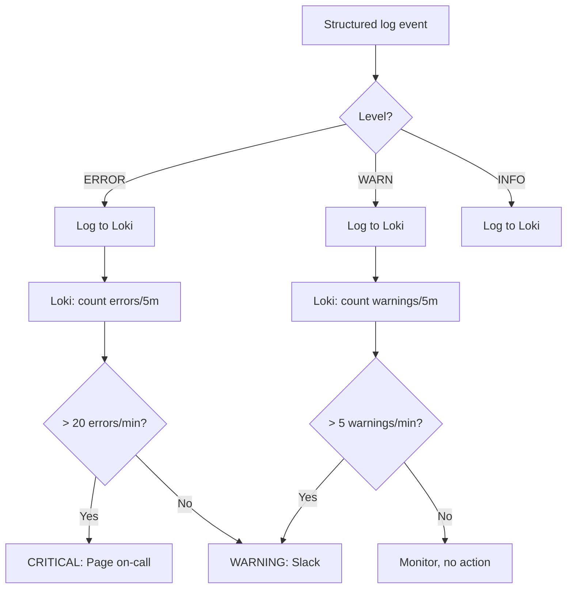
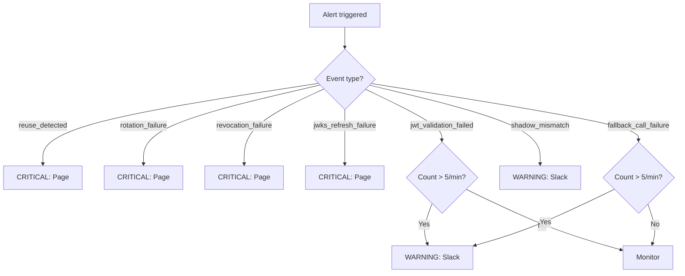
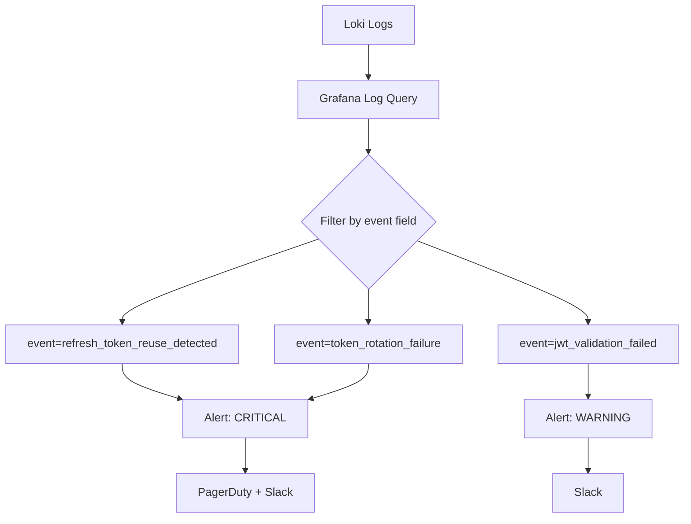

# Story 9.7: Alerting Configuration

## Epic

[09-observability](../observability.md)

## Parent Epic Story

Story 9.7

## Summary

Configure log-based alerting in Loki/Grafana for JWT-related security events. Alerts fire on WARN/ERROR structured log events from all stories in Epic 9. **DO NOT use Prometheus alerting rules** — there are no custom Prometheus metrics for JWT observability. Use Loki log filtering for alerts.

## Why This Story Exists

The JWT document states: "Sudden increases in invalid-token errors, JWKS refresh failures, fallback ratio spikes, token-size percentile growth, refresh-token reuse detection, revocation propagation exceeding route-class SLO." Without alerting, you won't know that something is wrong until users start reporting problems. **BRRTRouter's existing Prometheus metrics** (`brrtrouter_requests_total`, `brrtrouter_auth_failures_total`) cover HTTP-level alerting. JWT-specific alerts come from structured logs in Loki.

## Design Context

### Current State

- No JWT-specific alerting exists
- BRRTRouter's `/metrics` provides HTTP-level metrics (available for alerting, but JWT-specific alerts require structured logs)
- Loki is already configured to receive structured JSON logs via OTLP

### Alerting Approach: Loki Log Filtering

Since we use structured logs (not Prometheus counters), alerts are configured in Grafana/Loki as **log volume alerts**:

```yaml
# Grafana Loki alert rule example
# Alert: Refresh Token Reuse Detected
# Expr: sum by (service) (count_over_time({service=~".*idam.*"} | json | event="refresh_token_reuse_detected" | line_format "{{.msg}}" | __error="" [5m]))
# For: 1m
# Labels: severity: critical
# Annotations:
#   summary: "Refresh token reuse detected — possible token theft"
#   description: "{{ $value }} reuse events in last 5 minutes"
```

### Alert Rule Catalog

| Alert | Log Query (Loki) | Level | Severity | Action |
|-------|------------------|-------|----------|--------|
| TokenReuseDetected | `event="refresh_token_reuse_detected"` | WARN | CRITICAL | Page on-call — possible theft |
| TokenRotationFailure | `event="token_rotation_failure"` | ERROR | CRITICAL | Page on-call — token system broken |
| TokenRevocationFailure | `event="token_revocation_failure"` | ERROR | CRITICAL | Page on-call — revocation broken |
| JwtValidationSpike | `event="jwt_validation_failed"` | ERROR | CRITICAL | Page on-call — validation failing |
| JwtValidationDenialSpike | `event="jwt_validation_failed"` | WARN | WARNING | Ticket — denial rate rising |
| JwksRefreshFailure | `event="jwks_refresh_failure"` | WARN | CRITICAL | Page on-call — JWKS endpoint down |
| AuthzFallbackCallFailure | `event="authz_fallback_call_failure"` | WARN | WARNING | Ticket — authz-core unavailable |
| ShadowMismatch | `event="shadow_mismatch"` | WARN | WARNING | Ticket — JWT claims diverge from online |
| TokenValidationRevoked | `event="token_validation_revoked"` | WARN | WARNING | Ticket — mass revocation detected |
| ShadowModeStillEnabled | N/A (config check) | N/A | WARNING | Ticket — shadow mode not disabled |

### Alert Volume Filtering

Not all WARN/ERROR logs need alerts. The filtering rule is:

| Alert Level | Rate Threshold | Notification |
|-------------|---------------|--------------|
| CRITICAL | Any single event | Page on-call immediately |
| WARNING (1) | > 5 events/min | Slack notification |
| WARNING (2) | > 20 events/min | Page on-call |
| INFO | N/A | Included in daily digest only |

### CRITICAL Alerts (immediate page)

- `refresh_token_reuse_detected` — **1 event = page** (token theft, family revoked)
- `token_rotation_failure` — **1 event = page** (token system broken)
- `token_revocation_failure` — **1 event = page** (revocation broken, security gap)
- `jwks_refresh_failure` — **1 event = page** (JWKS down, JWT validation will fail)

### WARNING Alerts (Slack first, page if sustained)

- `jwt_validation_failed` — > 5/min = Slack, > 20/min = page
- `authz_fallback_call_failure` — > 5/min = Slack, > 20/min = page
- `shadow_mismatch` — > 0 during migration = Slack (investigate JWT claims)
- `token_validation_revoked` — > 10/min = Slack (possible mass revocation)

### Alert Routing

| Severity | Channel | Response Time |
|----------|---------|---------------|
| CRITICAL | PagerDuty + Slack #idam-incidents | 15 minutes |
| WARNING | Slack #idam-alerts | 1 hour |
| INFO | Email digest (daily) | Next business day |

## Mermaid Diagrams

### Alert Flow



### Alert Decision Tree



### Grafana Alert Configuration



## Malicious Hacker Gotchas (Must Be Addressed During Implementation)

> **Source:** `docs/PRS_SECURITY_HARDENING.md` — Security threat model analysis

### HACK-971: Alert Suppression via Controlled Token Failure Rate (CRITICAL — Hole #7 from PRS)

**Risk:** Attacker carefully controls token failure rate to stay BELOW the alerting threshold, silently bypassing authorization without triggering alerts

The story sets CRITICAL alert thresholds at 1 event for reuse/rotation/revocation/JWKS failure, and 5/min for JWT validation failures. But what if the attacker stays just below these thresholds?

**Exploit path (below-threshold token forgery):**
1. Attacker forges a JWT with elevated permissions
2. Attacker sends 1 request per second (below the 5/min WARNING threshold)
3. Each forged request fails JWT validation (signature mismatch) — 1 error per second = 60/min
4. The alert threshold is 5/min for WARNING, 20/min for CRITICAL
5. At 1 request/second = 60/min → CRITICAL alert fires (actually, this IS above threshold)
6. BUT: what if the forged token passes some validation steps but fails others?
7. Example: The forged token has a valid issuer and expiration but invalid claims
8. The validation might still allow the request through (if the JWT common path doesn't check all claims strictly)
9. Result: The attacker bypasses authorization with forged tokens at a rate low enough to stay below the alert threshold

**The real exploit is different:** What if the attacker FORGES a token that PASSES the JWT common path (valid signature, valid issuer, valid expiration) but has INFLATED claims?

This requires the attacker to have the signing key (or exploit a weak key). If the attacker has the key, they can forge tokens at ANY rate — the alert system won't detect this because the token IS valid.

**Exploit path (forged token with valid signature):**
1. Attacker obtains or guesses the JWT signing key (if HS256 is still supported, or if there's a key confusion attack)
2. Attacker forges a token with `role: admin` claims
3. The forged token PASSES JWT validation (valid signature, valid issuer, valid expiration)
4. The token is allowed through without triggering any alert (it's a valid token)
5. The only way to detect this is via shadow decisions (Story 9.4), which only run during migration
6. Result: Silent authorization bypass with forged tokens

**This is the same exploit as HACK-722 (cache poisoning via forged token).** The alert system CANNOT detect a valid token that was forged — it can only detect invalid tokens.

**Implementation requirement:**
- Alerting CANNOT detect forged tokens with valid signatures — this is a fundamental limitation
- The PRIMARY defense is to prevent key compromise (use RS256, not HS256)
- The SECONDARY defense is shadow decisions during migration (Story 9.4)
- The TERTIARY defense is token version rotation (Story 5.1) — when the signing key changes, old forged tokens become invalid
- Document: "Alerting does not and cannot detect tokens with valid signatures. Key management is the primary defense."

### HACK-972: Alert Fatigue Exploitation via Synthetic Warning Flood (HIGH — related to Hole #3 from PRS)

**Risk:** Attacker deliberately triggers WARNING-level alerts to create alert fatigue, causing the on-call team to ignore real CRITICAL alerts

The story says: "Too many warnings lead to ignored alerts." An attacker can weaponize this.

**Exploit path (alert fatigue DoS):**
1. Attacker sends requests that trigger `jwt_validation_failed` at > 5/min (WARNING threshold)
2. Slack alerts fire to #idam-alerts every time the threshold is exceeded
3. The on-call team receives 50+ Slack notifications for non-critical validation failures
4. Meanwhile, the attacker sends a single `refresh_token_reuse_detected` event (CRITICAL)
5. The PagerDuty page fires, but the on-call team has trained themselves to ignore alerts during high-volume periods
6. Result: The on-call team dismisses the CRITICAL alert as "just another false alarm"
7. The attacker's token theft goes undetected

**Exploit path (alert suppression via threshold manipulation):**
1. Attacker sends requests that trigger `jwt_validation_failed` at exactly 4/min (below the 5/min WARNING threshold)
2. Slack alerts do NOT fire (below threshold)
3. Meanwhile, the attacker sends a `refresh_token_reuse_detected` event (CRITICAL)
4. The PagerDuty page fires — BUT the on-call team is simultaneously receiving false alarms from other systems
5. Result: The CRITICAL alert is delayed or dismissed

**Implementation requirement:**
- Add a "quiet period" to WARNING alerts: after a WARNING alert fires, no further WARNING alerts for the same event type for 15 minutes
- This prevents alert flooding while still allowing CRITICAL alerts to fire immediately
- Add a `alert_suppression_total{event: "jwt_validation_failed", reason: "quiet_period"}` metric to track suppressed alerts
- Document: "WARNING alerts use a 15-minute quiet period to prevent alert flooding. CRITICAL alerts always fire immediately."

### HACK-973: Alert Query Manipulation via Malicious Log Injection (HIGH — related to Hole #7 from PRS)

**Risk:** Attacker injects a structured log with a fake `event` field to manipulate Loki's alerting queries

The alerting queries use `event="refresh_token_reuse_detected"` to match log entries. If the attacker can inject logs, they can create false positives or false negatives.

**Exploit path (false positive alert):**
1. Attacker gains access to the service's logging infrastructure (e.g., via a vulnerability in the application)
2. Attacker injects a structured log entry: `{"event": "refresh_token_reuse_detected", "user_id": "attacker_user"}`
3. The Loki alerting query matches this injected log entry
4. PagerDuty fires a CRITICAL alert for "token theft"
5. The on-call team investigates, finds nothing, and dismisses the alert
6. Meanwhile, the attacker continues their actual attack
7. Result: The attacker creates a "boy who cried wolf" scenario, making the on-call team dismiss real alerts

**Exploit path (false negative alert suppression):**
1. Attacker injects a structured log entry with a high `event` count or manipulates the log timestamps
2. The Loki query aggregates over the wrong time window
3. Result: Real alerts are suppressed because the query returns an artificially high count

**Implementation requirement:**
- Structured log entries MUST include a `service_name` field that is set by the service, NOT by the JWT or request
- The `event` field MUST be set exclusively by the middleware, never from any request data
- Add an integrity check: if a log entry contains an `event` field that was not set by the middleware, drop the entry
- Document: "Structured log event fields are set exclusively by the middleware. No external data can inject log event fields."

### HACK-974: Shadow Mismatch Alert Can Be Used as an Authorization Oracle (MEDIUM — related to Hole #4 from PRS)

**Risk:** The `shadow_mismatch` alert reveals whether a specific route uses jwt-only or jwt-with-fallback authorization, mapping the authorization system

The story says: "Shadow mismatch — JWT claims diverge from online." An attacker can use the alerting channel to probe the authorization system.

**Exploit path (shadow mismatch as oracle via Slack):**
1. Attacker has access to the #idam-alerts Slack channel (e.g., via a compromised team member's account)
2. Attacker sends requests to different routes
3. For routes where the JWT decision and online decision diverge, a `shadow_mismatch` alert fires
4. For routes where the JWT decision matches (or the route is jwt-only with no shadow check), NO alert fires
5. Result: The attacker maps which routes have shadow mode enabled and which routes have jwt-only authorization

**But wait:** shadow mode is only enabled during migration (Story 9.4). In production, shadow mode is disabled. So this exploit is only relevant during migration.

**The real risk is different:** During migration, the `shadow_mismatch` alert reveals that the JWT claims DO NOT match the online authorization decision for a specific route. This tells the attacker that:
1. The route uses jwt-with-fallback authorization
2. The JWT claims are incomplete for this route

This is useful information for the attacker to plan further attacks (e.g., adding missing claims to the forged JWT).

**Implementation requirement:**
- During migration, `shadow_mismatch` alerts MUST NOT include route-specific details in Slack notifications
- OR: use a generic alert message that does not reveal which route triggered the mismatch
- Document: "Shadow mismatch alerts in Slack do not include route-specific details."

### HACK-975: Alert Configuration in Source Control Enables Attack Planning (LOW — related to Hole #5 from PRS)

**Risk:** The alert configuration is stored in source control (e.g., Git), which includes the Loki query expressions and alert thresholds

An attacker with access to the source code can see exactly how alerts are configured.

**Exploit path (alert configuration reconnaissance):**
1. Attacker gains read access to the source code repository
2. The alert configuration file includes the Loki query expressions (e.g., `event="refresh_token_reuse_detected"`)
3. The attacker learns which events trigger alerts and at what thresholds
4. The attacker designs attacks that stay below the alert thresholds
5. Result: The attacker can optimize their attack to avoid detection

**Implementation requirement:**
- Alert configuration is NOT sensitive information — it can be public
- The PRIMARY defense is to design the system so that attacks are detectable even if the attacker knows the alert thresholds
- Document: "Alert configuration is stored in source control. This is intentional for version control and review."

---

## OpenAPI Changes

No OpenAPI changes. Alerting is internal to the operations layer.

## Design Doc References

- `design-doc.md` section 10.12: Observability -- alerting via Loki (not Prometheus)
- `observability.md`: Epic 9 log-based alerting

## Wiki Pages to Update/Create

- `topics/topic-observability.md`: Document log-based alerting configuration
- `topics/topic-ops-runbook.md`: (new) Document alert response procedures

## Acceptance Criteria

- [ ] All CRITICAL alerts (reuse, rotation failure, revocation failure, JWKS failure) page on-call on first event
- [ ] All WARNING alerts route to Slack #idam-alerts, escalate to page if rate > 20/min
- [ ] Loki log queries use `| json` filter to parse structured logs
- [ ] Alert expressions use `event=` field for precise log matching
- [ ] Alert annotations include: summary, description, current event count
- [ ] CRITICAL alerts have `for: 1m` (no sustained violation needed — any single event is critical)
- [ ] WARNING alerts have `for: 5m` (sustained violation required)
- [ ] Grafana dashboard shows alert status by severity
- [ ] Runbook documents response procedure for each alert

## Dependencies

- Depends on Stories 9.1-9.6 (structured log events that alerts monitor)
- Depends on Loki/Grafana stack being configured to receive OTLP logs
- BRRTRouter's existing Prometheus metrics (`brrtrouter_auth_failures_total`, `brrtrouter_request_duration_seconds`) may have separate Prometheus alerting rules for HTTP-level issues

## Risk / Trade-offs

- **Log volume vs alert precision**: Structured logs are searchable but Loki log queries are slower than Prometheus metric queries. CRITICAL alerts on single events (reuse_detected) need instant response — Loki log queries can handle this. WARNING alerts on rate (> 5/min) may have slight delay due to Loki aggregation.
- **Alert fatigue**: Too many warnings lead to ignored alerts. The threshold system (Slack first, page only if sustained) prevents alert fatigue for non-critical events. CRITICAL events always page because they indicate security incidents or system failures.
- **Loki vs Prometheus for alerting**: Loki log queries are more flexible (can match on any structured field) but less performant than Prometheus metric queries. For high-volume monitoring (10,000 RPS), consider using BRRTRouter's Prometheus metrics (`brrtrouter_requests_total`, `brrtrouter_auth_failures_total`) for HTTP-level alerting, and Loki logs only for JWT-specific alerts that require structured field matching.
