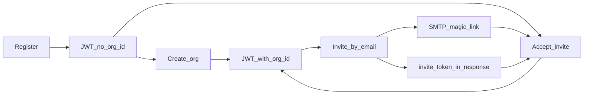

# PRD: Workspace Onboarding, Org Invites & Membership (Platform v2)

| Field | Value |
|-------|--------|
| **Version** | `v2026-08-03` |
| **Status** | Draft — iterate before implementation freeze |
| **Owner** | Sesame-IDAM (platform) |
| **Paired consumer PRD** | [`../hauliage/docs/PRD_loadlinker-workspace-onboarding-and-team-v2.md`](../../hauliage/docs/PRD_loadlinker-workspace-onboarding-and-team-v2.md) |
| **Supersedes** | Hauliage `PRD_account-first-onboarding.md` (product narrative); Sesame `topic-account-first-onboarding-checkpoint.md` (checkpoint) |
| **Normative companions** | [ADR-002](./ADR-002-tenant-consumer-idam-api-boundary.md), [transport-policy-v1](./standards-first-oidc/transport-policy-v1.md), Epic 15 portable consumer contract |
| **Evidence** | [POSTMORTEM-2026-08-03-identity-me-tenant-header-edge-502](./POSTMORTEM-2026-08-03-identity-me-tenant-header-edge-502.md) |

---

## 1. Executive summary

Sesame is the system of record for **identity, organizations, memberships, and invitations**. Product BFFs (Hauliage Loadlinker first) orchestrate domain profile creation; they must not own invite tokens or membership rows.

JWT authentication is now functional in dogfood. That makes three platform rules mandatory:

1. **After authentication, tenant is claim-bound** (`tenant_id` on the access token). Callers must not select tenancy with `X-Tenant-ID` on bearer routes. Public edges may strip that header.
2. **Org context is claim-bound** (`org_id` when the user has an active membership). Login/register without an org yields a valid token **without** `org_id` for onboarding-only use.
3. **Invites are Sesame-owned**: persist `org_invites`, send magic-link email, accept creates `org_memberships` and enables `org_id` re-issue.

This PRD replaces the pre-JWT “header + bridge table” product story with a contract any tenant consumer can implement.

---

## 2. Problem

### 2.1 Product gap

New users must be able to:

- Register an account without an organization.
- Create a workspace **or** accept an invite.
- Invite colleagues by email and see real member identities on team lists.

### 2.2 Live platform defects (2026-08-03 dogfood)

| Defect | Symptom | Cause |
|--------|---------|--------|
| Bearer routes require `X-Tenant-ID` | Public edge strip → 500/502 | OpenAPI/handler still header-required; edge correctly strips forgeable tenancy |
| Member emails are placeholders | `user-{uuid}` in list responses | `SELECT email FROM users` fails RLS (`sesame_current_tenant_id()` unset) |
| Invite create fails north–south | Consumer BFF 502 | `invite_user_to_org` reads tenant from header only |
| Invite email not sent | Mailpit has OTP/reset but no org invites | Invite path persists + logs token; no SMTP |

Older docs claimed account-first “verified” while these gaps remained. This PRD is the single backlog for closing them on the **provider** side.

---

## 3. Goals

1. Register = identity only (no org, no `org_id` claim).
2. Create organization → owner membership → access token includes `org_id`.
3. Invite by email → Sesame `org_invites` + outbound email + token in API response.
4. Accept invite → membership + refreshed tokens with `org_id`.
5. List org members with **real emails** (and names when profile exists), never synthetic `user-{uuid}` placeholders when the user row exists.
6. All consumer traffic is designed for the **public API** (north–south); pre-auth uses **`client_id`**, bearer uses JWT — **no** required `X-Tenant-ID`, no tenant hijack via headers.
7. Demo seeds for tenant `hauliage` remain first-class fixtures for dogfood.

## 4. Non-goals

| Item | Rationale |
|------|-----------|
| Email-domain auto-org | Rejected; freemail / accidental merges |
| SMS invite channel (v1) | Email magic-link only; SMS OTP remains ADR-009 |
| Multi-org switcher UI | v1: single active `org_id` in JWT; switch API may exist |
| Hauliage domain profile schema | Consumer PRD / company service |
| Caller-selected tenancy on bearer routes | Forbidden by Epic 15 / edge strip |
| Webhooks for org.created (v1) | Sync BFF chain remains MVP; webhooks are follow-on (ADR-002 S3) |

---

## 5. Actors and tenancy

| Concept | Meaning |
|---------|---------|
| **Tenant** | Hard isolation boundary (`hauliage`, …). Maps to SaaS customer partition. |
| **Application / RP** | OAuth client within a tenant (e.g. `hauliage-web`). |
| **Organization** | Workspace inside a tenant (shipper or haulier company in product terms). |
| **User** | Identity scoped to one tenant. |
| **Membership** | User ↔ org + role (`owner`, `admin`, `member`, product-mapped roles). |
| **Invite** | Pending email → org + role + opaque token + expiry. |

### 5.1 North–south end state (no east–west consumer traffic)

**Target:** product BFFs (Hauliage Loadlinker and future tenants) call Sesame only through the **public API origin** (`api.<zone>/idam/v1`). In-cluster east–west URLs (`http://identity-*-service…`, `http://org-mgmt…`) are a temporary dogfood/debug path and **must not** be the design centre. All OpenAPI, edge filters, and handler tenant rules are written for the public path.

Implication: anything that only “works” because a ClusterIP call still forwards `X-Tenant-ID` is **not done**. Public edge strips forgeable ambient headers; handlers must still be correct without them.

### 5.2 Pre-auth vs bearer (tenancy)

It is **incorrect** to say “`X-Tenant-ID` is only needed on the first login.” There is no access token yet for an entire **class** of unauthenticated calls. Those calls need a **non-header-authoritative** tenant bind. After a JWT exists, the claim is the only authority.

| Phase | Examples | How tenant is bound | `X-Tenant-ID` |
|-------|----------|---------------------|---------------|
| **Pre-auth** (no Bearer) | `POST /auth/register`, `POST /auth/login`, OTP send/verify, forgot/reset password, social/magic-link **start**, public invite preview | **Registered `client_id`** (preferred). Client registration maps RP → tenant. | **Not required.** Legacy optional hint only: if present, **must match** the client’s tenant or **reject**. Must never select a different tenant than the client. |
| **Bearer** (access token present) | `/identity/me`, create org, invite, list members, accept invite, set active org, refresh (when bearer-bound) | Validated JWT **`tenant_id`** (and **`org_id`** when the operation needs org context). | **Never required. Never authoritative.** Public edge **strips** it. If seen east–west and non-empty: **must match** claim or **401**; never prefer header over claim. |
| **Token-bound public** | `GET /invitations/preview?token=` | Invite token itself (scoped to org/tenant in DB). | Not used. |

**Hijack rule:** a caller holding a valid token for tenant A must not act on tenant B by inserting `X-Tenant-ID: B` (or any other forgeable tenancy header). That is a hard security requirement (FINDING-2026-07-25 / task 48; Epic 15 transport policy).

### 5.3 Header matrix (public API — reduce ambient authority / snooping)

Consumer-facing twin: Hauliage Loadlinker PRD §5.3 (what the BFF should send).

| Header / signal | Pre-auth (caller) | Bearer (caller) | Public edge (`api.`) | Notes |
|-----------------|-------------------|-----------------|----------------------|--------|
| `client_id` (body/query as specified) | **Required** for tenant bind where the operation is RP-scoped | Usually N/A (token already binds) | Allowed | Primary pre-auth tenancy signal |
| `X-Tenant-ID` | Optional legacy match-to-client only; **not required** (target) | **Forbidden as selector; not required** | **Strip inbound** | Remove from OpenAPI `required: true` everywhere edge strips or bearer applies |
| `Authorization: Bearer` | Absent | **Required** | Forward (do not strip) | Redact in access logs / OpenSearch |
| `Cookie` | Must not be relied on for API auth | Must not be relied on | **Strip inbound** | Hosted `auth.` SPA may use cookies; `api.` must not |
| `Set-Cookie` | Must not be emitted for API auth | Must not be emitted for API auth | **Strip outbound** on API routes | Prevent ambient session mint on API origin |
| Product `X-User-ID` / `X-Org-ID` / similar | Reject if used to select identity | Reject if used to override JWT | Strip or reject | Same class as tenant override |
| Internal `X-Debug-*` / PII baggage | Reject | Reject | Strip | Not from the public internet |
| `Content-Type: application/json` | As needed | As needed | Allowed | Standard |
| `Referer` / verbose `User-Agent` | Ignored for authz | Ignored for authz | Optional log-redact | Fingerprinting / snooping reduction |

OpenAPI debt: many login-service routes still mark `X-Tenant-ID` `required: true`. Target state is **`client_id`-bound pre-auth** + **JWT-bound bearer**, with `X-Tenant-ID` absent from required parameters everywhere the public edge is the path.

---

## 6. User journeys (platform)

### 6.1 Register (identity only)

1. Client → `POST /idam/v1/auth/register` (tenant via client / pre-auth policy).
2. Sesame creates `users` row; issues access + refresh tokens.
3. Access token has `sub`, `tenant_id`; **no** `org_id`.
4. Client directs user to product onboarding (out of Sesame UI scope).

### 6.2 Login without membership

1. `POST /idam/v1/auth/login` succeeds.
2. Token has `tenant_id`, no `org_id`.
3. Org-scoped APIs that require membership return 403/404 as specified; onboarding APIs remain available.

### 6.3 Create organization

1. Authenticated user (Bearer) → `POST /idam/v1/organizations` (or tenant-consumer equivalent) with name (+ optional metadata).
2. Sesame creates `organizations` + `org_memberships` (caller = `owner`).
3. Client calls `POST /idam/v1/sessions/active-organization` (or login re-issue) → new access token with `org_id`.
4. Product BFF may then create a domain profile keyed by the same UUID (consumer concern).

### 6.4 Invite member

1. Org admin/owner → `POST /idam/v1/organizations/{org_id}/invitations` with `{ email, role }`.
2. Sesame inserts `org_invites` (token, expiry ≥ 7 days default).
3. Sesame **sends** invite email (SMTP) containing magic link URL template configured per environment.
4. Response includes `invite_id` and `invite_token` (required for automated E2E; email is human path).

### 6.5 Accept invite

1. Invitee registers or logs in (email must match invite, case-insensitive).
2. `POST /idam/v1/invitations/accept` with `{ token }` + Bearer.
3. Sesame creates/activates membership; marks invite accepted.
4. Client obtains refreshed tokens with `org_id` via active-organization / accept response contract.

### 6.6 List members / remove / revoke

1. `GET /organizations/{org_id}/users` returns paginated members with real `email`, `user_id`, `role`, `created_at`.
2. Remove member and revoke pending invite are org-admin operations; tenant from JWT.

---

## 7. Normative API surface

Prefer **tenant-consumer** OpenAPI for product teams; org-mgmt remains the implementing service where routes already live.

| Operation | Method / path (illustrative `/idam/v1`) | Auth | Tenant |
|-----------|----------------------------------------|------|--------|
| Register | `POST /auth/register` | none / pre-auth | client / hint |
| Login | `POST /auth/login` | none / pre-auth | client / hint |
| Current user profile | `GET /identity/me` | Bearer | JWT only |
| Create org | `POST /organizations` | Bearer | JWT |
| Set active org | `POST /sessions/active-organization` | Bearer | JWT |
| List members | `GET /organizations/{org_id}/users` | Bearer | JWT |
| Invite | `POST /organizations/{org_id}/invitations` | Bearer | JWT |
| Preview invite | `GET /invitations/preview?token=` | public or light auth | N/A (token-bound) |
| Accept invite | `POST /invitations/accept` | Bearer | JWT |
| Revoke invite | `DELETE …/pending-invitations` | Bearer | JWT |
| Remove member | `DELETE /organizations/{org_id}/users/{user_id}` | Bearer | JWT |

### 7.1 Header policy (normative)

See §5.2–5.3. Summary:

- **Pre-auth:** bind tenant via **`client_id`**; do not require `X-Tenant-ID`.
- **Bearer:** bind tenant via JWT **`tenant_id`**; do not require `X-Tenant-ID`.
- **Public edge:** strip inbound `Cookie` and `X-Tenant-ID`; strip outbound `Set-Cookie` (current `sesame-idam-api-edge`).
- OpenAPI must not mark `X-Tenant-ID` `required: true` on any route that is reachable only after strip, or that is bearer-authenticated.
- End state assumes **north–south only**; do not design “header still works east–west” escapes.

### 7.2 Error shapes

Machine-readable `error` codes must match published enums so response validation does not turn a missing-parameter message into an opaque 500. Prefer `unauthorized` / `validation_error` / `forbidden` consistently on consumer-facing routes.

---

## 8. Data model (Sesame)

| Table | Role |
|-------|------|
| `sesame_idam.users` | Identity; RLS by `tenant_id` |
| `sesame_idam.organizations` | Workspace; `tenant_id` |
| `sesame_idam.org_memberships` | Active (and status) memberships |
| `sesame_idam.org_invites` | Pending invites: email, role, token, expiry, accepted_at |

### 8.1 RLS requirement for member listing

Any read of `users.email` (or profile fields) in the list-members path **must** run with transaction/session tenant context set to the JWT `tenant_id` (or an equivalent tenant-scoped join that satisfies RLS). Silent fallback to `user-{uuid}` when the user exists is a **defect**, not acceptable UX.

---

## 9. Invite email

| Requirement | Detail |
|-------------|--------|
| Transport | SMTP (dev: Mailpit / cluster `mailpit` in `data`) |
| Content | Org display name, role, magic-link URL, expiry |
| Link shape | Product-configured base + token query (e.g. `https://loadlinker…/onboarding?token=…`) |
| API | Always return `invite_token` for E2E even when email send succeeds |
| Failure | Persist invite; surface email-send failure in logs + optional warning field; do not pretend email succeeded if SMTP failed |

SMS invite is **out of scope** for v1.

---

## 10. Security

1. Public edge strip of `X-Tenant-ID` / `Cookie` remains correct; handlers must not require stripped headers.
2. Pre-auth: `client_id` binds tenant; header hint cannot disagree with client tenant.
3. Bearer: JWT claim binds tenant; header/claim mismatch → reject (401); header never wins.
4. Invite accept: JWT email must match invite email (case-insensitive).
5. Invite tokens: high entropy, single-use on accept, expire (default 7 days).
6. Org-admin authorization on invite/remove/revoke.
7. No cross-tenant membership or invite visibility.
8. Redact `Authorization` (and tokens) in gateway/app logs; do not log full invite tokens at info.

Related finding: [FINDING-2026-07-25-org-mgmt-tenant-header-override](./FINDING-2026-07-25-org-mgmt-tenant-header-override.md) (task 48) — claim-only / reject-on-disagree is mandatory for org-mgmt bearer routes.

---

## 11. Demo seeds (tenant `hauliage`)

Platform fixtures (non-exhaustive):

| Email | Role / org |
|-------|------------|
| `shipper@amecorp.dev` | Owner — AME Corp |
| `transport@transportservices.dev` | Owner — Transport Services |
| `owner@hauliage.dev`, `dispatcher@…`, `driver@…` | Memberships on Transport Services / demos |

Password for local dogfood: documented in consumer integration wiki (not repeated here as a secret). Seeds must remain apply-ordered with platform tenants + RLS grants.

---

## 12. Phased delivery (platform)

| Phase | Scope | Exit criteria |
|-------|--------|----------------|
| **P0** | JWT-bound tenant on `/identity/me`, invite, list-users (OpenAPI + handlers); deploy session + org-mgmt | Public `api.` calls succeed without `X-Tenant-ID`; invite not 502 |
| **P1** | RLS-safe member email resolution | List members returns real emails for seeded users |
| **P2** | SMTP invite email + Mailpit verification | Invite creates Mailpit message; token still in JSON |
| **P3** | Accept-invite + active-org token re-issue hardening | Contract tests / BDD green on Kind |
| **P4** | Align tenant-consumer OpenAPI + conformance fixtures | Consumer contract sync CI green |

Hauliage phases mirror these in the paired PRD.

---

## 13. Acceptance criteria (platform)

- [ ] Bearer `GET /identity/me` without `X-Tenant-ID` returns 200 for a valid token (public edge).
- [ ] Bearer `POST /organizations/{org_id}/invitations` without `X-Tenant-ID` creates invite and returns `invite_token`.
- [ ] Bearer `GET /organizations/{org_id}/users` returns `transport@transportservices.dev` (not `user-a1000001-…`) for Transport Services seeds.
- [ ] Invite email appears in Mailpit when SMTP is configured.
- [ ] Accept invite binds membership; subsequent login/access token includes matching `org_id`.
- [ ] Header `X-Tenant-ID` disagreeing with JWT `tenant_id` → 401 on bearer routes in scope.
- [ ] No regression: login/register still resolve tenant for pre-auth flows.

---

## 14. Open questions (iteration)

1. Exact magic-link URL template ownership: Sesame env vs per-RP redirect allow-list.
2. Whether pending invites appear on `GET …/users` or a dedicated pending collection (affects BFF merge).
3. Role vocabulary: Sesame lowercase slugs vs product uppercase enums — keep mapping in BFF or normalize in Sesame.
4. Timing for webhook-based domain provisioning (ADR-002 S3) vs sync BFF forever for Loadlinker.
5. How quickly to drop optional legacy `X-Tenant-ID` hint on pre-auth once all BFFs send `client_id` only (breaking change for old clients).
6. Calendar for forbidding east–west Sesame bases in consumer Helm (fail closed if `*.svc.cluster.local` configured).

---

## 15. Document control

- **Do not** extend superseded account-first checkpoints; update this PRD and the paired Hauliage PRD.
- ADR-002 remains the boundary ADR; implementation backlog for S1/S2 gaps lives here until closed.
- After implementation, update entity wiki pages (`entity-org-invite`, `entity-org-membership`) and append `docs/llmwiki/log.md`.
