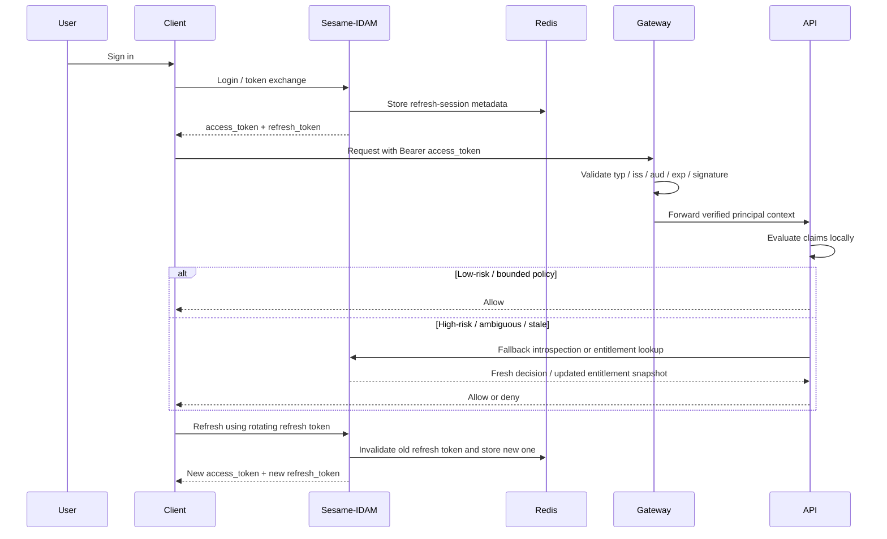
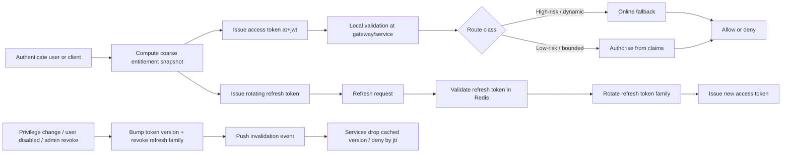

# Sesame-idam authorisation load mitigation with JWT claims

## Executive summary

Yes: **sesame-idam can materially reduce extreme per-request authorisation load by moving stable, low-cardinality authorisation facts into short-lived access tokens and using a hybrid online fallback only where freshness or cardinality demands it**. The public repository materials already lean in that direction. The README and OpenAPI describe short-lived stateless access JWTs, Redis-backed refresh tokens and session tracking, while the Rust code already defines a `TokenClaims` structure and Redis session/blacklist support. The generated server runtime also already supports JWKS-based bearer validation and cacheable remote API-key verification. citeturn40view4turn6view0turn16view0turn16view2turn17view8turn17view9turn18view0

That said, the current public codebase is **still an early-stage scaffold rather than a finished IAM system**. The repository page shows only one commit; the generated controller module exposes a narrower set of operations than the broader OpenAPI text suggests; and several controllers return example payloads rather than production logic. I did not find a public RFC 7662 introspection endpoint, a JWKS publication endpoint, or a dedicated fine-grained authorisation-decision endpoint in the retrieved API materials, so those capabilities are best treated as **unspecified** unless they exist in unretrieved branches or private code. citeturn40view0turn22view0turn23view0turn23view1turn23view2turn23view3turn7view4turn7view5

For sesame-idam, the best target architecture is **not** “put all permissions in JWTs and delete online checks”. It is a **hybrid** model:

- use a self-contained JWT access token for the common path;
- keep claims coarse, bounded, and resource-specific;
- add **token and entitlement versioning**;
- revoke primarily through **short TTLs, rotating refresh tokens, and per-subject version bumps**;
- reserve online introspection or policy lookup for **high-risk writes, admin actions, delegated actions, and high-cardinality resource ACLs**. citeturn35view2turn35view3turn35view5turn36view0turn36view1turn39view0turn29search0turn29search12

If you do that, the reduction in online authorisation load can be very large. In the simple analytical case where a protected request would otherwise call an online authorisation service once per request, replacing that with local JWT validation plus a small fallback rate can cut central decision traffic by **well over 95%**, often by **99%+**, depending on request rate per session, access-token TTL, and fallback frequency. That is a design inference rather than a measured repo benchmark, because the current repository does not expose production benchmark data and several controllers are still placeholders. citeturn6view0turn23view0turn23view2

## Repository review and likely hot paths

### What the public repository currently shows

The retrievable public repository is presented on GitHub as `microscaler/idam`, and the README describes it as a central identity and access management microservice for Microscaler systems. The README says the service is an **HTTP microservice** using **BRRTRouter**, **OpenAPI 3.1**, **Rust**, **Supabase GoTrue**, and **Redis**, and that other services communicate with it over HTTP rather than by linking a library. It also describes IDAM as providing authentication, authorisation, and user management for systems such as PriceWhisperer and RERP. citeturn40view4turn40view2

The OpenAPI text says login flows issue an **access token**, **refresh token**, and **user details**, and documents session-management assumptions of **short-lived stateless access JWTs** and **long-lived refresh tokens stored in Redis**. The README and OpenAPI are therefore already aligned to a token-centric architecture. citeturn6view0turn10view2turn9view0

In code, `common/src/jwt.rs` defines registered claims such as `sub`, `iss`, `aud`, `exp`, `iat`, and `jti`, plus namespaced custom claims for `email`, `org_id`, `portal_type`, and `roles`. The same module currently signs tokens with **HS256** from a shared `JWT_SECRET`, generates refresh tokens with minimal claims, validates issuer and audience, and includes a helper to extract `jti` before full validation. `common/src/redis.rs` stores refresh-token metadata in Redis, keeps per-user session sets, and blacklists revoked token IDs. `src/main.rs` and `config/config.yaml` show that the generated runtime can register **JWKS bearer validators**, **PropelAuth/JWKS metadata**, and a **cacheable RemoteApiKeyProvider**. citeturn16view0turn16view2turn17view8turn17view9turn18view0

Two caveats matter for design decisions. First, the repo page shows **one commit**, which strongly suggests a very early public snapshot. Second, the controller layer is scaffolded: multiple controllers return example values rather than production logic, and the controller module exports fewer handlers than the broader raw OpenAPI text suggests. That means you should treat the repo as an architectural seed, not as evidence of a finished authz engine. citeturn40view0turn22view0turn23view0turn23view1turn23view2turn23view3

### Endpoints likely to become expensive if every request needs online authz

The retrieved API materials do **not** expose a dedicated per-request authorisation-check endpoint, so the central online authorisation bottleneck is currently more of a **design risk** than an already implemented API surface. Even so, several endpoint families are obvious candidates to generate heavy auth checks if protected naïvely.

| Endpoint or family | Why it can become high-load | Recommendation |
|---|---|---|
| `/api/identity/email/upsert` | The API description explicitly says this is the **single source of truth** for email addresses and that **all other services must call this endpoint** to obtain `email_address_id`. If every such call also requires a central authz lookup, this can become a hot path very quickly. citeturn9view0 | Use JWT claims for coarse caller capability and tenant context; keep data-integrity checks online. |
| `/api/identity/user/{human_name_id}` | Returns full user details including email, mobile, and verification status, which makes it a likely identity-hydration call for downstream services or BFFs. citeturn15view2 | Local JWT validation for read permission; online fallback only when cross-tenant or elevated access is involved. |
| `/api/identity/verification-status/{human_name_id}` | A lightweight check that is likely to be used repeatedly to gate flows that require verified email/phone. citeturn15view4 | Embed verification state or its version where safe; online refresh only when the action is sensitive. |
| `/api/identity/users/me`, `/api/identity/users/me/verification-status`, `/api/identity/preferences` | These appear in the raw OpenAPI as authenticated self-service profile and preference endpoints, which front ends often call on page load, navigation, or save operations. These routes were visible in raw OpenAPI snippets but not in the current generated controller module, so they look planned or partially generated rather than fully implemented. citeturn12view2turn12view6turn13view7turn13view9turn22view0 | Excellent fit for local JWT-based authz in the common path. |
| `/api/identity/api-keys/{key_id}` and the `api-keys` family | API key inspection, regeneration, and revocation are not usually the highest-QPS routes, but they are high-sensitivity routes where stale authz is expensive. The raw OpenAPI shows usage stats, regeneration, and revocation operations in this family. citeturn13view1turn13view3turn13view5turn13view7 | Use a hybrid model with stricter freshness and immediate revocation semantics. |
| Authentication initiation/callback routes such as `/api/identity/auth/login`, `/auth/login/google`, `/auth/login/github`, `/auth/callback/github`, `/auth/login/dual-otp`, `/auth/verify/*` | These are bursty during sign-in and recovery flows, but they are **not** the main steady-state per-request authorisation bottleneck. They matter more for anti-abuse, rate limiting, and session issuance than for common-path authz load. citeturn6view0turn10view3turn11view2turn11view6turn12view0 | Optimise for identity proofing and abuse resistance, not claims-only authz. |

One additional point matters operationally: the raw OpenAPI shows a **global `ApiKeyHeader` security requirement**. In other words, the visible public spec currently defaults toward API-key protection, not HTTP bearer JWT protection. At the same time, the generated runtime clearly supports JWKS-based bearer validation. That means a move to JWT-heavy authorisation is plausible **without changing the framework**, but it **does** require changing the OpenAPI security model and route policies, not just tweaking token payloads. citeturn24view3turn17view8turn17view9turn18view0

## JWT mitigation patterns

### Which claim types actually help

JWTs mitigate online authorisation load only when they carry the **right kind** of information. The standards are clear on the stable core: JWTs carry claims; RFC 7519 defines registered claims like `exp`, `nbf`, `iat`, and `jti`; RFC 9068 defines a standard JWT profile for OAuth access tokens and says the access token should carry resource-specific information such as `aud`, `sub`, `client_id`, and, when appropriate, `scope`. Claims outside the standard set are allowed, but RFC 7519 distinguishes safer collision-resistant public names from private names that can collide. citeturn35view0turn37view0turn37view1turn37view2turn37view3turn37view4turn37view5turn35view5turn36view0turn36view2turn36view5

For sesame-idam, the practical mapping looks like this:

| Claim class | Use it in the access token | Why it helps | Main warning |
|---|---|---|---|
| **Scopes** | Yes | RFC 9068 recommends the `scope` claim when a scope parameter is used, and it is a very efficient way to represent coarse API capabilities. citeturn36view0turn39view0 | Scope strings must be meaningful for the resources named in `aud`; broad or ambiguous scopes are dangerous. citeturn36view0turn36view2 |
| **Roles** | Yes, if low-cardinality | The repo already carries roles in the JWT, and coarse tenant/platform roles compress very well. citeturn16view0 | Roles are not a standard OAuth authorisation claim, so use collision-resistant custom names. citeturn37view4turn37view5 |
| **Permissions** | Sometimes | Useful when the permission set is small and stable for the token lifetime. | High-cardinality permission arrays will bloat tokens and become stale quickly. |
| **Resource lists** | Rarely | Can remove online checks for very small, naturally bounded sets, such as “these three organisations”. | They do not scale. Microsoft Entra explicitly limits `groups` emission and switches to an overage pattern once group membership would push tokens toward header-size limits. citeturn34search3turn34search6 |
| **Entitlement snapshot/version** | Yes | Best pattern for large or changing policy: embed a snapshot ID, hash, or monotonic version rather than the entire ACL. | Needs a cache or occasional online lookup when the snapshot is absent locally. |
| **Context claims** | Yes | Tenant/org, portal type, session context, and risk context help services make decisions without a central hop. The repo already uses `org_id` and `portal_type`. citeturn16view0 | Do not confuse identity context with dynamic business-state checks. |
| **Expiry and versioning** | Yes | `exp`, `nbf`, `iat`, and `jti` are the core tools for freshness, clock handling, and replay control, while custom `ver` or `authz_ver` claims let you invalidate whole classes of tokens. citeturn37view0turn37view1turn37view2turn37view3 | A version check that requires Redis on every request partly recreates the original bottleneck. Use short caches. |
| **Delegation and actor** | Yes, where needed | RFC 8693 defines the `act` claim for delegation so downstream services can see both the subject and the current actor. citeturn39view0turn39view2 | The actor must not accidentally inherit more privilege than intended. |

The single most important design rule is this: **put stable, bounded, resource-relevant claims in the token; put volatile, high-cardinality, or high-risk decisions behind a fallback path**. RFC 9068 explicitly expects resource servers to use JWT claims **together with other contextual information** when deciding whether to allow a call. citeturn36view1

### How small the token should stay

There is **no universal JWT size limit in RFC 7519**, but there are very real transport limits in the systems that carry the token. Auth0 says to put the **bare minimum number of claims** into tokens for performance and security, and its platform caps custom claims payloads at **100 KB**; however, transport infrastructure is usually much tighter than that. NGINX defaults to a `client_header_buffer_size` of **1 KB** and uses larger buffers when needed; common NGINX defaults for large request headers are **4 × 8 KB**. Apache’s `LimitRequestFieldSize` default is **8190 bytes** for an individual request header field. AWS Application Load Balancer allows a **16 KB single header** and **64 KB total request headers**. Microsoft Entra’s “groups overage” behaviour is another practical signal that large authorisation lists in tokens are a real problem. citeturn34search0turn34search4turn31search0turn31search1turn33view0turn30search3turn34search3turn34search6

For sesame-idam, the practical target should therefore be:

- **preferably in the low kilobytes**;
- **comfortably below 8 KB** for the bearer token itself;
- avoid long repeated namespaced claim keys in multiple adjacent claims when a single namespaced object can carry the same information.

That is why I would **not** put large resource lists or full ACLs in the token. Use an **entitlements reference** or **version**, and let services or gateways cache the corresponding snapshot locally.

### Token lifetimes, refresh, and delegation

The repo already documents access tokens of roughly **15–60 minutes** and refresh tokens of **7–30 days**, which is directionally sensible for a stateless access-token design. For authorisation-heavy JWTs, I would bias toward the **lower end** of that range: usually **5–15 minutes** for normal user access tokens, and shorter still for highly privileged admin surfaces. Refresh tokens should be **rotating** and server-tracked; Auth0’s documentation explicitly recommends refresh-token rotation because it reduces the risk of replay from a compromised refresh token. citeturn6view0turn10view2turn29search0turn29search8turn29search12

For delegated or “act on behalf of” flows, RFC 8693 gives you the right primitive: an `actor_token` can be exchanged into a token containing an `act` claim, and the `act` object can identify the current actor while retaining a nested history of prior actors. The spec is also clear that **top-level claims plus the current actor are what matter for access control**; deeper nested actors are audit information, not decision inputs. This is the right pattern for support tooling, platform automation, and service-to-service “user plus service” delegation. citeturn39view0turn39view1turn39view2

## Architecture options and revocation

### The approach comparison

The relevant standards define three broad validation models. RFC 7662 defines online token introspection, RFC 9068 defines self-contained JWT access tokens, and RFC 7009 defines a revocation endpoint. The repo itself already mixes token self-containment, Redis-backed state, and pluggable runtime security providers, which makes a hybrid design especially natural here. citeturn35view2turn35view3turn35view5turn16view0turn16view2turn17view8turn17view9

| Approach | How a resource server decides | Freshness | Common-path latency and central load | Revocation quality | Best fit |
|---|---|---|---|---|---|
| **Introspection** | Calls the authorisation server or authz service for token state and rights. citeturn35view2 | Best | Highest latency and highest dependency on the central service | Strong, because decision state stays central | Highly dynamic or high-risk policy |
| **Self-contained JWT** | Validates signature, `typ`, `iss`, `aud`, and time claims locally, then authorises from claims. citeturn36view1turn36view2turn36view3 | Bounded by token lifetime | Lowest latency and lowest central load | Only as good as TTL, denylist, and version strategy | Stable coarse entitlements |
| **Hybrid** | Validates JWT locally on the common path, but falls back online for selected routes or ambiguous cases. | Very good | Low in the common path, controlled central load on fallbacks | Better than pure JWT, cheaper than pure introspection | The recommended default for sesame-idam |

For sesame-idam, I recommend **hybrid** as the default operating model. Use self-contained JWTs for the normal path because that is what actually kills extreme per-request load. Keep a lightweight online path for the small set of routes where policy is too dynamic, too sensitive, or too large to encode safely in a token. This is also the architecture most consistent with what the repo already has: stateless access tokens, Redis state for refresh/session management, and runtime support for JWKS and cached remote security providers. citeturn6view0turn16view0turn16view2turn17view8turn17view9turn18view0



### Issuance, discovery, caching, and revocation

If you adopt JWT-heavy authz, token issuance should look like this:

- authenticate the user or client;
- compute a **coarse, resource-specific authorisation snapshot**;
- issue a standard JWT access token profile with a strong `aud`, `iss`, `sub`, `client_id`, `scope`, `exp`, and `jti`;
- publish discovery metadata and a JWKS document so resource servers can validate the token locally. RFC 8414 and OIDC Discovery both define how clients and services learn the issuer metadata and `jwks_uri`. citeturn35view5turn35view6turn35view9

The repo runtime is already prepared for the validation side of that model. `main.rs` can register `JwksBearerProvider` instances with issuer, audience, leeway, and cache TTL configuration, while `config.yaml` exposes those settings explicitly. That is a strong signal that you can move sesame-idam to asymmetric JWT validation without replacing the framework. citeturn17view9turn18view0

Revocation needs to be layered, because JWTs are stateless in the common path and RFC 7009 alone does not magically give every resource server immediate awareness of a revoked token. The right stack for sesame-idam is:

- **short access-token TTLs** to cap staleness;
- **rotating refresh tokens** stored in Redis, with reuse detection;
- **per-subject or per-tenant token versioning** so privilege changes can invalidate future requests quickly;
- **targeted `jti` denylisting** only for exceptional, urgent cases;
- **push invalidation** for important events if you later need near-real-time response, similar in spirit to Microsoft Entra’s Continuous Access Evaluation patterns. citeturn35view3turn16view2turn29search0turn29search12turn29search2turn29search14

One subtle but important point: checking a central blacklist or Redis version key on **every request** defeats much of the purpose. So cache revocation and version data at the gateway or service for a **short window**—often seconds, not minutes—and reserve immediate central checks for especially sensitive routes.

## Security trade-offs

JWT-based load reduction is real, but it comes with security trade-offs that need to be engineered explicitly rather than wished away.

The primary trade-off is **stale permissions**. If a token is self-contained and valid for ten minutes, then any authorisation fact embedded in it can be stale for up to ten minutes unless you add version checks or explicit revocation handling. RFC 7519 makes `exp` and `nbf` the core freshness controls, and RFC 9068 expects resource servers to use claims together with context rather than blindly trusting the token to answer every policy question. That means coarse rights in-token, dynamic state online. citeturn37view0turn37view1turn36view1

The second trade-off is **token substitution and privilege confusion**. RFC 8725 is explicit: libraries must verify algorithms from an allow-list; applications should use explicit typing; and if multiple JWT kinds come from the same issuer, their validation rules must be mutually exclusive. RFC 9068 builds on that by requiring resource servers to validate `typ`, `aud`, signature, issuer, and expiry for JWT access tokens, and to reject `alg: none`. That matters directly for sesame-idam because the current JWT code signs with HS256 and the generated runtime also contains a development fallback `BearerJwtProvider` using a simple signature string if no JWKS configuration is supplied. That fallback is acceptable for a scaffold, but not for production authorisation. citeturn38view0turn38view1turn38view2turn38view3turn38view5turn36view1turn16view0turn17view9turn18view0

The third trade-off is **token theft and replay**. Bearer tokens remain bearer tokens: if stolen, they can be replayed until they expire unless you sender-constrain them. RFC 7519 notes that `jti` can help prevent replay, but `jti` by itself only helps if the resource server checks some state. For higher-risk channels, DPoP is the standards-track mechanism that binds access and refresh tokens to a proof-of-possession key, and the spec positions it specifically as an alternative where mTLS token binding is not practical. Separately, Auth0’s token guidance stresses HTTPS, minimal claims, and explicit token expiry. citeturn37view3turn35view8turn34search0

The fourth trade-off is **shared-secret blast radius**. In the current repo, every validating service would need the same symmetric `JWT_SECRET` to validate HS256 tokens. In a multi-service environment, that means every validator is also, effectively, a potential signer if the key leaks. An asymmetric model with **private signing keys in sesame-idam** and **public validation keys via JWKS** is operationally safer and fits the repo’s existing runtime support. That recommendation is an architectural inference from the repo code and OAuth/OIDC discovery standards, but it is a strong one. citeturn16view0turn17view9turn35view9turn35view6

## Performance model and recommended benchmarks

Because the public repo is scaffold-grade and several controllers return example responses, there is **no trustworthy production benchmark in the public materials**. So the right way to talk about performance here is as an analytical model plus a concrete benchmark plan. citeturn23view0turn23view1turn23view2turn23view3

### Analytical load model

If you have `R` protected requests per second and each request currently performs one synchronous online authz check, then your central authorisation load is approximately:

```text
baseline_authz_qps = R
```

If you move to JWT common-path validation and only fall back online on a fraction `f` of requests, plus token issuance/refresh traffic `T`, then central load becomes roughly:

```text
hybrid_authz_qps = (R × f) + T
reduction = 1 - hybrid_authz_qps / baseline_authz_qps
```

That means the economics turn almost entirely on `f`, the fallback rate.

A few simple examples show why JWTs help so much:

- if `R = 10,000 rps`, fallback is `0.5%`, and issuance/refresh averages `20 rps`, then central authz load drops from `10,000 rps` to about `70 rps`, a reduction of roughly **99.3%**;
- if fallback is `2%`, central load is about `220 rps`, still roughly **97.8%** lower than the baseline.

Those are not measurements; they are direct arithmetic. But they show the right design conclusion: **the common path must stay local**.

### Latency, throughput, CPU, and memory

The performance trade-off is mostly a swap:

- **you remove a network hop and central queueing** from the common path;
- **you add local crypto and claim parsing** at the edge or service.

In most distributed systems, that is a very good trade because tail latency is dominated by network and contention far more often than by a local signature check. The cost then moves into local CPU and small caches:

- CPU for JWS verification and claim parsing;
- memory for JWKS caches, revocation/version caches, and fallback-result caches;
- additional issuer CPU during refresh, token issuance, and entitlement-snapshot computation.

The practical implication is not that local verification is “free”; it is that its cost is **predictable and horizontally distributable**.

### Benchmark plan

You should benchmark the following workloads before and after migration:

| Benchmark | What it answers | Suggested target |
|---|---|---|
| **JWT verify only** | Cost of header parse, signature verify, and claim validation | Stable p95 and p99 under peak concurrency |
| **JWT + local policy** | Common-path authz cost | Near-linear throughput scaling with cores |
| **Fallback cache hit** | Cost when an online decision is needed but cached | Small constant overhead |
| **Fallback cache miss** | Worst-case hybrid path | Clear p95 budget and bounded origin QPS |
| **Refresh storm** | Behaviour during mass expiry or reconnect | No thundering herd and no token-family reuse bugs |
| **Revocation propagation** | Time from revoke/version bump to effective deny | Measured in seconds, not minutes, for sensitive routes |
| **Header-size stress** | Practical size ceiling for tokens through your proxies/gateways | No 400/431/414 failures below your token budget |

Measure at least:

- p50, p95, p99, and max latency;
- successful and failed validations by reason;
- fallback rate;
- cache hit ratio;
- issuer CPU and Redis latency;
- token size distribution in bytes.

## Implementation guidance for sesame-idam

### Recommended claim schema

The repo’s current access-token claim set is a good starting point, but it is too small for robust local authorisation and too coupled to current product naming. I would evolve it into a standard-plus-namespaced structure like this:

- standard JWT / RFC 9068 claims for interoperability;
- one **collision-resistant custom namespace** for sesame-idam-specific authz data;
- explicit **versioning** so you can invalidate authorisation snapshots cleanly;
- optional `act` for delegation. citeturn16view0turn37view4turn35view5turn36view0turn39view0

```json
{
  "iss": "https://idam.example.com",
  "sub": "usr_123456",
  "aud": "sesame-api",
  "client_id": "web-portal",
  "scope": "profile:read preferences:write orders:read",
  "exp": 1770001200,
  "nbf": 1770000600,
  "iat": 1770000600,
  "jti": "01JV8X3Y3R2P6A7S6M0M7B7Q4T",
  "ver": 42,
  "sid": "ses_01JV8W...",
  "act": {
    "sub": "svc_support_tool"
  },
  "https://sesame-idam.dev/claims": {
    "tenant": "org_789",
    "portal": "platform",
    "roles": ["org_admin"],
    "permissions": ["users.read", "prefs.write"],
    "entitlements_ref": "ent_2c6a7a9f",
    "entitlements_hash": "sha256:7a0d...",
    "risk": "normal"
  }
}
```

Key guidance for the custom block:

- `roles`: **small** and coarse;
- `permissions`: only when the set is naturally bounded;
- `entitlements_ref` or `entitlements_hash`: preferred over large ACL arrays;
- `risk`: optional contextual signal, not a substitute for online risk engines;
- avoid putting `email` into every access token unless every resource server truly needs it.

### Recommended Rust shape

```rust
#[derive(Debug, Serialize, Deserialize)]
pub struct ActorClaim {
    pub sub: String,
}

#[derive(Debug, Serialize, Deserialize)]
pub struct SesameAuthzClaims {
    pub tenant: Option<String>,
    pub portal: String,
    pub roles: Vec<String>,
    pub permissions: Vec<String>,
    pub entitlements_ref: Option<String>,
    pub entitlements_hash: Option<String>,
    pub risk: Option<String>,
}

#[derive(Debug, Serialize, Deserialize)]
pub struct AccessClaims {
    pub iss: String,
    pub sub: String,
    pub aud: Vec<String>,
    pub client_id: String,
    pub scope: String,
    pub exp: i64,
    pub nbf: i64,
    pub iat: i64,
    pub jti: String,
    pub ver: u64,
    pub sid: String,
    pub act: Option<ActorClaim>,

    #[serde(rename = "https://sesame-idam.dev/claims")]
    pub sx: SesameAuthzClaims,
}
```

This is intentionally close to the current repo style, which already uses namespaced claims, but it adds the fields needed for bounded local authz and future delegation. citeturn16view0

### Validation logic

The validation pipeline should implement the standards literally where possible:

1. parse the JOSE header;
2. require `typ = at+jwt`;
3. require an allow-listed `alg`;
4. choose the key by `kid` from a JWKS cache;
5. verify signature;
6. validate `iss`, `aud`, `exp`, and optionally `nbf` with small skew;
7. reject if `jti` appears in a local deny cache;
8. compare token `ver` to a cached subject or tenant version when the route class requires it;
9. evaluate local policy from `scope`, roles, permissions, and tenant context;
10. if the route is high-risk, ambiguous, or requires dynamic state, call the online fallback. citeturn36view1turn36view2turn36view3turn38view0turn38view1turn38view2

```rust
fn authorize(req: &HttpRequest, token: &str, route: &RoutePolicy) -> Result<AuthzContext, AuthzError> {
    let header = decode_header(token)?;
    require!(header.typ.as_deref() == Some("at+jwt"), "wrong token type");
    require!(matches!(header.alg, Algorithm::ES256 | Algorithm::EdDSA | Algorithm::RS256), "alg not allowed");

    let claims: AccessClaims = verify_with_jwks(token, &header.kid, route.expected_issuer(), route.expected_audience())?;

    let now = current_unix_time();
    require!(claims.nbf <= now + 60, "not yet valid");
    require!(claims.exp > now - 60, "expired");

    if deny_cache_contains(&claims.jti) {
        return Err(AuthzError::Revoked);
    }

    if route.requires_fresh_version() {
        if let Some(current_ver) = version_cache_get(&claims.sub) {
            require!(claims.ver >= current_ver, "stale authz snapshot");
        }
    }

    if local_policy_allows(route, &claims) {
        return Ok(AuthzContext::from_claims(claims));
    }

    if route.allows_online_fallback() {
        return online_authz_fallback(req, &claims);
    }

    Err(AuthzError::Forbidden)
}
```

A note on the current repo’s `extract_jti` helper: it disables signature validation to extract `jti` before full validation. That is acceptable only as a **pre-validation optimisation** for denylist lookup. It must never become a trust decision path by itself. citeturn16view0turn38view0

### Caching policies

For sesame-idam, I would use the following starting policy:

| Cache | Suggested TTL | Why |
|---|---|---|
| **JWKS cache** | 5 minutes | Low churn, avoids repeated discovery/JWKS fetches |
| **Subject or tenant token-version cache** | 15–60 seconds | Limits central lookups without making revocation too slow |
| **Online fallback authz result cache** | 5–30 seconds | Cuts repeated fallback chatter on hot objects |
| **Denylist cache** | Until token `exp` | Needed only for urgent revocations |
| **Entitlement snapshot cache by `entitlements_ref`** | 30–300 seconds | Lets you avoid embedding large ACLs in tokens |

The repo’s generated runtime already exposes `cache_ttl_secs` knobs for remote API-key verification and JWKS validation, so this style of caching fits the framework naturally. citeturn17view8turn17view9turn18view0

### Decision matrix by endpoint type

The best strategy is route-dependent.

| Endpoint type | Examples in the repo | Recommended strategy | Rationale |
|---|---|---|---|
| **Login, callback, OTP initiation and verification** | `/api/identity/auth/login`, `/auth/login/google`, `/auth/login/github`, `/auth/callback/github`, `/auth/login/dual-otp`, `/auth/verify/*` citeturn6view0turn10view3turn11view2turn11view6turn12view0 | **Server-side/session logic, not claims-only authz** | These routes create trust; they are not the steady-state authz bottleneck. |
| **Self-service reads** | `/api/identity/users/me`, `/api/identity/verification-status/{human_name_id}`, `/api/identity/preferences` GET citeturn12view2turn13view7turn15view4 | **Self-contained JWT** | Excellent fit for coarse claims and ownership checks. |
| **Self-service low-risk writes** | `/api/identity/preferences` PUT, `/api/identity/users/me` PUT citeturn12view2turn13view9 | **JWT common path + optional short online fallback** | Ownership is stable; business-side validation can remain online. |
| **Identity resolution / source-of-truth lookups** | `/api/identity/email/upsert`, `/api/identity/email/{email}`, `/api/identity/user/{human_name_id}` citeturn9view0turn15view2 | **Hybrid** | These are likely hot and cross-service, but data-integrity and tenancy checks can still need fresh state. |
| **API key lifecycle** | `/api/identity/api-keys/{key_id}` GET/PUT/DELETE and related family citeturn13view1turn13view3turn13view5turn13view7 | **Hybrid leaning central** | Regeneration and revocation want stronger freshness guarantees. |
| **Delegated or admin actions** | Platform portal and future support-tool flows | **Hybrid with `act`, step-up, and version checks** | High consequence if stale or confused. |

### Token lifecycle



## Migration, testing, and observability

### Migration path from per-request authz

The easiest migration for sesame-idam is **not** a flag day. It is a controlled dual-path rollout.

Start by inventorying every route into three buckets: stable coarse policy, dynamic policy, and high-risk policy. Then add JWT claims and validation in **shadow mode**, where services still make the current online decision but also compute a local decision from claims and emit a mismatch metric. Once mismatch rates are acceptably low, cut stable read paths over to JWT common-path validation. Keep hybrid fallbacks for sensitive writes and admin operations. Finally, reduce the fallback surface only when the observed mismatch rate and revocation behaviour are acceptable. That sequence is especially appropriate here because the repo is early-stage, controllers are still scaffolded, and the runtime already supports both API-key and bearer/JWKS security providers. citeturn23view0turn23view1turn17view8turn17view9turn24view3

A practical migration sequence looks like this:

- **Phase one**: keep the current API-key model where necessary, but add an internal or gateway-issued JWT for downstream services;
- **Phase two**: change protected OpenAPI schemes from `ApiKeyHeader` to bearer/JWKS where appropriate;
- **Phase three**: move self-service reads and common-path service reads onto local JWT authz;
- **Phase four**: add RFC 7662-compatible introspection if you want a standards-based fallback endpoint, since that is not visible in the current public API;
- **Phase five**: introduce token exchange or API-key-to-JWT exchange for machine clients if you want to preserve existing API-key onboarding while moving downstream services to JWT validation. citeturn24view3turn35view2turn35view4

### Recommended tests

Testing should cover both standards compliance and your chosen route policy model.

I would require, at minimum:

- **unit tests** for claim parsing, `typ` enforcement, algorithm allow-listing, issuer/audience validation, clock-skew handling, and token-version mismatch handling; citeturn36view1turn38view0turn38view1turn38view3
- **security regression tests** for `alg: none`, wrong issuer, wrong audience, wrong token type, expired token, replayed refresh token, and delegated-token misuse; citeturn36view1turn38view0turn38view2turn39view0
- **integration tests** for login, refresh rotation, logout/revocation, JWKS rotation, and fallback introspection decisions; citeturn35view3turn29search0turn17view9turn35view9
- **property or fuzz tests** for malformed JWTs and oversized claims;
- **shadow-decision tests** that compare online and local decisions on the same traffic sample;
- **header-budget tests** that fail the build if representative tokens exceed your chosen byte budget. citeturn31search0turn33view0turn30search3

### Monitoring and observability

For this design, observability is not optional. Without it, you will not know whether the load reduction is real or whether you have just hidden staleness bugs.

The minimum metrics set should include:

| Metric | Why it matters |
|---|---|
| `jwt_validation_total{result,reason}` | Shows whether failures spike by expiry, signature, issuer, audience, or type |
| `jwt_validation_latency_ms` | Measures common-path cost |
| `jwks_cache_hit_ratio` and `jwks_refresh_failures_total` | Detects key-discovery issues |
| `authz_fallback_total{route}` and `authz_fallback_ratio` | Tells you whether the common path is really local |
| `authz_shadow_mismatch_total{route}` | Essential during migration |
| `token_refresh_total`, `refresh_reuse_detected_total`, `refresh_rotation_failures_total` | Detects session and replay problems |
| `token_revocation_total`, `revocation_propagation_seconds` | Measures how revocation actually behaves |
| `token_size_bytes` and `authorization_header_size_bytes` | Prevents gradual token bloat |
| `denylist_lookup_latency_ms` and `version_lookup_latency_ms` | Detects hidden central bottlenecks |

Structured logs should include:

- issuer;
- subject;
- client ID;
- session ID;
- token ID;
- token version;
- route;
- decision source (`jwt`, `fallback`, `denylist`, `version_mismatch`);
- actor subject when `act` is present.

Do **not** log raw access tokens or refresh tokens.

Alert on:

- sudden increases in invalid-token errors;
- JWKS refresh failures;
- fallback ratio spikes;
- token-size percentile growth;
- refresh-token reuse detection;
- revocation propagation exceeding your route-class SLO.

A final practical point: Microsoft Entra’s Continuous Access Evaluation documentation is useful here not because you should copy Entra, but because it demonstrates that near-real-time revocation in a token-based world is an **event-driven overlay on top of short-lived tokens**, not an argument against tokens. That is the right mental model for sesame-idam as well. citeturn29search2turn29search14turn29search17

## Bottom line

For sesame-idam, **JWT claims can absolutely mitigate extreme per-request authorisation load**, and the public repo already contains several of the ingredients needed to do it: stateless access tokens, Redis session state, JWT claim handling, and runtime bearer/JWKS support. But the winning design is a **bounded-claims, short-lived-token, hybrid-fallback architecture**, not a naïve “all authz in the token forever” model. Keep scopes, coarse roles, context, versions, and delegation markers in access tokens; keep large ACLs, highly dynamic business-policy checks, and urgent revocation scenarios behind selective online checks and push invalidation. That design will preserve correctness while delivering the load reduction you are after. citeturn16view0turn16view2turn17view9turn35view2turn35view5turn35view3turn39view0turn34search0