# Sesame-IDAM: Design Document

> **Version:** 1.0  
> **Date:** 2026-05-05  
> **Status:** Design complete, implementation pending  
> **Repository:** [github.com/microscaler/seasame-idam](https://github.com/microscaler/seasame-idam)  
> **Status:** Design complete, implementation pending  
> **Repository:** [github.com/microscaler/seasame-idam](https://github.com/microscaler/seasame-idam)  

---

## Table of Contents

1. [Executive Summary](#1-executive-summary)
2. [What Problem Are We Solving?](#2-what-problem-are-we-solving)
3. [Architecture — Six Independent Services](#3-architecture--six-independent-services)
4. [Service Details](#4-service-details)
5. [Data Model](#5-data-model)
6. [Authentication & Authorization](#6-authentication--authorization)
7. [The RLS Bridge](#7-the-rls-bridge)
8. [Integration Patterns](#8-integration-patterns)
9. [OpenAPI Surface](#9-openapi-surface)
10. [Security Design](#10-security-design)
11. [Scaling & Deployment](#11-scaling--deployment)
12. [What Sesame Adds Beyond the Benchmark](#12-what-sesame-adds-beyond-the-benchmark)
13. [Trade-offs & Hard Boundaries](#13-trade-offs--hard-boundaries)
14. [Future Work](#14-future-work)

---

## 1. Executive Summary

**Executive Summary:**

Sesame-IDAM is an **open-source bolt-on identity and access management platform** built for B2B SaaS applications. Any application can integrate Sesame in hours — not months — and implement zero authentication logic.

The platform provides:
- **Login & registration** — email/password, social OAuth, email/phone OTP, dual OTP, magic links
- **Session management** — token refresh, OIDC discovery, JWKS — scaled independently due to EXTREME frequency
- **User management** — user CRUD, MFA, email/phone verification, social link management, migration
- **Organizations** — org lifecycle, memberships, invites, roles, permissions, SSO/SCIM, webhooks
- **Enriched JWTs** — every token contains user identity, org membership, roles, and permissions
- **Database-level security** — automatic RLS injection via `SET LOCAL` session variables, no JWT ever enters the database
- **API key management** — M2M authentication for services and CLI tools
- **Enterprise SSO** — SAML and OIDC per organisation
- **Webhooks** — real-time event delivery for identity state changes
- **MCP support** — Model Context Protocol authentication for AI agents

Sesame combines the best of two worlds:
- **The B2B complexity of PropelAuth** — orgs, invites, roles, seat management, SSO
- **The database-native security of Supabase** — RLS helpers that lock down data automatically

It is built in **Rust**, deployed as **six independent microservices** (split by access frequency for independent scaling), and designed for Kubernetes.

---

## 2. What Problem Are We Solving?

### 2.1 The Pain Point

Every B2B SaaS application needs identity management: login, registration, password reset, MFA, organisation membership, roles, permissions, API keys, SSO, session management, audit logging. Building this correctly is expensive, error-prone, and a distraction from the product.

Most teams either:
1. **Build it themselves** — months of engineering time, ongoing maintenance burden, security risk
2. **Use a hosted solution** — per-user pricing, vendor lock-in, limited control

### 2.2 The Sesame Solution

Sesame acts as a **bolt-on identity platform**. The consuming application:
1. Registers with Sesame
2. Adds a middleware component that validates Sesame's JWTs
3. Wraps its ORM with a session-injection wrapper that sets RLS context
4. Deploys Sesame's SQL helper functions into its PostgreSQL database

The application never stores passwords, never manages sessions, never implements role resolution. Sesame handles all of it.

### 2.3 Two User Types

Every user in Sesame is either:

| Type | Who | JWT Claim | Use Case |
|------|-----|-----------|----------|
| `customer` | End users of the application | `user_type: "customer"` | B2B SaaS — users in organisations |
| `platform` | People who use the application internally | `user_type: "platform"` | App admins, support, editors |

**One user table. Two JWT claim shapes. One system.**

### 2.4 Three Organisation Personas

Sesame supports three distinct organisation types coexisting on the same platform:

| Persona | Role | Example |
|---------|------|---------|
| **Platform** | SaaS operator | Sesame-IDAM itself |
| **Provider** | Delivers services through the platform | Employment agency, transporter, broker |
| **Consumer** | Consumes services | Employing company, shipper, buyer |

The `org_type` claim in every JWT determines access rules — provider orgs can see their own data plus data shared with their consumer orgs, consumers can only see their own org's data, and platform admins see everything.

---

## 3. Architecture — Six Independent Services

Sesame-IDAM is **six independent Rust microservices**, not a monolith. This split is driven by per-request frequency and per-request cost analysis — each service scales independently based on its load profile:

| Service | Base Path | Frequency | Per-Request Cost | Scale Profile |
|---------|-----------|-----------|-----------------|---------------|
| **identity-login-service** | `/auth/login`, `/auth/register`, `/social/*`, `/oauth/authorize`, OTP endpoints | HIGH | Medium-High (password hashing, DB writes, JWT signing) | Scales with auth events — login spikes, social OAuth traffic |
| **identity-session-service** | `/auth/refresh`, `/.well-known/openid-configuration`, `/.well-known/jwks.json` | HIGH | Low (cache hit / static response) | Scales with active sessions — steady state |
| **identity-user-mgmt-service** | `/api/v1/identity/users/*`, MFA, email/phone, social links, migration | MEDIUM | Medium (DB reads/writes) | Scales with admin operations and user profile changes |
| **authz-core** | `/api/v1/am/authorize`, `/api/v1/am/principal/*` | EXTREME | Low-Medium (cache hit, role evaluation) | Scales with every authenticated request — highest volume |
| **api-keys** | `/api/v1/am/api-keys/*` | MEDIUM | Low-Medium (DB validation, cache) | Scales with M2M service traffic |
| **org-mgmt** | `/orgs/*`, `/api/v1/am/applications/*`, SCIM, webhooks | LOW | High (complex org operations, external SSO) | Scales with org lifecycle events — low volume, high complexity |

This gives us independent scaling units. During a login surge, only `identity-login-service` needs more capacity. During a per-request authorization storm, only `authz-core` scales. `identity-session-service` can be sized purely on active session counts.

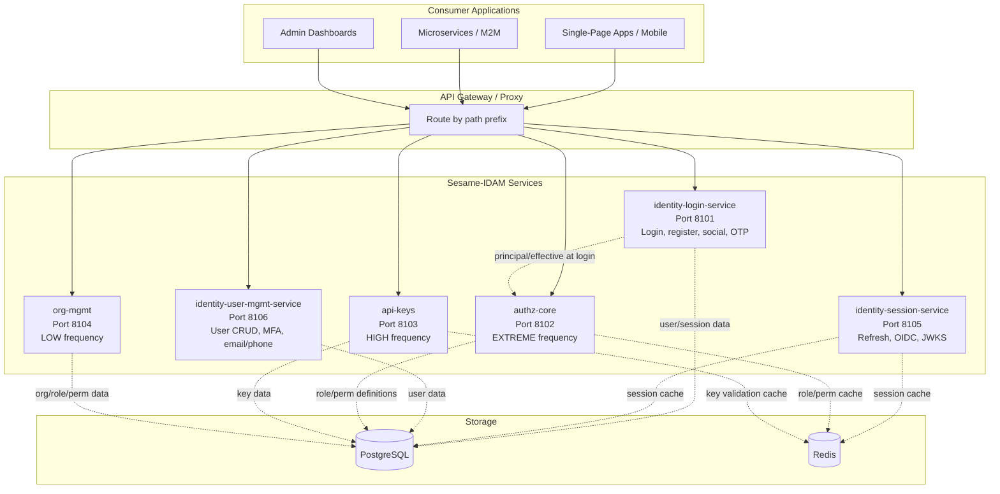

**Why six services?**
1. **Different access patterns demand different scales** — login handles bursts, refresh handles steady state, authorize handles every API call
2. **Different per-request costs** — password hashing is expensive, JWT verification is cheap
3. **Failure domains are isolated** — a login outage doesn't affect session refresh or authorization
4. **Independent deployment cycles** — OTP flows can ship without touching user management

### 3.1 Inter-Service Dependencies

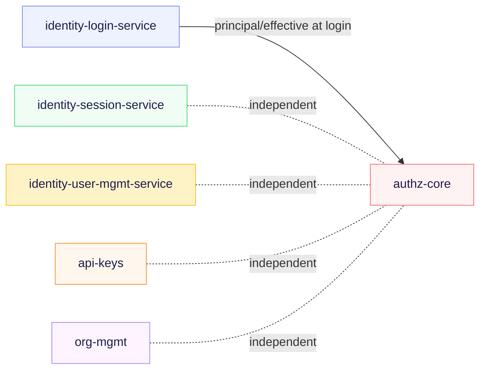

The **only** cross-service dependency is `identity-login-service` calling authz-core's `/principal/effective` endpoint at login time to populate JWT claims. After the JWT is issued, it is self-contained. All other services are fully independent.

---

## 4. Service Details

### 4.1 identity-login-service (Port 8101)

The primary authentication entry point. Handles all user-facing login, registration, and social OAuth flows.

**Base paths:** `/auth/login`, `/auth/register`, `/auth/logout`, `/auth/token`, `/social/*`, `/oauth/authorize`, OTP endpoints

| Sub-area | Endpoints | Frequency | Cost |
|----------|-----------|-----------|------|
| **Password Login** | `/auth/login`, `/auth/token` | HIGH | HIGH (password hash + JWT sign) |
| **Social OAuth** | `/social/{provider}/login`, `/social/{provider}/callback` | HIGH | HIGH (external IdP + JWT sign) |
| **Email OTP** | `/auth/login/email-otp`, `/auth/verify/email-otp` | MEDIUM | MEDIUM (email send + JWT sign) |
| **Phone OTP** | `/auth/login/phone-otp`, `/auth/verify/phone-otp` | MEDIUM | MEDIUM (SMS send + JWT sign) |
| **Dual OTP** | `/auth/login/dual-otp`, `/auth/verify/dual-otp` | LOW | HIGH (2x channel + JWT sign) |
| **Session Init** | `/auth/register`, `/auth/forgot-password`, `/auth/reset-password` | MEDIUM | MEDIUM (DB writes) |
| **Magic Link** | `/api/v1/identity/users/{id}/magiclink` | LOW | LOW-MEDIUM (email send) |

**Key endpoints:**
- `POST /auth/login` — email/password login, returns enriched JWT
- `POST /auth/register` — idempotent user creation with email/password
- `POST /auth/login/email-otp` — passwordless email OTP flow
- `POST /auth/login/dual-otp` — simultaneous email + phone OTP for high-security
- `POST /social/{provider}/login` — initiate social OAuth (redirect)
- `POST /social/{provider}/callback` — exchange OAuth code for tokens
- `POST /oauth/authorize` — authorization code flow for OIDC SPAs

**Storage:** PostgreSQL (users, sessions), Redis (session cache, OTP tokens)

### 4.2 identity-session-service (Port 8105)

Token lifecycle and OIDC discovery. Handles refresh, logout, and JWKS/OIDC endpoints.

**Base paths:** `/auth/refresh`, `/auth/logout`, `/.well-known/openid-configuration`, `/.well-known/jwks.json`

| Sub-area | Endpoints | Frequency | Cost |
|----------|-----------|-----------|------|
| **Token Refresh** | `/auth/refresh` | EXTREME | LOW (DB lookup + rotate + sign) |
| **OIDC Discovery** | `/.well-known/openid-configuration` | EXTREME | NEGLIGIBLE (static) |
| **JWKS** | `/.well-known/jwks.json` | EXTREME | NEGLIGIBLE (cached key set) |
| **Session Info** | `GET /api/v1/identity/users/me` | HIGH | LOW (cached profile) |
| **Session Update** | `PATCH /api/v1/identity/users/me` | LOW | MEDIUM (DB write) |
| **Logout** | `/auth/logout` | MEDIUM | LOW (token revocation) |

**Key endpoints:**
- `POST /auth/refresh` — rotate refresh token, issue new access token
- `GET /.well-known/openid-configuration` — OIDC discovery document
- `GET /.well-known/jwks.json` — public key set for JWT verification
- `GET /api/v1/identity/users/me` — current user profile (from token or session)

**Storage:** PostgreSQL (refresh tokens), Redis (session cache, JWKS cache)

### 4.3 identity-user-mgmt-service (Port 8106)

Admin-facing user lifecycle management. Handles user CRUD, MFA, email/phone verification, social link management, and migration.

**Base paths:** `/api/v1/identity/users/*`, `/api/v1/identity/users/{id}/mfa/*`, `/api/v1/identity/users/{id}/email/*`, `/api/v1/identity/users/{id}/phone/*`, `/api/v1/identity/users/{id}/social/*`

| Sub-area | Endpoints | Frequency | Cost |
|----------|-----------|-----------|------|
| **User CRUD** | `POST/GET/PUT/DELETE /api/v1/identity/users`, `GET /api/v1/identity/users/query` | MEDIUM | MEDIUM (DB reads/writes) |
| **Email Mgmt** | `PUT /api/v1/identity/users/{id}/email`, verify, resend confirmation | MEDIUM | MEDIUM (DB + email) |
| **Phone Mgmt** | `POST /api/v1/identity/users/{id}/phone`, verify | LOW | MEDIUM (DB + SMS) |
| **MFA** | `POST/DELETE /api/v1/identity/users/{id}/mfa/*`, verify | MEDIUM | MEDIUM (DB + TOTP setup) |
| **Social Links** | `POST/GET /api/v1/identity/users/{id}/social/*`, refresh tokens | LOW | MEDIUM (external IdP + DB) |
| **Account Actions** | disable, enable, logout-all, clear-password, migrate | LOW | LOW-MEDIUM |

**Key endpoints:**
- `POST /api/v1/identity/users` — create user (admin)
- `GET /api/v1/identity/users/query` — paginated user search with filters
- `POST /api/v1/identity/users/{id}/mfa/setup` — TOTP setup
- `POST /api/v1/identity/users/{id}/mfa/verify` — MFA verification
- `POST /api/v1/identity/users/migrate` — bulk password migration
- `POST /api/v1/identity/users/{id}/social/link` — link OAuth account

**Storage:** PostgreSQL (users, MFA secrets, social tokens)

### 4.4 authz-core (Port 8102)

Real-time authorization evaluation. Called on every consumer API request for fine-grained permission checks.

**Base paths:** `/api/v1/am/authorize`, `/api/v1/am/principal/*`

| Endpoint | Method | Purpose |
|----------|--------|---------|
| `/api/v1/am/authorize` | POST | Per-request authorization check |
| `/api/v1/am/principal/effective` | POST | Resolve user's effective roles + permissions |
| `/api/v1/am/principals/roles` | POST | Assign/revoke principal roles |
| `/api/v1/am/principals/attributes` | POST | Set principal attributes (ABAC) |

**Authorization model:**
- **Coarse-grained checks** (e.g., "is Admin?", "has invoices:write?") — answered from JWT claims directly, zero latency
- **Fine-grained checks** (e.g., "can user delete invoice #123?") — requires `POST /authorize` with action + resource context, uses ABAC rules

**Caching:** Redis with 30-second TTL for permission resolution results. Cache hit ratio targets >99%.

### 4.5 api-keys (Port 8103)

M2M authentication for services and CLI tools. Independent from user-facing authentication.

**Base path:** `/api/v1/am/api-keys/*`

| Endpoint | Method | Purpose |
|----------|--------|---------|
| `/api/v1/am/api-keys` | POST | Create API key |
| `/api/v1/am/api-keys/{id}` | GET/PATCH/DELETE | Manage key |
| `/api/v1/am/api-keys/validate` | POST | Validate any API key |
| `/api/v1/am/api-keys/validate/personal` | POST | Validate personal (user-scoped) key |
| `/api/v1/am/api-keys/validate/org` | POST | Validate org-scoped key |
| `/api/v1/am/api-keys/archived` | GET | Fetch expired/revoked keys |
| `/api/v1/am/api-keys/usage` | GET | Fetch usage statistics |
| `/api/v1/am/api-keys/import` | POST | Import keys from third-party systems |

**Validation flow:** Simple hash comparison (SHA-256 of stored key). Extremely fast CPU. Returns user + org context if valid.

### 4.6 org-mgmt (Port 8104)

Organisation lifecycle, membership, SSO/SCIM, application/role/permission definitions.

**Base paths:** `/orgs/*`, `/api/v1/am/applications/*`

| Area | Endpoints | Frequency |
|------|-----------|-----------|
| **Orgs** | `POST/GET/PUT/DELETE /orgs`, `/orgs/{id}/members`, `/orgs/{id}/pending-invites` | LOW |
| **SSO/SCIM** | SAML/OIDC configuration per org, SCIM groups | LOW |
| **Applications** | `POST/GET /api/v1/am/applications`, roles/permissions per application | LOW |
| **Webhooks** | `POST/GET/PUT/DELETE /orgs/{id}/webhooks`, test delivery | LOW |

**Org settings** (new, May 5, 2026):
- Password rotation: `password_rotation_enabled`, `password_rotation_history_size`, `password_rotation_period`
- Seat management: `max_users` (nullable = unlimited)
- Domain controls: `domain`, `domains`, `domain_auto_join`, `domain_restrict`
- SAML status: `is_saml_configured`, `is_saml_in_test_mode`, `can_setup_saml`, `isolated`, `sso_trust_level`
- Legacy: `legacy_org_id`

---

## 5. Data Model

### 5.0 Multi-Tenant Partitioning

**Sesame-IDAM uses a hard-segment multi-tenant architecture.** Every major entity includes a `tenant_id` (UUID) column that partitions data per consuming platform. The same email can exist across tenants but represents unrelated identities.

| Entity | `tenant_id` Column | UK Constraint |
|--------|-------------------|---------------|
| `users` | `uuid NOT NULL FK` | `UNIQUE(tenant_id, email)` |
| `organizations` | `uuid NOT NULL FK` | `UNIQUE(tenant_id, name)` |
| `api_keys` | `uuid NOT NULL FK` | `UNIQUE(tenant_id, key_hash)` |
| `mfa_devices` | `uuid NOT NULL FK` | N/A |
| `audit_logs` | `uuid NOT NULL FK` | N/A |
| `applications` | `uuid NOT NULL FK` | N/A |

Tenant isolation is enforced at three layers (defense in depth):
1. **Application layer** — `SesameExecutor` injects `tenant_id` into every query
2. **Lifeguard ORM** — transparent context injection via database wrapper
3. **PostgreSQL RLS** — policies silently strip cross-tenant data

See [`topics/topic-tenancy-model.md`](./topics/topic-tenancy-model.md) for the full model.

### 5.1 Entity Relationship Diagram

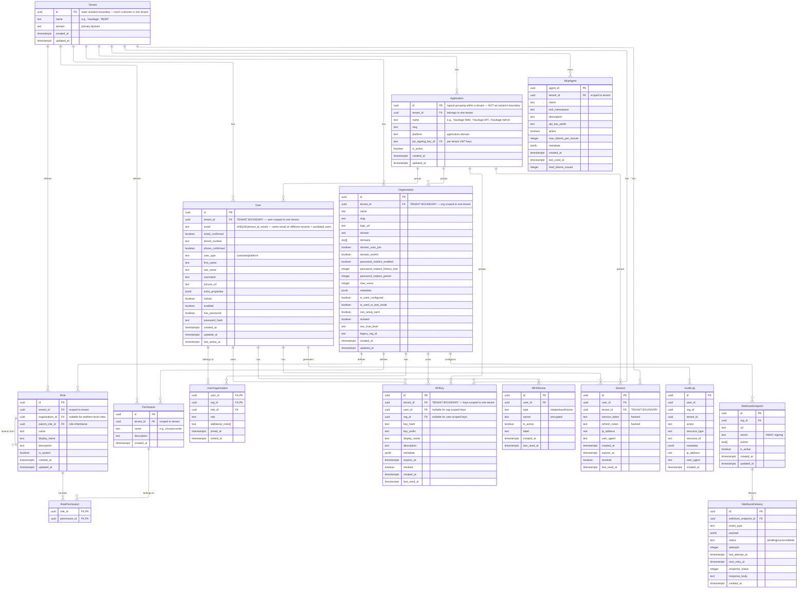

### 5.2 Key Design Decisions

| Decision | Rationale |
|----------|-----------|
| **Two-level hierarchy: Tenant > Application** | A `Tenant` is the isolation boundary (zero bleed between tenants). An `Application` is a logical grouping within a tenant (e.g., hauliage has hauliage-web, hauliage-api, hauliage-admin). `X-Tenant-ID` maps to the Tenant. |
| **No shared users across tenants** | `UNIQUE(tenant_id, email)` — the same email can exist on different tenants but represents unrelated users. No cross-tenant identity. |
| **One user table, two user types** | No separate `platform_user` and `customer_user` tables. The `user_type` column distinguishes them, and the JWT claim shape differs. |
| **Organisations are per-tenant** | The same organisation name can exist in different tenants without conflict. An org is always scoped to the tenant it was created in. |
| **Roles are per-tenant, scoped to orgs** | Platform-level roles have `org_id: NULL`. Org-level roles are scoped to a specific org within a specific tenant. |
| **Role inheritance via `parent_role_id`** | A role can inherit from another role within the same tenant. Effective permissions are resolved by walking the inheritance chain. |
| **Sessions are per-tenant AND per-user** | A user has sessions only within the tenant they authenticated against. Refresh tokens are tenant-scoped. |
| **Soft deletes everywhere** | `deleted_at` columns on user, organisation, application, and tenant allow graceful deletion with auditability. |
| **Refresh tokens are rotated** | On every `/refresh`, the old token is revoked and a new one issued. Prevents replay attacks. |
| **API keys are per-tenant** | Each key belongs to exactly one tenant. Keys from one tenant cannot be used in another. |

---

## 6. Authentication & Authorization

### 6.0 Multi-Tenant Context

Every request enters Sesame-IDAM with a tenant context that partitions all data. The `X-Tenant-ID` header (or tenant-scoped API key) identifies which consuming platform the request belongs to. This header is injected by the consuming application's gateway or SDK.

**Critical rules:**
- The same email can exist on multiple tenants but represents unrelated users
- All database queries automatically scope to `tenant_id` via `SesameExecutor`
- JWTs include `tenant_id` in claims so downstream services stay in context
- No cross-tenant identity, no cross-tenant data, no cross-tenant operations

See [`topics/topic-tenancy-model.md`](./topics/topic-tenancy-model.md) for the full model.

### 6.1 Authentication Flows

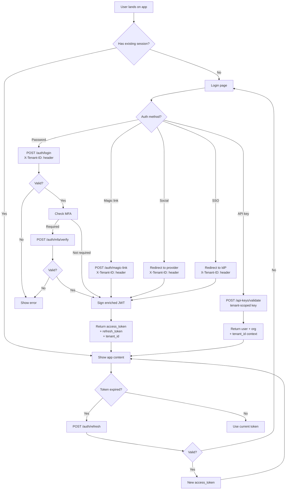

**Supported auth methods:**
- Email/password login
- Magic link login
- Social login (Google, GitHub, LinkedIn, etc.)
- Enterprise SSO (SAML/OIDC per organisation)
- API key authentication (M2M)
- Phone OTP login

**MFA:** TOTP setup and verification, with step-up MFA for sensitive actions.

### 6.2 JWT Schema

Every JWT issued by Sesame is an RS256-signed token containing all the identity and access context the application needs:

```json
{
  "alg": "RS256",
  "typ": "JWT",
  "kid": "key-2025-01",
  "iss": "https://auth.seesame.io",
  "sub": "31c41c16-...",
  "aud": "myapp.com",
  "exp": 1715003600,
  "iat": 1715000000,
  "jti": "tok_abc123",
  "tenant_id": "app_a4b9c1...",
  "user_id": "31c41c16-...",
  "user_type": "customer",
  "org_id": "1189c444-...",
  "org_name": "Acme Inc",
  "roles": ["admin", "billing-viewer"],
  "permissions": ["org:admin", "billing:read", "billing:write"],
  "inherited_roles_plus_current": ["admin", "member"],
  "mfa_enabled": true,
  "is_platform_admin": false,
  "phone_number": "+141****1234",
  "phone_verified": true,
  "email_verified": true,
  "locked": false,
  "enabled": true
}
```

**Claim trust model:** All claims are **authoritative in Sesame**. They are written by the identity service at token generation time and are never modifiable by the client. The application reads them as trusted facts.

### 6.3 Authorization Model


**Coarse-grained checks** use JWT claims directly — zero latency, zero DB call:
```rust
// In your handler
if jwt.claims.permissions.contains("invoices:write") {
    // Allow the operation
}
```

**Fine-grained checks** call `authz-core`:
```rust
// For resource-specific checks
let result = authz_client.authorize(AuthorizeRequest {
    user_id: jwt.claims.user_id,
    org_id: jwt.claims.org_id,
    action: "delete",
    resource: "invoice:123",
}).await?;
```

**ABAC attributes** can be set on principals for context-aware authorization:
```rust
// Example: department-based access control
authz_client.set_principal_attribute(SetPrincipalAttributeRequest {
    user_id: user_id,
    key: "department",
    value: "engineering",
    org_id: Some(org_id),
}).await?;
```

---

## 7. The RLS Bridge

This is Sesame's **killer differentiator**. PropelAuth gives you the JWT; Supabase gives you RLS helpers. Sesame gives you both.

### 7.1 The Three-Layer Model

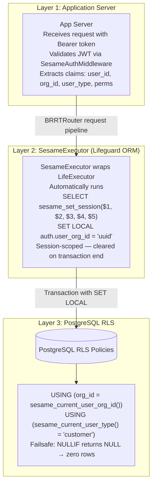

### 7.2 SQL Helpers (Deployed Into Consuming App's DB)

```sql
-- Set all RLS session variables from decoded JWT claims
-- Called by the application AFTER validating the JWT.
-- org_type is the 4th parameter (for 3-persona B2B support).
CREATE OR REPLACE FUNCTION public.sesame_set_session(
    p_user_id        uuid,
    p_user_org_id    uuid,
    p_user_org_type  text DEFAULT 'consumer',
    p_user_type      text DEFAULT 'customer',
    p_permissions    text[] DEFAULT '{}',
    p_user_email     text DEFAULT NULL
) RETURNS void LANGUAGE plpgsql SECURITY DEFINER AS $$
BEGIN
    SET LOCAL auth.user_id        := p_user_id;
    SET LOCAL auth.user_org_id    := p_user_org_id;
    SET LOCAL auth.user_org_type  := p_user_org_type;
    SET LOCAL auth.user_type      := p_user_type;
    SET LOCAL auth.permissions    := p_permissions;
    SET LOCAL auth.user_email     := p_user_email;
END;
$$;

-- Read helpers for RLS policies
CREATE OR REPLACE FUNCTION public.sesame_current_user_id()      RETURNS uuid  LANGUAGE sql STABLE AS $$ SELECT NULLIF(current_setting('auth.user_id', true), ''); $$;
CREATE OR REPLACE FUNCTION public.sesame_current_user_org_id()  RETURNS uuid  LANGUAGE sql STABLE AS $$ SELECT NULLIF(current_setting('auth.user_org_id', true), ''); $$;
CREATE OR REPLACE FUNCTION public.sesame_current_user_org_type() RETURNS text  LANGUAGE sql STABLE AS $$ SELECT NULLIF(current_setting('auth.user_org_type', true), ''); $$;
CREATE OR REPLACE FUNCTION public.sesame_current_user_type()    RETURNS text  LANGUAGE sql STABLE AS $$ SELECT NULLIF(current_setting('auth.user_type', true), ''); $$;
CREATE OR REPLACE FUNCTION public.sesame_current_permissions()  RETURNS text[] LANGUAGE sql STABLE AS $$ SELECT NULLIF(current_setting('auth.permissions', true), ''); $$;
CREATE OR REPLACE FUNCTION public.sesame_current_user_email()   RETURNS text  LANGUAGE sql STABLE AS $$ SELECT NULLIF(current_setting('auth.user_email', true), ''); $$;
```

### 7.3 RLS Policy Template

```sql
-- Enable RLS on the table
ALTER TABLE public.invoices ENABLE ROW LEVEL SECURITY;

-- Policy for customer users: only see rows in their org
CREATE POLICY org_scope_customers ON public.invoices
    FOR ALL
    USING (
        org_id = COALESCE(
            sesame_current_user_org_id(),
            gen_random_uuid()  -- failsafe: if no org_id set, match nothing
        )
    )
    AND sesame_current_user_type() = 'customer';

-- Policy for platform users: can see all rows
CREATE POLICY platform_all_access ON public.invoices
    FOR ALL
    USING (sesame_current_user_type() = 'platform');

-- Policy for unauthenticated access: block everything
CREATE POLICY deny_unauthenticated ON public.invoices
    FOR ALL
    USING (sesame_current_user_id() IS NOT NULL);
```

### 7.4 Provider↔Consumer Cross-Org Model

For apps with provider-consumer relationships (e.g., logistics, HR platforms):

```sql
-- Provider users: see own org rows + rows linked to their consumer orgs
CREATE POLICY provider_cross_org_access ON public.shipments
    FOR ALL
    USING (
        sesame_current_user_org_type() = 'provider'
        AND (
            org_id = sesame_current_user_org_id()
            OR org_id IN (
                SELECT consumer_org_id
                FROM public.provider_consumer_links
                WHERE provider_org_id = sesame_current_user_org_id()
            )
        )
    );

-- Consumer users: see own org rows
CREATE POLICY consumer_org_scope ON public.shipments
    FOR ALL
    USING (
        sesame_current_user_org_type() = 'consumer'
        AND org_id = COALESCE(
            sesame_current_user_org_id(),
            gen_random_uuid()
        )
    );
```

### 7.5 Access Matrix

| User Persona | org_id | org_type | Should see rows where |
|---|---|---|---|
| **Platform** | platform-org | platform | `org_id IS NOT NULL` (all rows) |
| **Provider** | provider-A | provider | `org_id = provider-A` OR linked consumer orgs |
| **Consumer** | consumer-B | consumer | `org_id = consumer-B` only |

### 7.6 Transaction Boundary Guarantee

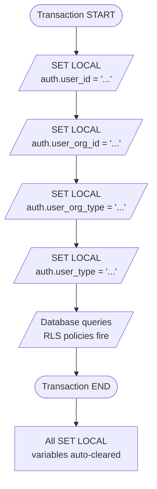

`SET LOCAL` is scoped to the current transaction only — critical for connection pooling. If we used `SET`, a leaked session variable from one user would be visible to the next user reusing the same DB connection.

---

## 8. Integration Patterns

### 8.1 How an Application Bolts On

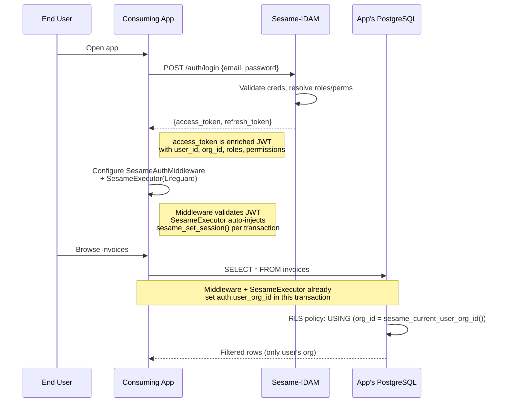

### 8.2 Login + JWT Enrichment Flow

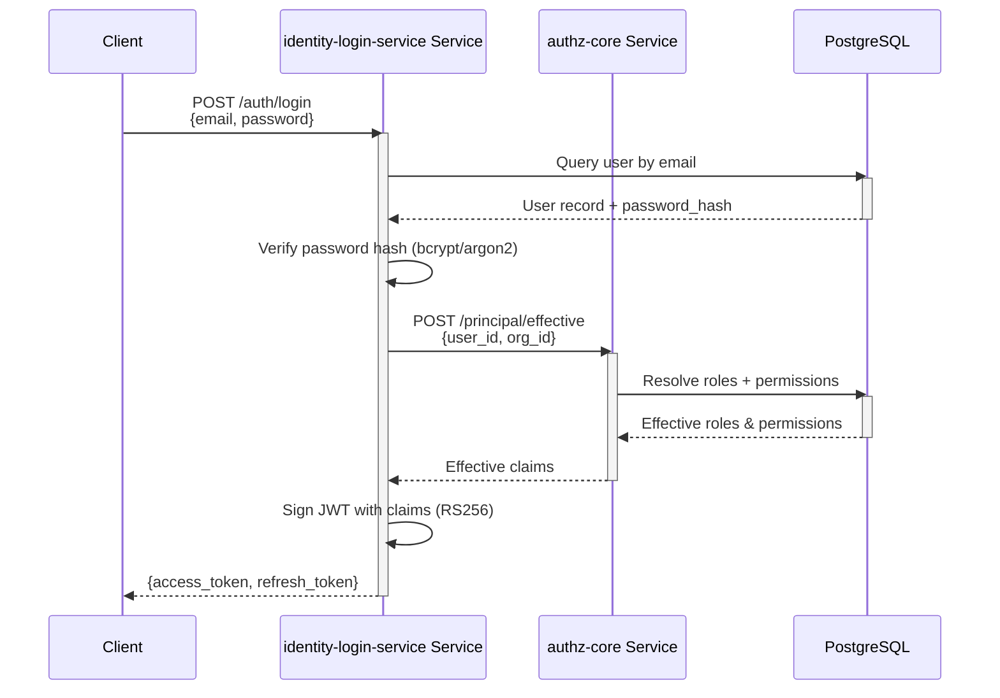

**Key insight:** The call to authz-core happens **once at login**. The resulting JWT contains all role/permission claims. Subsequent requests use the JWT directly — no further authz-core call is needed for coarse-grained checks.

### 8.3 Per-Request Fine-Grained Authorization

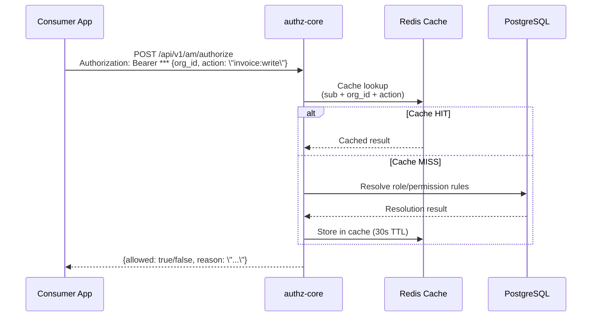

### 8.4 API Key Validation Flow

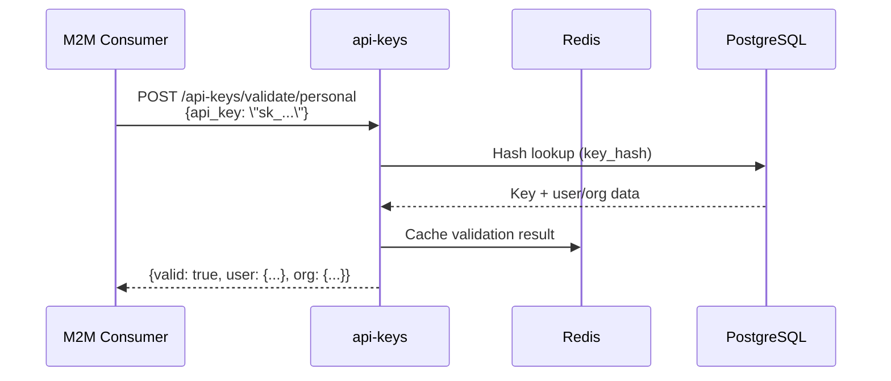

### 8.5 Webhook System

Sesame sends webhooks to the consuming application when identity state changes.

**Event types (17 events):**
`user.created`, `user.updated`, `user.deleted`, `user.login`, `user.impersonated`, `organization.created`, `organization.updated`, `organization.deleted`, `membership.joined`, `membership.left`, `membership.role_changed`, `role.created`, `role.updated`, `role.deleted`, `permission.created`, `permission.updated`, `permission.deleted`

**Delivery:** HMAC-SHA256 signed payloads, exponential backoff retry (1s, 2s, 4s...), max 10 attempts over ~17 minutes.

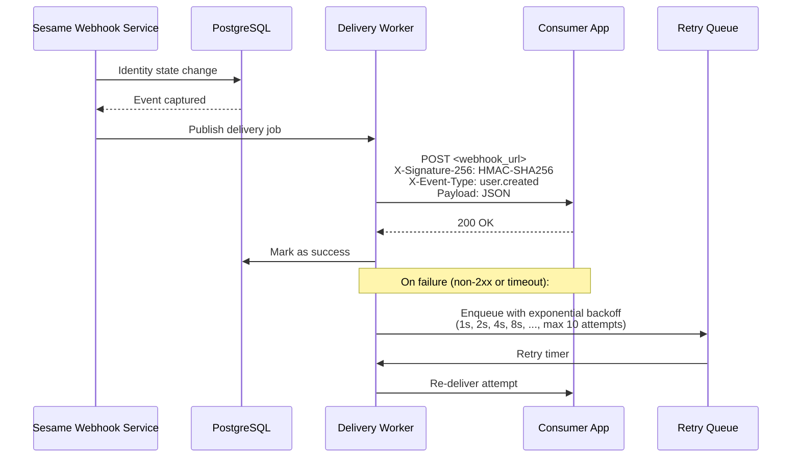

---

## 9. OpenAPI Surface

**Total: 146 endpoints across 130 OpenAPI paths, 152 schemas**

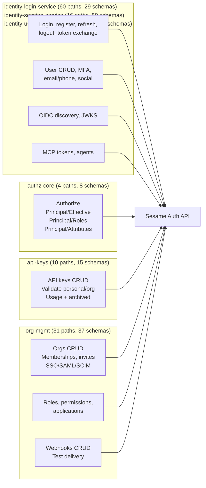

**Key OpenAPI files:**

| Service | Spec File | Description |
|---------|-----------|-------------|
| identity-login-service + identity-session-service + identity-user-mgmt-service | `openapi/idam/identity-login-service/`, `openapi/idam/identity-session-service/`, `openapi/idam/identity-user-mgmt-service/` | **Canonical spec** — all identity service endpoints, feeds BRRTRouter codegen |
| identity-login-service | `openapi/identity-login-service/openapi.yaml` | Login, register, social, token exchange (self-contained copy) |
| identity-session-service | `openapi/identity-session-service/openapi.yaml` | Token refresh, OIDC, JWKS (self-contained copy) |
| identity-user-mgmt-service | `openapi/identity-user-mgmt-service/openapi.yaml` | User CRUD, MFA, email/phone (self-contained copy) |
| authz-core | `openapi/authz-core/openapi.yaml` | authorize, principal/effective, roles, attributes |
| api-keys | `openapi/api-keys/openapi.yaml` | API keys CRUD, validation (personal + org variants) |
| org-mgmt | `openapi/org-mgmt/openapi.yaml` | Orgs CRUD, memberships, SSO, roles, permissions, webhooks |

> Each service has its own independent spec (no combined spec) is the single source of truth for BRRTRouter codegen. Sub-specs are independent, self-contained copies for navigation — they do not lint independently.

---

## 10. Security Design

### 10.1 Token Security

| Property | Detail |
|----------|--------|
| **Algorithm** | RS256 (RSA + SHA-256) |
| **Key management** | Public keys served via `/.well-known/jwks.json`, rotated on schedule |
| **TTL** | Default 15 minutes, configurable per application |
| **Refresh tokens** | Rotated on every use, stored hashed in Redis and PostgreSQL |
| **Impersonation** | Platform admins can generate tokens acting as any user in their org |
| **Session management** | Full session lifecycle with per-application scoping, logout-all, IP tracking |

### 10.2 Password Security

| Property | Detail |
|----------|--------|
| **Hashing** | Argon2id with tuned parameters (configurable cost) |
| **Rotation** | Per-org settings: `password_rotation_enabled`, `history_size` (1-24), `period` (default 30 days) |
| **Reset** | Token-based password reset via email, single-use |
| **Clear password** | `DELETE /users/{id}/password` for SSO-only conversion |

### 10.3 MFA

| Feature | Detail |
|---------|--------|
| **TOTP** | QR code provisioning, 6-digit codes |
| **WebAuthn** | Hardware security keys, biometric |
| **SMS OTP** | 4-6 digit codes |
| **Step-up** | Re-authentication for sensitive actions (separate from login) |

### 10.4 API Key Security

| Property | Detail |
|----------|--------|
| **Storage** | SHA-256 hash of key (never stored plaintext) |
| **Prefix** | Full key shown only at creation time |
| **Validation** | Hash lookup, <1ms |
| **Rotation** | PATCH /api-keys/{id} with new key material |
| **Archival** | Revoked/expired keys retained for audit |

### 10.5 RLS Security Model

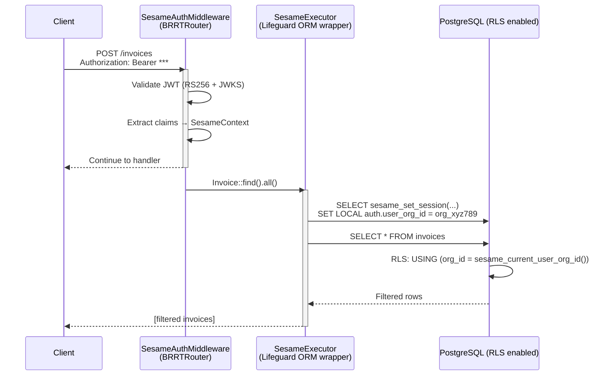

**Security guarantees:**
1. JWT signature verification happens in the application layer using RS256 public keys from Sesame's JWKS
2. The JWT itself **never** enters PostgreSQL
3. Only extracted, verified claim values enter the database via `SET LOCAL`
4. RLS policies are the defense-in-depth safety net — if middleware is bypassed, zero rows are returned
5. `SET LOCAL` scoping prevents cross-user leakage in connection pooling scenarios

### 10.6 Webhook Security

| Property | Detail |
|----------|--------|
| **Signing** | HMAC-SHA256(payload, secret) in `X-Signature-256` header |
| **Secret** | Configurable per webhook, stored encrypted |
| **Verification** | Consumer app computes HMAC and compares with header |

---

## 11. Scaling & Deployment

### 11.1 Scaling Profile Per Service

| Service | Frequency | Cost | Bottleneck | Strategy |
|---------|-----------|------|------------|----------|
| **identity-login-service** | HIGH (100-10K req/s per 1K users) | Mixed | Password hashing (CPU-bound) | Horizontal + vertical (Argon2id tuned) |
| **authz-core** | EXTREME (>10K req/s per 1K users) | LOW (cached) | Redis latency | Horizontal, sharded by org_id |
| **api-keys** | HIGH (independently spiky) | LOW (hash lookup) | Trivial CPU | Horizontal, stateless |
| **org-mgmt** | LOW (<100 req/s) | MEDIUM (SSO) | External IdP calls | Single instance, scale to zero |

### 11.2 Storage Layout

| Service | PostgreSQL Tables | Redis Usage |
|---------|------------------|-------------|
| identity-login-service | users, sessions, mfa_devices, password_reset_tokens | Session cache, refresh token rotation |
| authz-core | roles, permissions, role_permissions, user_roles | Role/permission cache (30s TTL) |
| api-keys | api_keys | Validation result cache (short TTL) |
| org-mgmt | organizations, organization_members, webhook_endpoints, applications | None |

### 11.3 Deployment

**Environment:** Kubernetes (Kind for development, production clusters for deployment)

**Tooling:** Tilt for local development, Helm charts for production deployment

**Ports:**
| Service | Port |
|---------|------|
| identity-login-service | 8101 |
| authz-core | 8102 |
| api-keys | 8103 |
| org-mgmt | 8104 |

**Database:** PostgreSQL (hosted externally or via Supabase stack), Redis for caching

---

## 12. What Sesame Adds Beyond the Benchmark

Sesame matches or exceeds the entire PropelAuth API surface **and** adds features that PropelAuth doesn't have:

| Feature | Sesame | PropelAuth |
|---------|--------|------------|
| **RLS Helper SQL** | ✅ Native RLS helpers (`sesame_set_session`, `sesame_current_*`) | ❌ App-level only |
| **SesameExecutor** | ✅ Automatic RLS injection at ORM level | ❌ |
| **Dual OTP** | ✅ Email + phone simultaneous verification | ❌ |
| **Phone OTP** | ✅ SMS OTP login | ❌ |
| **Role inheritance** | ✅ Explicit `parent_role_id` in data model | ⚠️ Implicit |
| **Application model** | ✅ First-class Application entities | ❌ Implicit (projectId) |
| **Webhook system** | ✅ Complete delivery with retries, signing, tracking | ⚠️ Basic |
| **User type** | ✅ `customer` / `platform` distinction at JWT claim level | ❌ |
| **Token rotation** | ✅ Explicit refresh token rotation on every `/refresh` | ❌ |
| **org_type** | ✅ Provider/consumer/platform persona classification | ❌ |
| **Open source** | ✅ Self-hosted, no per-user pricing | ❌ Proprietary / paid |

---

## 13. Trade-offs & Hard Boundaries

### 13.1 No PostgREST-Style Auto-Generated API

**Sesame will NOT provide a PostgREST-style auto-generated REST interface.** All access to consuming-application data flows through the application server. There is no direct SQL-to-REST bridge that bypasses the app layer. RLS policies exist because database-level security is non-negotiable, but they are not the primary authorization mechanism.

### 13.2 JWT Verification Never Happens in PostgreSQL

Sesame does not do JWT signature verification inside PostgreSQL. The application layer validates the JWT using RS256 public keys from Sesame's JWKS. Only extracted claim values enter the database.

### 13.3 Multi-Org Sessions

At any given moment, a user operates within **ONE** org context. When a user belongs to multiple orgs:
1. Present the user with an org picker
2. On selection, `SET LOCAL auth.user_org_id = <selected_org_id>`
3. All subsequent queries are scoped to that org
4. `user.switchOrg(id)` in the SDK rotates the JWT to reflect the new context

### 13.4 org_type Trust Boundary

`org_type` must never appear in URI paths (e.g., `/provider-orgs/`) because URIs are client-controlled and mutable. It flows exclusively via JWT claim, set by the identity service at token generation. This is the same trust model as `user_type`.

---

## 14. Future Work

| Area | Status | Notes |
|------|--------|-------|
| **Custom OAuth providers** | Planned | Support arbitrary OAuth providers beyond Google, GitHub, LinkedIn |
| **Bulk user operations** | Deferred | Import/export users in bulk for migration |
| **Session analytics** | Deferred | Login frequency, active sessions, geographic distribution |
| **Advanced MFA** | Deferred | Push notifications, hardware key enrollment flows |
| **Custom login pages** | Deferred | Branded login/signup pages (PropelAuth provides this) |
| **Frontend SDK** | Planned | React/Vue hooks for auth state management |
| **Backend SDK** | Planned | Rust, Python, Node.js libraries for token validation and enrichment |

---

*This design document consolidates the following prior documents: `service-topology-design.md`, `HLD.md`, `sequence.md`, `UML.md`, `sesame-idam-complete.md`, `rls-design-v2.md`, `rls-design.md`, `rls-hauliage-design.md`, `adr-001-org-type-classification.md`, `cross-repo-auth-analysis.md`, `propelauth-gap-analysis.md`, `propeleauth-footprint-and-developer-contract.md`.*
