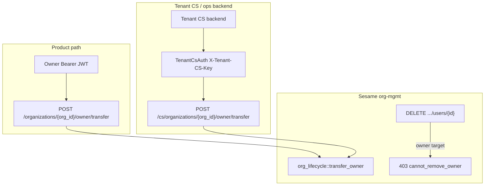

# Design: Organization Owner Transfer & Ops-Console Privileged APIs

| Field | Value |
|-------|--------|
| **Version** | `v2026-08-03` |
| **Status** | Active — authoritative design for Owner succession |
| **Owner** | Sesame-IDAM (org-mgmt) |
| **Related PRD** | [`PRD_org-owner-admin-membership-policy-v1.md`](./PRD_org-owner-admin-membership-policy-v1.md) |
| **Consumer twin** | Hauliage [`PRD_loadlinker-owner-admin-roles-v1.md`](../../hauliage/docs/PRD_loadlinker-owner-admin-roles-v1.md) |
| **Platform tenancy** | [`topic-platform-tenants.md`](./llmwiki/topics/topic-platform-tenants.md), [PRD-P1](./PRD-P1-platform-tenant-admin.md) |

---

## 1. Purpose

This document defines **how organization ownership may change** in Sesame-IDAM, and the **reusable pattern for privileged ops-console APIs** (Sesame platform ops and tenant product CS/ops backends).

It is the reference when:

1. Implementing Owner succession in org-mgmt.
2. Adding further Sesame platform ops surfaces.
3. Advising tenants (Hauliage, PriceWhisperer, …) how to build **their** CS/ops consoles against Sesame without inventing competing membership authority.

---

## 2. Problem

| Constraint | Implication |
|------------|-------------|
| Product-path Owner remove/demote is forbidden (`cannot_remove_owner`) | Need a **deliberate succession** primitive |
| Org must not become Owner-less | Prefer **transfer** over bare DELETE of Owner |
| Current Owner may want to hand off | Product path: Owner-initiated transfer |
| Owner unavailable / compromised / departed | Tenant CS backend needs a **privileged** transfer |
| Sesame platform ops ≠ tenant CS | Distinct principal types and blast radius |
| Consumers must not re-implement policy in BFFs | Sesame remains sole membership authority |

---

## 3. Goals

1. **Atomic Owner transfer** as the only supported way to change the org principal on product and CS paths.
2. **Two caller classes** with clear contracts: product Owner JWT; tenant CS service credential.
3. **Reusable ops-console pattern** for future privileged org/tenant operations.
4. **Hard tenant isolation** on every privileged call.
5. **Auditability** (reason/ticket/actor) and **session invalidation** after succession.
6. Keep product `DELETE`/`PATCH role` Owner guards unchanged forever.
7. **Role elevation** (member → admin / product roles) stays on `PATCH …/role`; assigning `owner` is forbidden there (`cannot_assign_owner`) — use transfer.

## 4. Non-goals

| Item | Notes |
|------|-------|
| Multi-owner product feature | Transfer targets a **single** principal; multi-owner cleanup is edge-case only |
| Org dissolve / last-Owner wipe | Separate future API |
| Dual-control inside Sesame v1 | Consumer CS may enforce; Sesame audits |
| Full RBAC permission catalog | Out of scope |
| Exposing CS APIs on public product BFFs | Forbidden |

---

## 5. Authority model



| Layer | May decide Owner succession? |
|-------|------------------------------|
| Sesame `org_lifecycle` | **Yes — sole authority** |
| Sesame product membership DELETE/PATCH | **No** for Owners |
| Tenant product BFF | Orchestrate + pass through errors only |
| Tenant CS backend | Call Sesame CS transfer; may add ticket/dual-control UX |
| Sesame platform admin (`X-Platform-Admin-Key`) | Tenant mint/suspend — **not** org Owner transfer (wrong layer) |

---

## 6. Principal types (ops-console pattern)

Reusable classification for any privileged Sesame API:

| Principal | Auth artifact | Scope | Typical caller |
|-----------|---------------|-------|----------------|
| **End-user** | Bearer JWT (`sub`, `tenant_id`, org membership) | Own membership / org-admin product APIs | Loadlinker UI via BFF |
| **Tenant CS / ops service** | `TenantCsAuth` (`X-Tenant-CS-Key`) + `X-Tenant-ID` | Narrow ops scopes within **one** tenant | Hauliage CS backend |
| **Platform ops** | `PlatformServiceAuth` (`X-Platform-Admin-Key`) | Cross-tenant platform registry (tenants, OAuth metadata) | Sesame CLI / provisioning worker |

### Rules

1. **Never** overload end-user JWT with “CS mode” flags to bypass Owner immutability.
2. **Never** use platform admin key for tenant org membership mutations (blast radius + wrong trust domain).
3. Tenant CS credentials are **tenant-bound**: a key for `hauliage` cannot act on `acme`.
4. Privileged routes use a **distinct path prefix and security scheme** from product routes.
5. Product BFFs must **not** proxy CS credentials to browsers.

### Evolution path for TenantCsAuth

| Phase | Mechanism |
|-------|-----------|
| **v1 (this design)** | Env map `SESAME_TENANT_CS_KEYS` JSON `{"hauliage":"<secret>",...}` validated by org-mgmt provider + handler tenant bind |
| **v2** | Migrate to api-keys / OAuth client-credentials with explicit scope `org.owner.transfer` |
| **v3** | Optional human `platform_admin` / tenant-staff JWT for Sesame portal agents on the same handler (`actor_type` in audit) |

---

## 6b. Role elevation (non-Owner)

| Operation | API | Allowed targets | UX / step-up |
|-----------|-----|-----------------|--------------|
| Elevate / change role | `PATCH /organizations/{org_id}/users/{user_id}/role` | Any **non-owner** role (`admin`, `dispatcher`, …) | Simple confirmation (consumer UI) is enough |
| Become Owner | `POST …/owner/transfer` only | Successor must already be an active member | **Dual-factor step-up** on the product path |

Typical product flow: elevate a trusted member to **Admin**, then **transfer** ownership to them (transfer promotes to Owner and demotes the former Owner). Do **not** PATCH `primary_role=owner`.

### Why dual-factor for Owner transfer (not for Admin elevation)

A walk-away unlocked Owner console is a real threat: another person can click through a confirmation dialog in seconds. Elevating someone to Admin is reversible and lower blast radius; confirming is enough.

Email OTP alone is **not** enough for Owner transfer: if the hijacker sits at the machine for several minutes, they may also open the Owner’s webmail tab and read the code. Product path therefore requires **two independent factors**:

| Factor | v1 (now) | v2 (when MFA enrollment is common) |
|--------|----------|-------------------------------------|
| Knowledge / authenticator | **Account password re-entry** (not on-screen) | Prefer TOTP / WebAuthn if enrolled; else password |
| Out-of-band | **Email OTP** from transfer challenge | Prefer **SMS OTP** to verified phone when available; else email |

Tenant CS path does **not** use this step-up (it uses `TenantCsAuth` + required `reason` instead).

---

## 7. Transfer semantics

### 7.1 Request (conceptual)

```json
{
  "successor_user_id": "<uuid>",
  "from_user_id": "<uuid, optional>",
  "former_owner_disposition": "demote_to_admin",
  "reason": "Owner leaving company",
  "ticket_id": "CS-4821",
  "idempotency_key": "optional-opaque"
}
```

| Field | Product path | CS path |
|-------|--------------|---------|
| `successor_user_id` | Required | Required |
| `password` | **Required** (current Owner password) | Ignored / omitted |
| `otp` | **Required** (email code from challenge) | Ignored / omitted |
| `from_user_id` | Optional if exactly one Owner; else required | Same |
| `former_owner_disposition` | Default `demote_to_admin` | Same |
| `reason` | Optional (recommended) | **Required** (min length) |
| `ticket_id` | Optional | Strongly recommended |
| `idempotency_key` | Optional | Recommended for CS retries |

### 7.2 Disposition enum

| Value | Effect on former Owner |
|-------|------------------------|
| `demote_to_admin` | Role → `admin` (default; recoverable) |
| `demote_to_member` | Role → `member` |
| `remove_membership` | Delete membership row (account remains) |

### 7.3 Algorithm (authoritative)

Executed inside org-mgmt (single logical operation; promote-before-demote so the org is never Owner-less):

1. Resolve org; enforce `org.tenant_id == request tenant`.
2. List **active** memberships with role `owner` (case-insensitive).
3. Resolve **former owner**:
   - If `from_user_id` set → must be in that owner set; else `owner_not_found`.
   - Else if exactly one owner → that user.
   - Else → `ambiguous_owner`.
4. **Authorize actor**:
   - Product: caller JWT `sub` **must equal** former owner.
   - CS: `TenantCsAuth` valid for tenant; no membership check.
5. Successor must be an **active** member of the org; else `successor_not_member`.
6. Successor must not equal former owner; else `validation_error`.
7. **Promote** successor → `owner` (no-op if already owner).
8. Apply disposition to former owner.
9. Assert ≥1 active owner remains → else `last_owner_violation` (should be unreachable if algorithm followed).
10. Bump token versions for former and successor.
11. Emit audit event `org.owner.transferred`.

### 7.4 Idempotency

If successor is already the sole Owner and former owner already matches the requested disposition (or membership already removed), return **200** with the same response shape (no error). Distinct body with same `idempotency_key` → `idempotency_conflict` (v1 may defer durable idempotency store; document retry guidance).

---

## 8. HTTP API (org-mgmt)

Base: `/idam/v1` (ClusterIP `:8080`).

### 8.1 Product — Owner-initiated

```http
POST /organizations/{org_id}/owner/transfer/challenge
Authorization: Bearer <access_token>
```

- Security: `BearerAuth` only.
- Caller must be an active Owner of the org.
- Mints a 6-digit email OTP (Redis, hashed, TTL ~5m, attempt-capped, single-use) bound to `tenant + org + caller`.
- Sends the code to the caller’s account email via SMTP.
- Response is generic success (no email echo) whether or not delivery succeeded — failures are loud in logs.

```http
POST /organizations/{org_id}/owner/transfer
Authorization: Bearer <access_token>
```

- Security: `BearerAuth` only.
- Tenant from JWT `tenant_id` (header optional; mismatch → 401 per existing `org_auth`).
- Caller must be the former Owner.
- Body must include `password` (current account password) and `otp` (outstanding challenge).
- Missing/invalid → `403 password_required` / `password_invalid` / `otp_required` / `otp_invalid`.

### 8.2 Tenant CS — privileged

```http
POST /cs/organizations/{org_id}/owner/transfer
X-Tenant-CS-Key: <secret>
X-Tenant-ID: hauliage
```

- Security: `TenantCsAuth` only (not Bearer).
- `X-Tenant-ID` **required**.
- Key must be bound to that tenant.
- `reason` required.

### 8.3 Success response (`200`)

```json
{
  "org_id": "…",
  "former_owner_user_id": "…",
  "successor_user_id": "…",
  "former_owner_disposition": "demote_to_admin"
}
```

### 8.4 Error codes

| HTTP | `error` | When |
|------|---------|------|
| 401 | `unauthorized` | Missing/invalid JWT or CS key |
| 403 | `forbidden` | Product caller is not the Owner |
| 403 | `password_required` | Product transfer missing `password` |
| 403 | `password_invalid` | Product transfer password does not match |
| 403 | `otp_required` | Product transfer missing `otp` |
| 403 | `otp_invalid` | Product transfer OTP wrong/expired/exhausted |
| 400 | `validation_error` | Bad UUIDs / disposition / missing reason (CS) |
| 400 | `ambiguous_owner` | Multiple owners; `from_user_id` omitted |
| 404 | `owner_not_found` | `from_user_id` not an Owner |
| 404 | `successor_not_member` | Successor not active in org |
| 404 | `not_found` | Org not in tenant |
| 409 | `idempotency_conflict` | Key reuse with different body (when store exists) |
| 503 | `security_state_unavailable` | VersionStore bump failed after mutation / Redis OTP store down |

Product `cannot_remove_owner` remains on DELETE/PATCH only.

---

## 9. Safeguards checklist

| Control | Owner |
|---------|-------|
| Separate CS path + security scheme | Sesame OpenAPI |
| Tenant-bound CS key | Sesame `TenantCsAuth` provider |
| Promote-before-demote | `transfer_owner` |
| No Owner-less org | Invariant assert |
| Default demote (not delete) | Disposition default |
| Mandatory CS reason | CS controller |
| Audit event with actor type | Controllers |
| Session invalidation both parties | VersionStore after success |
| CS endpoint not on public product BFF | Tenant architecture |
| Rate limit / alerting | Ops (v1: document; enforce later) |
| Dual control | Tenant CS UX (optional) |
| Product transfer dual-factor | Password re-entry + email OTP before `transfer_owner` |
| Role change confirmation | Consumer UI only (not Sesame-enforced) |

---

## 10. Guidance for ops consoles

### 10.1 Sesame platform ops console

- Uses **PlatformServiceAuth** for tenant registry / OAuth metadata ([PRD-P1](./PRD-P1-platform-tenant-admin.md)).
- Does **not** call org Owner transfer with the platform key.
- If Sesame staff must fix ownership for a tenant org: either (a) use a **tenant CS key** for that tenant in a break-glass vault, or (b) future v3 human platform-agent principal on the CS transfer route with extra audit.

### 10.2 Tenant product CS / ops console (e.g. Hauliage)

Recommended architecture:

```text
Support agent → Hauliage CS UI/API (SSO + tickets + optional dual control)
             → Hauliage CS backend (holds SESAME tenant CS key)
             → Sesame POST /cs/organizations/{org_id}/owner/transfer
```

| Do | Don't |
|----|-------|
| Keep Sesame CS key server-side only | Put CS key in browser or product BFF |
| Require ticket + reason before calling Sesame | Call transfer without audit context |
| Surface Sesame error codes to agents | Re-check Owner in BFF and invent local policy |
| Use product transfer UI for Owner self-serve | Let Admins “force” Owner change via product DELETE |

Product Loadlinker UI may call **product** transfer (Owner JWT) when the Owner initiates handoff. Admins still cannot remove Owners.

### 10.3 Adding future privileged ops

When adding another privileged operation (e.g. force-revoke invites, dissolve org):

1. Put authority in the owning Sesame service lifecycle module.
2. Add a **`/cs/...`** (or `/platform/...`) path with the correct principal type from §6.
3. Do not widen product org-admin APIs with escape hatches.
4. Require reason/ticket for CS; audit actor type; invalidate sessions if security-relevant.
5. Document consumer orchestration in the paired product PRD.

---

## 11. Implementation map (v1)

| Deliverable | Location |
|-------------|----------|
| This design | `docs/design-org-owner-transfer-and-ops-consoles.md` |
| OpenAPI | `openapi/idam/org-mgmt/openapi.yaml` |
| Lifecycle | `org_lifecycle::transfer_owner` |
| Product controller | `transfer_org_owner` |
| Product challenge | `challenge_org_owner_transfer` + `owner_transfer_otp` |
| CS controller | `cs_transfer_org_owner` |
| CS auth module | `tenant_cs_auth` + `security.rs` provider |
| BDD | `org_lifecycle` transfer scenarios |
| PRD pointer | Membership policy PRD §8 → this design |

---

## 12. Acceptance criteria

- [x] Owner JWT can transfer to an active member; former becomes admin by default. (lifecycle BDD)
- [x] Admin cannot initiate product transfer (`Forbidden`). (lifecycle BDD)
- [x] Product DELETE Owner still `cannot_remove_owner`. (existing BDD)
- [x] CS key for tenant A cannot act on tenant B. (`tenant_cs_auth` unit tests)
- [x] CS without reason → 400. (CS controller validation)
- [x] Successor not a member → `SuccessorNotMember`. (lifecycle BDD)
- [x] Multi-owner without `from_user_id` → `AmbiguousOwner`. (lifecycle BDD)
- [x] Token versions bumped for former + successor on success. (controllers)
- [x] Audit log line `org.owner.transferred` with `actor_type` `product_owner` or `tenant_cs`.
- [x] Product transfer requires email OTP from challenge; missing/invalid OTP → 403.
- [x] CS transfer does not require email OTP.

---

## 13. Open questions

1. ~~Should product transfer require password / step-up MFA?~~ **Decided:** dual-factor = password re-entry + email OTP (v1). v2: prefer TOTP/WebAuthn + SMS when enrolled/verified. Role changes: UI confirm only.
2. Durable idempotency store for CS keys — Redis vs Postgres?
3. When migrating TenantCsAuth to api-keys, keep header name for compatibility?
