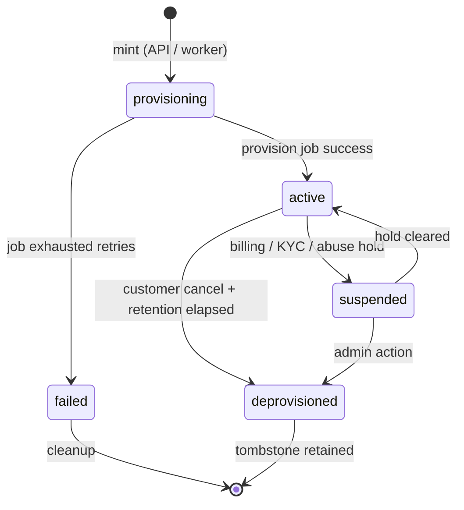

# Design: SaaS-of-SaaS Multi-Tenancy & Tenant Provisioning

> **Version:** 1.0  
> **Date:** 2026-07-14  
> **Status:** Design — ready for PRD and story extraction  
> **Authors:** Platform (Sesame-IDAM)  
> **Supersedes / extends:** [design-doc.md](./design-doc.md) § tenancy (conceptual), [topic-tenancy-model.md](./llmwiki/topics/topic-tenancy-model.md)  
> **ADRs:** [ADR-002](./ADR-002-tenant-consumer-idam-api-boundary.md), [ADR-004](./ADR-004-platform-tenant-provisioning.md)  
> **Audience:** Platform engineers, product, downstream consumers (Hauliage, PriceWhisperer, future buyers)

---

## Table of Contents

1. [Executive Summary](#1-executive-summary)
2. [Problem Statement](#2-problem-statement)
3. [Terminology & Hierarchy](#3-terminology--hierarchy)
4. [Design Principles](#4-design-principles)
5. [Current State (2026-07-14)](#5-current-state-2026-07-14)
6. [Target Architecture](#6-target-architecture)
7. [Tenant Registry & Lifecycle](#7-tenant-registry--lifecycle)
8. [Provisioning Paths](#8-provisioning-paths)
9. [Self-Service Onboarding (Online Store)](#9-self-service-onboarding-online-store)
10. [Platform OAuth vs Org Application](#10-platform-oauth-vs-org-application)
11. [Secrets & Credential Management](#11-secrets--credential-management)
12. [Platform API Surface](#12-platform-api-surface)
13. [Security & Isolation](#13-security--isolation)
14. [Data Model](#14-data-model)
15. [Integration Contract for Consumer Products](#15-integration-contract-for-consumer-products)
16. [Non-Goals](#16-non-goals)
17. [Phased Delivery Plan](#17-phased-delivery-plan)
18. [Story Backlog (Epic-Ready)](#18-story-backlog-epic-ready)
19. [PRD Derivation Map](#19-prd-derivation-map)
20. [Open Questions](#20-open-questions)
21. [Related Documents](#21-related-documents)

---

## 1. Executive Summary

Sesame-IDAM operates as a **SaaS-of-SaaS** identity platform:

- **Sesame** is the product being sold (identity, orgs, JWT, SSO, API keys).
- Each **tenant** is a hard isolation partition for a downstream SaaS product or a customer who bought Sesame to power their own SaaS.
- Within a tenant, **organizations** are B2B workspaces for that product's end customers.

Today we dogfood with Microscaler-owned tenants (`hauliage`, `pricewhisperer`) provisioned manually via seeds and K8s secrets. The next evolution is **self-service tenant minting**: a prospect completes an online store checkout (free tier first), passes KYC gates, and receives a fully provisioned tenant partition **without operator intervention**.

This document defines the **complete multi-tenancy model**, the **provisioning pipeline**, and a **phased build plan** from manual dogfood → platform API → online store → scaled secrets management. It is the canonical source for PRDs and implementation stories.

**Key decisions (locked):**

| # | Decision |
|---|----------|
| D1 | Both **platform-admin** and **self-service** tenant minting |
| D2 | **Reject unknown tenants** — `404 tenant_unknown`; no magic slugs from `X-Tenant-ID` |
| D3 | OAuth secrets start in **K8s/env**; DB holds metadata only; evolve to Vault at scale |
| D4 | **OAuth rotation** requires API + audit trail (`config_version`, `last_rotated_*`) |
| D5 | **Platform tenant OAuth** (product signup buttons) is separate from **org `Application`** (B2B OIDC) |
| D6 | Seed hauliage + pricewhisperer now to avoid post-launch migration |

---

## 2. Problem Statement

### 2.1 Dogfood works; scale does not

Manual SQL seeds and per-tenant K8s env vars work for 2–10 internal products. They fail when:

- Sesame is **sold online** (free or paid tier).
- Each buyer needs an isolated tenant partition automatically.
- KYC and billing must anchor identity before provisioning.
- OAuth credentials must be rotatable with audit evidence.
- PriceWhisperer must onboard without rewriting hauliage's tenant model.

### 2.2 Security risk without a registry

Before the tenant registry, any value in `X-Tenant-ID` could drive auth logic. That enables:

- Cross-tenant probing and resource exhaustion.
- Accidental bleed if middleware assumes slug validity.
- No lifecycle control (suspend, deprovision, billing hold).

### 2.3 Conceptual confusion

Three layers are often conflated:

| Layer | Example | Wrong mental model |
|-------|---------|-------------------|
| **Sesame platform** | sesame.com store, billing | "Hauliage is the platform" |
| **Tenant** | `hauliage`, `acme-corp-saas` | "Shipper org is a tenant" |
| **Organization** | AME Corp, Transport Services | "Each org needs its own X-Tenant-ID" |

Shipper vs transport provider inside Hauliage are **orgs**, not tenants.

### 2.4 What success looks like

| Milestone | Evidence |
|-----------|----------|
| Hauliage launch | `hauliage` tenant active; unknown slugs rejected; OAuth per-tenant |
| PriceWhisperer launch | `pricewhisperer` tenant active; same machinery, zero hauliage migration |
| Online free tier | Checkout → provisioned tenant → admin portal in &lt; 5 min, no ops ticket |
| Paid tier + KYC | Stripe-verified customer before `active`; suspension on billing failure |
| Scale | 100+ self-service tenants; secrets not in flat env var matrix |

---

## 3. Terminology & Hierarchy

```
┌─────────────────────────────────────────────────────────────┐
│  SESAME PLATFORM (single deployment, sesame_idam database)  │
│                                                             │
│  ┌─────────────────┐  ┌─────────────────┐  ┌────────────┐ │
│  │ Tenant: hauliage│  │ Tenant: PW      │  │ Tenant:    │ │
│  │ (platform)      │  │ (platform)      │  │ acme-saas  │ │
│  │                 │  │                 │  │(self_svc)  │ │
│  │  ┌───────────┐  │  │  ┌───────────┐  │  │ ┌────────┐ │ │
│  │  │ Org: AME  │  │  │  │ Org: Desk │  │  │ │ Org:   │ │ │
│  │  │ (shipper) │  │  │  │ (trader)  │  │  │ │ Default│ │ │
│  │  └───────────┘  │  │  └───────────┘  │  │ └────────┘ │ │
│  │  ┌───────────┐  │  │                 │  │            │ │
│  │  │ Org: Trans│  │  │                 │  │            │ │
│  │  │ (haulier) │  │  │                 │  │            │ │
│  │  └───────────┘  │  │                 │  │            │ │
│  └─────────────────┘  └─────────────────┘  └────────────┘ │
└─────────────────────────────────────────────────────────────┘
```

| Term | Maps to | Header / claim | Isolation |
|------|---------|----------------|-----------|
| **Tenant** | SaaS product partition or Sesame customer partition | `X-Tenant-ID` / JWT `tenant_id` | **Hard** — zero bleed |
| **Application** | Logical app grouping within tenant (web, api, mobile) | JWT `client_id` / `aud` | Soft — shared user base |
| **Organization** | B2B workspace inside tenant | JWT `org_id` | Scoped to tenant |
| **User** | End user or platform admin | JWT `sub` | `UNIQUE(tenant_id, email)` |

**Slug rules:**

- Lowercase alphanumeric + hyphens; 3–64 chars.
- Globally unique in `tenants.slug`.
- Immutable after first `active` (rename = new tenant + migration project).

---

## 4. Design Principles

1. **Provisioned, not discovered** — A tenant exists only after an authorized mint path inserts a registry row.
2. **Gate before credentials** — `TenantService::require_active` runs before password, OAuth, or signup validation.
3. **Same table, two mint paths** — Platform ops and self-service checkout both write to `tenants`; differ only in `provisioning_mode` and orchestration.
4. **Billing outside auth microservices** — Stripe/store webhooks drive provisioning; identity services do not implement payment logic.
5. **Secrets out of DB** — OAuth client secrets never stored in PostgreSQL; metadata + `secret_ref` only.
6. **Platform OAuth ≠ org OIDC** — Product-level social login is not an org-mgmt `Application`.
7. **Idempotent provisioning** — Every checkout/subscription ID maps to at most one tenant via `tenant_provisioning_jobs`.
8. **Fail closed** — `provisioning` and `suspended` tenants reject auth; no degraded anonymous mode.

---

## 5. Current State (2026-07-14)

### 5.1 Implemented

| Component | Location | Status |
|-----------|----------|--------|
| `tenants` entity | `identity-login-service/impl/src/models/tenant.rs` | ✅ Model + migration |
| `tenant_oauth_providers` entity | `identity-login-service/impl/src/models/tenant_oauth_provider.rs` | ✅ Model + migration |
| `TenantService` | `services/tenant_service.rs` | ✅ `require_active`, `create` |
| `TenantOAuthService` | `services/tenant_oauth_service.rs` | ✅ `resolve`, `record_rotation`, `upsert_metadata` |
| Tenant gate on auth | `auth_login`, `auth_register`, `signup_validate`, `social_*` | ✅ Wired |
| Dev seed | `impl/seeds/20260714000000_platform_tenants.sql` | ✅ hauliage + pricewhisperer |
| Social OAuth MVP | `social_login`, `social_callback` | ✅ DB metadata + env secrets |
| ADR-004 | `docs/ADR-004-platform-tenant-provisioning.md` | ✅ Accepted |

### 5.2 Not yet implemented

| Component | Priority |
|-----------|----------|
| Platform admin REST API (`POST /platform/tenants`, etc.) | P1 |
| CLI (`sesame-idam tenant create`, `oauth set`, `oauth rotate`) | P1 |
| `tenant_provisioning_jobs` + worker | P2 |
| Store UI + Stripe integration | P2 |
| Tenant admin portal (post-provision setup) | P2 |
| KYC tables + verification gates | P3 |
| Dynamic secrets backend (Vault / per-tenant K8s) | P3 |
| Hauliage BFF social proxy + frontend callback | P1 (consumer) |

---

## 6. Target Architecture

### 6.1 Component map

```
┌──────────────┐     ┌──────────────┐     ┌──────────────────────┐
│  Store UI    │────▶│ Stripe /     │────▶│ Provisioning Worker  │
│  (sesame.com)│     │ Payment GW   │     │ (tooling / service)  │
└──────────────┘     └──────────────┘     └──────────┬───────────┘
                                                       │
                       ┌───────────────────────────────┼───────────────────────────────┐
                       │                               ▼                               │
                       │              ┌────────────────────────────────┐               │
                       │              │ identity-login-service        │               │
                       │              │  POST /platform/tenants/*     │               │
                       │              │  tenants, tenant_oauth_*      │               │
                       │              │  tenant_provisioning_jobs     │               │
                       │              └────────────────┬───────────────┘               │
                       │                               │                               │
                       │         ┌─────────────────────┼─────────────────────┐         │
                       │         ▼                     ▼                     ▼         │
                       │   org-mgmt            authz-core              K8s / Vault     │
                       │   (default org,       (default roles)         (secrets)       │
                       │    welcome invite)                                          │
                       │  SESAME PLATFORM DEPLOYMENT                                 │
                       └─────────────────────────────────────────────────────────────┘
                                                       │
                       ┌───────────────────────────────┼───────────────────────────────┐
                       │  CONSUMER PRODUCTS (per tenant)                               │
                       │         ▼                     ▼                     ▼         │
                       │    Hauliage BFF        PriceWhisperer BFF      Customer SaaS   │
                       │    X-Tenant-ID:        X-Tenant-ID:            X-Tenant-ID:    │
                       │    hauliage            pricewhisperer          acme-saas       │
                       └─────────────────────────────────────────────────────────────┘
```

### 6.2 Service ownership

| Concern | Owner | Rationale |
|---------|-------|-----------|
| Tenant registry | identity-login-service | Auth gate must be co-located with `require_active` |
| Platform OAuth metadata | identity-login-service | Social login handlers live here |
| Platform admin API | identity-login-service (new OpenAPI tag) | Not org-mgmt — platform scope |
| Default org + first invite | org-mgmt | Org lifecycle already here |
| Default roles | authz-core | Role enrichment at login |
| Billing / subscriptions | **New boundary** — worker + `tenant_subscriptions` table; Stripe is SoT for payment state | Keeps 6-service split clean |
| Store UI | **External** to sesame-idam repo (or future `sesame-store` repo) | Marketing/checkout is not IDAM |
| Provisioning worker | `tooling/` Python (CLI-first) | Webhook handler, job runner, K8s secret writer |

---

## 7. Tenant Registry & Lifecycle

### 7.1 `tenants` table (implemented)

| Column | Type | Notes |
|--------|------|-------|
| `id` | UUID | PK |
| `slug` | VARCHAR(64) | Unique; equals `X-Tenant-ID` |
| `display_name` | VARCHAR(255) | Human label |
| `status` | VARCHAR(32) | See state machine §7.2 |
| `provisioning_mode` | VARCHAR(32) | `platform` \| `self_service` |
| `created_at` / `updated_at` | TIMESTAMPTZ | |

### 7.2 Tenant status state machine



| Status | Auth allowed? | Meaning |
|--------|---------------|---------|
| `provisioning` | **No** (`403 tenant_not_active`) | Row exists; secrets/admin/org not ready |
| `active` | **Yes** | Normal operation |
| `suspended` | **No** | Billing failure, KYC rejection, abuse |
| `deprovisioned` | **No** | Soft delete; data retention policy applies |
| `failed` | **No** | Provisioning exhausted retries; ops alert |

### 7.3 Auth gate behaviour (implemented)

| Condition | HTTP | `error` |
|-----------|------|---------|
| Empty `X-Tenant-ID` | 400 | `tenant_required` |
| Slug not in registry | 404 | `tenant_unknown` |
| Status ≠ `active` | 403 | `tenant_not_active` |

Applied at: `POST /auth/login`, `POST /auth/register`, `GET /auth/signup/validate`, `GET /auth/social/{provider}/login`, `POST /auth/social/{provider}/callback`.

---

## 8. Provisioning Paths

### 8.1 Path A — Platform admin (dogfood)

**Who:** Operators, CI, internal CLI.  
**Mode:** `provisioning_mode = platform`.  
**Today:** SQL seed `20260714000000_platform_tenants.sql`.  
**Target:** `POST /platform/tenants` + `sesame-idam tenant create`.

```
Ops / CLI
   │
   ▼
POST /platform/tenants
   { slug, display_name, plan?: "internal" }
   │
   ▼
INSERT tenants (status=provisioning, mode=platform)
   │
   ▼
[Optional] upsert tenant_oauth_providers + K8s secret
   │
   ▼
PATCH status=active
```

**Use cases:** hauliage, pricewhisperer, staging tenants, partner pilots.

### 8.2 Path B — Self-service (online store)

**Who:** External buyer via sesame.com.  
**Mode:** `provisioning_mode = self_service`.  
**Trigger:** Stripe `checkout.session.completed` (or equivalent) webhook.

```
Customer → Store UI → Stripe Checkout (free or paid)
   │
   ▼
Webhook → Provisioning Worker
   │
   ▼
POST /platform/tenants/provision  (idempotent key = stripe_session_id)
   │
   ├─ INSERT tenant_provisioning_jobs
   ├─ INSERT tenants (provisioning, self_service)
   ├─ CREATE default org (org-mgmt internal call)
   ├─ CREATE platform admin user + magic-link invite
   ├─ ASSIGN default roles (authz-core)
   ├─ [Optional] CREATE K8s secret placeholder for OAuth
   ├─ INSERT tenant_subscriptions (stripe_customer_id, plan)
   └─ PATCH tenant status=active (if KYC gate passed)
   │
   ▼
Welcome email → https://admin.sesame.dev/{slug}/setup
```

**Idempotency:** `tenant_provisioning_jobs.external_id` UNIQUE (Stripe session or subscription ID). Retry-safe.

### 8.3 Path comparison

| Aspect | Platform admin | Self-service |
|--------|----------------|--------------|
| Trigger | Human / CI | Payment webhook |
| KYC | Implicit (internal) | Email + Stripe Customer; Identity for paid |
| OAuth at mint | Pre-configured (seeds) | Post-provision via admin portal |
| Default org | Optional (hauliage uses seeds) | Always created |
| Billing record | None | `tenant_subscriptions` |

---

## 9. Self-Service Onboarding (Online Store)

### 9.1 User journey

| Step | Actor | System |
|------|-------|--------|
| 1 | Prospect visits sesame.com | Marketing site |
| 2 | Selects plan (Free / Pro / Enterprise) | Store UI |
| 3 | Stripe Checkout (even $0 collects email + ToS) | Stripe |
| 4 | Payment webhook fires | Provisioning worker |
| 5 | Tenant provisioned (`provisioning` → `active`) | identity-login-service |
| 6 | Welcome email with setup link | Notification (TBD) |
| 7 | First login + org setup wizard | Tenant admin portal |
| 8 | Configure OAuth, invite team, copy integration snippet | Admin portal |
| 9 | Integrate consumer app with `X-Tenant-ID` | Customer's SaaS |

### 9.2 KYC tiers

| Tier | Gate before `active` | Provider |
|------|----------------------|----------|
| **Free** | Verified email + Stripe Customer created + captcha/rate limit | Stripe Checkout + Sesame OTP |
| **Pro** | Free gates + payment method on file | Stripe |
| **Enterprise** | Pro + business verification or Stripe Identity | Stripe Identity / manual review |

`tenant_kyc.status`: `pending` → `verified` | `rejected` | `not_required` (platform mode).

**Rule:** Free tier may go `active` on email verification. Paid tier may enter `provisioning` until payment succeeds; `suspended` on chargeback or failed renewal.

### 9.3 Store components (out of scope for identity microservices)

| Component | Repo / owner | Notes |
|-----------|--------------|-------|
| Marketing + pricing pages | `sesame-store` or static site | Not in sesame-idam `/ui` |
| Checkout session creation | Store backend | Creates Stripe session with metadata: `desired_slug`, `plan_id` |
| Webhook endpoint | `tooling/provisioning/` | Verify `Stripe-Signature`; enqueue job |
| Tenant admin portal | New — `sesame-admin` or portal in store repo | Post-provision configuration |

### 9.4 Provisioning worker responsibilities

| Step | Action | Failure handling |
|------|--------|------------------|
| Validate webhook | Signature + idempotency key | 400, no retry |
| Reserve slug | Check uniqueness; suggest alternative if taken | Return to store UI |
| Create tenant | `POST /platform/tenants/provision` | Retry with backoff; alert on exhaustion |
| Create subscription row | Link Stripe IDs | Reconcile job |
| Create default org | org-mgmt internal API | Roll back tenant on hard failure |
| Create admin user | Register or invite platform user | Roll back |
| Write secrets placeholder | K8s Secret or skip (OAuth later) | Non-fatal; warn in setup wizard |
| Activate | `status=active` if KYC tier satisfied | Stay `provisioning` until gate clears |
| Notify | Welcome email | Retry queue |

---

## 10. Platform OAuth vs Org Application

### 10.1 Two OAuth layers

| Layer | Table / entity | Scope | Example |
|-------|----------------|-------|---------|
| **Platform tenant OAuth** | `tenant_oauth_providers` | Whole tenant — signup/sign-in buttons | Hauliage Google login |
| **Org OIDC application** | org-mgmt `applications` | Single org — enterprise SSO | Acme Corp SAML/OIDC |

### 10.2 Platform tenant OAuth (implemented metadata model)

| Field | Purpose |
|-------|---------|
| `tenant_slug` | FK logical to `tenants.slug` |
| `provider` | `google` \| `microsoft` |
| `client_id` | Public id (or env override via `client_id_env_key`) |
| `redirect_uris` | Comma-separated allowlist |
| `secret_env_key` / future `secret_ref` | Points to K8s/Vault; **not** the secret |
| `config_version` | Bumped on rotation |
| `last_rotated_at` / `last_rotated_by` | Audit |

**Rotation flow:**

1. Operator or tenant admin updates secret in K8s/Vault.
2. `POST /platform/tenants/{slug}/oauth/{provider}/rotate` bumps version + audit fields.
3. Audit event `oauth_credential_rotated` emitted (new `AuditEventType`).

### 10.3 When to use which

| Use case | Layer |
|----------|-------|
| "Sign in with Google" on product login page | Platform tenant OAuth |
| Enterprise customer connects their Okta | Org `Application` + SAML (P3) |
| M2M service auth | api-keys service |

---

## 11. Secrets & Credential Management

### 11.1 Phased approach

| Phase | Tenant count | Mechanism | `secret_*` column |
|-------|--------------|-----------|-------------------|
| **1 — Dogfood** | 2–10 | K8s Secret → pod env `SESAME_OAUTH__{TENANT}__*` | `secret_env_key` |
| **2 — Early self-service** | 10–100 | Per-tenant K8s Secret in `sesame-tenant-{slug}` namespace; ESO | `secret_ref` (K8s name) |
| **3 — Scale** | 100+ | HashiCorp Vault / cloud SM; runtime fetch | `secret_ref` (Vault path) |

**Migration:** `TenantOAuthService::resolve` reads `secret_env_key` today; add resolver chain: env → K8s → Vault without changing controller code.

### 11.2 Self-service default

New self-service tenants **do not require OAuth at provision time**. Email/password works immediately. OAuth is configured in the admin portal post-provision (BYO credentials).

Optional future: Sesame-managed shared OAuth apps with per-tenant redirect URI registration (reduces BYO burden; increases platform security responsibility).

---

## 12. Platform API Surface

New OpenAPI spec or tag: **`platform-admin`** on identity-login-service.  
**Auth:** Platform service token (mTLS or signed service JWT) — never end-user Bearer.

### 12.1 Endpoints (to implement)

| Method | Path | Purpose | Phase |
|--------|------|---------|-------|
| `POST` | `/platform/tenants` | Platform-admin mint | P1 |
| `POST` | `/platform/tenants/provision` | Self-service worker mint (idempotent) | P2 |
| `GET` | `/platform/tenants/{slug}` | Status + metadata | P1 |
| `PATCH` | `/platform/tenants/{slug}/status` | Suspend / activate / deprovision | P1 |
| `PUT` | `/platform/tenants/{slug}/oauth/{provider}` | Upsert OAuth metadata | P1 |
| `POST` | `/platform/tenants/{slug}/oauth/{provider}/rotate` | Record rotation | P1 |
| `GET` | `/platform/tenants/{slug}/provisioning` | Job status poll | P2 |
| `POST` | `/platform/webhooks/stripe` | Stripe events (or on worker) | P2 |

### 12.2 CLI mirror (P1)

```
sesame-idam tenant create --slug acme --display-name "Acme SaaS" --mode platform
sesame-idam tenant status --slug acme
sesame-idam tenant oauth set --slug acme --provider google --client-id ... --secret-env-key ...
sesame-idam tenant oauth rotate --slug acme --provider google --by ops@microscaler.dev
```

---

## 13. Security & Isolation

### 13.1 Zero bleed (unchanged from topic-tenancy-model)

| Layer | Enforcement |
|-------|-------------|
| Application | `WHERE tenant_id = ?` on all queries |
| Database | `SET LOCAL current_tenant_id` per transaction |
| RLS | `tenant_id = current_tenant_id` policies |
| Auth gate | Registry lookup before credentials |

### 13.2 Platform API hardening

- Service-to-service auth only; rate limit per API key.
- `POST /platform/tenants/provision` accepts only from worker service account.
- Audit every mint, suspend, OAuth change, rotation.
- Slug enumeration: generic errors on public paths; admin paths may return `slug_taken`.

### 13.3 Self-service abuse controls

| Control | Implementation |
|---------|----------------|
| Rate limit signups per IP / email domain | Store + worker |
| Block disposable email domains | Configurable list |
| Captcha on checkout | Store UI |
| Manual review queue | `tenant_kyc.review_required` flag |
| Suspended tenant | Immediate auth block |

---

## 14. Data Model

### 14.1 Existing (implemented)

See [ADR-004](./ADR-004-platform-tenant-provisioning.md) and migrations:
`migrations/identity-login-service/20260714102157_{tenants,tenant_oauth_providers}.sql`.

### 14.2 New tables (to implement)

#### `tenant_provisioning_jobs`

| Column | Type | Notes |
|--------|------|-------|
| `id` | UUID | PK |
| `external_id` | VARCHAR(255) | UNIQUE — Stripe session/subscription ID |
| `tenant_slug` | VARCHAR(64) | FK logical |
| `status` | VARCHAR(32) | `pending` \| `running` \| `completed` \| `failed` |
| `provisioning_mode` | VARCHAR(32) | |
| `plan_id` | VARCHAR(64) | `free` \| `pro` \| `enterprise` |
| `request_payload` | JSONB | Checkout metadata snapshot |
| `error_message` | TEXT | Last failure |
| `attempt_count` | INT | Retry counter |
| `created_at` / `updated_at` / `completed_at` | TIMESTAMPTZ | |

#### `tenant_subscriptions`

| Column | Type | Notes |
|--------|------|-------|
| `id` | UUID | PK |
| `tenant_slug` | VARCHAR(64) | UNIQUE |
| `stripe_customer_id` | VARCHAR(255) | |
| `stripe_subscription_id` | VARCHAR(255) | Nullable for free tier |
| `plan_id` | VARCHAR(64) | |
| `status` | VARCHAR(32) | `active` \| `past_due` \| `canceled` |
| `current_period_end` | TIMESTAMPTZ | |
| `created_at` / `updated_at` | TIMESTAMPTZ | |

#### `tenant_kyc`

| Column | Type | Notes |
|--------|------|-------|
| `id` | UUID | PK |
| `tenant_slug` | VARCHAR(64) | UNIQUE |
| `status` | VARCHAR(32) | `not_required` \| `pending` \| `verified` \| `rejected` |
| `provider` | VARCHAR(32) | `email` \| `stripe_identity` \| `manual` |
| `provider_ref` | VARCHAR(255) | External verification ID |
| `verified_at` | TIMESTAMPTZ | |
| `review_required` | BOOLEAN | Manual queue flag |
| `created_at` / `updated_at` | TIMESTAMPTZ | |

### 14.3 ER snippet (platform layer)

```
tenants 1───1 tenant_subscriptions (optional)
tenants 1───1 tenant_kyc (optional)
tenants 1───N tenant_oauth_providers
tenants 1───N tenant_provisioning_jobs (history)
tenants.slug ──► all tenant-scoped tables (users, orgs, ...)
```

---

## 15. Integration Contract for Consumer Products

Unchanged from [ADR-002](./ADR-002-tenant-consumer-idam-api-boundary.md):

1. All HTTP calls include `X-Tenant-ID: {slug}`.
2. JWT validation via JWKS; no shared Postgres in production.
3. Product DB keyed by `sesame_org_id` for domain profile extensions.

**New requirement for consumers:**

- Consumer BFF must use a **provisioned slug** — hardcode per deployment (`hauliage`, `pricewhisperer`) or config from Helm values.
- Social OAuth proxy must forward `X-Tenant-ID` and use tenant-scoped callback URLs.

---

## 16. Non-Goals

| Item | Rationale |
|------|-----------|
| Multi-region tenant migration | Future; single-region Launch 1.0 |
| Per-tenant custom domains for Sesame APIs | Future (`acme.sesame.dev` vanity) |
| Built-in CRM / sales pipeline | Use Stripe + external tools |
| Tenant data export self-service | P5 compliance epic |
| Cross-tenant user identity | Explicitly forbidden |
| Auto-create tenant from `X-Tenant-ID` on register | Security — rejected (D2) |

---

## 17. Phased Delivery Plan

### Phase P1 — Platform admin API (pre–online store)

**Goal:** Replace SQL seeds with API/CLI for hauliage + PW.

| Deliverable | Owner |
|-------------|-------|
| OpenAPI `platform-admin` tag + codegen | identity-login-service |
| `POST /platform/tenants`, status PATCH | identity-login-service |
| OAuth upsert + rotate endpoints | identity-login-service |
| `sesame-idam tenant` CLI commands | tooling |
| Migrate hauliage/PW seeds to CLI-created | ops |
| Hauliage social BFF proxy | hauliage |

**Exit criteria:** New tenant minted via CLI in &lt; 2 min without SQL; OAuth rotate bumps `config_version` with audit.

### Phase P2 — Self-service provisioning core

**Goal:** Webhook-driven tenant creation without store UI polish.

| Deliverable | Owner |
|-------------|-------|
| `tenant_provisioning_jobs` entity + migration | identity-login-service |
| `POST /platform/tenants/provision` | identity-login-service |
| Provisioning worker (Stripe webhook stub) | tooling |
| Default org + admin user creation | worker + org-mgmt |
| `tenant_subscriptions` table | identity-login-service |
| Integration test: webhook → active tenant → register works | BDD |

**Exit criteria:** Simulated Stripe webhook creates tenant; `POST /auth/register` succeeds with `X-Tenant-ID`.

### Phase P3 — Online store + KYC

**Goal:** Public free tier with email KYC.

| Deliverable | Owner |
|-------------|-------|
| Store UI + Stripe Checkout ($0) | sesame-store (new) |
| Real Stripe webhooks | worker |
| `tenant_kyc` table + email verification gate | identity-login-service |
| Tenant admin portal (minimal setup wizard) | sesame-admin (new) |
| Welcome email | notification integration |
| Abuse controls (rate limit, captcha) | store + worker |

**Exit criteria:** End-to-end from browser checkout to first login without ops.

### Phase P4 — Scale & enterprise

| Deliverable | Owner |
|-------------|-------|
| Paid plans + billing webhooks → suspend | worker |
| Stripe Identity KYC | worker |
| Vault / dynamic secrets resolver | identity-login-service |
| Per-tenant K8s namespace isolation | infra |
| Enterprise plan manual review queue | ops tooling |

---

## 18. Story Backlog (Epic-Ready)

Suggested new epic: **`10-platform-tenancy`** under `docs/Epics/10-platform-tenancy/`.

### P1 stories

| ID | Story | Acceptance criteria |
|----|-------|-------------------|
| 10.1 | Platform OpenAPI spec + codegen | `platform-admin` tag linted; handlers stubbed |
| 10.2 | `POST /platform/tenants` | Creates `provisioning` → `active` tenant; rejects duplicate slug |
| 10.3 | `PATCH /platform/tenants/{slug}/status` | Suspend blocks login with `tenant_not_active` |
| 10.4 | `PUT /platform/tenants/{slug}/oauth/{provider}` | Upserts metadata; no secret in DB |
| 10.5 | `POST …/oauth/{provider}/rotate` | Bumps `config_version`; audit event |
| 10.6 | CLI `tenant create` / `oauth set` / `oauth rotate` | Parity with REST; `just qa` clean |
| 10.7 | Service auth for platform routes | Unauthenticated calls return 401 |
| 10.8 | BDD: CLI mint → register → login | New slug end-to-end |

### P2 stories

| ID | Story | Acceptance criteria |
|----|-------|-------------------|
| 10.9 | `tenant_provisioning_jobs` entity | Migration applied |
| 10.10 | `POST /platform/tenants/provision` | Idempotent on `external_id` |
| 10.11 | Provisioning worker skeleton | Handles test webhook; creates tenant |
| 10.12 | Default org on provision | org-mgmt org exists for new slug |
| 10.13 | Platform admin user on provision | First user can log in via magic link |
| 10.14 | `tenant_subscriptions` entity | Stripe IDs stored |
| 10.15 | BDD: provision → register | Self-service mode tenant auth works |

### P3 stories

| ID | Story | Acceptance criteria |
|----|-------|-------------------|
| 10.16 | Stripe Checkout integration | $0 session creates provisioning job |
| 10.17 | `tenant_kyc` + email gate | Free tier requires verified email before `active` |
| 10.18 | Tenant admin portal — setup wizard | OAuth BYO form writes metadata + K8s secret |
| 10.19 | Welcome email + setup URL | Link lands on wizard |
| 10.20 | Abuse: rate limit + captcha | Documented thresholds |
| 10.21 | Billing webhook → suspend | `past_due` suspends tenant within 1 min |

### Consumer stories (cross-repo)

| ID | Story | Repo |
|----|-------|------|
| C1 | Hauliage BFF social OAuth proxy | hauliage |
| C2 | Hauliage `/oauth/callback` page | hauliage |
| C3 | PriceWhisperer tenant Helm values | pricewhisperer |

---

## 19. PRD Derivation Map

This design document splits into **four PRDs**:

| PRD | Scope | Stories | Depends on |
|-----|-------|---------|------------|
| **[PRD-P1-platform-tenant-admin](./PRD-P1-platform-tenant-admin.md)** | REST + CLI for ops mint, OAuth metadata, rotation | 10.1–10.8 | Current registry (done) — **draft ready** |
| **PRD-P2-self-service-provisioning** | Worker, jobs table, provision API, default org/admin | 10.9–10.15 | PRD-P1 |
| **PRD-P3-online-store-kyc** | Store UI, Stripe, KYC, admin portal | 10.16–10.21 | PRD-P2 |
| **PRD-P4-tenant-secrets-scale** | Vault, per-tenant namespaces, paid billing | Phase P4 items | PRD-P3 |

**Existing PRD updates:**

- [PRD_k8s-native-idam-platform-and-hauliage-integration.md](./PRD_k8s-native-idam-platform-and-hauliage-integration.md) — add reference to tenant registry gate and per-tenant OAuth env.
- [ROADMAP-launch-1.0.md](./ROADMAP-launch-1.0.md) — add Phase P1 platform tenancy before P3 enterprise SSO.

---

## 20. Open Questions

| # | Question | Default if unresolved |
|---|----------|----------------------|
| Q1 | Separate `sesame-store` repo or monorepo `store/`? | Separate repo |
| Q2 | Who sends welcome email — org-mgmt invites or new notifier? | Reuse org invite machinery |
| Q3 | Free tier: allow OAuth before email verified? | No — email first |
| Q4 | Slug chosen at checkout or admin portal? | Checkout (with availability check) |
| Q5 | Shared Sesame OAuth apps for self-service tenants? | BYO only at P3; shared apps = P4 optional |
| Q6 | `tenant_provisioning_jobs` in login-service or new `platform-service`? | login-service (P2); extract if boundary blurs |

---

## 21. Related Documents

| Document | Relationship |
|----------|--------------|
| [ADR-002](./ADR-002-tenant-consumer-idam-api-boundary.md) | Consumer integration contract |
| [ADR-004](./ADR-004-platform-tenant-provisioning.md) | Locked decisions + first implementation slice |
| [topic-tenancy-model.md](./llmwiki/topics/topic-tenancy-model.md) | Hard-segment isolation (wiki) |
| [topic-platform-tenants.md](./llmwiki/topics/topic-platform-tenants.md) | Implementation snapshot (wiki) |
| [design-doc.md](./design-doc.md) | Parent system design |
| [ROADMAP-launch-1.0.md](./ROADMAP-launch-1.0.md) | Launch sequencing |

---

*This document is the canonical design source for SaaS-of-SaaS multi-tenancy. PRDs and epic stories must reference section numbers here. When implementation diverges, update this doc and ADR-004 in the same session.*
