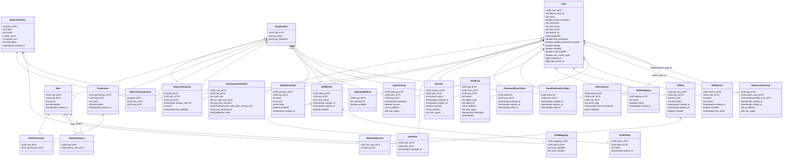

```mermaid
classDiagram
    class Organization {
        UUID org_id PK
        text org_name
        jsonb org_metadata
    }
    class User {
        UUID user_id PK
        text legacy_user_id
        text email
        boolean email_confirmed
        text username
        text first_name
        text last_name
        text picture_url
        jsonb properties
        boolean has_password
        boolean update_password_required
        boolean locked
        boolean enabled
        boolean mfa_enabled
        boolean can_create_orgs
        bigint created_at
        bigint last_active_at
    }
    class UserOrganizationInfo {
        UUID user_id FK
        UUID org_id FK
        text user_role
        text url_safe_org_name
        text org_role_structure
        text[] inherited_user_roles_plus_current_role
        text[] user_permissions
        text[] additional_roles
    }
    class Role {
        UUID role_id PK
        UUID org_id FK
        text name
        text description
        timestamptz created_at
    }
    class Permission {
        UUID permission_id PK
        UUID org_id FK
        text name
        text description
        timestamptz created_at
    }
    class RolePermission {
        UUID role_id FK
        UUID permission_id FK
    }
    class UserRole {
        UUID user_id FK
        UUID role_id FK
        timestamptz assigned_at
    }
    class RoleInheritance {
        UUID role_id FK
        UUID parent_role_id FK
    }
    class RateLimitPolicy {
        int policy_id PK
        text name
        text scope
        int limit_count
        int window_sec
        text description
        timestamptz created_at
    }
    class RateLimitAssignment {
        int policy_id FK
        UUID user_id FK
        UUID org_id FK
    }
    class RateLimitCounter {
        int policy_id FK
        UUID user_id FK
        UUID org_id FK
        timestamptz window_start PK
        int count
        timestamptz last_updated
    }
    class Session {
        UUID session_id PK
        UUID user_id FK
        text refresh_token
        timestamptz created_at
        timestamptz expires_at
        boolean revoked
        inet ip_address
        text user_agent
    }
    class PasswordResetToken {
        UUID token PK
        UUID user_id FK
        timestamptz created_at
        timestamptz expires_at
        timestamptz used_at
    }
    class EmailVerificationToken {
        UUID token PK
        UUID user_id FK
        timestamptz created_at
        timestamptz expires_at
        timestamptz used_at
    }
    class LoginAttempt {
        UUID attempt_id PK
        UUID user_id FK
        UUID org_id FK
        timestamptz timestamp
        boolean success
        inet ip_address
        text user_agent
    }
    class WaitlistSignup {
        UUID signup_id PK
        text email
        boolean invited
        timestamptz invited_at
    }
    class APIKey {
        UUID api_key_id PK
        UUID user_id FK
        text key_hash
        text description
        timestamptz created_at
        timestamptz expires_at
        boolean revoked
    }
    class APIKeyRateLimit {
        UUID api_key_id FK
        int policy_id FK
    }
    class MFADevice {
        UUID device_id PK
        UUID user_id FK
        text type
        text secret
        timestamptz created_at
        boolean enabled
        timestamptz last_used
    }
    class IdentityProvider {
        UUID provider_id PK
        UUID org_id FK
        text type
        text name
        jsonb config
        boolean enabled
        timestamptz created_at
    }
    class SCIMClient {
        UUID client_id PK
        UUID org_id FK
        text client_secret
        timestamptz created_at
        timestamptz expires_at
        boolean enabled
    }
    class SCIMMapping {
        UUID mapping_id PK
        UUID client_id FK
        text local_attribute
        text scim_attribute
    }
    class SCIMToken {
        UUID token_id PK
        UUID client_id FK
        text token
        timestamptz expires_at
    }
    class OrgLoginMethod {
        UUID org_id FK
        text method PK
        boolean enabled
    }
    class AuditLog {
        UUID log_id PK
        UUID user_id FK
        UUID org_id FK
        text action
        text object_type
        text object_id
        inet ip_address
        text user_agent
        timestamptz timestamp
        jsonb details
    }
    class ImpersonationLog {
        UUID log_id PK
        UUID admin_user_id FK
        UUID impersonated_user_id FK
        timestamptz started_at
        timestamptz ended_at
        inet ip_address
        text user_agent
    }
    class MetricsEvent {
        UUID event_id PK
        UUID user_id FK
        UUID org_id FK
        text event_type
        timestamptz event_timestamp
        jsonb metadata
    }

    %% Relationships
    Organization "1" <-- "0..*" UserOrganizationInfo
    User         "1" <-- "0..*" UserOrganizationInfo

    Organization "1" <-- "0..*" Role
    Organization "1" <-- "0..*" Permission

    Role        "1" <-- "0..*" RolePermission
    Permission  "1" <-- "0..*" RolePermission

    User        "1" <-- "0..*" UserRole
    Role        "1" <-- "0..*" UserRole

    Role        "1" <-- "0..*" RoleInheritance : child
    Role        "1" <-- "0..*" RoleInheritance : parent

    RateLimitPolicy "1" <-- "0..*" RateLimitAssignment
    User             "1" <-- "0..*" RateLimitAssignment
    Organization     "1" <-- "0..*" RateLimitAssignment

    RateLimitPolicy "1" <-- "0..*" RateLimitCounter
    User             "1" <-- "0..*" RateLimitCounter
    Organization     "1" <-- "0..*" RateLimitCounter

    User           "1" <-- "0..*" Session
    User           "1" <-- "0..*" PasswordResetToken
    User           "1" <-- "0..*" EmailVerificationToken

    User           "1" <-- "0..*" LoginAttempt
    Organization   "1" <-- "0..*" LoginAttempt

    User           "1" <-- "0..*" WaitlistSignup

    User           "1" <-- "0..*" APIKey
    APIKey         "1" <-- "0..*" APIKeyRateLimit
    RateLimitPolicy "1" <-- "0..*" APIKeyRateLimit

    User           "1" <-- "0..*" MFADevice

    Organization   "1" <-- "0..*" IdentityProvider

    Organization   "1" <-- "0..*" SCIMClient
    SCIMClient     "1" <-- "0..*" SCIMMapping
    SCIMClient     "1" <-- "0..*" SCIMToken

    Organization   "1" <-- "0..*" OrgLoginMethod

    User           "1" <-- "0..*" AuditLog
    Organization   "1" <-- "0..*" AuditLog

    User           "1" <-- "0..*" ImpersonationLog : admin_user_id
    User           "1" <-- "0..*" ImpersonationLog : impersonated_user_id

    User           "1" <-- "0..*" MetricsEvent
    Organization   "1" <-- "0..*" MetricsEvent

```