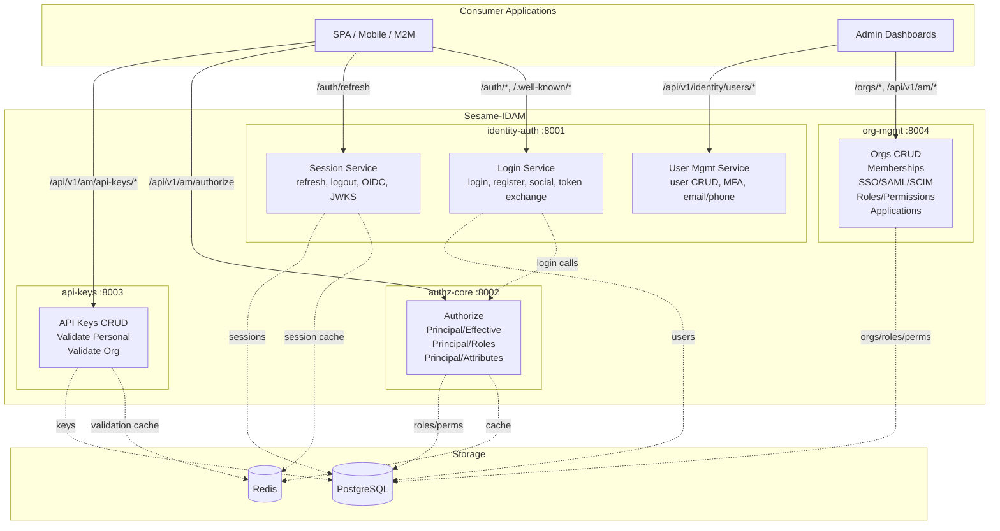

# Sesame-IDAM High-Level Design

> Four independent services, not a monolith.
> Date: 2026-05-02 (updated)

---

## Architecture Overview



## Service Details

### identity-auth (4 sub-services)

The identity-auth service is split into 4 independent OpenAPI sub-specs:

| Sub-service | Spec File | Base Path | Freq | Cost |
|-------------|-----------|-----------|------|------|
| **login-service** | `openapi/identity-auth/login-service.yaml` | `/auth/*` | HIGH | HIGH (bcrypt + JWT sign) |
| **session-service** | `openapi/identity-auth/session-service.yaml` | `/auth/refresh`, `/.well-known/*` | EXTREME | LOW (cached lookups) |
| **user-mgmt-service** | `openapi/identity-auth/user-mgmt-service.yaml` | `/api/v1/identity/users/*` | LOW | MEDIUM (write-heavy) |
| **combined** | `openapi/identity-auth/openapi.yaml` | (all above) | — | — |

### authz-core

| Spec | Base Path | Freq | Cost |
|------|-----------|------|------|
| `openapi/authz-core/openapi.yaml` | `/api/v1/am/authorize`, `/api/v1/am/principal/*` | EXTREME | LOW (Redis cached) |

### api-keys

| Spec | Base Path | Freq | Cost |
|------|-----------|------|------|
| `openapi/api-keys/openapi.yaml` | `/api/v1/am/api-keys/*` | HIGH | LOW (hash lookup) |

### org-mgmt

| Spec | Base Path | Freq | Cost |
|------|-----------|------|------|
| `openapi/org-mgmt/openapi.yaml` | `/orgs/*`, `/api/v1/am/applications/*` | LOW | MEDIUM (CRUD) |

## Cross-Service Dependencies

```mermaid
graph LR
    LS[identity-auth] -->|principal/effective at login| AC[authz-core]
    AK[api-keys] -. independent .-. AC
    OM[org-mgmt] -. independent .-. AC

    style LS fill:#4A90D9
    style AC fill:#E74C3C
    style AK fill:#F39C12
    style OM fill:#27AE60
```

The only cross-service dependency is identity-auth → authz-core at login time for JWT claim enrichment. After the JWT is issued, it is self-contained.

## Storage Layer

| Service | PostgreSQL Tables | Redis Usage |
|---------|------------------|-------------|
| identity-auth | users, sessions, mfa_devices, password_reset_tokens | session cache, refresh token rotation |
| authz-core | roles, permissions, role_permissions, user_roles | role/permission cache (30s TTL) |
| api-keys | api_keys | validation result cache (short TTL) |
| org-mgmt | organizations, organization_members, webhook_endpoints | none |
