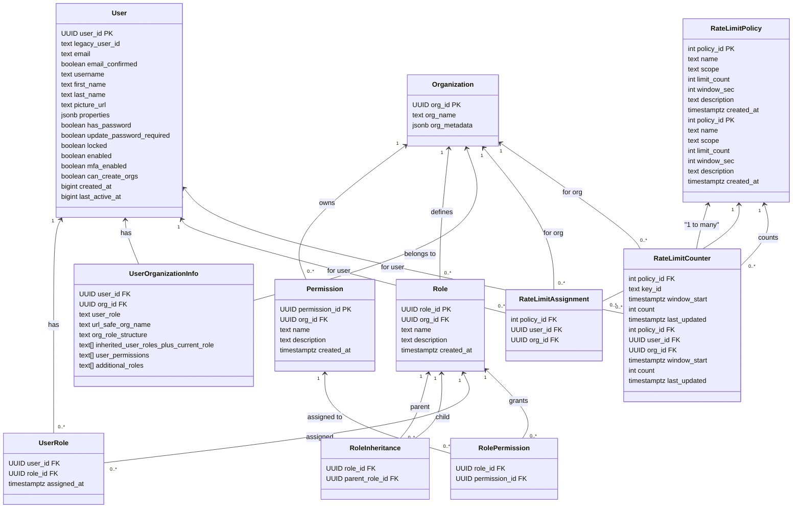

```mermaid
classDiagram
    class User {
        UUID user_id PK
        text legacy_user_id
        text email
        boolean email_confirmed
        text username
        text first_name
        text last_name
        text picture_url
        jsonb properties
        boolean has_password
        boolean update_password_required
        boolean locked
        boolean enabled
        boolean mfa_enabled
        boolean can_create_orgs
        bigint created_at
        bigint last_active_at
    }

    class Organization {
        UUID org_id PK
        text org_name
        jsonb org_metadata
    }

    class UserOrganizationInfo {
        UUID user_id FK
        UUID org_id FK
        text user_role
        text url_safe_org_name
        text org_role_structure
        text[] inherited_user_roles_plus_current_role
        text[] user_permissions
        text[] additional_roles
    }

    class Role {
        UUID role_id PK
        UUID org_id FK
        text name
        text description
        timestamptz created_at
    }

    class Permission {
        UUID permission_id PK
        UUID org_id FK
        text name
        text description
        timestamptz created_at
    }

    class RolePermission {
        UUID role_id FK
        UUID permission_id FK
    }

    class UserRole {
        UUID user_id FK
        UUID role_id FK
        timestamptz assigned_at
    }

    class RoleInheritance {
        UUID role_id FK
        UUID parent_role_id FK
    }
        
    class RateLimitPolicy {
        int policy_id PK
        text name
        text scope
        int limit_count
        int window_sec
        text description
        timestamptz created_at
    }

    class RateLimitCounter {
        int policy_id FK
        text key_id
        timestamptz window_start
        int count
        timestamptz last_updated
    }

    class RateLimitPolicy {
        int policy_id PK
        text name
        text scope
        int limit_count
        int window_sec
        text description
        timestamptz created_at
    }

    class RateLimitCounter {
        int policy_id FK
        UUID user_id FK
        UUID org_id  FK
        timestamptz window_start
        int count
        timestamptz last_updated
    }

    class RateLimitAssignment {
        int policy_id FK
        UUID user_id FK
        UUID org_id  FK
    }

    RateLimitPolicy "1" <-- "0..*" RateLimitCounter : counts
    RateLimitPolicy "1" <-- "0..*" RateLimitAssignment : applies to
    User              "1" <-- "0..*" RateLimitCounter : for user
    Organization      "1" <-- "0..*" RateLimitCounter : for org
    User              "1" <-- "0..*" RateLimitAssignment : for user
    Organization      "1" <-- "0..*" RateLimitAssignment : for org

    User <-- UserOrganizationInfo : has
    Organization <-- UserOrganizationInfo : belongs to
    RateLimitPolicy <-- RateLimitCounter : "1 to many"
    Organization "1" <-- "0..*" Role            : defines
    Organization "1" <-- "0..*" Permission      : owns
    Role         "1" <-- "0..*" RolePermission : grants
    Permission   "1" <-- "0..*" RolePermission : assigned to
    User         "1" <-- "0..*" UserRole       : has
    Role         "1" <-- "0..*" UserRole       : assigned
    Role         "1" <-- "0..*" RoleInheritance: child
    Role         "1" <-- "0..*" RoleInheritance: parent
```

