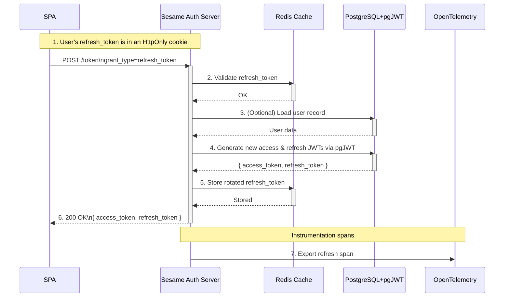

# Role Sequence

```mermaid
flowchart TD
    A[Org Admin Dashboard] --> B[Roles & Permissions Page]
    B --> C[Role List]
    C --> D[+ Create Role]
    C --> E[Click “Edit” on role]
D --> F[Create Role Form]
E --> G[Edit Role Form]
F & G --> H[Form Fields]

subgraph H
HF1[Name input]
HF2[Description input]
HF3[Permissions multi-select (checkbox list)]
HF4[Parent Roles multi-select]
HF5[Assigned Users multi-select]
HF6[Save / Cancel]
end

H --> I[On Save → call POST/PUT endpoints]
I --> C[Refresh Role List]


```

