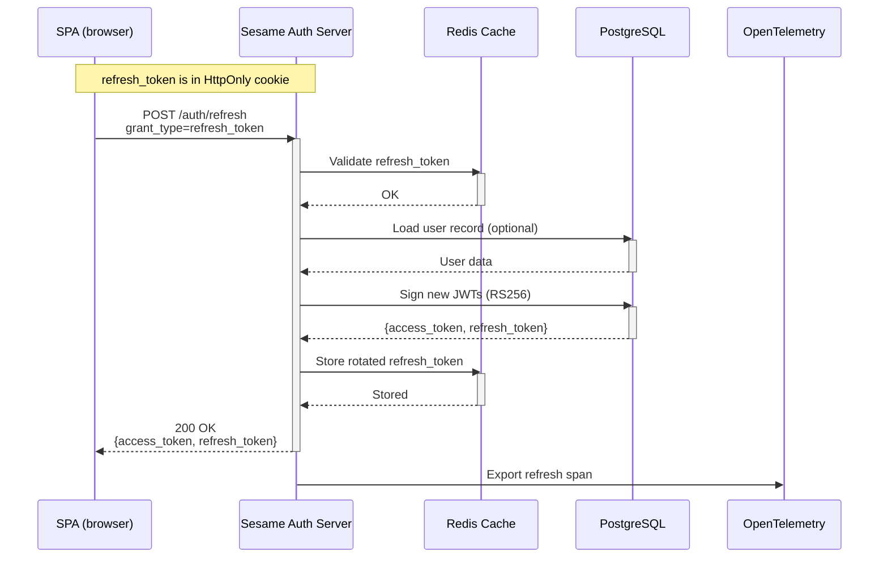
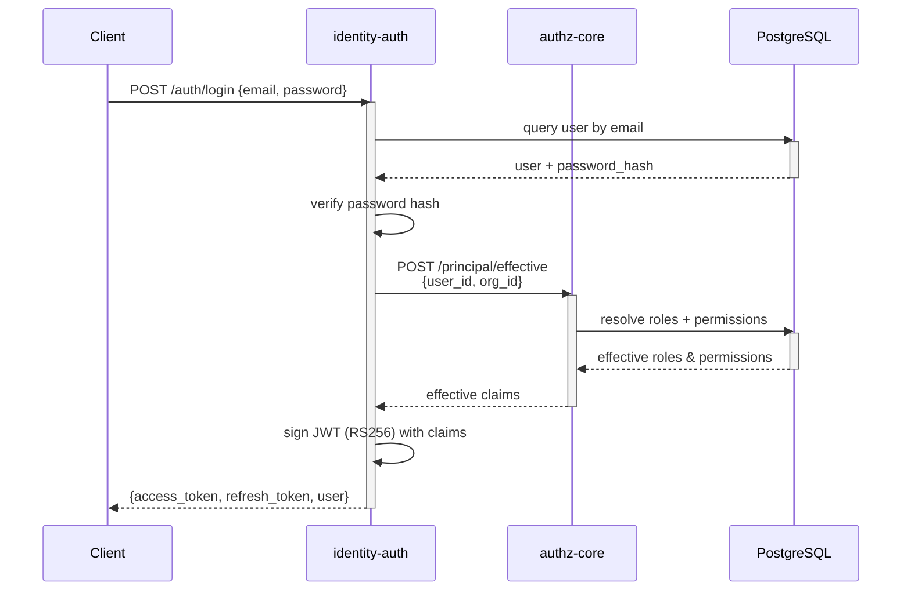
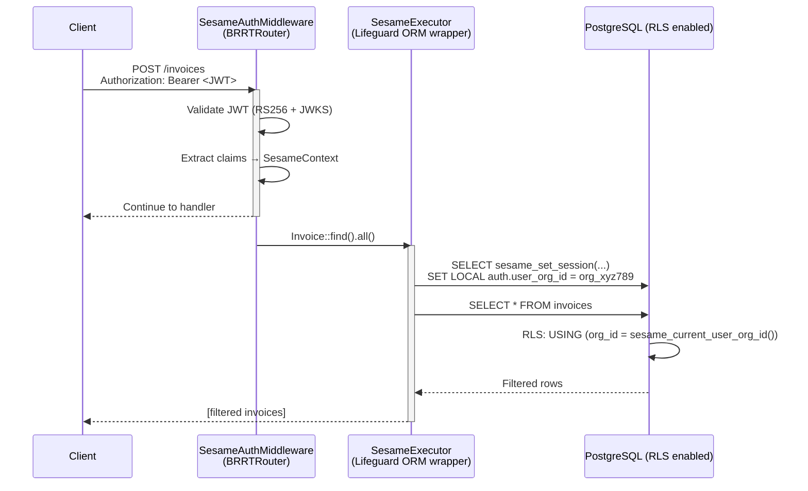

# Sesame-IDAM Sequence Diagrams

> Reflects the 4-service topology with BRRTRouter middleware + Lifeguard ORM integration.
> Date: 2026-05-02 (updated)

---

## 1. Token Refresh Flow (identity-auth: session-service)

```mermaid
sequenceDiagram
    participant SPA as SPA (browser)
    participant Sesame as Sesame Auth Server
    participant Redis as Redis Cache
    participant PG as PostgreSQL
    participant Otel as OpenTelemetry

    Note over SPA,Sesame: refresh_token is in HttpOnly cookie

    SPA->>Sesame: POST /auth/refresh<br/>grant_type=refresh_token
    activate Sesame

    Sesame->>Redis: Validate refresh_token
    activate Redis
    Redis-->>Sesame: OK
    deactivate Redis

    Sesame->>PG: Load user record (optional)
    activate PG
    PG-->>Sesame: User data
    deactivate PG

    Sesame->>PG: Sign new JWTs (RS256)
    activate PG
    PG-->>Sesame: {access_token, refresh_token}
    deactivate PG

    Sesame->>Redis: Store rotated refresh_token
    activate Redis
    Redis-->>Sesame: Stored
    deactivate Redis

    Sesame-->>SPA: 200 OK<br/>{access_token, refresh_token}
    deactivate Sesame

    Sesame->>Otel: Export refresh span
```

## 2. User Login Flow (identity-auth + calls authz-core)

```mermaid
sequenceDiagram
    participant Client as Client
    participant IA as identity-auth
    participant AC as authz-core
    participant PG as PostgreSQL

    Client->>IA: POST /auth/login {email, password}
    activate IA
    IA->>PG: query user by email
    activate PG
    PG-->>IA: user + password_hash
    deactivate PG

    IA->>IA: verify password hash

    IA->>AC: POST /principal/effective<br/>{user_id, org_id}
    activate AC
    AC->>PG: resolve roles + permissions
    activate PG
    PG-->>AC: effective roles & permissions
    deactivate PG
    AC-->>IA: effective claims
    deactivate AC

    IA->>IA: sign JWT (RS256) with claims
    IA-->>Client: {access_token, refresh_token, user}
    deactivate IA
```

## 3. Role Management Flow (org-mgmt)

```mermaid
flowchart TD
    A[Org Admin Dashboard] --> B[Roles & Permissions Page]
    B --> C[Role List]
    C --> D[+ Create Role]
    C --> E[Click "Edit" on role]
    D --> F[Create Role Form]
    E --> G[Edit Role Form]
    F & G --> H[Form Fields]

    subgraph H [Role Form Fields]
        HF1[Name input]
        HF2[Description input]
        HF3[Permissions multi-select]
        HF4[Parent Roles multi-select]
        HF5[Assigned Users multi-select]
        HF6[Save / Cancel]
    end

    H --> I[On Save → call POST/PUT /api/v1/am/roles]
    I --> C[Refresh Role List]
```

## 4. RLS Integration Flow (BRRTRouter middleware + Lifeguard ORM)

```mermaid
sequenceDiagram
    participant Client as Client
    participant Mid as SesameAuthMiddleware<br/>(BRRTRouter)
    participant SE as SesameExecutor<br/>(Lifeguard ORM wrapper)
    participant DB as PostgreSQL (RLS enabled)

    Client->>Mid: POST /invoices<br/>Authorization: Bearer <JWT>
    activate Mid
    Mid->>Mid: Validate JWT (RS256 + JWKS)
    Mid->>Mid: Extract claims → SesameContext
    Mid-->>Client: Continue to handler
    deactivate Mid

    Mid->>SE: Invoice::find().all()
    activate SE
    SE->>DB: SELECT sesame_set_session(...)<br/>SET LOCAL auth.user_org_id = org_xyz789
    SE->>DB: SELECT * FROM invoices
    DB->>DB: RLS: USING (org_id = sesame_current_user_org_id())
    DB-->>SE: Filtered rows
    SE-->>Client: [filtered invoices]
    deactivate SE
```
