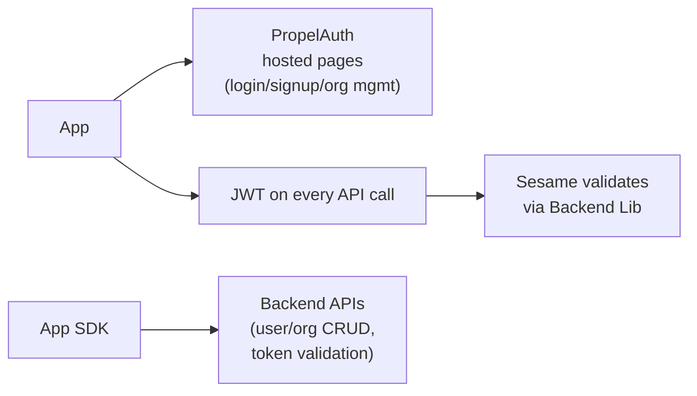

# PropelAuth API & Developer Contract Analysis

> Source: `docs.propelauth.com` — systematically explored via browser navigation.
> Date: 2026-05-02
> Purpose: Benchmark Sesame-IDAM's OpenAPI design against the market leader in bolt-on identity.

---

## 1. Architecture Overview

PropelAuth is a **bolt-on identity platform** designed to eliminate all auth logic from consuming applications. The architecture consists of:

- **Hosted pages** — Login, signup, password reset, email confirmation, org invite acceptance, SAML setup, SSO login, profile management.
- **Backend APIs** — Server-side CRUD for users, orgs, roles, permissions, API keys, sessions, SSO configs, social accounts, MFA.
- **Frontend Libraries** — JS/React SDK for integrating hosted pages and managing auth state.
- **Backend Libraries** — Language-specific SDKs (Rust, Python, Node, Go, .NET, etc.) for validating tokens, enriching JWTs, and performing authorization checks.
- **JWT tokens** — RS256-signed, short-lived (configurable, default 15 min), enriched with user/org/role/permission claims.

### Integration Pattern



The app never stores passwords, manages sessions, or handles org hierarchy. All of that is offloaded to PropelAuth.

---

## 2. API Surface

All APIs are called from the backend using a **PropelAuth API Key** (the platform key, distinct from user API keys). Base path:

```
POST /api/backend/v1/...
GET  /api/backend/v1/...
PUT  /api/backend/v1/...
PATCH /api/backend/v1/...
DELETE /api/backend/v1/...
```

### 2.1 User APIs (23 endpoints)

#### Create & Fetch

| Endpoint | Method | Description |
|---|---|---|
| `/api/backend/v1/user/` | POST | Create a new user. Idempotent if email matches existing. |
| `/api/backend/v1/user/<userId>` | GET | Fetch user by user ID. |
| `/api/backend/v1/user/email` | GET | Fetch user by email. |
| `/api/backend/v1/user/username` | GET | Fetch user by username. |
| `/api/backend/v1/user/query` | GET | Paginated query for users with filters (email, emailConfirmed, enabled, disabled, locked, createdAfter, createdBefore, emailPattern). |
| `/api/backend/v1/user/signup/query` | GET | Query users who signed up via a specific flow (`signup`, `invite`, `magiclink`, `password`, `social`, `saml`). |

**Create User request body:**

```json
{
  "email": "test@example.com",
  "emailConfirmed": true,
  "sendEmailConfirmation": false,
  "firstName": "Test",
  "lastName": "User",
  "username": "testuser",
  "pictureUrl": "https://...",
  "sendWelcomeEmail": false,
  "extraProperties": { "customKey": "customValue" }
}
```

**Fetch User response:**

```json
{
  "userId": "31c41c16-...",
  "email": "test@example.com",
  "emailConfirmed": true,
  "firstName": "Buddy",
  "lastName": "Framm",
  "username": "airbud3",
  "pictureUrl": "https://...",
  "properties": { "favoriteSport": "basketball" },
  "locked": false,
  "enabled": true,
  "hasPassword": true,
  "updatePasswordRequired": false,
  "mfaEnabled": false,
  "canCreateOrgs": false,
  "createdAt": 1625476380,
  "lastActiveAt": 1625476380,
  "legacyUserId": "..." // only if migrated
}
```

#### Update

| Endpoint | Method | Description |
|---|---|---|
| `/api/backend/v1/user/<userId>` | PUT | Update user fields (firstName, lastName, username, pictureUrl, extraProperties, emailConfirmed, canCreateOrgs, locked, sendWelcomeEmail, sendMagicLink). |
| `/api/backend/v1/user/<userId>/email` | PUT | Change user email. |
| `/api/backend/v1/user/<userId>/password` | PUT | Set/change user password. |
| `/api/backend/v1/user/<userId>/clear-password` | PUT | Remove password (for SSO-only users). |

#### Auth & Sessions

| Endpoint | Method | Description |
|---|---|---|
| `/api/backend/v1/user/<userId>/magiclink` | POST | Send magic link email for login. |
| `/api/backend/v1/user/<userId>/accesstoken` | POST | **Create Access Token** — generates a signed JWT for the user with current org context. |
| `/api/backend/v1/user/migrate` | POST | Migrate user from external auth system (hash + salt password, import properties). |
| `/api/backend/v1/user/migrate-password` | POST | Bulk migrate passwords (hash + salt format: `$2a$14$...`). |
| `/api/backend/v1/user/<userId>/disable` | POST | Disable/block a user. |
| `/api/backend/v1/user/<userId>/enable` | POST | Re-enable/unblock a user. |
| `/api/backend/v1/user/<userId>/disable-2fa` | POST | Disable user's 2FA. |
| `/api/backend/v1/user/<userId>/logout-all-sessions` | POST | Invalidate all user sessions. |
| `/api/backend/v1/user/<userId>/resend-email-confirmation` | POST | Re-send email confirmation. |

#### Delete

| Endpoint | Method | Description |
|---|---|---|
| `/api/backend/v1/user/<userId>` | DELETE | Delete user (irreversible). |

#### Employee (B2B)

| Endpoint | Method | Description |
|---|---|---|
| `/api/backend/v1/user/<employeeId>` | GET | Fetch a user in "employee mode" — returns user info but omits orgs they're not part of. Used for B2B directory lookup. |

### 2.2 Organization APIs (15+ endpoints)

#### Create & Fetch

| Endpoint | Method | Description |
|---|---|---|
| `/api/backend/v1/org/` | POST | Create org with name, domain, auto-join settings, maxUsers, customRoleMappingName, legacyOrgId, metadata. |
| `/api/backend/v1/org/<orgId>` | GET | Fetch org by ID. |
| `/api/backend/v1/org/query` | POST | Fetch orgs with pagination (pageSize, pageNumber), filters (orderBy: CREATED_AT_ASC/DESC, NAME, name pattern, domain, legacyOrgId). |

**Fetch Org response:**

```json
{
  "orgId": "1189c444-...",
  "name": "Acme Inc",
  "urlSafeOrgSlug": "fa5514e1-...",
  "isSamlConfigured": false,
  "isSamlInTestMode": false,
  "canSetupSaml": true,
  "domain": "acme.com",
  "extraDomains": ["propelauth.com"],
  "domainAutojoin": false,
  "domainRestrict": false,
  "maxUsers": undefined,
  "customRoleMappingName": "Paid Plan",
  "legacyOrgId": "1234",
  "isolated": false,
  "metadata": { "customKey": "customValue" },
  "passwordRotationEnabled": true,
  "passwordRotationHistorySize": 5,
  "passwordRotationPeriod": 2592000
}
```

#### User Management in Org

| Endpoint | Method | Description |
|---|---|---|
| `/api/backend/v1/org/<orgId>/users` | GET | Fetch users in org, filter by role, include full org info per user. Paginated. |
| `/api/backend/v1/org/<orgId>/add-user` | POST | Add existing user to org with a role. |
| `/api/backend/v1/org/<orgId>/invite-user` | POST | Invite a user by email to join org with role. Sends email invite. |
| `/api/backend/v1/org/<orgId>/invite-user-by-user-id` | POST | Invite an existing user to org by userId. |
| `/api/backend/v1/org/<orgId>/change-role` | POST | Change user's role in org. Supports additional roles (multi-role). |
| `/api/backend/v1/org/<orgId>/remove-user` | POST | Remove user from org. |

**Fetch Users in Org response (with includeOrgs=true):**

```json
{
  "users": [{
    "userId": "...",
    "email": "test@example.com",
    "firstName": "Buddy",
    "lastName": "Framm",
    "username": "airbud3",
    "pictureUrl": "...",
    "properties": { "favoriteSport": "basketball" },
    "locked": false,
    "enabled": true,
    "hasPassword": true,
    "updatePasswordRequired": false,
    "mfaEnabled": false,
    "canCreateOrgs": false,
    "createdAt": 1625476380,
    "lastActiveAt": 1625476380,
    "orgIdToOrgInfo": {
      "<orgId>": {
        "orgId": "...",
        "orgName": "Acme Inc",
        "orgMetadata": { "customKey": "customValue" },
        "userRole": "Admin",
        "userPermissions": ["CanViewBilling"],
        "urlSafeOrgName": "acme-inc",
        "inheritedUserRolesPlusCurrentRole": ["Admin", "Member"],
        "orgRoleStructure": "multi_role",
        "additionalRoles": ["Member"]
      }
    }
  }]
}
```

#### Update & Delete

| Endpoint | Method | Description |
|---|---|---|
| `/api/backend/v1/org/<orgId>` | PUT | Update org fields (name, domain, extraDomains, autojoin, restrict, maxUsers, canSetupSaml, legacyOrgId, ssoTrustLevel, require2faBy, metadata, passwordRotation settings). |
| `/api/backend/v1/org/<orgId>` | DELETE | Delete org. |

#### Role Mappings & Invites

| Endpoint | Method | Description |
|---|---|---|
| `/api/backend/v1/org/<orgId>/role-mappings` | GET | Fetch custom role mappings (plan-based roles). |
| `/api/backend/v1/org/<orgId>/subscribe-role-mapping` | PUT | Subscribe an org to a custom role mapping (e.g., "Paid Plan" → Admin/Member roles). |
| `/api/backend/v1/org/<orgId>/pending-invites` | GET | Fetch pending org invites with pagination. |
| `/api/backend/v1/org/<orgId>/revoke-pending-invite` | DELETE | Revoke a pending invite by email. |

### 2.3 API Key APIs (13 endpoints)

User/organization API keys (M2M keys or service accounts), separate from the PropelAuth platform API key.

| Endpoint | Method | Description |
|---|---|---|
| `/api/backend/v1/end_user_api_keys/validate` | POST | Validate any API key. Returns associated user/org/metadata. |
| `/api/backend/v1/end_user_api_keys/validate` | POST | Validate **personal** API key (must be user-scoped, not org-scoped). |
| `/api/backend/v1/end_user_api_keys/validate` | POST | Validate **org** API key (must be org-scoped). |
| `/api/backend/v1/end_user_api_keys/` | POST | Create API key. Supports userId, orgId, expiration, metadata, displayName. |
| `/api/backend/v1/end_user_api_keys/<apiKeyId>` | PATCH | Update API key (expiration, metadata, setToNeverExpire). |
| `/api/backend/v1/end_user_api_keys/<apiKeyId>` | DELETE | Delete API key. |
| `/api/backend/v1/end_user_api_keys/<apiKeyId>` | GET | Fetch API key details. |
| `/api/backend/v1/end_user_api_keys/current` | GET | Fetch active API keys (filter by userId/userEmail/orgId, paginated). |
| `/api/backend/v1/end_user_api_keys/archived` | GET | Fetch expired API keys (filter by userId/userEmail/orgId, paginated). |
| `/api/backend/v1/end_user_api_keys/usage` | GET | Fetch API key usage count (by apiKeyId, userId, orgId, date). |
| `/api/backend/v1/end_user_api_keys/import` | POST | Import API key from a third-party system. |
| `/api/backend/v1/end_user_api_keys/import/validate` | POST | Validate a newly imported API key. |

**Validate API Key response:**

```json
{
  "metadata": { "customKey": "customValue" },
  "user": { "userId": "...", "email": "test@example.com", ... },
  "org": { "orgId": "...", "orgName": "Example Organization", ... },
  "userInOrg": {
    "userAssignedRole": "Guest",
    "userPermissions": ["CanReadProjectList"]
  }
}
```

### 2.4 Enterprise SSO APIs (11 endpoints)

Per-org SAML/OIDC/SCIM configuration.

| Endpoint | Method | Description |
|---|---|---|
| `/api/backend/v1/org/<orgId>/allow_saml` | POST | Allow org to set up SAML SSO. |
| `/api/backend/v1/org/<orgId>/disallow_saml` | POST | Disallow org from using SAML SSO. |
| `/api/backend/v1/org/<orgId>/create_saml_connection_link` | POST | Create a link for SAML setup without requiring login. |
| `/api/backend/v1/saml/metadata` | GET | Fetch the org's SAML SP metadata (for IdP config). |
| `/api/backend/v1/org/<orgId>/saml_metadata` | POST | Set SAML IdP metadata XML for an org. |
| `/api/backend/v1/org/<orgId>/oidc_metadata` | POST | Set OIDC IdP metadata for an org. |
| `/api/backend/v1/org/<orgId>/enable_saml` | POST | Enable SAML connection for an org. |
| `/api/backend/v1/org/<orgId>/delete_saml` | DELETE | Delete SAML connection. |
| `/api/backend/v1/org/<orgId>/migrate-to-isolated` | POST | Migrate org to isolated SAML mode (separate identity pool). |
| `/api/backend/v1/org/<orgId>/scim/groups` | GET | Fetch SCIM groups for org. |
| `/api/backend/v1/scim/groups/<groupId>` | GET | Fetch a specific SCIM group. |

**SAML/OIDC trust levels:** `AlwaysTrust`, `NeverTrust`, `TrustForDomain` — controls whether email is auto-confirmed via SSO.

### 2.5 Social Login APIs (4 endpoints)

| Endpoint | Method | Description |
|---|---|---|
| `{AUTH_URL}/{PROVIDER_NAME}/login` | GET | Redirect user to OAuth provider login (Google, GitHub, LinkedIn, etc.). Supports scopes, redirect_uri, login_hint. |
| `{AUTH_URL}/link/{PROVIDER_NAME}/login` | GET | Link social account to existing user (requires login). |
| `/api/backend/v1/user/<userId>/oauth/tokens` | GET | Fetch user's stored OAuth tokens from providers. |
| `/api/backend/v1/user/<userId>/oauth/tokens/<provider>` | GET | Fetch a fresh token from a specific provider (refresh if needed). |

**Supported providers:** Google, GitHub, LinkedIn, Facebook, Twitter/X, Apple, Microsoft, Slack, Okta, and custom OAuth providers.

### 2.6 OAuth2 APIs (6 endpoints)

PropelAuth can act as an OAuth2/OIDC provider.

| Endpoint | Method | Description |
|---|---|---|
| `{AUTH_URL}/propelauth/oauth/authorize` | GET | Authorization endpoint (response_type=code). |
| `{AUTH_URL}/propelauth/oauth/token` | POST | Token endpoint — exchange auth code for access/refresh tokens. |
| `{AUTH_URL}/propelauth/oauth/token` | POST | Refresh token endpoint. |
| `{AUTH_URL}/propelauth/oauth/userinfo` | GET | User Info endpoint (JWT Bearer auth). |
| `{AUTH_URL}/propelauth/oauth/logout` | POST | Logout endpoint. |
| `{AUTH_URL}/.well-known/openid-configuration` | GET | OIDC discovery endpoint. |

### 2.7 Step-Up MFA APIs

Endpoints for enforcing re-authentication on sensitive actions. Supports TOTP, WebAuthn, SMS, email.

### 2.8 MCP APIs

Model Context Protocol endpoints for AI agent authentication.

---

## 3. Frontend Libraries

### JavaScript

- `createAuth` — initialize auth client with projectId.
- `loginWithEmailAndPassword` — email/password login.
- `loginWithOtp` — OTP login.
- `sendMagicLink` — magic link login.
- `logout` — clear session.
- `useAuth()` — React hook returning:
  - `user` — current user object (userId, email, firstName, lastName, username, pictureUrl, properties, emailConfirmed).
  - `isAuthenticated` — boolean.
  - `isLoading` — loading state.
  - `error` — error state.
  - `loginWithRedirect` — redirect to hosted login page.
  - `logout` — redirect to logout.
  - `refreshAccessToken` — refresh the JWT.

### React

- `AuthProvider` — context provider wrapping the app.
- `useAuth()` hook — same as above, plus:
  - `activeOrg` — currently active organization in the org picker.
  - `availableOrgs` — all orgs the user belongs to.
  - `switchActiveOrg` — change the active org context.

**Active org in JWT context:**

When a user belongs to multiple orgs, the frontend SDK sets the **active org** context. The JWT token contains the active orgId, roles, and permissions for that org. This enables per-request org-scoped authorization.

---

## 4. Backend Libraries

Language-specific SDKs for token validation, JWT enrichment, and authorization.

### Available languages

Actix, Axum, Django Rest Framework, Express, FastAPI, Flask, Go, Node.js, Python, Rust, Cloudflare Workers, .NET.

### Common functionality across all libraries

| Function | Description |
|---|---|
| `validate_jwt(token)` | Validate the JWT signature, expiration, and issuer. Returns decoded claims. |
| `get_user_from_jwt(jwt)` | Extract user information from JWT claims. |
| `check_permissions(jwt, permissions)` | Check if the user has specific permissions in the active org. |
| `enrich_user_in_jwt(user, orgs)` | Add org memberships, roles, and permissions to the user object before issuing the JWT. |

### Rust (Axum) example

```rust
use propelauth_axum::{validate_jwt, User};

#[actix_web::get("/protected")]
async fn protected(headers: actix_web::http::HeaderMap) -> String {
    let jwt = extract_jwt_from_header(&headers);
    let user = validate_jwt(jwt).expect("Invalid token");
    format!("Hello, {}!", user.email)
}
```

### Python example

```python
from propelauth_fastapi import verify_jwt, get_user_from_token

@router.get("/protected")
def protected(authorization: str = Header(...)):
    token = authorization.replace("Bearer ", "")
    user = verify_jwt(token)
    return {"email": user.email, "user_id": user.user_id}
```

---

## 5. JWT Schema

JWT tokens are RS256-signed, configurable TTL (default 15 minutes).

**Standard claims:**

```json
{
  "sub": "31c41c16-...",        // userId
  "email": "test@example.com",
  "emailConfirmed": true,
  "firstName": "Buddy",
  "lastName": "Framm",
  "username": "airbud3",
  "pictureUrl": "...",
  "properties": { "customKey": "value" },
  "enabled": true,
  "locked": false,
  "mfaEnabled": false,
  "iat": 1625476380,
  "exp": 1625477280,
  "orgId": "1189c444-...",      // active org
  "orgName": "Acme Inc",
  "userRole": "Admin",
  "userPermissions": ["CanViewBilling"],
  "urlSafeOrgName": "acme-inc",
  "inheritedUserRolesPlusCurrentRole": ["Admin", "Member"]
}
```

**Key design decisions:**

- **JWT enrichment is automatic** — when creating an access token, PropelAuth includes the user's current org context, roles, and permissions directly in the token. Downstream services can read claims without making a backend call.
- **Multi-role support** — users can have multiple roles in an org (`Admin`, `Member`, custom roles).
- **Permission granularity** — permissions are dot-notation strings (e.g., `CanViewBilling`, `CanEditInvoice`).
- **Active org model** — each token is scoped to one active org. Switching orgs requires getting a new token.

---

## 6. Key Differentiators vs. In-House Auth

| Feature | PropelAuth | In-House (Sesame baseline) |
|---|---|---|
| **Hosted login/signup pages** | Yes (customizable) | Must build |
| **Magic link login** | Yes | Must build |
| **Email/OTP login** | Yes | Must build |
| **Password reset flow** | Yes | Must build |
| **2FA/MFA** | TOTP, WebAuthn, SMS, email | Must build |
| **Step-up MFA** | Re-auth for sensitive actions | Must build |
| **B2B org hierarchy** | Built-in (orgs, members, roles, invites) | Must build |
| **Role-based permissions** | Custom roles + dot-notation permissions | Must build |
| **JWT enrichment** | Automatic org/role/permission claims | Must build |
| **SSO (SAML/OIDC)** | Per-org SAML setup, SCIM sync | Must build |
| **Social login** | 10+ providers | Must build |
| **API keys (M2M)** | Create, validate, expire, import | Must build |
| **Session management** | Automatic rotation, logout-all, refresh | Must build |
| **User migration** | Import hashes, legacy IDs | Manual |
| **Domain auto-join** | Email domain → org auto-join | Must build |
| **Password rotation** | Enforced rotation with history | Must build |
| **Frontend SDK** | React/JS with hooks | Must build |
| **Backend SDK** | 12+ languages | Must build |
| **OAuth2 provider** | Full authorization code flow | Must build |
| **Employee mode** | B2B directory lookup (filtered user info) | Must build |
| **Invitation system** | Email invites with expiration, tracking | Must build |

---

## 7. Integration Patterns

### 7.1 Customer Auth Flow

1. User lands on app → Frontend SDK renders hosted login page (or redirect).
2. User authenticates (email/password, magic link, social, SSO).
3. PropelAuth issues JWT → Frontend SDK stores it.
4. Every API call includes `Authorization: Bearer <jwt>`.
5. Backend SDK validates JWT → extracts user + org context.

### 7.2 B2B/Org Flow

1. Admin creates org via API or signup flow.
2. Admin invites members by email → PropelAuth sends invite email.
3. Invitee accepts → becomes member with specified role.
4. User can belong to multiple orgs → Frontend SDK provides org picker.
5. Active org changes → new JWT issued with updated org context.

### 7.3 Admin/Platform Flow

1. Platform admin uses Backend API Key to manage users, orgs, roles.
2. Idempotent user creation (by email).
3. Bulk user import/migration from existing auth systems.
4. Per-org SSO configuration (SAML/OIDC).
5. Domain-based auto-join and restrictions.
6. API key management for service accounts.

---

## 8. OpenAPI Implications for Sesame-IDAM

Based on the PropelAuth footprint, Sesame's OpenAPI specs should cover:

### Authentication Microservice (`idam/authentication/`)

| Area | Required Endpoints |
|---|---|
| **User CRUD** | `POST /users/`, `GET /users/{id}`, `GET /users/email`, `GET /users/username`, `GET /users/query`, `PUT /users/{id}`, `DELETE /users/{id}` |
| **Email Auth** | `POST /users/{id}/magiclink`, `POST /users/{id}/email-confirmation`, `POST /users/{id}/resend-email-confirmation` |
| **Password Auth** | `PUT /users/{id}/password`, `PUT /users/{id}/clear-password`, `POST /users/migrate-password` |
| **Session/Auth** | `POST /users/{id}/accesstoken`, `POST /users/{id}/logout-all-sessions` |
| **Status** | `POST /users/{id}/disable`, `POST /users/{id}/enable`, `POST /users/{id}/disable-2fa` |
| **Social/SSO** | `GET /social/login`, `POST /social/link`, `GET /users/{id}/oauth/tokens` |
| **OAuth2/OIDC** | `GET /oauth/authorize`, `POST /oauth/token`, `GET /oauth/userinfo`, `POST /oauth/logout`, `GET /.well-known/openid-configuration` |
| **MFA** | `POST /mfa/setup`, `POST /mfa/verify`, `POST /mfa/disable` |
| **User migration** | `POST /users/migrate`, `POST /users/migrate-password` |

### Authorization Microservice (`idam/authorization/`)

| Area | Required Endpoints |
|---|---|
| **Org CRUD** | `POST /orgs/`, `GET /orgs/{id}`, `GET /orgs/query`, `PUT /orgs/{id}`, `DELETE /orgs/{id}` |
| **Org Members** | `GET /orgs/{id}/users`, `POST /orgs/{id}/add-user`, `POST /orgs/{id}/remove-user` |
| **Invites** | `POST /orgs/{id}/invite-user`, `POST /orgs/{id}/invite-user-by-id`, `GET /orgs/{id}/pending-invites`, `DELETE /orgs/{id}/invites` |
| **Roles** | `POST /orgs/{id}/change-role`, `GET /orgs/{id}/role-mappings`, `PUT /orgs/{id}/subscribe-role-mapping` |
| **Permissions** | `POST /permissions/check`, role/permission CRUD |
| **API Keys** | `POST /api-keys/`, `GET /api-keys/current`, `GET /api-keys/{id}`, `PATCH /api-keys/{id}`, `DELETE /api-keys/{id}`, `POST /api-keys/validate`, `GET /api-keys/usage` |
| **SSO** | SAML/OIDC per-org config, SCIM endpoints |
| **Employee mode** | `GET /users/{id}/employee` |

### Shared Concepts to Standardize

1. **JWT schema** — Define the exact claims structure (user_id, email, org_id, roles, permissions, etc.).
2. **API Key format** — Define the API Key validation endpoint and response structure.
3. **Pagination** — Standardized `pageSize`, `pageNumber`, `orderBy`, `hasMoreResults`.
4. **Error responses** — Standard error format across all services.
5. **Auth mechanism** — All backend APIs use `X-API-Key` header; all client APIs use `Authorization: Bearer <JWT>`.
6. **Role mapping** — Plan-based role assignment (e.g., "Free Plan" → default roles, "Paid Plan" → admin roles).

---

## 9. Notes on Sesame-IDAM Alignment

### What to adopt from PropelAuth

- **JWT enrichment** — Include org context, roles, and permissions in the token itself so downstream services don't need to call back.
- **Idempotent user creation** — `POST /users/` should not error if the user already exists; return the existing user.
- **Employee mode** — B2B apps need a way to look up users in their org without exposing cross-org membership data.
- **Domain auto-join** — Email domain → org auto-join for B2B onboarding.
- **Multi-role support** — Users can have multiple roles in a single org.
- **API key lifecycle** — Full CRUD + validation + usage tracking for M2M keys.

### What Sesame should differentiate

- **Native PostgreSQL RLS integration** — This is Sesame's unique value proposition. PropelAuth doesn't provide DB-level security helpers; Sesame should generate PostgreSQL policy scripts that read JWT claims and enforce row-level access.
- **Microservice-first architecture** — PropelAuth is a monolith. Sesame should design for a microservice ecosystem where each service has its own OpenAPI spec but shares the same auth infrastructure.
- **Platform vs. customer user separation** — Explicit handling of platform admin users vs. customer users in the JWT schema.
