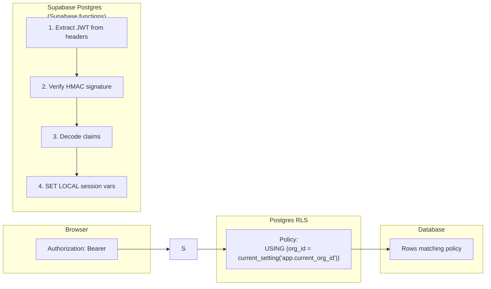
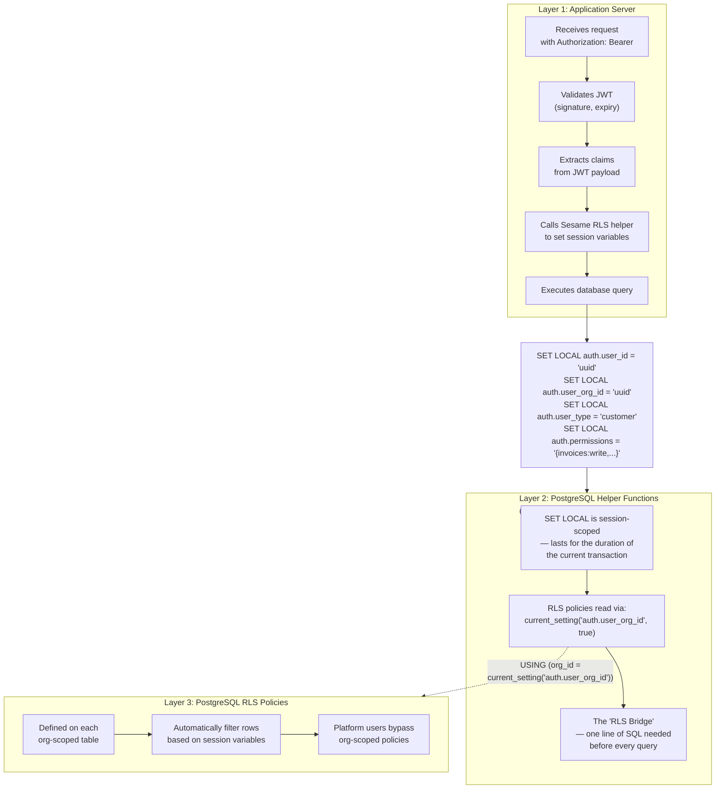
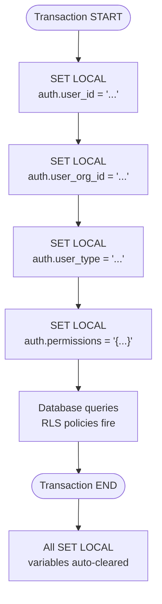
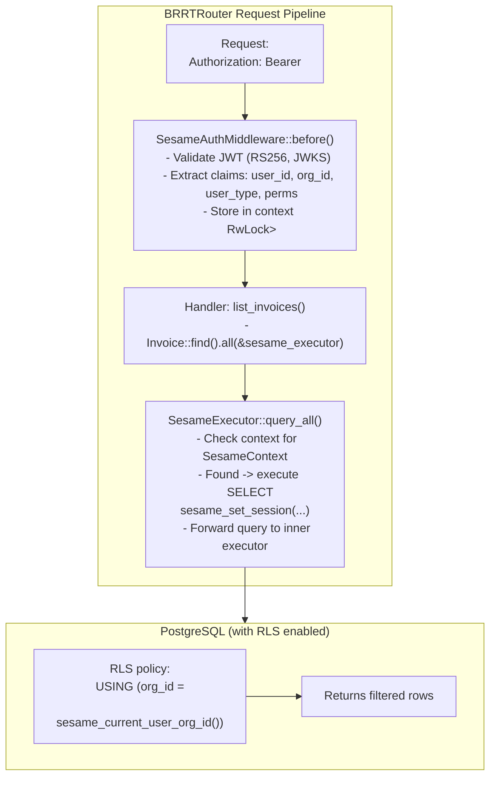
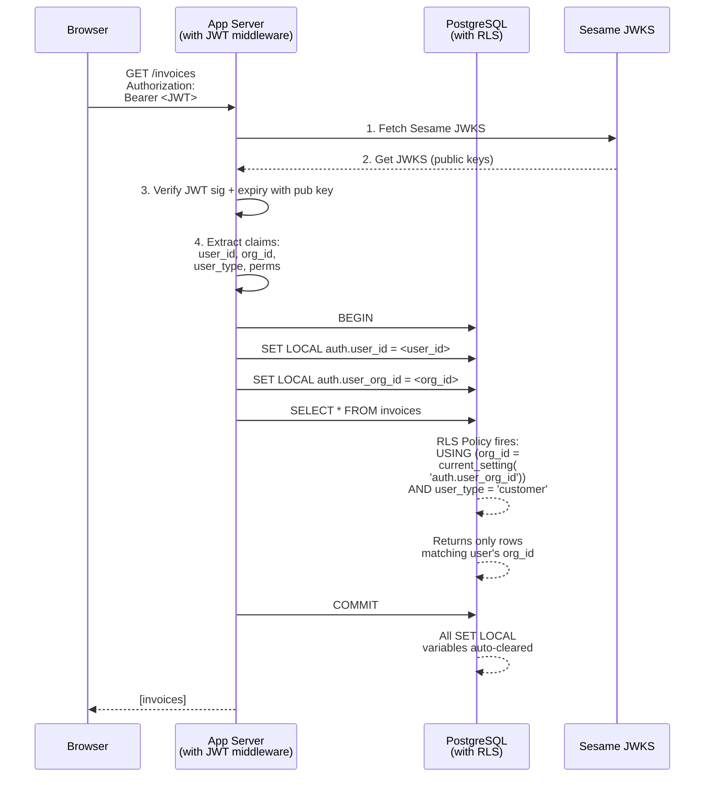
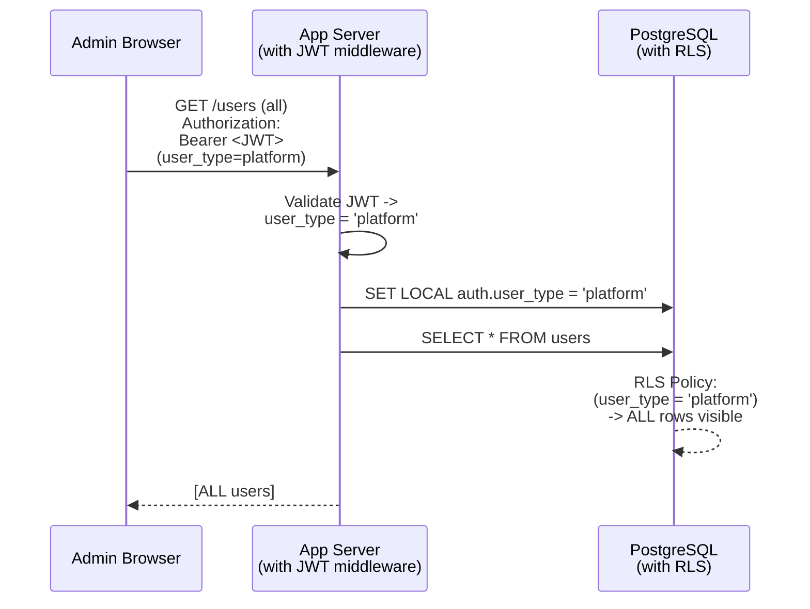
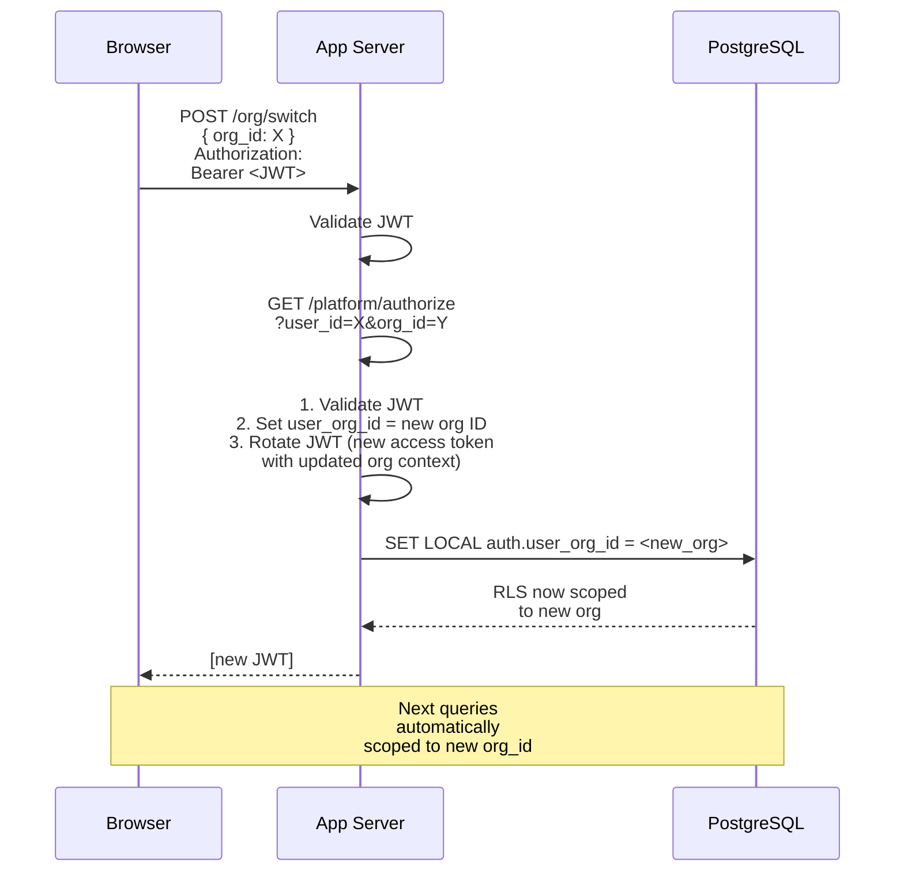
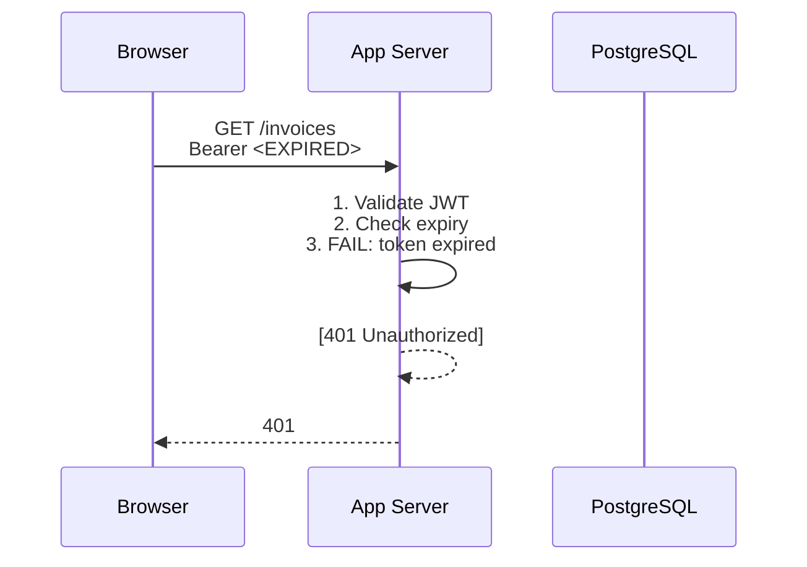
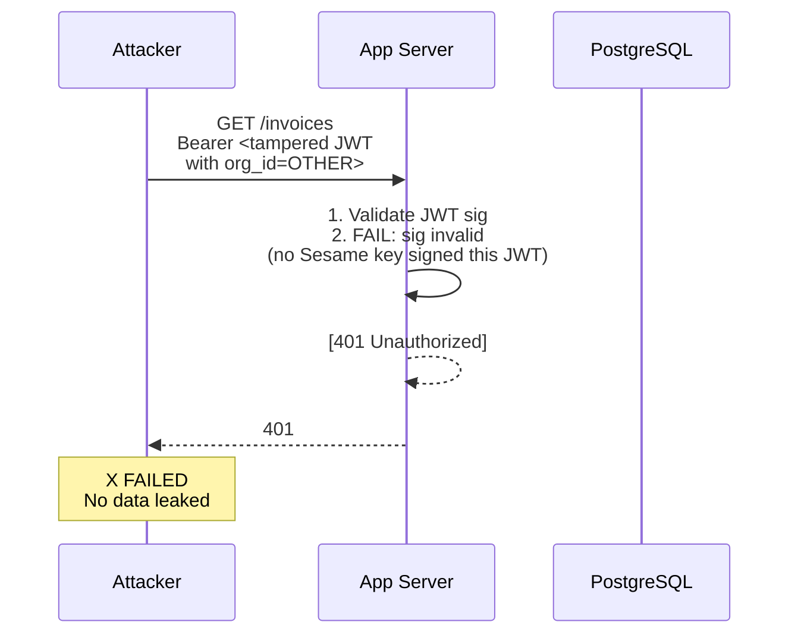
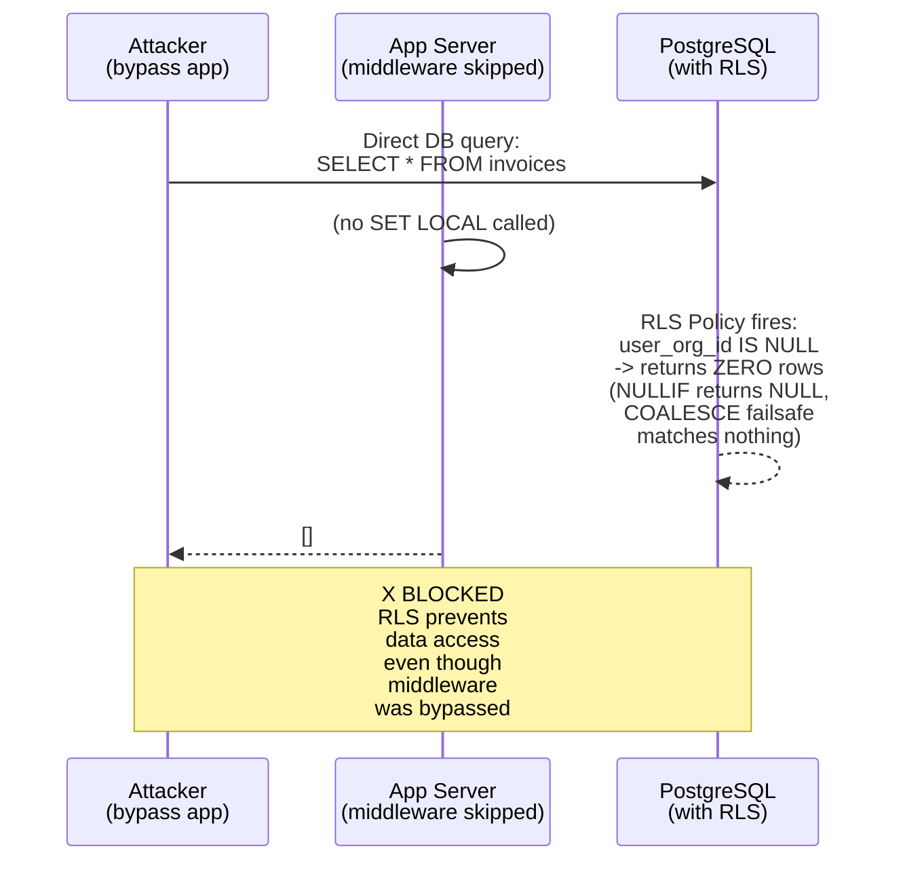

# Design Doc: PostgreSQL RLS Integration for Sesame-IDAM

> Inspired by Supabase's approach, adapted for Sesame's bolt-on architecture.
> The JWT never enters the database — but its claims do, via session variables.
> Date: 2026-05-02

---

## 1. Problem Statement

Sesame-IDAM issues enriched JWTs containing `user_id`, `org_id`, `user_type`, roles, and permissions. The consuming application uses these JWTs for auth. But the application also has its own PostgreSQL database with rows that need to be scoped to the current user's organization.

**Supabase solves this by** providing SQL functions that parse the JWT from the HTTP request header and set PostgreSQL session variables, which RLS policies then reference.

**Sesame's challenge is** that it's a bolt-on IDAM — the consuming application has its own database, its own application server, and Sesame doesn't control the auth middleware. The JWT signature verification must happen in the application layer (where we have RS256 public keys), not in Postgres (where we can't do crypto without extensions).

**The solution:** Sesame provides SQL helper functions that the application calls AFTER validating the JWT. These helpers set session-scoped variables (`SET LOCAL`) so RLS policies can filter rows transparently.

---

## 2. How Supabase Does RLS (Reference)

Supabase's approach is elegant because it does everything in the database:



**Key insight:** Supabase does JWT signature verification INSIDE Postgres using an HMAC-SHA256 key stored in a session-level config. The function `auth.jwt()` and `auth.uid()` parse the JWT from the raw `Authorization` header.

**PostgREST integration:** When using PostgREST, the JWT is passed directly to Postgres, and the Supabase functions can extract claims without any application middleware.

### What Supabase has that Sesame won't have

1. **JWT verification in Postgres** — Supabase uses HMAC, which can be done with PG's built-in `crypto` extension. Sesame uses RS256 (RSA), which requires the `pgcrypto` extension with more complex operations or the application layer.
2. **Supabase functions auto-inject the Authorization header** — `auth.jwt()` reads from `current_setting('request.headers')`. Sesame won't have PostgREST, so this doesn't apply.
3. **Supabase's JWT claims are standard** — `sub`, `email`, `email_verified`, `user_metadata`, `app_metadata`, `role`. Sesame's JWT is enriched with `org_id`, `user_type`, `permissions`, etc.

### Conclusion

Sesame **will not** do JWT verification inside PostgreSQL. Instead:

- **Application layer** validates JWT signature, checks expiry
- **Sesame provides SQL helpers** that extract the already-validated claims
- **RLS policies** reference those helpers to filter rows
- **No JWT travels to Postgres** — only extracted claim values

This is actually simpler from a security perspective: one less attack surface (no JWT verification in DB), and the claims are set explicitly after the application has verified them.

---

## 3. Sesame's RLS Architecture

### 3.1 The Three-Layer Model



### 3.2 Why `SET LOCAL` Instead of `SET`

`SET` persists for the entire session/connection. `SET LOCAL` is scoped to the current transaction only. This is critical because:

- **Connection pooling:** If we used `SET`, a leaked session variable from one user would be visible to the next user reusing the same DB connection.
- **Multiple orgs per request:** Some requests might need to query across orgs (admin operations). `SET LOCAL` ensures the scoping is isolated per transaction.
- **Automatic cleanup:** No need for explicit `RESET` or `SET` back to empty — Postgres handles it.

### 3.3 Transaction Boundary



---

## 4. Sesame's SQL Helpers

These are the exact SQL functions Sesame will generate and deploy into the consuming application's database.

### 4.1 Core Session Variables

```sql
-- =============================================================================
-- Sesame-IDAM: RLS Helper Functions
-- Deploy once per consuming application's database.
--
-- These functions read session variables set by the application server
-- BEFORE each database query. They do NOT validate JWTs — that happens
-- in the application layer.
-- =============================================================================

-- Set all RLS session variables from decoded JWT claims.
-- Called by the application AFTER validating the JWT.
CREATE OR REPLACE FUNCTION public.sesame_set_session(
    p_user_id        uuid,
    p_user_org_id    uuid,
    p_user_type      text DEFAULT 'customer',
    p_permissions    text[] DEFAULT '{}',
    p_user_email     text DEFAULT NULL
)
RETURNS void
LANGUAGE plpgsql
SECURITY DEFINER  -- Runs with the privilege of the function owner (safer than SECURITY INVOKER
AS $$             -- because we validate inputs, not trust the caller
BEGIN
    SET LOCAL auth.user_id        := p_user_id;
    SET LOCAL auth.user_org_id    := p_user_org_id;
    SET LOCAL auth.user_type      := p_user_type;
    SET LOCAL auth.permissions    := p_permissions;
    SET LOCAL auth.user_email     := p_user_email;
END;
$$;

-- Get the current user's ID from session (null if not set)
CREATE OR REPLACE FUNCTION public.sesame_current_user_id()
RETURNS uuid
LANGUAGE sql
STABLE
AS $$
    SELECT NULLIF(current_setting('auth.user_id', true), '');
$$;

-- Get the current user's org ID from session (null if not set)
CREATE OR REPLACE FUNCTION public.sesame_current_user_org_id()
RETURNS uuid
LANGUAGE sql
STABLE
AS $$
    SELECT NULLIF(current_setting('auth.user_org_id', true), '');
$$;

-- Get the current user type from session
CREATE OR REPLACE FUNCTION public.sesame_current_user_type()
RETURNS text
LANGUAGE sql
STABLE
AS $$
    SELECT NULLIF(current_setting('auth.user_type', true), '');
$$;

-- Get the current user's permissions as an array
CREATE OR REPLACE FUNCTION public.sesame_current_permissions()
RETURNS text[]
LANGUAGE sql
STABLE
AS $$
    SELECT NULLIF(current_setting('auth.permissions', true), '');
$$;

-- Get the current user's email
CREATE OR REPLACE FUNCTION public.sesame_current_user_email()
RETURNS text
LANGUAGE sql
STABLE
AS $$
    SELECT NULLIF(current_setting('auth.user_email', true), '');
$$;
```

### 4.2 RLS Policy Templates

These are the RLS policies the application creates on its org-scoped tables:

```sql
-- =============================================================================
-- Example: Apply RLS to an org-scoped table
-- =============================================================================

-- Enable RLS on the table
ALTER TABLE public.invoices ENABLE ROW LEVEL SECURITY;

-- Policy for customer users: only see rows in their org
CREATE POLICY org_scope_customers ON public.invoices
    USING (
        org_id = COALESCE(
            sesame_current_user_org_id(),
            gen_random_uuid()  -- failsafe: if no org_id set, match nothing
        )
    )
    AND sesame_current_user_type() = 'customer';

-- Policy for platform users: can see all rows (platform admin view)
CREATE POLICY platform_all_access ON public.invoices
    FOR ALL
    USING (sesame_current_user_type() = 'platform');

-- Policy for unauthenticated access: block everything
CREATE POLICY deny_unauthenticated ON public.invoices
    FOR ALL
    USING (sesame_current_user_id() IS NOT NULL);
```

### 4.3 Hard Boundary: No PostgREST-Style Auto-Generated API

**This is a hard architectural boundary: Sesame will NOT provide a PostgREST-style
auto-generated REST interface like Supabase.**

Supabase's RLS story is tightly coupled to PostgREST — PostgREST passes the raw
`Authorization` header to PostgreSQL, and `auth.jwt()` / `auth.uid()` parse claims
directly from the JWT string inside the database. This works because PostgREST is
the *only* route to the database.

Sesame takes the opposite approach:

- **All access to consuming-application data flows through the application server.**
  The application server is the sole gateway to the database. There is no direct
  SQL-to-REST bridge that bypasses the app layer.
- **JWT signature verification happens in the application layer** using RS256 public
  keys from Sesame's JWKS endpoint. The JWT itself never travels to PostgreSQL.
- **The application server is the RLS injection point.** After validating the JWT,
  the middleware calls `sesame_set_session()` which `SET LOCAL`s the extracted claims
  into the current database transaction.
- **RLS is defense-in-depth, not a self-service API boundary.** RLS policies exist
  because database-level security is non-negotiable, but they are not the primary
  authorization mechanism. The application layer (BRRTRouter middleware + business
  logic) is the primary authorization boundary.

This means Sesame's RLS integration is **not a drop-in "install and forget" like
Supabase** — the consuming application *must* implement the Sesame middleware
integration (Section 4.4). This is by design: it keeps Sesame a bolt-on IDAM that
respects the consuming application's existing architecture rather than imposing a
PostgREST-like layer on top.

### 4.4 BRRTRouter Middleware + Lifeguard ORM Integration

Because Sesame controls both BRRTRouter (the web framework) and Lifeguard (the ORM),
the Sesame middleware integration is **tight, automatic, and idiomatic** — not a
manual `SELECT sesame_set_session(...)` call in every handler.

#### 4.4.1 BRRTRouter Middleware: JWT Validation + Session Setup

BRRTRouter's middleware system (`Middleware` trait with `before`/`after` hooks) is
used to create a `SesameAuthMiddleware`:

```rust
// In the consuming application's BRRTRouter setup:

let mut service = AppService::new(router, spec);

// Sesame middleware validates JWT, extracts claims, sets DB session
service.add_middleware(SesameAuthMiddleware::new(
    JWKS_URL,              // Sesame's JWKS endpoint for key fetching
    RS256_VERIFY,          // Use RS256 with public key (NOT HMAC)
    SESSION_TIMEOUT_MS,    // Token expiry tolerance
));

// Metrics and CORS still work — middleware ordering is unchanged
service.add_middleware(MetricsMiddleware::new());
service.add_middleware(CorsMiddleware::new());
```

The middleware's `before` hook:

1. Extracts the `Authorization: Bearer <JWT>` header
2. Fetches/validates the JWT signature against Sesame's JWKS (RS256)
3. Extracts claims: `user_id`, `org_id`, `user_type`, `permissions`, `email`
4. Injects the claims into the request context (stored in `HandlerRequest` extensions)
5. Returns `None` to continue, or a 401 `HandlerResponse` to short-circuit

#### 4.4.2 Lifeguard ORM Enrichment: Automatic `SET LOCAL` Injection

Lifeguard's `LifeExecutor` trait abstracts database execution over `may_postgres`.
Lifeguard's `Transaction` type implements `LifeExecutor` and wraps a `may_postgres::Client`
with full transaction semantics (commit, rollback, savepoints, isolation levels).

**Enrichment strategy:** Add a `SesameExecutor` wrapper to Lifeguard that implements
`LifeExecutor` and automatically runs `SELECT sesame_set_session($1, $2, $3, $4, $5)`
at the start of each transaction, when Sesame session context is present.

```rust
// Lifeguard-enriched executor (added to lifeguard crate)

pub struct SesameExecutor<E> {
    inner: E,
    context: Arc<RwLock<Option<SesameContext>>>,
}

pub struct SesameContext {
    pub user_id: uuid::Uuid,
    pub org_id: uuid::Uuid,
    pub user_type: String,
    pub permissions: Vec<String>,
    pub email: Option<String>,
}

impl<E: LifeExecutor> LifeExecutor for SesameExecutor<E> {
    fn execute(&self, query: &str, params: &[&dyn ToSql]) -> Result<u64, LifeError> {
        if let Some(ctx) = self.context.read().unwrap().clone() {
            let session_sql = format!(
                "SELECT public.sesame_set_session({}, {}, {}, {}, {})",
                ctx.user_id, ctx.org_id, ctx.user_type,
                format!("{:?}", &ctx.permissions),
                ctx.email.map(|e| format!("'{}'", e)).unwrap_or("NULL")
            );
            self.inner.execute(&session_sql, &[])?;
        }
        self.inner.execute(query, params)
    }

    fn query_one(&self, query: &str, params: &[&dyn ToSql]) -> Result<Row, LifeError> {
        // inject session context before first query in transaction
        self.inner.query_one(query, params)
    }

    fn query_all(&self, query: &str, params: &[&dyn ToSql]) -> Result<Vec<Row>, LifeError> {
        // inject session context before first query in transaction
        self.inner.query_all(query, params)
    }
}
```

The consuming application creates the enriched executor once at startup:

```rust
// Application bootstrap

let client = LifeguardPool::connect("postgresql://...").await?;
let base_executor = MayPostgresExecutor::new(client);

// Wrap with Sesame session injection
let sesame_executor = SesameExecutor::new(
    base_executor,
    request_context,  // Shared context populated by SesameAuthMiddleware
);

// Now ALL Lifeguard queries go through SesameExecutor:
let invoices = Invoice::find().all(&sesame_executor)?;
// <- SesameExecutor automatically runs sesame_set_session() so RLS policies fire.
```

#### 4.4.3 Flow: Middleware -> Context -> ORM -> RLS



#### 4.4.4 Transaction Boundary Guarantee

Because Lifeguard's `Transaction` type implements `LifeExecutor`, the `SesameExecutor`
wrapper works seamlessly with Lifeguard's transaction semantics:

```rust
// Within a Lifeguard transaction:
let tx = sesame_executor.begin()?;

// All queries inside the transaction inherit the SesameContext:
// - The first query triggers sesame_set_session()
// - Subsequent queries reuse the SET LOCAL (transaction-scoped)
// - Transaction commit/rollback clears all SET LOCAL automatically
Invoice::find()
    .filter(Expr::col(Invoice::Column::Status).eq("pending"))
    .all(&tx)?;
```

This guarantees that `SET LOCAL` is always scoped to the transaction, even when
queries span multiple Lifeguard operations within the same transaction block.

#### 4.4.5 Lifeguard-Specific Features That Work With RLS

All existing Lifeguard features continue to work unchanged:

- **Identity Map (`Session`/`ModelIdentityMap`):** Still operates on model instances;
  RLS filtering only affects which rows are loaded from the database, not the identity
  map semantics.
- **Scopes:** Scopes are composable query predicates — RLS adds an additional
  `USING` clause on top; scopes are unaffected.
- **`flush_dirty` / `flush_dirty_in_transaction`:** Dirty model tracking is unchanged;
  `SesameExecutor` transparently wraps the executor used during flush.
- **Raw SQL (`execute`, `query_one`, `query_all`):** Raw SQL queries also go through
  `SesameExecutor`, so RLS context is automatically present for raw SQL too.
- **Connection pooling (`LifeguardPool`, `PooledLifeExecutor`):** `SesameExecutor`
  wraps any `LifeExecutor` implementation, including pooled executors.

---

## 5. Sequence Diagrams

### 5.1 Happy Path: User Queries Org-Scoped Data



### 5.2 Platform User (Admin) Querying All Data



### 5.3 User Switching Organization (Org Context Rotation)



### 5.4 Security Failure: Expired Token



### 5.5 Security Failure: Cross-Tenant Data Leak Attempt

This is the critical case — what happens if someone tampers with the JWT to access another org's data.



**Key point:** Even if an attacker forges the JWT with a different `org_id`, the signature verification in the application layer blocks it. The RLS layer is defense-in-depth: if the app middleware is bypassed, RLS still prevents cross-org access.

### 5.6 Application Middleware Bypass — RLS as Last Line of Defense



**This is the critical security property:** RLS is the last line of defense. Even if:
1. The application middleware is bypassed entirely
2. An attacker queries the database directly
3. No session variables are set

...the RLS policies still return zero rows because `sesame_current_user_org_id()` returns `NULL`.

---

## 6. JWT Claim Schema (What Gets Set)

The Sesame JWT contains these claims, which map to session variables:

| JWT Claim | Session Variable | Function | RLS Usage |
|-----------|-----------------|----------|-----------|
| `sub` (UUID) | `auth.user_id` | `sesame_current_user_id()` | Identify the row owner |
| `org_id` (UUID) | `auth.user_org_id` | `sesame_current_user_org_id()` | **Primary RLS filter** |
| `user_type` | `auth.user_type` | `sesame_current_user_type()` | Platform vs customer routing |
| `permissions` (array) | `auth.permissions` | `sesame_current_permissions()` | Fine-grained permission checks |
| `email` | `auth.user_email` | `sesame_current_user_email()` | Email-based policies |

### Example: RLS policy using permissions

```sql
-- Fine-grained: only users with 'invoices:write' can INSERT
CREATE POLICY invoices_write ON public.invoices
    FOR INSERT
    USING (
        'invoices:write' = ANY(sesame_current_permissions())
    );
```

---

## 7. Deployment

### 7.1 What Sesame Generates

Sesame will provide a **single SQL migration file** per consuming application:

```
seasame_rls_helpers.sql
├── Helper functions (sesame_set_session, sesame_current_*)
├── RLS policy templates (for common table patterns)
├── Application schema setup instructions
└── Safety notes (SECURITY DEFINER, SET LOCAL, etc.)
```

### 7.2 Deploy Steps for Application Developer

```sql
-- Step 1: Run Sesame's SQL in their database
\i sesame_rls_helpers.sql

-- Step 2: Enable RLS on each org-scoped table
ALTER TABLE public.invoices ENABLE ROW LEVEL SECURITY;

-- Step 3: Add RLS policies (use templates)
CREATE POLICY invoices_org_scope ON public.invoices
    USING (
        org_id = COALESCE(
            sesame_current_user_org_id(),
            gen_random_uuid()  -- failsafe: match nothing if unset
        )
    )
    AND sesame_current_user_type() = 'customer';

CREATE POLICY invoices_platform ON public.invoices
    FOR ALL
    USING (sesame_current_user_type() = 'platform');

-- Step 4: (In application code) Call sesame_set_session before queries
```

### 7.3 Where Sesame's Own Database Fits

Sesame also has its own PostgreSQL database (identity store). This does NOT need RLS — it uses its own internal auth (API keys, JWTs). The RLS helpers are only deployed to **consuming application databases**, not Sesame's own database.

---

## 8. Comparison: Sesame vs. Supabase vs. PropelAuth

| Aspect | Supabase | PropelAuth | Sesame-IDAM |
|--------|----------|------------|-------------|
| **JWT verification** | Inside Postgres (HMAC) | Inside Sesame's service | In application layer (RS256) |
| **How claims reach DB** | `auth.jwt()` reads header | App reads claims, filters in app | `SET LOCAL` via helper function |
| **RLS policies** | Pre-built functions | Not provided | Generated SQL templates |
| **Platform integration** | Tightly coupled (their Postgres) | Independent | Bolt-on, any PostgreSQL |
| **Org context in DB** | Via JWT claims | Via app logic only | Via `SET LOCAL` session vars |
| **Defense-in-depth** | RLS is the safety net | App-level only | RLS + app validation |
| **Cross-org isolation** | Automatic via RLS | Manual | Automatic via RLS |

---

## 9. Open Questions

### 9.1 Multi-org sessions (user belongs to multiple orgs)

The current design sets one `user_org_id`. If a user belongs to 3 orgs, the app must:
1. Present the user with an org picker
2. When they select an org, the app calls `SET LOCAL auth.user_org_id = <selected_org_id>`
3. All subsequent queries are scoped to that org
4. `user.switchOrg(id)` in the SDK rotates the JWT to reflect the new context

This is correct — at any given moment, the user is operating within ONE org context.

### 9.2 What if RLS policies are slow?

RLS policies are evaluated per-row. For tables with millions of rows and complex policies, this can be slow. Mitigations:
- Index `org_id` on all org-scoped tables (always needed anyway)
- Keep policies simple: equality comparison (`=`) on indexed columns is fast
- For complex permission checks, consider a `WITH` clause that pre-filters by `org_id` before RLS

### 9.3 Should Sesame validate the JWT signature in Postgres at all?

**Decision: No.** Reasons:
1. RS256 signature verification in Postgres requires `pgcrypto` extension + external key material — complex and error-prone
2. The application already validates the JWT — doing it twice is redundant
3. RLS is defense-in-depth, not the primary auth boundary
4. If Postgres is directly accessible, `SET LOCAL` won't help — but that's a deployment security issue (shouldn't happen in production)

### 9.4 What about the `platform` column on organizations?

The data model has `organization.platform` to scope orgs per application. This is handled by the application server (Sesame's Platform API), not by RLS. RLS only handles per-user/per-org scoping. The `platform` scoping is a higher-level tenant isolation concern.

### 9.5 PostgREST — explicitly out of scope

This is **not a planned capability**. Per the hard boundary in Section 4.3, Sesame will
never provide a PostgREST-style auto-generated API. All database access flows through
the application server and Sesame's middleware/ORM integration.

If a consuming application independently adds PostgREST, RLS policies will still
function as a safety net — but no Sesame-provided support or integration exists for it.

---

## 10. Summary

The RLS bridge works like this:

1. **Sesame issues JWTs** with `user_id`, `org_id`, `user_type`, `permissions`
2. **Application validates JWT** (signature, expiry) using Sesame's JWKS public key
3. **Application calls `sesame_set_session()`** with extracted claims — this `SET LOCAL`s them into the current transaction
4. **RLS policies** reference `sesame_current_user_org_id()` etc. to filter rows
5. **Transaction ends** — `SET LOCAL` variables are automatically cleared
6. **If middleware is bypassed** — RLS returns zero rows (defense-in-depth)

The "magic" is `SET LOCAL` — a single Postgres statement that bridges the application layer's validated JWT claims to the database layer's RLS policies, without the JWT itself ever entering Postgres.
