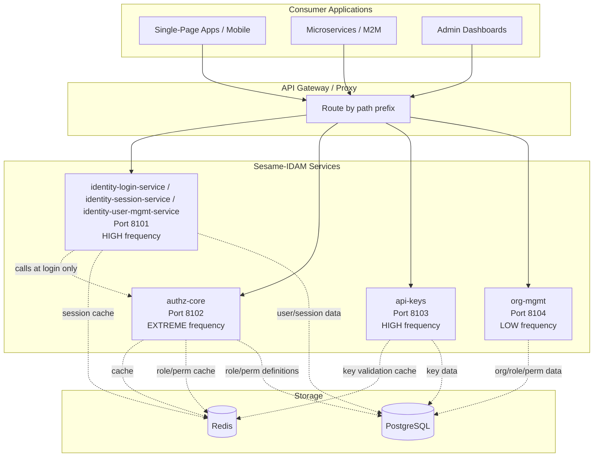
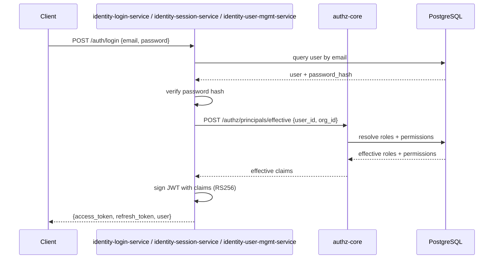
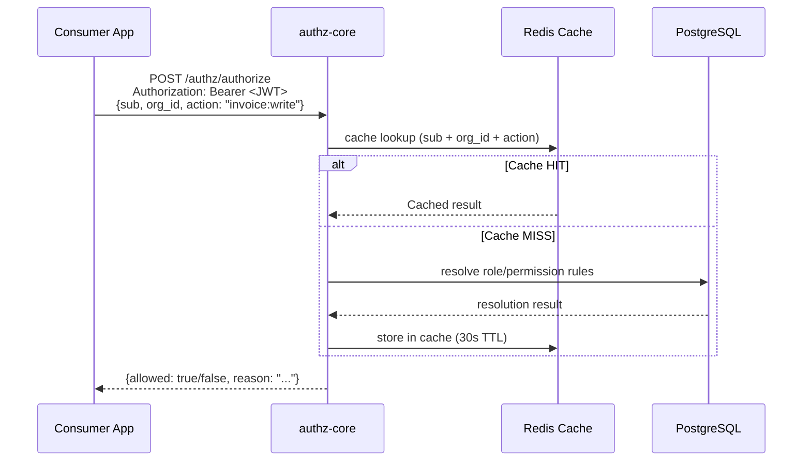
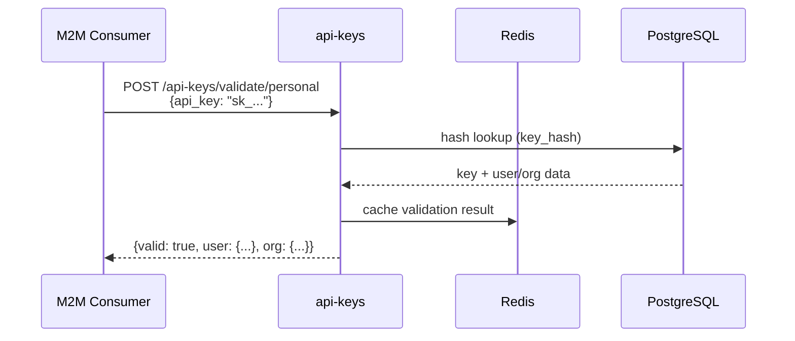
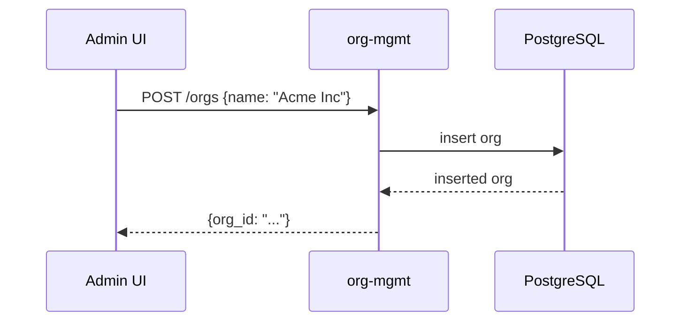
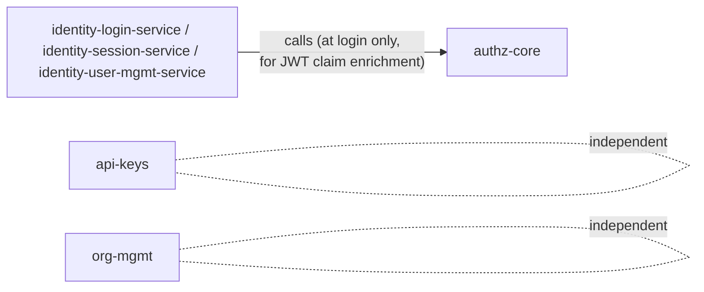

# Service Topology Design — Sesame-IDAM

> **Status:** Design Decision Record
> **Date:** 2026-05-02 (updated)
> **Key decision:** Four independent services instead of two. Driven by per-endpoint
> access frequency AND per-request cost analysis.

## The Problem

Treating Sesame-IDAM as a single authN/authZ monolith ignores a fundamental reality:
every HTTP request to every consumer application passes through Sesame for identity and
authorization checks. These paths are called **thousands of times per second** at scale.
Meanwhile, org management, SSO setup, and user lifecycle operations are called **dozens
of times per day**.

The original design assumed 2 binaries (Authentication + Authorization). This is
insufficient because:

1. **Per-request cost differs by orders of magnitude.** A user lookup (`users/me`) takes
   microseconds (indexed DB lookup by `user_id` from JWT). A login (`/auth/login`) takes
   milliseconds (bcrypt/scrypt hash + DB write + JWT sign). An org SSO setup takes seconds
   (external IdP communication).

2. **Traffic patterns diverge completely.** M2M API key validation traffic can spike
   independently from user-facing traffic. CI/CD pipelines hammering the key service while
   mobile users are offline.

3. **Failure domains must be isolated.** A spike in M2M key validation should not
   degrade user-facing login flows.

## Service Split Summary

| Service | OpenAPI Spec | Base Path | Ports | Scaling Profile |
|---------|-------------|-----------|-------|----------------|
| **identity-login-service / identity-session-service / identity-user-mgmt-service** | `openapi/identity-login-service/
identity-session-service/
identity-user-mgmt-service/` (3 separate specs: `openapi.yaml`, `login-service.yaml`, `session-service.yaml`, `user-mgmt-service.yaml`) | `/auth/*`, `/admin/users/*`, `/.well-known/*` | 8101 | HIGH: refresh + users/me = read-heavy, fast DB |
| **authz-core** | `openapi/authz-core/openapi.yaml` | `/authz/authorize`, `/authz/principals/*` | 8102 | EXTREME: called on EVERY consumer API request |
| **api-keys** | `openapi/api-keys/openapi.yaml` | `/api-keys/*` | 8103 | HIGH: M2M validation = hash lookup, independently spiky |
| **org-mgmt** | `openapi/org-mgmt/openapi.yaml` | `/organizations/*`, `/applications/*` | 8104 | LOW: admin-heavy, near-zero scaling pressure |

## Architecture Diagram



## Call Sequence Diagrams

### 1. User Login Flow (identity-login-service / identity-session-service / identity-user-mgmt-service + calls authz-core)



**Key point:** The call to authz-core `principal/effective` happens **once at login**.
The resulting JWT contains all role/permission claims. Subsequent requests use the JWT
directly — no further authz-core call is needed for coarse-grained checks.

### 2. Per-Request Authorization Flow (authz-core only)



**Key point:** `authz-core` is called on **every** API request from every consumer app.
It must respond in <10ms using Redis caching. The JWT claims provide fast coarse-grained
checks (e.g., "is Admin" — no DB call needed). Fine-grained checks (e.g., "can write
this specific invoice") require the `authorize` endpoint.

### 3. API Key Validation Flow (api-keys only)



**Key point:** M2M validation is a simple hash lookup — much cheaper than user auth or
RBAC evaluation. But the volume is independently spiky (CI/CD pipelines, batch jobs,
third-party integrations).

### 4. Org Management Flow (org-mgmt only)



**Key point:** Admin operations, called rarely, no caching pressure, no scaling pressure.

## Per-Endpoint Access Profile

### EXTREME Frequency (>10K req/s per 1K users)

| Path | Service | Per-Request Cost | Cache Strategy |
|------|---------|-----------------|----------------|
| `POST /auth/refresh` | identity-login-service / identity-session-service / identity-user-mgmt-service | MEDIUM (DB lookup + JWT sign) | Redis session cache |
| `GET /identity/me` | identity-login-service / identity-session-service / identity-user-mgmt-service | LOW (indexed lookup) | Redis (5s TTL) |
| `POST /authz/authorize` | authz-core | MEDIUM (role evaluation) | Redis (30s TTL) |
| `POST /api-keys/validate/personal` | api-keys | LOW (hash lookup) | Redis (no need — hash lookup is fast) |
| `POST /api-keys/validate/org` | api-keys | LOW-MEDIUM (hash + org lookup) | Redis (5s TTL) |
| `GET /.well-known/openid-configuration` | identity-login-service / identity-session-service / identity-user-mgmt-service | NEGLIGIBLE | Static (never expires) |
| `GET /.well-known/jwks.json` | identity-login-service / identity-session-service / identity-user-mgmt-service | NEGLIGIBLE | Static (rotate on key rotation) |

### HIGH Frequency (100-10K req/s per 1K users)

| Path | Service | Per-Request Cost |
|------|---------|-----------------|
| `POST /auth/login` | identity-login-service / identity-session-service / identity-user-mgmt-service | HIGH (password hash + email) |
| `GET /oauth/userinfo` | identity-login-service / identity-session-service / identity-user-mgmt-service | LOW (JWT verify) |
| `POST /authz/principals/effective` | authz-core | HIGH (resolves hierarchy) |
| `GET /authz/principals/roles` | authz-core | LOW |
| `GET /authz/principals/attributes` | authz-core | LOW |

### LOW Frequency (<100 req/s)

| Path | Service |
|------|---------|
| All `POST/PUT/DELETE /organizations/*` | org-mgmt |
| All `POST/PUT/DELETE /organizations/{org_id}/users` | org-mgmt |
| All SSO/SAML/SCIM endpoints | org-mgmt |
| All `POST/PUT/DELETE /applications/*` | org-mgmt |
| User CRUD (PATCH/DELETE) | identity-login-service / identity-session-service / identity-user-mgmt-service |
| MFA setup/verify | identity-login-service / identity-session-service / identity-user-mgmt-service |
| Phone setup/verify | identity-login-service / identity-session-service / identity-user-mgmt-service |
| Social login | identity-login-service / identity-session-service / identity-user-mgmt-service |
| Password reset flows | identity-login-service / identity-session-service / identity-user-mgmt-service |

## Inter-Service Dependencies



The **only** cross-service dependency is identity-login-service / identity-session-service / identity-user-mgmt-service calling authz-core's
`/authz/principals/effective` endpoint at login time to populate JWT claims. This is a
fire-and-forget call during session creation — not on the hot path of subsequent
requests. After the JWT is issued, it is self-contained.

### JWT Schema (issued by identity-login-service / identity-session-service / identity-user-mgmt-service, claims sourced from authz-core)

```json
{
  "sub": "user-uuid",
  "email": "user@example.com",
  "email_verified": true,
  "name": "John Doe",
  "preferred_username": "johnd",
  "user_id": "user-uuid",
  "first_name": "John",
  "last_name": "Doe",
  "org_id": "org-uuid",
  "org_name": "Acme Inc",
  "user_role": "Admin",
  "user_permissions": ["invoices:write", "invoices:read", "users:manage"],
  "mfa_enabled": true,
  "is_platform_admin": false,
  "phone_number": "+141****1234",
  "phone_verified": true,
  "iat": 1705312800,
  "exp": 1705313700
}
```

**Coarse-grained checks** (e.g., "is Admin?", "has invoices:write?") use JWT claims
directly — zero latency, zero cross-service call. **Fine-grained checks** (e.g., "can
user delete invoice #123?") require a call to `authz-core` at request time.

## Scaling Considerations Per Service

### identity-login-service / identity-session-service / identity-user-mgmt-service

- **Compute:** Password hashing is the bottleneck (CPU-bound). Needs to scale vertically
  or use GPU for bcrypt. Everything else is I/O bound (DB lookups).
- **Storage:** PostgreSQL for user data, Redis for session cache.
- **Horizontal scale:** Stateless after DB connect. Redis session cache eliminates
  cross-node state. JWT signing is stateless (private key in memory).
- **Vertical scale:** Password hashing limits per-instance throughput. Consider a
  dedicated "hasher" node or use Argon2id with tuned parameters.

### authz-core

- **Compute:** Role hierarchy resolution + permission evaluation. Very fast with cached
  data (<1ms per check). The `principal/effective` call at login is the heavy op
  (resolves full hierarchy).
- **Storage:** PostgreSQL for role/permission definitions (rarely changed). Redis for
  per-principal permission cache (high read, moderate write).
- **Horizontal scale:** Can shard by `org_id` (permissions are org-scoped). Each shard
  is independent.
- **Vertical scale:** Cache hit ratio should exceed 99% for active users. Raw throughput
  is limited by Redis latency, not compute.

### api-keys

- **Compute:** Simple hash comparison (SHA-256 of stored key). Trivial CPU.
- **Storage:** PostgreSQL for key metadata. Redis for validation result cache (short TTL
  because keys can be revoked at any time).
- **Horizontal scale:** Stateless hash lookup. Can shard by `user_id` or `org_id` suffix.
- **Vertical scale:** One core can handle tens of thousands of validations/sec.

### org-mgmt

- **Compute:** CRUD operations. SSO setup involves external HTTP calls (IdP metadata
  fetch, SAML XML parse) — these are the expensive ops but called rarely.
- **Storage:** PostgreSQL for org data. No cache needed (admin operations are low volume).
- **Horizontal scale:** Single instance handles all traffic. Auto-scale to zero if needed.
- **Vertical scale:** No constraints.

## OpenAPI Spec Layout

The six services each have their own OpenAPI spec(s):

```
openapi/
├── identity-login-service/
identity-session-service/
identity-user-mgmt-service/
│   ├── openapi.yaml              # Combined spec (all identity-login-service / identity-session-service / identity-user-mgmt-service endpoints)
│   ├── login-service.yaml        # Login, register, token exchange, social login
│   ├── session-service.yaml      # Token refresh, OIDC discovery, JWKS
│   └── user-mgmt-service.yaml    # User CRUD, account security, email/phone verify
├── authz-core/openapi.yaml       # authorize, principal/effective, roles, attributes
├── api-keys/openapi.yaml         # api-keys CRUD, api-keys/validate (all variants)
└── org-mgmt/openapi.yaml         # /organizations/*, applications, roles, permissions, SSO/SCIM
```

| **Application** | `openapi/idam/org-mgmt/openapi.yaml` | Application/tenant management, roles, permissions, applications |
| **SCIM** | `openapi/idam/org-mgmt/openapi.yaml` | SCIM user/group provisioning for enterprise SSO |

### Schema ownership per service

| Schema | Service | Used by Others? |
||--------|---------|----------------|
| `User` | identity-login-service | Yes (org-mgmt returns user snapshots) |
| `UserProfile` | identity-login-service | Yes (returned from authz-core principal endpoints) |
| `LoginRequest/Response` | identity-login-service | No |
| `TokenResponse` | identity-login-service | No |
| `MfaFactor/MfaSetupRequest/Response` | identity-login-service | No |
| `OpenIDConfiguration/JWKS` | identity-session-service | No |
| `Org` | org-mgmt | Yes (returned from api-keys validation) |
| `AuthorizeRequest/Response` | authz-core | No |
| `EffectiveRequest/Response` | authz-core | No |
| `Application` | org-mgmt | Yes (tenant boundary, returned in responses) |
| `Role/Permission` | org-mgmt | No |
| `ApiKey/ApiKeyValidationResponse` | api-keys | No |
| `ScimGroup` | org-mgmt | No |

Shared schemas are duplicated in each consuming spec's `components/schemas` section. This
is intentional — each OpenAPI spec must be self-contained for BRRTRouter codegen to work.
