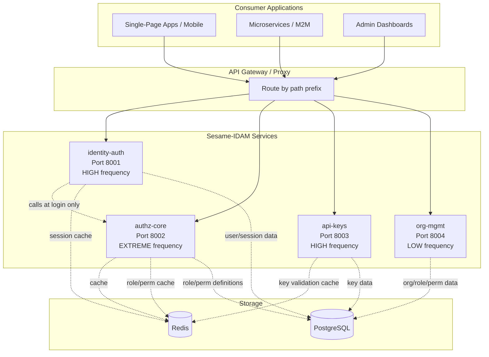
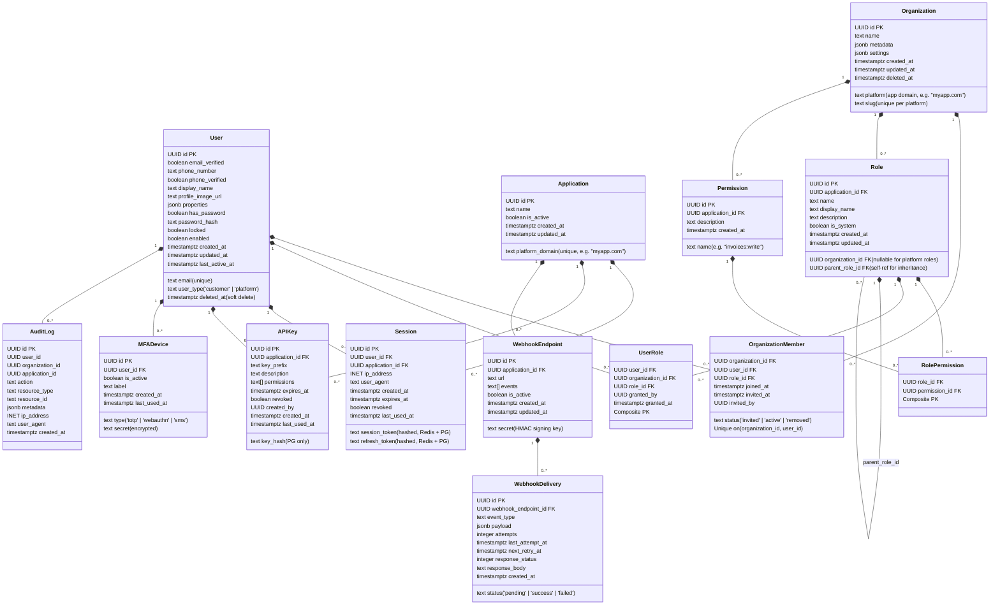
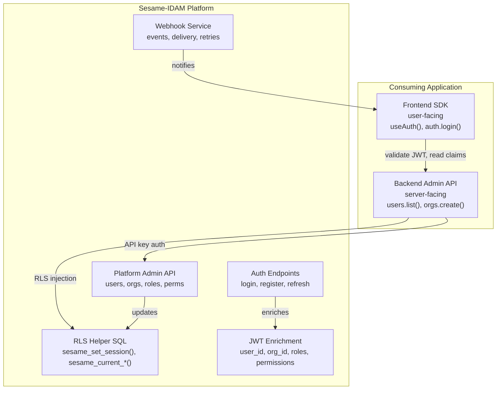
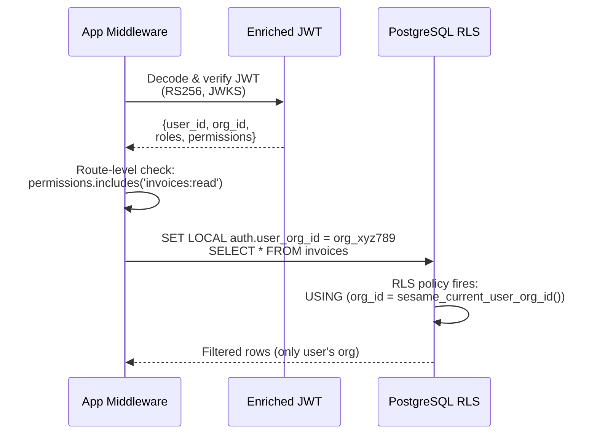
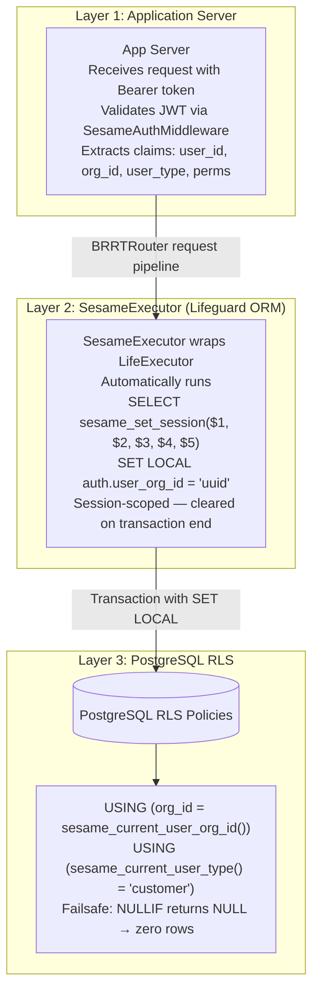
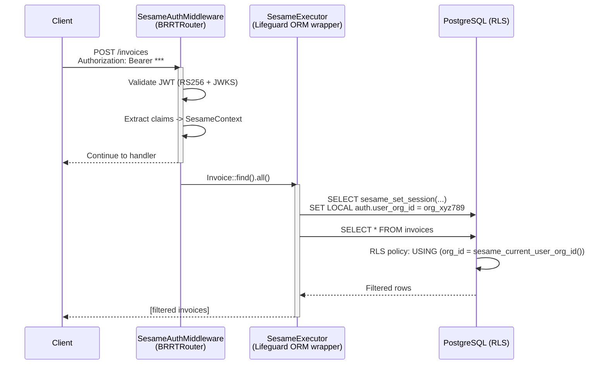
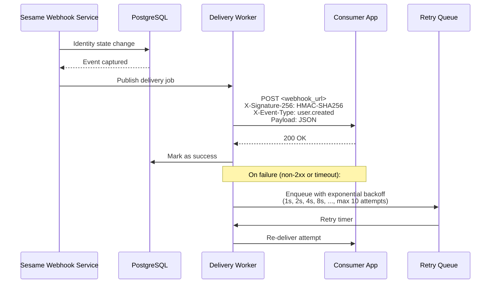
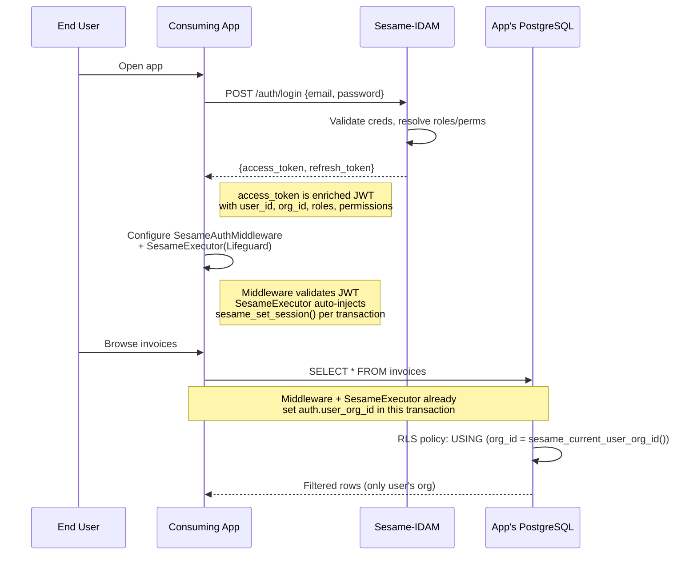
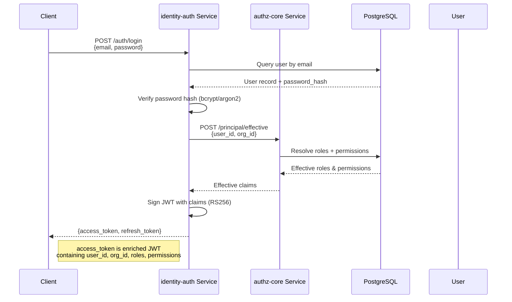
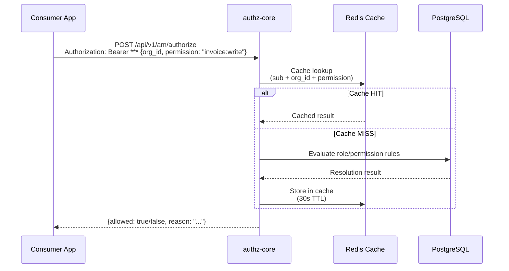

# Sesame-IDAM: Architecture, Developer Contract & Design

> The bolt-on identity platform for any SaaS. Zero auth logic in your app.
> Inspired by PropelAuth's developer experience, enhanced with Supabase-style RLS.
> Open source, self-hosted (Rust backend, TypeScript SDK).
> Date: 2026-05-02

---

## Table of Contents

1. [Vision](#1-vision)
2. [Benchmark: PropelAuth vs Supabase vs Sesame](#2-benchmark-propelauth-vs-supabase-vs-sesame)
3. [Architecture — Four Independent Services](#3-architecture--four-independent-services)
4. [Data Model](#4-data-model)
5. [The Developer Contract](#5-the-developer-contract)
6. [The API Surface](#6-the-api-surface)
7. [JWT Enrichment Schema](#7-jwt-enrichment-schema)
8. [The RLS Bridge](#8-the-rls-bridge)
9. [Webhook System](#9-webhook-system)
10. [Integration Patterns](#10-integration-patterns)
11. [Hard Boundaries](#11-hard-boundaries)
12. [Deployment & Scaling](#12-deployment--scaling)
13. [Open Questions](#13-open-questions)
14. [Summary](#14-summary)

---

## 1. Vision

Sesame-IDAM is a **bolt-on identity platform** that any application can integrate in hours, not months. The consuming application implements **zero authentication logic**:

- Sesame manages users, organizations, memberships, roles, and permissions
- Sesame issues enriched JWTs containing all identity and access claims
- The application reads the JWT and enforces access control (route-level, RLS, feature flags)
- Sesame provides SDKs, admin API, and webhooks for seamless integration

### The Two User Types

| Type | Who | JWT Claim | Use Case |
|------|-----|-----------|----------|
| `customer` | End users/customers of the application | `user_type: "customer"` | B2B SaaS — users in orgs |
| `platform` | People who use the application internally | `user_type: "platform"` | App admins, support, editors |

**One user table. Two JWT claim shapes. One system.**

---

## 2. Benchmark: PropelAuth vs Supabase vs Sesame

| Feature | **PropelAuth** | **Supabase Auth** | **Sesame-IDAM (Target)** |
|---------|---------------|-------------------|--------------------------|
| **Core Promise** | "Auth for your SaaS product" | "Auth for your database" | **"Auth for your SaaS with database-level security"** |
| **User/Org Model** | Users + Organizations | Flat Users | **Users + Organizations (B2B native)** |
| **B2B Logic** | **Built-in** (Invites, Seats, Roles) | Manual / Custom Logic | **Built-in (Same as PropelAuth)** |
| **Database Security** | JWT Claims (App logic only) | **Native RLS** | **Native RLS Helpers (We provide the SQL)** |
| **Integration** | Backend API + Frontend SDK | SDK + PostgREST/RLS | **Backend API + SDK + RLS Helper SQL** |
| **Custom Metadata** | User/Org Metadata | User Metadata | **User + Org Metadata** |
| **Source** | Proprietary / Paid | Open Source | **Open Source (Rust/TS)** |
| **Hosted UI** | Yes (Customizable) | Yes | **SDK Components (React/Vue/Plain HTML)** |

### Why Sesame Wins

Sesame combines the best of both worlds:
- **The B2B complexity of PropelAuth** (orgs, invites, roles, seat management)
- **The database-native security of Supabase** (RLS helpers that lock down your data automatically)
- **Open source and self-hosted** (no vendor lock-in, no per-user pricing)

---

## 3. Architecture — Four Independent Services

Sesame-IDAM is **four independent Rust services**, not a single binary. This split is driven by per-request frequency and per-request cost analysis — the two services in the original design were insufficient because the identity tier alone needs to separate fast reads (token refresh, user lookup) from slow writes (password hashing, registration).



### 3.1 Service Breakdown

| Service | OpenAPI Specs | Base Path | Frequency | Cost | Responsibility |
|---------|--------------|-----------|-----------|------|----------------|
| **identity-auth** | `openapi/identity-auth/` (4 sub-specs: `openapi.yaml`, `login-service.yaml`, `session-service.yaml`, `user-mgmt-service.yaml`) | `/auth/*`, `/api/v1/identity/*`, `/.well-known/*` | HIGH | Mixed (DB lookups + JWT signing) | Login, register, refresh, logout, MFA, password reset, OIDC discovery, JWKS, user CRUD, sessions, token exchange (RFC 8693) |
| **authz-core** | `openapi/authz-core/openapi.yaml` | `/api/v1/am/authorize`, `/api/v1/am/principal/*` | EXTREME (every consumer API request) | LOW (cached) | Real-time authorization checks, principal/effective resolution, role/permission evaluation |
| **api-keys** | `openapi/api-keys/openapi.yaml` | `/api/v1/am/api-keys/*` | HIGH (independently spiky) | LOW (hash lookup) | API key lifecycle, validation (personal + org variants), rotation, revocation |
| **org-mgmt** | `openapi/org-mgmt/openapi.yaml` | `/orgs/*`, `/api/v1/am/applications/*` | LOW (admin-heavy) | MEDIUM (CRUD + external SSO) | Org/tenant CRUD, memberships, invitations, SSO/SAML/SCIM, roles, permissions, applications, webhooks |

**Why four services?**

1. **Per-request cost differs by orders of magnitude.** User lookup (`users/me`) takes microseconds. Login (`/auth/login`) takes milliseconds (bcrypt/hash + DB write + JWT sign). SSO setup takes seconds (external IdP communication).
2. **Traffic patterns diverge completely.** M2M API key validation traffic can spike independently from user-facing traffic. CI/CD pipelines hammering the key service while mobile users are offline.
3. **Failure domains must be isolated.** A spike in M2M key validation should not degrade user-facing login flows.
4. **Independent scaling.** `authz-core` must scale to handle every consumer API request. `org-mgmt` can scale to near-zero.

### 3.2 Inter-Service Dependencies

```mermaid
graph LR
    IA[identity-auth] -->|principal/effective at login| AC[authz-core]
    AK[api-keys] -. independent .-. AC
    OM[org-mgmt] -. independent .-. AC

    style IA fill:#4A90D9
    style AC fill:#E74C3C
    style AK fill:#F39C12
    style OM fill:#27AE60
```

The **only** cross-service dependency is identity-auth calling authz-core's `/principal/effective` endpoint at login time to populate JWT claims. After the JWT is issued, it is self-contained. `api-keys` and `org-mgmt` are fully independent.

---

## 4. Data Model

The data model is the single source of truth. Every table, every relationship, every constraint.

### 4.1 Core Entities



### 4.2 Key Design Decisions

**One user table, two user types.** No separate `platform_user` and `customer_user` tables. The `user_type` column distinguishes them, and the JWT claim shape differs. A user can belong to both a platform (as an admin) and an organization (as a customer member).

**Organizations are per-platform.** The `organization.platform` column means the same organization name can exist in different applications without conflict. An org is always scoped to the application it was created in.

**Roles are per-application, scoped to organizations.** A role belongs to an application and can optionally belong to an organization. Platform-level roles (admin, editor) have `organization_id: NULL`. Organization-level roles (billing-viewer, member) are scoped to a specific org.

**Role inheritance via `parent_role_id`.** A role can inherit from another role within the same application. When resolving a user's effective permissions, the system walks the inheritance chain.

**Sessions are per-user AND per-application.** A user has separate sessions per application. Logging into App A doesn't give you a session in App B — you need a separate login. The refresh token is also per-application.

**Refresh tokens are rotated.** On every `/refresh`, the old refresh token is revoked and a new one is issued. This prevents token replay attacks. Old tokens are stored briefly (TTL-based) for one-time reuse detection.

**API keys are per-application.** An API key grants a specific set of permissions to a specific application. Used for server-to-server or CLI access where a user session doesn't exist.

**Soft deletes everywhere.** `deleted_at` columns on user, organization, and application allow graceful deletion with auditability. Hard deletes are never performed directly.

---

## 5. The Developer Contract

This is the **contract** we are building. When a developer integrates Sesame, this is exactly what they will interact with.

### 5.1 The Three Integration Layers



### 5.2 Frontend SDK (User-Facing)

The developer uses the frontend SDK to handle login. They never write login logic.

```typescript
// Frontend (React/Vue/HTML)
import { useAuth } from '@sesame-idam/frontend';

function App() {
  const { user, orgs, isLoading, login, logout } = useAuth();

  return (
    <div>
      {!user ? (
        <button onClick={() => login({ email: 'user@example.com' })}>
          Login
        </button>
      ) : (
        <div>
          <h1>Welcome, {user.email}</h1>
          <select onChange={(e) => user.switchOrg(e.target.value)}>
            {orgs.map(org => <option value={org.id}>{org.name}</option>)}
          </select>
          <button onClick={logout}>Logout</button>
        </div>
      )}
    </div>
  );
}
```

**The Contract:**
1. `login({email})` — Handles the email/password (or magic link) flow
2. `useAuth()` — Returns the current user's **Enriched JWT**
3. `user.switchOrg(id)` — Rotates the JWT to reflect the new organization context

### 5.3 Backend Admin API (Server-Facing)

The developer uses the Backend API to manage users and orgs server-side.

```typescript
// Get all orgs a user belongs to
const orgs = await sesame.orgs.list('user_abc123');

// Get specific org details
const org = await sesame.orgs.get('org_xyz789');

// Update org settings
await sesame.orgs.update('org_xyz789', {
  name: 'Acme Corp 2.0',
  settings: { allowed_email_domains: ['acme.com'] }
});

// Close an org
await sesame.orgs.close('org_xyz789');

// Get all members of an org
const members = await sesame.orgs.getMembers('org_xyz789');

// Add a user to an org (or update their role)
await sesame.orgs.addMember('org_xyz789', {
  userId: 'user_abc123',
  role: 'Admin'
});

// Remove a user from an org
await sesame.orgs.removeMember('org_xyz789', 'user_abc123');

// Get all users in the platform
const users = await sesame.users.list({ limit: 10 });

// Get a specific user by ID
const user = await sesame.users.get('user_abc123');

// Update user metadata (custom properties)
await sesame.users.update('user_abc123', {
  metadata: { tier: 'enterprise', seats: 50 }
});

// Deactivate a user (Soft Delete)
await sesame.users.delete('user_abc123');

// Check if a user has a permission
const hasPermission = await sesame.permissions.check({
  userId: 'user_abc123',
  orgId: 'org_xyz789',
  permission: 'invoices:write'
});

// Generate a token to act as the user (Impersonation)
const impersonationToken = await sesame.users.impersonate('user_abc123');
```

---

## 6. The API Surface

All endpoints are under `/api/v1`. The API is split across four services.

### 6.1 Service: identity-auth

Base path: `/auth/*`, `/api/v1/identity/*`, `/.well-known/*`

Split into 4 sub-specs for independent implementation:

#### Sub-service: login-service (HIGH freq / HIGH cost)

| Method | Path | Summary |
|--------|------|---------|
| POST | `/auth/login` | Login with password |
| POST | `/auth/register` | Idempotent user create/lookup |
| POST | `/auth/login/oauth/github` | OAuth GitHub login |
| POST | `/auth/login/oauth/github/callback` | OAuth GitHub callback |
| POST | `/auth/token/exchange` | Token exchange (RFC 8693) |
| POST | `/auth/password/reset/request` | Send password reset email |
| POST | `/auth/password/reset/confirm` | Confirm password reset |
| POST | `/auth/mfa/verify` | Verify MFA code |

#### Sub-service: session-service (EXTREME freq / LOW cost)

| Method | Path | Summary |
|--------|------|---------|
| POST | `/auth/refresh` | Refresh access token |
| GET | `/.well-known/openid-configuration` | OIDC discovery |
| GET | `/.well-known/jwks.json` | JWKS for JWT verification |
| POST | `/auth/logout` | Revoke session |

#### Sub-service: user-mgmt-service (LOW freq / MEDIUM cost)

| Method | Path | Summary |
|--------|------|---------|
| POST | `/api/v1/identity/users` | Create user (idempotent) |
| GET | `/api/v1/identity/users/me` | Get current user |
| POST | `/api/v1/identity/users/lookup` | Lookup user by email |
| POST | `/api/v1/identity/users/email/verify` | Verify email |
| POST | `/api/v1/identity/users/phone/verify` | Verify phone |

#### Sub-service: openapi.yaml (combined auth flows)

Contains the full identity-auth API surface as a single spec for reference/codegen, combining all sub-services.

### 6.2 Service: authz-core

Base path: `/api/v1/am/authorize`, `/api/v1/am/principal/*`

| Method | Path | Summary |
|--------|------|---------|
| POST | `/api/v1/am/authorize` | Authorization check |
| POST | `/api/v1/am/principal/effective` | Resolve user's effective permissions |
| GET | `/api/v1/am/principals/roles` | List principal roles |
| GET | `/api/v1/am/principals/attributes` | List principal attributes |

### 6.3 Service: api-keys

Base path: `/api/v1/am/api-keys/*`

| Method | Path | Summary |
|--------|------|---------|
| POST | `/api/v1/am/api-keys` | Create API key (M2M / service account) |
| POST | `/api/v1/am/api-keys/validate/personal` | Validate personal API key |
| POST | `/api/v1/am/api-keys/validate/org` | Validate org API key |
| PUT | `/api/v1/am/api-keys/{id}/rotate` | Rotate API key |
| DELETE | `/api/v1/am/api-keys/{id}` | Revoke API key |

### 6.4 Service: org-mgmt

Base path: `/orgs/*`, `/api/v1/am/applications/*`

#### User Management

| Method | Path | Description |
|--------|------|-------------|
| GET | `/api/v1/platform/users` | List users (paginated, filterable by email) |
| GET | `/api/v1/platform/users/{userId}` | Get user details |
| PUT | `/api/v1/platform/users/{userId}` | Update user (metadata, properties) |
| DELETE | `/api/v1/platform/users/{userId}` | Deactivate user (soft delete) |
| POST | `/api/v1/platform/users/{userId}/impersonate` | Impersonate user (returns their JWT) |

#### Organization & Membership Management

| Method | Path | Description |
|--------|------|-------------|
| GET | `/orgs` | List all organizations (paginated) |
| POST | `/orgs` | Create an organization |
| GET | `/orgs/{orgId}` | Get organization details |
| PUT | `/orgs/{orgId}` | Update organization (name, settings) |
| DELETE | `/orgs/{orgId}` | Deactivate organization |
| GET | `/orgs/{orgId}/members` | List all members of an organization |
| POST | `/orgs/{orgId}/members` | Add member to organization |
| PUT | `/orgs/{orgId}/members/{userId}` | Change member role |
| DELETE | `/orgs/{orgId}/members/{userId}` | Remove member from organization |

#### Role & Permission Management

| Method | Path | Description |
|--------|------|-------------|
| GET | `/api/v1/am/applications` | List applications |
| GET | `/api/v1/am/roles` | List all roles (filtered by application) |
| POST | `/api/v1/am/roles` | Create role |
| PUT | `/api/v1/am/roles/{roleId}` | Update role |
| DELETE | `/api/v1/am/roles/{roleId}` | Deactivate role |
| GET | `/api/v1/am/permissions` | List all permissions |
| POST | `/api/v1/am/permissions` | Create permission |
| PUT | `/api/v1/am/permissions/{permissionId}` | Update permission |
| DELETE | `/api/v1/am/permissions/{permissionId}` | Deactivate permission |
| GET | `/api/v1/platform/permissions/check` | Check if user has permission |

### 6.5 OpenID Connect

| Method | Path | Description |
|--------|------|-------------|
| GET | `/.well-known/openid-configuration` | OIDC discovery document |
| GET | `/.well-known/jwks.json` | JWKS for JWT verification |

### 6.6 Authentication (API Key Auth)

All platform admin API endpoints require authentication via API key:

```
Authorization: Bearer ***
```

Auth endpoints (login, refresh, etc.) are public — they don't require an API key. They return JWTs that are then used to call the platform API.

---

## 7. JWT Enrichment Schema

This is the core mechanism that makes Sesame a bolt-on service. The JWT contains everything the application needs to make access decisions.

### 7.1 JWT Structure

```json
{
  "alg": "RS256",
  "typ": "JWT",
  "kid": "key-2025-01",
  "iss": "https://auth.myapp.com",
  "sub": "user_abc123",
  "aud": "myapp.com",
  "exp": 1715003600,
  "iat": 1715000000,
  "jti": "tok_abc123",
  "user_id": "user_abc123",
  "user_type": "customer",
  "email": "alice@company.com",
  "email_verified": true,
  "display_name": "Alice Smith",
  "org_id": "org_xyz789",
  "roles": ["admin", "billing-viewer"],
  "permissions": ["org:admin", "billing:read", "billing:write"],
  "mfa_verified": true,
  "is_platform_admin": false,
  "phone_number": "+141****1234",
  "phone_verified": true
}
```

### 7.2 Claim Details

| Claim | Type | Description |
|-------|------|-------------|
| `iss` | string | Issuer (Sesame base URL) |
| `sub` | string | User ID |
| `aud` | string | Application platform domain |
| `exp` | int64 | Expiration (default 15 minutes) |
| `iat` | int64 | Issued at |
| `jti` | string | JWT ID (for rotation tracking) |
| `user_id` | string | User ID (convenience, same as sub) |
| `user_type` | string | `customer` or `platform` |
| `email` | string | User email |
| `email_verified` | bool | Email verification status |
| `display_name` | string | User display name |
| `org_id` | string | **Currently selected organization ID** (from `switchOrg`) |
| `roles` | array | **Resolved roles** for the current org (with inheritance) |
| `permissions` | array | **Resolved permissions** for the current org (from all roles) |
| `mfa_verified` | bool | Whether MFA was verified for this session |
| `is_platform_admin` | bool | Whether user has platform admin role |
| `phone_number` | string | User phone (redacted) |
| `phone_verified` | bool | Phone verification status |

### 7.3 JWT Size Management

The JWT includes resolved roles and permissions. For users with many orgs and permissions, this can get large. Mitigations:

1. **Organization limit per user** — configurable, default 50. Users can't join more than N organizations.
2. **Permission count cap** — per role, max N permissions. If a role has more, resolution returns top-level role name.
3. **Compact JSON encoding** — keys are abbreviated. JWT is compressed with ZLIB before signing.
4. **Short token lifetime** — 15 minutes default. Refresh frequently.

### 7.4 How the Application Uses the JWT



**The key insight: the application reads the JWT and makes decisions from it. It never calls Sesame for permission checks during normal request handling.** The `/api/v1/am/authorize` endpoint is only used for admin interfaces or for checking permissions that may have changed since the last login.

---

## 8. The RLS Bridge

This is where Sesame beats the competition. PropelAuth gives you the JWT; Supabase gives you the RLS logic. Sesame gives you **both**.

### 8.1 The Three-Layer Model



### 8.2 Sesame's SQL Helpers

These functions are deployed into the consuming application's PostgreSQL database once:

```sql
-- Set all RLS session variables from decoded JWT claims
CREATE OR REPLACE FUNCTION public.sesame_set_session(
    p_user_id        uuid,
    p_user_org_id    uuid,
    p_user_type      text DEFAULT 'customer',
    p_permissions    text[] DEFAULT '{}',
    p_user_email     text DEFAULT NULL
) RETURNS void
LANGUAGE plpgsql
SECURITY DEFINER
AS $$
BEGIN
    SET LOCAL auth.user_id        := p_user_id;
    SET LOCAL auth.user_org_id    := p_user_org_id;
    SET LOCAL auth.user_type      := p_user_type;
    SET LOCAL auth.permissions    := p_permissions;
    SET LOCAL auth.user_email     := p_user_email;
END;
$$;

-- Read helpers for RLS policies
CREATE OR REPLACE FUNCTION public.sesame_current_user_id()      RETURNS uuid  LANGUAGE sql STABLE AS $$ SELECT NULLIF(current_setting('auth.user_id', true), ''); $$;
CREATE OR REPLACE FUNCTION public.sesame_current_user_org_id()  RETURNS uuid  LANGUAGE sql STABLE AS $$ SELECT NULLIF(current_setting('auth.user_org_id', true), ''); $$;
CREATE OR REPLACE FUNCTION public.sesame_current_user_type()    RETURNS text  LANGUAGE sql STABLE AS $$ SELECT NULLIF(current_setting('auth.user_type', true), ''); $$;
CREATE OR REPLACE FUNCTION public.sesame_current_permissions()  RETURNS text[] LANGUAGE sql STABLE AS $$ SELECT NULLIF(current_setting('auth.permissions', true), ''); $$;
CREATE OR REPLACE FUNCTION public.sesame_current_user_email()   RETURNS text  LANGUAGE sql STABLE AS $$ SELECT NULLIF(current_setting('auth.user_email', true), ''); $$;
```

### 8.3 RLS Policy Template

```sql
-- Enable RLS on the table
ALTER TABLE public.invoices ENABLE ROW LEVEL SECURITY;

-- Policy for customer users: only see rows in their org
CREATE POLICY org_scope_customers ON public.invoices
    USING (
        org_id = COALESCE(
            sesame_current_user_org_id(),
            gen_random_uuid()  -- failsafe: if no org_id set, match nothing
        )
    )
    AND sesame_current_user_type() = 'customer';

-- Policy for platform users: can see all rows
CREATE POLICY platform_all_access ON public.invoices
    FOR ALL
    USING (sesame_current_user_type() = 'platform');

-- Policy for unauthenticated access: block everything
CREATE POLICY deny_unauthenticated ON public.invoices
    FOR ALL
    USING (sesame_current_user_id() IS NOT NULL);
```

### 8.4 Runtime: Automatic Injection via BRRTRouter Middleware + Lifeguard

Because Sesame controls both BRRTRouter (the web framework) and Lifeguard (the ORM), the RLS injection is **automatic** — not a manual SQL call in every handler.



**Lifeguard features that work with RLS:** All existing Lifeguard features continue to work unchanged — Identity Map, Scopes, `flush_dirty`/`flush_dirty_in_transaction`, Raw SQL (`execute`, `query_one`, `query_all`), and Connection pooling. `SesameExecutor` transparently wraps any `LifeExecutor` implementation.

---

## 9. Webhook System

Sesame sends webhooks to the consuming application when identity state changes.

### 9.1 Event Types

| Event | When Fired | Payload |
|-------|-----------|---------|
| `user.created` | New user created | `{ user_id, email, user_type, platform }` |
| `user.updated` | User profile updated | `{ user_id, email, user_type, platform, changes }` |
| `user.deleted` | User soft-deleted | `{ user_id, email, platform }` |
| `user.login` | Successful login | `{ user_id, platform, ip, user_agent }` |
| `user.impersonated` | Admin impersonated user | `{ impersonator_id, target_user_id, platform }` |
| `organization.created` | New org created | `{ org_id, name, slug, platform }` |
| `organization.updated` | Org details changed | `{ org_id, platform, changes }` |
| `organization.deleted` | Org soft-deleted | `{ org_id, platform }` |
| `membership.joined` | User added to org | `{ org_id, user_id, role, platform }` |
| `membership.left` | User removed from org | `{ org_id, user_id, platform }` |
| `membership.role_changed` | User's org role changed | `{ org_id, user_id, old_role, new_role, platform }` |
| `role.created` | New role created | `{ role_id, name, application_id }` |
| `role.updated` | Role changed | `{ role_id, name, application_id, changes }` |
| `role.deleted` | Role deactivated | `{ role_id, name, application_id }` |
| `permission.created` | New permission created | `{ permission_id, name, application_id }` |
| `permission.updated` | Permission changed | `{ permission_id, name, application_id, changes }` |
| `permission.deleted` | Permission deactivated | `{ permission_id, name, application_id }` |

### 9.2 Webhook Delivery



**Signature verification (app side):** `HMAC-SHA256(payload_body, webhook_secret) == X-Signature-256`

**Delivery retry:** Exponential backoff (1s, 2s, 4s, 8s, 16s, 32s, 64s, ...). Max 10 attempts over ~17 minutes. After that, the webhook is marked as failed and can be retried manually.

---

## 10. Integration Patterns

### 10.1 How an Application Bolts On



**Step 1: Initialize** — Register app in Sesame, get API key
**Step 2: Configure** — Add SesameAuthMiddleware to BRRTRouter
**Step 3: Wrap ORM** — Wrap Lifeguard executor with SesameExecutor
**Step 4: Deploy** — Run Sesame's RLS helper SQL in app database

### 10.2 Login + JWT Enrichment Flow



### 10.3 Per-Request Authorization Flow



---

## 11. Hard Boundaries

### 11.1 No PostgREST-Style Auto-Generated API

**Sesame will NOT provide a PostgREST-style auto-generated REST interface like Supabase.**

All access to consuming-application data flows through the application server. There is no direct SQL-to-REST bridge that bypasses the app layer. RLS policies exist because database-level security is non-negotiable, but they are not the primary authorization mechanism. The application layer (BRRTRouter middleware + business logic) is the primary authorization boundary.

### 11.2 JWT Verification Never Happens in PostgreSQL

Sesame does not do JWT signature verification inside PostgreSQL. The application layer validates the JWT using RS256 public keys from Sesame's JWKS. Only extracted claim values enter the database.

### 11.3 No PostgREST in Scope

This is **not a planned capability**. Per the hard boundary in Section 11.1, Sesame will never provide a PostgREST-style auto-generated API. All database access flows through the application server and Sesame's middleware/ORM integration.

If a consuming application independently adds PostgREST, RLS policies will still function as a safety net — but no Sesame-provided support or integration exists for it.

---

## 12. Deployment & Scaling

### 12.1 Scaling Per Service

| Service | Scaling Profile | Bottleneck | Strategy |
|---------|----------------|------------|----------|
| **identity-auth** | HIGH (100-10K req/s per 1K users) | Password hashing (CPU-bound) | Horizontal + vertical (Argon2id tuned) |
| **authz-core** | EXTREME (>10K req/s per 1K users) | Redis latency | Horizontal, sharded by org_id |
| **api-keys** | HIGH (independently spiky) | Hash lookup (trivial CPU) | Horizontal, stateless |
| **org-mgmt** | LOW (<100 req/s) | External SSO calls (rare) | Single instance, scale to zero |

---

## 13. Open Questions

### 13.1 Multi-org sessions (user belongs to multiple orgs)

The current design sets one `user_org_id`. If a user belongs to 3 orgs, the app must:
1. Present the user with an org picker
2. When they select an org, the middleware calls `SET LOCAL auth.user_org_id = <selected_org_id>`
3. All subsequent queries are scoped to that org
4. `user.switchOrg(id)` in the SDK rotates the JWT to reflect the new context

This is correct — at any given moment, the user is operating within ONE org context.

### 13.2 What if RLS policies are slow?

RLS policies are evaluated per-row. For tables with millions of rows and complex policies, this can be slow. Mitigations:
- Index `org_id` on all org-scoped tables (always needed anyway)
- Keep policies simple: equality comparison (`=`) on indexed columns is fast
- For complex permission checks, consider a `WITH` clause that pre-filters by `org_id` before RLS

### 13.3 Should Sesame validate the JWT signature in Postgres at all?

**Decision: No.** Reasons:
1. RS256 signature verification in Postgres requires `pgcrypto` extension + external key material — complex and error-prone
2. The application already validates the JWT — doing it twice is redundant
3. RLS is defense-in-depth, not the primary auth boundary
4. If Postgres is directly accessible, `SET LOCAL` won't help — but that's a deployment security issue (shouldn't happen in production)

---

## 14. Summary

The Sesame RLS bridge works like this:

1. **Sesame issues JWTs** with `user_id`, `org_id`, `user_type`, `permissions` (RS256 signed)
2. **Application validates JWT** (signature, expiry) using Sesame's JWKS public key
3. **BRRTRouter middleware + SesameExecutor** call `sesame_set_session()` automatically at transaction start
4. **SET LOCAL** scopes session variables to the current transaction
5. **RLS policies** reference `sesame_current_user_org_id()` etc. to filter rows
6. **Transaction ends** — `SET LOCAL` variables are automatically cleared
7. **If middleware is bypassed** — RLS returns zero rows (defense-in-depth)

The "magic" is `SET LOCAL` — a single Postgres statement that bridges the application layer's validated JWT claims to the database layer's RLS policies, without the JWT itself ever entering Postgres. Combined with the 4-service topology, this gives Sesame the best of both worlds: **PropelAuth-style B2B identity management** with **Supabase-style native database security**, all delivered as open-source infrastructure that any app can bolt onto in hours.
